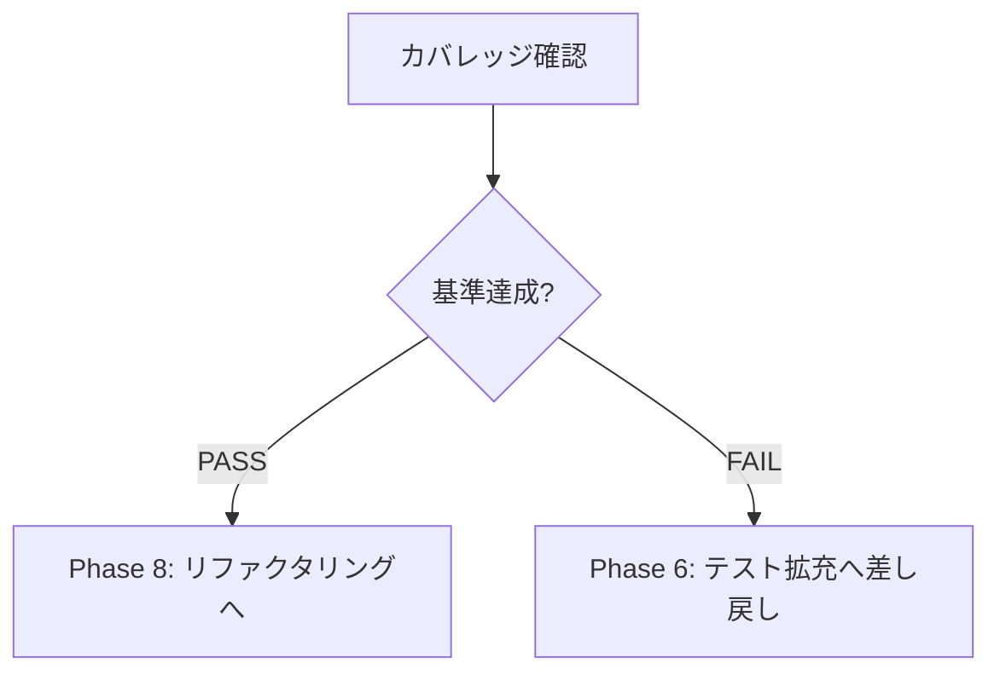

# Phase 7: カバレッジ確認 - スライド依存関係管理システム

## メタ情報

| 項目       | 内容                                      |
| ---------- | ----------------------------------------- |
| Phase      | 7                                         |
| タスクID   | task-feat-slide-dependency-management-003 |
| 名称       | カバレッジ確認                            |
| ステータス | 未実施                                    |
| 依存Phase  | Phase 5, 6                                |

---

## 目的

Phase 6の拡充結果を検証し、カバレッジ基準を満たすまでゲートとして確認する。

---

## 使用スキル

| スキル名      | パス                                    | 選定理由                              |
| ------------- | --------------------------------------- | ------------------------------------- |
| test-coverage | `.claude/skills/test-coverage/SKILL.md` | カバレッジ検証（Trigger: カバレッジ） |
| quality-gate  | `.claude/skills/quality-gate/SKILL.md`  | 品質ゲート判定（Trigger: 品質ゲート） |

**実行方法**: 各スキルのSKILL.mdを読み込み、スキルを参照して実行

---

## 統合テスト連携【必須】

### Phase 7での統合テスト連携アクション

統合テストの再実行とゲート判定を行う。

**確認項目**:

1. 統合テストの全件成功確認
2. カバレッジ基準の達成確認
3. フロントエンド・バックエンド接続テストの成功確認

---

## 実行手順

### Step 1: カバレッジ確認

```bash
# ユニットテストカバレッジ
pnpm --filter @repo/shared test:coverage
pnpm --filter @repo/desktop test:coverage

# 統合テスト実行
pnpm test:integration

# E2Eテスト実行
pnpm test:e2e
```

### Step 2: カバレッジ基準チェック

#### ユニットテストカバレッジ

| 指標              | 最低基準 | 推奨基準 | 実績 | 判定 |
| ----------------- | -------- | -------- | ---- | ---- |
| Line Coverage     | 80%      | 90%      | -%   | ☐    |
| Branch Coverage   | 60%      | 70%      | -%   | ☐    |
| Function Coverage | 80%      | 90%      | -%   | ☐    |

#### 結合テストカバレッジ

| 指標                         | 目標 | 実績 | 判定 |
| ---------------------------- | ---- | ---- | ---- |
| APIエンドポイント            | 100% | -%   | ☐    |
| モジュール間インターフェース | 100% | -%   | ☐    |
| 正常系シナリオ               | 100% | -%   | ☐    |
| 異常系シナリオ               | 80%+ | -%   | ☐    |
| 外部連携ポイント             | 100% | -%   | ☐    |

### Step 3: ゲート判定

#### 判定基準

| 判定 | 条件                          |
| ---- | ----------------------------- |
| PASS | すべてのカバレッジ基準を達成  |
| FAIL | 1つ以上のカバレッジ基準が未達 |

#### 未達の場合の対応

- Phase 6に戻りテスト拡充を実施
- 未達箇所を特定し、追加テストを作成
- カバレッジ改善後、再度Phase 7を実行

---

## サブタスク管理

Phase実行開始時に、TodoWriteツールで以下のサブタスクを作成すること:

1. 参照資料の確認
2. 使用スキルの実行（各スキルごとに1タスク）
3. 統合テスト連携の実施
4. 成果物の作成・配置
5. 完了条件の検証

**重要**: 各サブタスクは実行完了後すぐにcompletedに更新すること。

---

## 成果物

| 成果物             | パス                                 | 説明               | 必須 |
| ------------------ | ------------------------------------ | ------------------ | ---- |
| カバレッジレポート | `outputs/phase-7/coverage-report.md` | カバレッジ分析結果 | ✅   |
| ゲート判定結果     | `outputs/phase-7/gate-result.md`     | ゲート判定の結果   | ✅   |

---

## 参照資料

### システム仕様（aiworkflow-requirements）

> カバレッジ確認時に必ず以下のシステム仕様を参照してください。

| 参照資料             | パス                                                                     | 内容                    |
| -------------------- | ------------------------------------------------------------------------ | ----------------------- |
| Electron IPC設計     | `.claude/skills/aiworkflow-requirements/references/electron-ipc-spec.md` | IPC通信仕様             |
| Agent SDK統合        | `.claude/skills/aiworkflow-requirements/references/agent-sdk-spec.md`    | Agent SDK統合仕様       |
| 状態管理ガイドライン | `.claude/skills/aiworkflow-requirements/references/state-management.md`  | Zustand使用ガイドライン |

---

## スキル100%実行確認【必須】

Phase完了前に以下を確認:

- [ ] 本Phase内の全スキルを100%実行完了
- [ ] 各スキルの成果物が生成されている
- [ ] スキルフィードバックがLOGS.mdに記録されている
- [ ] artifacts.jsonが更新されている
- [ ] Phase末端で各タスクを100%完了し、完了を明記している

```bash
# Phase完了時の検証コマンド
node .claude/skills/task-specification-creator/scripts/validate-phase-output.mjs docs/30-workflows/slide-dependency-management --phase 7

# Phase完了・成果物登録
node .claude/skills/task-specification-creator/scripts/complete-phase.mjs \
  --workflow docs/30-workflows/slide-dependency-management --phase 7 --artifacts "coverage-report.md,gate-result.md"
```

---

## 完了条件チェックリスト

- [ ] ユニットテストカバレッジ基準を達成（Line 80%+, Branch 60%+, Function 80%+）
- [ ] 結合テストカバレッジ基準を達成（API 100%, シナリオ 100%/80%）
- [ ] 統合テストが全て成功
- [ ] フロントエンド・バックエンド接続テストが成功
- [ ] カバレッジレポートが出力されている
- [ ] **本Phase内の全スキルを100%実行完了**

---

## 分岐ロジック



---

## スキルフィードバック記録

| スキル        | 結果    | 備考 |
| ------------- | ------- | ---- |
| test-coverage | pending | -    |
| quality-gate  | pending | -    |

---

## 前後Phase

- 前: [Phase 6: テスト拡充](phase-6-test-expansion.md)
- 次: [Phase 8: リファクタリング](phase-8-refactoring.md)
