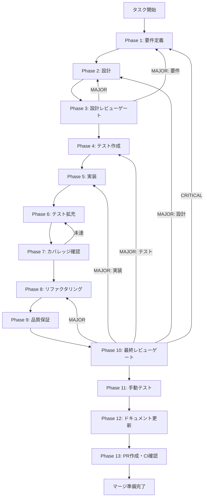

# slide-directory-settings - タスク実行仕様書

## ユーザーからの元の指示

```
スライド出力ディレクトリ設定機能を実装する。
presentation-slide-generatorスキルの出力先をユーザーがElectronアプリのUI上で設定・管理できるようにする。
設定はアプリ再起動後も永続化され、ディレクトリが存在しない場合は自動作成される。
```

## メタ情報

| 項目         | 内容                                   |
| ------------ | -------------------------------------- |
| タスクID     | task-feat-slide-directory-settings-002 |
| タスク名     | slide-directory-settings               |
| 分類         | 要件（新機能）                         |
| 対象機能     | スライド作成システム                   |
| 優先度       | 高                                     |
| 見積もり規模 | 小規模                                 |
| ステータス   | 未実施                                 |
| 作成日       | 2026-01-13                             |

---

## タスク概要

### 目的

ユーザーがElectronアプリのUI上でスライド出力ディレクトリを設定・管理できる機能を実装する。presentation-slide-generatorスキルが生成するスライドの出力先を、ユーザーが自由に指定できるようにする。

### 背景

presentation-slide-generatorスキルは、スライドを以下の構成で出力する：

```
slide-YYYY-MM-DD-{タイトル}/
├── index.html      # プレゼンテーション本体
├── structure.md    # 構造化データ（改善・修正用）
└── deploy-guide.md # GASデプロイ手順
```

現状、出力先はスキル内でハードコードされており（`05_Project/スライド/`）、ユーザーが自由に変更できない。Electronアプリから利用する場合、ユーザーが任意のディレクトリを指定できる必要がある。

### 最終ゴール

1. アプリの設定画面でスライド出力先ディレクトリを指定できる
2. 設定がアプリ再起動後も永続化される
3. ディレクトリが存在しない場合は自動作成される
4. スキル呼び出し時に設定されたディレクトリが自動的に使用される

### 成果物一覧

| 種別         | 成果物                     | 配置先                                  |
| ------------ | -------------------------- | --------------------------------------- |
| 機能         | 設定画面UIコンポーネント   | `apps/desktop/src/renderer/settings/`   |
| 機能         | 設定管理サービス           | `apps/desktop/src/main/settings/`       |
| 機能         | IPC通信API                 | `apps/desktop/src/preload/`             |
| 型定義       | 設定型定義                 | `packages/shared/src/types/settings.ts` |
| テスト       | ユニットテスト・統合テスト | `apps/desktop/src/**/*.test.ts`         |
| ドキュメント | 設定機能使用ガイド         | `outputs/phase-12/`                     |
| PR           | GitHub Pull Request        | GitHub UI                               |

---

## 参照ファイル

本仕様書は以下のシステム仕様を参照：

### システム仕様（aiworkflow-requirements）

| 参照資料             | パス                                                                         | 内容                                 |
| -------------------- | ---------------------------------------------------------------------------- | ------------------------------------ |
| Electronデプロイ     | `.claude/skills/aiworkflow-requirements/references/deployment-electron.md`   | Electronアプリのビルド・リリース設定 |
| Electronセキュリティ | `.claude/skills/aiworkflow-requirements/references/security-api-electron.md` | IPC通信のセキュリティ・CSP設定       |
| フォーム・設定UI     | `.claude/skills/aiworkflow-requirements/references/ui-ux-forms.md`           | フォーム設計・バリデーションパターン |

### 関連ドキュメント

- `docs/00-requirements/master_system_design.md` - システム要件
- `.claude/skills/presentation-slide-generator/SKILL.md` - スライドスキル仕様

---

## タスク分解サマリー

| ID     | フェーズ | サブタスク名                 | 責務                                   | 依存   |
| ------ | -------- | ---------------------------- | -------------------------------------- | ------ |
| T-01-1 | Phase 1  | 機能要件・非機能要件の定義   | 設定機能の詳細要件定義                 | -      |
| T-01-2 | Phase 1  | 受け入れ基準の作成           | テスト可能な受け入れ基準               | T-01-1 |
| T-02-1 | Phase 2  | コンポーネント設計           | 設定画面UIの構造設計                   | T-01   |
| T-02-2 | Phase 2  | IPC通信インターフェース設計  | Main-Renderer間通信設計                | T-01   |
| T-02-3 | Phase 2  | electron-storeスキーマ設計   | 永続化データ構造設計                   | T-01   |
| T-03-1 | Phase 3  | 設計レビューゲート           | 要件・設計の妥当性検証                 | T-02   |
| T-04-1 | Phase 4  | 設定管理サービスのテスト作成 | TDD Red: 失敗するテスト                | T-03   |
| T-04-2 | Phase 4  | UIコンポーネントのテスト作成 | TDD Red: 失敗するテスト                | T-03   |
| T-05-1 | Phase 5  | 型定義の実装                 | 設定型・IPCチャンネル型                | T-04   |
| T-05-2 | Phase 5  | 設定管理サービスの実装       | electron-storeによる永続化             | T-05-1 |
| T-05-3 | Phase 5  | IPC通信の実装                | preload APIとMain側ハンドラー          | T-05-2 |
| T-05-4 | Phase 5  | 設定画面UIの実装             | Reactコンポーネント                    | T-05-3 |
| T-06-1 | Phase 6  | エッジケーステスト追加       | 境界条件・異常系テスト                 | T-05   |
| T-06-2 | Phase 6  | 統合テスト拡充               | 全カテゴリカバレッジ向上               | T-05   |
| T-07-1 | Phase 7  | カバレッジ確認・ゲート判定   | カバレッジ目標達成確認                 | T-06   |
| T-08-1 | Phase 8  | コード品質改善               | TDD Refactor                           | T-07   |
| T-09-1 | Phase 9  | 品質保証チェック             | 静的解析・セキュリティ確認             | T-08   |
| T-10-1 | Phase 10 | 最終レビューゲート           | 全体品質・整合性検証                   | T-09   |
| T-11-1 | Phase 11 | 手動テスト検証               | UX・実環境動作確認                     | T-10   |
| T-12-1 | Phase 12 | ドキュメント更新             | 使用ガイド・仕様反映                   | T-11   |
| T-13-1 | Phase 13 | PR作成                       | `/ai:diff-to-pr`でコミット・PR・CI確認 | T-12   |

**総サブタスク数**: 21個

---

## 実行フロー図



---

## Phase一覧

| Phase | 名称               | 仕様書                                                 | ステータス |
| ----- | ------------------ | ------------------------------------------------------ | ---------- |
| 1     | 要件定義           | [phase-1-requirements.md](phase-1-requirements.md)     | 未実施     |
| 2     | 設計               | [phase-2-design.md](phase-2-design.md)                 | 未実施     |
| 3     | 設計レビューゲート | [phase-3-design-review.md](phase-3-design-review.md)   | 未実施     |
| 4     | テスト作成         | [phase-4-test-creation.md](phase-4-test-creation.md)   | 未実施     |
| 5     | 実装               | [phase-5-implementation.md](phase-5-implementation.md) | 未実施     |
| 6     | テスト拡充         | [phase-6-test-expansion.md](phase-6-test-expansion.md) | 未実施     |
| 7     | カバレッジ確認     | [phase-7-coverage-check.md](phase-7-coverage-check.md) | 未実施     |
| 8     | リファクタリング   | [phase-8-refactoring.md](phase-8-refactoring.md)       | 未実施     |
| 9     | 品質保証           | [phase-9-quality.md](phase-9-quality.md)               | 未実施     |
| 10    | 最終レビューゲート | [phase-10-final-review.md](phase-10-final-review.md)   | 未実施     |
| 11    | 手動テスト         | [phase-11-manual-test.md](phase-11-manual-test.md)     | 未実施     |
| 12    | ドキュメント更新   | [phase-12-documentation.md](phase-12-documentation.md) | 未実施     |
| 13    | PR作成             | [phase-13-pr-creation.md](phase-13-pr-creation.md)     | 未実施     |

---

## テストカバレッジ目標

### ユニットテスト

| 指標              | 最低基準 | 推奨基準 |
| ----------------- | -------- | -------- |
| Line Coverage     | 80%      | 90%      |
| Branch Coverage   | 60%      | 70%      |
| Function Coverage | 80%      | 90%      |

### 結合テスト

| 指標                         | 目標 |
| ---------------------------- | ---- |
| IPCエンドポイント            | 100% |
| モジュール間インターフェース | 100% |
| 正常系シナリオ               | 100% |
| 異常系シナリオ               | 80%+ |
| 外部連携ポイント             | 100% |

---

## 統合テスト連携（Phase 1〜11で必須）

各Phaseで以下の統合テスト連携アクションを実施すること:

| Phase | 統合テスト連携アクション                                    |
| ----- | ----------------------------------------------------------- |
| 1     | IPC通信要件・永続化要件を要件に明記                         |
| 2     | IPC通信インターフェース・electron-storeスキーマを設計に反映 |
| 3     | 統合テスト観点のレビューゲートを実施                        |
| 4     | Main-Renderer間通信の統合テストシナリオを作成               |
| 5     | IPC通信・設定永続化の実装とテスト支援コード整備             |
| 6     | 統合テストの拡充（異常系・エッジケース）                    |
| 7     | 統合テストの再実行とゲート判定                              |
| 8     | リファクタ後の統合テスト継続成功を確認                      |
| 9     | 品質保証で統合テスト結果を確認                              |
| 10    | 最終レビューで統合テスト結果を確認                          |
| 11    | 手動統合テスト（UI/設定永続化）を確認                       |

---

## Phase完了時の必須アクション

**各Phase完了時に以下を必ず実行すること:**

1. **タスク100%実行**: Phase内で指定された全タスクを完全に実行
2. **成果物確認**: 全ての必須成果物が生成されていることを検証
3. **実行記録**: 実行タスクの結果を記録
4. **artifacts.json更新**: Phase完了ステータスを更新
5. **Phase末端の実行確認**: 各タスクを100%実行し、各タスクを完遂した旨を必ず明記

```bash
# Phase完了時の検証コマンド
node .claude/skills/task-specification-creator/scripts/validate-phase-output.mjs docs/30-workflows/slide-directory-settings --phase {{PHASE_NUMBER}}

# Phase完了・成果物登録
node .claude/skills/task-specification-creator/scripts/complete-phase.mjs \
  --workflow docs/30-workflows/slide-directory-settings --phase {{PHASE_NUMBER}} --artifacts "..."
```

---

## 依存タスク

| タスクID                            | 依存内容                          |
| ----------------------------------- | --------------------------------- |
| task-feat-agent-sdk-integration-001 | Agent SDK基盤が実装済みであること |

---

## 技術スタック

| 技術要素         | 使用技術                           |
| ---------------- | ---------------------------------- |
| UIフレームワーク | React                              |
| 状態管理         | カスタムフック（useSlideSettings） |
| 永続化           | electron-store                     |
| IPC通信          | Electron contextBridge + ipcMain   |
| テスト           | Vitest + @testing-library/react    |
| 型定義           | TypeScript                         |

---

## 設定スキーマ（参考）

```typescript
interface SlideSettings {
  outputDirectory: string; // スライド出力先ディレクトリ
  defaultTheme: "kanagawa"; // デフォルトテーマ（将来拡張用）
  autoCreateDirectory: boolean; // ディレクトリ自動作成フラグ
}

const defaultSettings: SlideSettings = {
  outputDirectory: "~/Documents/Slides",
  defaultTheme: "kanagawa",
  autoCreateDirectory: true,
};
```

---

## IPC通信チャンネル（参考）

```typescript
// チャンネル定義（ホワイトリスト方式）
export const SLIDE_SETTINGS_CHANNELS = {
  GET_DIRECTORY: "slideSettings:getDirectory",
  SET_DIRECTORY: "slideSettings:setDirectory",
  SELECT_DIRECTORY: "slideSettings:selectDirectory",
  VALIDATE_DIRECTORY: "slideSettings:validateDirectory",
} as const;
```

---

## 使用方法

1. Phase 1から順番に各Phaseの仕様書を実行
2. 各Phase完了時に`artifacts.json`を更新
3. Phase 13完了後、ユーザー許可を得てPRを作成
