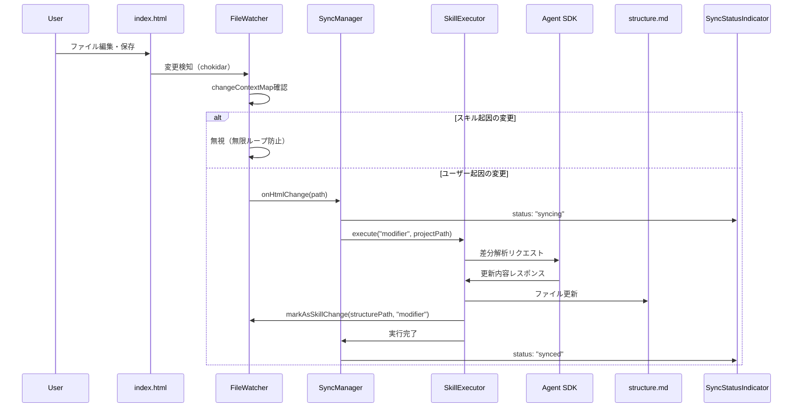

# 実装ガイド: index.html→structure.md 逆同期機能

## メタ情報

| 項目     | 内容                             |
| -------- | -------------------------------- |
| 機能名   | slide-reverse-sync               |
| タスクID | task-feat-slide-reverse-sync-001 |
| 作成日   | 2026-01-10                       |
| Phase    | 12                               |

---

# Part 1: 概念的説明（初学者・非技術者向け）

## 1. 逆同期機能とは何か

### 1.1 かんたんな説明

スライドを作るとき、2つの重要なファイルがあります：

1. **structure.md** - スライドの「設計図」（何を話すか、どんな順番で）
2. **index.html** - 実際に表示される「完成品」（見た目が整ったスライド）

通常は「設計図（structure.md）を書く → 完成品（index.html）が自動生成」という流れです。
これを**順方向同期**と呼びます。

**逆同期機能**は、その逆です。
「完成品（index.html）を直接編集 → 設計図（structure.md）も自動で更新」という機能です。

### 1.2 例え話

料理のレシピ（structure.md）と完成した料理（index.html）を想像してください。

- **順方向**: レシピを見て料理を作る
- **逆方向**: 完成した料理を少し味を変えたら、レシピも自動で更新される

---

## 2. なぜ必要なのか

### 2.1 従来の問題

スライドの見た目を微調整したいとき、次の問題がありました：

1. index.htmlを直接編集すると便利（見た目をすぐ確認できる）
2. でも、structure.mdとの整合性が壊れる
3. 次にstructure.mdから再生成すると、手動の変更が消える

### 2.2 解決策

逆同期機能があれば：

- index.htmlを自由に編集できる
- 編集内容がstructure.mdに自動反映
- 設計図と完成品が常に一致

---

## 3. どのように動作するのか

### 3.1 動作の流れ（図解）

```
┌─────────────────────────────────────────────────────┐
│  ステップ1: あなたがindex.htmlを編集・保存          │
│                                                     │
│     index.html                                      │
│     [タイトルを変更]                                │
│     [文字色を調整]                                  │
│           │                                         │
│           ▼                                         │
└─────────────────────────────────────────────────────┘
                    │
                    ▼
┌─────────────────────────────────────────────────────┐
│  ステップ2: 変更を検知                              │
│                                                     │
│     ファイル監視システム（FileWatcher）              │
│     「index.htmlが変わったぞ！」                     │
│           │                                         │
│           ▼                                         │
└─────────────────────────────────────────────────────┘
                    │
                    ▼
┌─────────────────────────────────────────────────────┐
│  ステップ3: AIが変更内容を解析                      │
│                                                     │
│     Claude AI（Agent SDK）                          │
│     「前のHTMLと新しいHTMLを比べて...」             │
│     「タイトルが変わったね！」                       │
│           │                                         │
│           ▼                                         │
└─────────────────────────────────────────────────────┘
                    │
                    ▼
┌─────────────────────────────────────────────────────┐
│  ステップ4: 設計図を更新                            │
│                                                     │
│     structure.md                                    │
│     [タイトルの記述を更新]                          │
│           │                                         │
│           ▼                                         │
│     完了！両方のファイルが一致                       │
└─────────────────────────────────────────────────────┘
```

### 3.2 無限ループ防止

「設計図 → 完成品 → 設計図 → ...」と永遠に続かないよう、
システムは「これはAIが作った変更だ」と覚えておき、1秒間は連鎖的な同期を止めます。

---

## 4. 利用シナリオ

### シナリオ1: 見た目の微調整

1. プレゼンのリハーサル中
2. 「このタイトル、もっと大きくしたい」
3. index.htmlで文字サイズを直接変更
4. structure.mdに自動反映
5. 次回以降も変更が維持される

### シナリオ2: 緊急の修正

1. 発表直前に誤字を発見
2. index.htmlで直接修正
3. structure.mdも自動で修正される
4. 整合性が保たれる

### シナリオ3: デザイナーとの協業

1. デザイナーがindex.htmlのスタイルを調整
2. 開発者のstructure.mdに変更が反映
3. 両者の作業がコンフリクトしない

---

# Part 2: 技術的詳細（開発者・技術者向け）

## 1. アーキテクチャ概要

### 1.1 システム構成

```
┌────────────────────────────────────────────────────────────┐
│                    Renderer Process                         │
│   SyncStatusIndicator: 同期状態表示UI                       │
└─────────────────────────┬──────────────────────────────────┘
                          │ IPC (slide:sync-status)
┌─────────────────────────┴──────────────────────────────────┐
│                     Main Process                            │
│                                                             │
│   FileWatcher ──> SyncManager ──> SkillExecutor            │
│        │              │                │                    │
│        │              │                │                    │
│        └──────────────┴────────────────┘                   │
│                       │                                     │
│              changeContextMap                               │
│              (無限ループ防止)                               │
└─────────────────────────┬──────────────────────────────────┘
                          │ Agent SDK API
┌─────────────────────────┴──────────────────────────────────┐
│                  Claude Agent SDK                           │
│                                                             │
│   ModifierSkill: HTML→structure.md差分解析                 │
└────────────────────────────────────────────────────────────┘
```

### 1.2 データフロー（逆同期）

1. **ファイル変更検知**: chokidarがindex.htmlの変更を検知
2. **ループ防止チェック**: changeContextMapでスキル起因でないか確認
3. **逆同期開始**: SyncManager.reverseSync()
4. **AI呼び出し**: ModifierSkillがAgent SDKにプロンプト送信
5. **差分解析**: Claude AIが変更内容を解析
6. **ファイル更新**: structure.mdを更新
7. **ループ防止マーク**: changeContextMapにstructure.mdをマーク
8. **状態通知**: IPCでUIに完了通知

---

## 2. コンポーネント設計

### 2.1 FileWatcher（拡張）

**ファイル**: `apps/desktop/src/main/slide/file-watcher.ts`

```typescript
interface SlideWatcher {
  projectPath: string;
  watcher: FSWatcher | null;

  // ライフサイクル
  start(): void;
  stop(): void;

  // 変更検知コールバック
  onStructureChange(callback: (path: string) => void): void;
  onHtmlChange(callback: (path: string) => void): void; // 新規追加

  // 無限ループ防止
  markAsSkillChange(path: string, phase: SkillPhase): void;
  clearChangeContext(path: string): void;
}
```

**設定**:

- debounce: 500ms（急速な変更の統合）
- awaitWriteFinish: true（書き込み完了待機）
- TTL: 1000ms（スキル変更マーカーの有効期限）

### 2.2 SyncManager（拡張）

**ファイル**: `apps/desktop/src/main/slide/sync-manager.ts`

```typescript
interface SyncManager {
  // 既存
  sync(projectPath: string): Promise<void>; // 順方向
  getStatus(projectPath: string): Promise<SyncStatus>;
  cancel(): void;
  onProgress(callback: (progress: number) => void): void;

  // 新規追加
  reverseSync(projectPath: string): Promise<ReverseSyncResult>; // 逆方向
  onStatusChange(callback: (status: SyncStatusEvent) => void): void;
}

interface ReverseSyncResult {
  success: boolean;
  changes?: StructureChange[];
  error?: string;
  duration: number;
}

interface SyncStatusEvent {
  status: SyncStatus | "syncing";
  direction: "forward" | "reverse";
  projectPath?: string;
  timestamp: number;
}
```

### 2.3 ModifierSkill（新規）

**ファイル**: `apps/desktop/src/main/slide/modifier-skill.ts`

```typescript
interface ModifierContext {
  projectPath: string;
  htmlContent: string; // 現在のindex.html
  structureContent: string; // 現在のstructure.md
}

interface StructureChange {
  type: "add" | "modify" | "delete";
  section: string;
  before?: string;
  after?: string;
}

interface ModifierResponse {
  success: boolean;
  changes?: StructureChange[];
  error?: string;
}

// 主要関数
function buildModifierPrompt(context: ModifierContext): string;
function parseModifierResponse(response: string): ModifierResponse;
function createModifierSkill(): ModifierSkill;
```

### 2.4 AgentClient（新規）

**ファイル**: `apps/desktop/src/main/slide/agent-client.ts`

```typescript
interface ModifierAgentAPI {
  query(
    options: ModifierAgentQueryOptions,
  ): Promise<ModifierAgentQueryResponse>;
  abort(): void;
  getStatus(): AgentInternalStatus;
  onMessage(callback: (message: SDKMessage) => void): () => void;
}

type AgentInternalStatus = "idle" | "running" | "error";
```

---

## 3. API仕様

### 3.1 IPC API

#### slide:reverse-sync

```typescript
// Main → Renderer
interface ReverseSyncRequest {
  projectPath: string;
}

interface ReverseSyncResponse {
  success: boolean;
  changes?: StructureChange[];
  error?: string;
}
```

#### slide:sync-status

```typescript
// Main → Renderer（状態変更時に自動送信）
interface SyncStatusUpdate {
  status: "synced" | "syncing" | "error";
  progress: number; // 0-100
  direction: "forward" | "reverse";
  error?: string;
  projectPath: string;
}
```

#### slide:sync-progress

```typescript
// Main → Renderer（進捗更新時）
interface ProgressUpdate {
  progress: number; // 0-100
  phase: string; // 現在のフェーズ名
}
```

### 3.2 Agent SDK プロンプト

```
You are a structure analyzer for slide presentations.

Given the current HTML content and structure.md content,
analyze what changes have been made and provide the updates
needed for structure.md.

## Current HTML (index.html)
{htmlContent}

## Current Structure (structure.md)
{structureContent}

## Instructions
1. Compare the HTML with structure.md
2. Identify any differences in content, structure, or styling
3. Output the changes needed to update structure.md

Output format (JSON):
{
  "success": true,
  "changes": [
    {
      "type": "modify" | "add" | "delete",
      "section": "affected section name",
      "before": "original content (if modify/delete)",
      "after": "new content (if modify/add)"
    }
  ]
}
```

---

## 4. データフロー詳細

### 4.1 逆同期シーケンス図



### 4.2 無限ループ防止フロー

```
┌─────────────────────────────────────────────────────────────────┐
│                    changeContextMap                              │
│  Map<string, { source: "skill", timestamp: number, phase }>     │
└─────────────────────────────────────────────────────────────────┘

順方向同期時:
  1. structure.md 変更検知 → 処理開始
  2. html skill 実行 → index.html 更新
  3. markAsSkillChange(index.html, "html") → マップに記録
  4. index.html 変更検知 → マップ確認 → TTL内なら無視

逆方向同期時:
  1. index.html 変更検知 → 処理開始
  2. modifier skill 実行 → structure.md 更新
  3. markAsSkillChange(structure.md, "modifier") → マップに記録
  4. structure.md 変更検知 → マップ確認 → TTL内なら無視
```

---

## 5. エラーハンドリング

### 5.1 エラー種別と対応

| エラー種別             | 検出方法         | 対応                            |
| ---------------------- | ---------------- | ------------------------------- |
| Agent SDK接続エラー    | API呼び出し失敗  | リトライ（3回、指数バックオフ） |
| タイムアウト           | 30秒超過         | 処理中断、エラー通知            |
| 不正なHTML             | パースエラー     | 即時エラー通知                  |
| ファイル書き込みエラー | fs.writeFile失敗 | エラー通知（ロールバック）      |
| 競合状態               | 同時同期検出     | 後発処理を拒否                  |

### 5.2 リトライ機構

```typescript
const executeWithRetry = async (
  fn: () => Promise<void>,
  maxRetries: number = 3,
): Promise<void> => {
  let lastError: Error | null = null;

  for (let attempt = 0; attempt < maxRetries; attempt++) {
    try {
      await fn();
      return;
    } catch (error) {
      lastError = error instanceof Error ? error : new Error(String(error));

      // 指数バックオフ: 1秒, 2秒, 4秒
      const delay = Math.min(1000 * Math.pow(2, attempt), 4000);
      await new Promise((resolve) => setTimeout(resolve, delay));
    }
  }

  throw lastError;
};
```

---

## 6. 設定・カスタマイズ

### 6.1 設定パラメータ

| パラメータ         | デフォルト | 説明                          |
| ------------------ | ---------- | ----------------------------- |
| CHANGE_CONTEXT_TTL | 1000ms     | スキル変更マーカーの有効期限  |
| DEBOUNCE_DELAY     | 500ms      | ファイル変更のデバウンス時間  |
| SDK_TIMEOUT        | 30000ms    | Agent SDK呼び出しタイムアウト |
| MAX_RETRIES        | 3          | 最大リトライ回数              |
| MAX_FILE_SIZE      | 10MB       | 処理可能な最大ファイルサイズ  |
| PROGRESS_THROTTLE  | 100ms      | 進捗通知の最小間隔            |

### 6.2 監視対象ファイル

```typescript
const watchPatterns = {
  structure: "**/structure.md",
  html: "**/index.html",
};

const ignorePatterns = ["**/node_modules/**", "**/.git/**", "**/dist/**"];
```

---

## 7. テスト戦略

### 7.1 テストカテゴリ

| カテゴリ      | テスト数 | カバレッジ目標 |
| ------------- | -------- | -------------- |
| FileWatcher   | 16       | Line 98.80%    |
| SyncManager   | 18       | Line 98.66%    |
| SkillExecutor | 22       | Line 95.87%    |
| ModifierSkill | 14       | Line 87.50%    |
| Integration   | 15       | -              |
| **合計**      | 85       | Branch 80%+    |

### 7.2 重要なテストケース

```typescript
// 無限ループ防止テスト
it("should prevent infinite loop on bidirectional sync", async () => {
  watcher.markAsSkillChange(`${projectPath}/index.html`, "html");
  mockWatchInstance.emit("change", `${projectPath}/index.html`);
  expect(htmlChangeCallback).not.toHaveBeenCalled();
});

// エラー回復テスト
it("should recover from Agent SDK failure", async () => {
  vi.spyOn(executor, "execute").mockRejectedValueOnce(new Error("SDK Error"));
  await expect(syncManager.reverseSync(projectPath)).rejects.toThrow();
});
```

---

## 8. 今後の拡張

### 8.1 Agent SDK統合（必須）

現在はシミュレーション実装。SDK統合時に以下を実装：

1. `agent-client.ts`を実SDK呼び出しに置換
2. APIキー管理（Electron safeStorage）
3. 30秒タイムアウトの実動作テスト

### 8.2 将来的な改善

- 差分送信（全文ではなく変更部分のみ）
- 変更プレビュー機能
- 競合解決UI
- 複数ファイル対応

---

## 関連ドキュメント

| ドキュメント   | パス                                        |
| -------------- | ------------------------------------------- |
| 受け入れ基準   | `outputs/phase-1/acceptance-criteria.md`    |
| アーキテクチャ | `outputs/phase-2/architecture-design.md`    |
| 実装サマリー   | `outputs/phase-5/implementation-summary.md` |
| 品質レポート   | `outputs/phase-9/quality-report.md`         |
| セキュリティ   | `outputs/phase-9/security-check.md`         |
| 最終レビュー   | `outputs/phase-10/final-review-result.md`   |
| 手動テスト結果 | `outputs/phase-11/manual-test-result.md`    |
