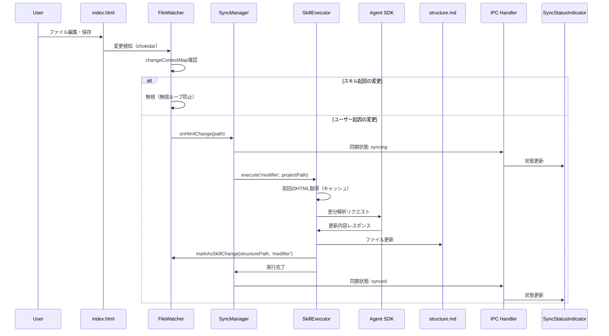
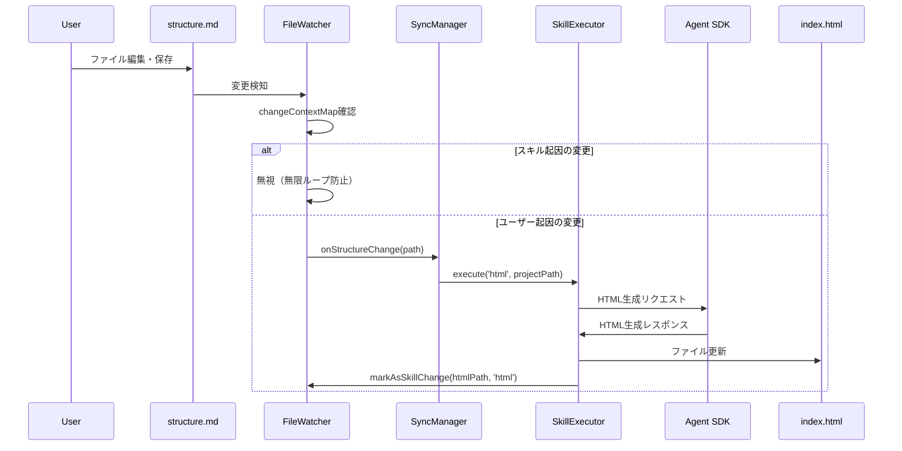

# アーキテクチャ設計書 - index.html→structure.md 逆同期機能

## メタ情報

| 項目     | 内容                             |
| -------- | -------------------------------- |
| 機能名   | slide-reverse-sync               |
| タスクID | task-feat-slide-reverse-sync-001 |
| 作成日   | 2026-01-10                       |
| Phase    | 2                                |

---

## 1. システム概要

### 1.1 全体アーキテクチャ

```
┌─────────────────────────────────────────────────────────────────────┐
│                         Renderer Process                              │
│  ┌─────────────────────────────────────────────────────────────────┐ │
│  │                    SyncStatusIndicator                           │ │
│  │   [同期状態表示] [進捗バー] [エラーメッセージ]                     │ │
│  └─────────────────────────────────────────────────────────────────┘ │
└────────────────────────────────┬────────────────────────────────────┘
                                 │ IPC (slide:sync-status)
┌────────────────────────────────┴────────────────────────────────────┐
│                          Main Process                                 │
│  ┌─────────────────────────────────────────────────────────────────┐ │
│  │                      IPC Handlers                                │ │
│  │  - slide:get-status                                              │ │
│  │  - slide:sync (順方向)                                           │ │
│  │  - slide:reverse-sync (逆方向)                                   │ │
│  │  - slide:cancel                                                  │ │
│  └────────────────────────────────┬────────────────────────────────┘ │
│                                   │                                    │
│  ┌─────────────────┐  ┌──────────┴──────────┐  ┌─────────────────┐  │
│  │  FileWatcher    │──│   SyncManager       │──│ SkillExecutor   │  │
│  │                 │  │                     │  │                 │  │
│  │ - structure.md  │  │ - getStatus()       │  │ - execute()     │  │
│  │ - index.html    │  │ - sync()            │  │ - cancel()      │  │
│  │                 │  │ - reverseSync()     │  │ - onProgress()  │  │
│  │ - onChange()    │  │ - cancel()          │  │                 │  │
│  └────────┬────────┘  └─────────────────────┘  └────────┬────────┘  │
│           │                                              │            │
│           │         ┌───────────────────────────────────┘            │
│           │         │                                                 │
│  ┌────────┴─────────┴──────────────────────────────────────────────┐ │
│  │                    changeContextMap                              │ │
│  │   { path: { source, timestamp, skillPhase } }                    │ │
│  │   [無限ループ防止機構]                                            │ │
│  └─────────────────────────────────────────────────────────────────┘ │
└─────────────────────────────────────────────────────────────────────┘
                                 │
                                 │ Agent SDK API
                                 ▼
┌─────────────────────────────────────────────────────────────────────┐
│                        Claude Agent SDK                               │
│                    (Anthropic Cloud Service)                          │
│  ┌─────────────────────────────────────────────────────────────────┐ │
│  │  Modifier Skill Prompt                                           │ │
│  │  - 変更前HTML + 変更後HTML + 現在のstructure.md                   │ │
│  │  - 差分解析 → structure.md形式の更新内容を出力                    │ │
│  └─────────────────────────────────────────────────────────────────┘ │
└─────────────────────────────────────────────────────────────────────┘
```

---

## 2. コンポーネント設計

### 2.1 FileWatcher（拡張）

**責務**: structure.mdとindex.htmlの両方を監視し、変更イベントを発火する

```typescript
interface SlideWatcher {
  projectPath: string;
  watcher: FSWatcher | null;
  start(): void;
  stop(): void;

  // 既存
  onStructureChange(callback: (path: string) => void): void;

  // 新規追加
  onHtmlChange(callback: (path: string) => void): void;

  // 双方向対応
  markAsSkillChange(path: string, phase: SkillPhase): void;
  clearChangeContext(path: string): void;
}
```

**変更点**:

- index.htmlの監視を追加
- onHtmlChangeコールバックを追加
- changeContextMapを両ファイルに対応

---

### 2.2 SyncManager（拡張）

**責務**: 順方向・逆方向の同期処理を管理する

```typescript
interface SyncManager {
  // 既存
  getStatus(projectPath: string): Promise<SyncStatus>;
  sync(projectPath: string): Promise<void>; // 順方向: structure.md → index.html
  setAutoSync(enabled: boolean): void;
  isAutoSyncEnabled(): boolean;
  onProgress(callback: (progress: number) => void): void;
  cancel(): void;

  // 新規追加
  reverseSync(projectPath: string): Promise<void>; // 逆方向: index.html → structure.md
}
```

**変更点**:

- reverseSync()メソッドを追加
- modifier skillを呼び出す

---

### 2.3 SkillExecutor（既存活用）

**責務**: Claude Agent SDK経由でスキルを実行する

```typescript
interface SkillExecutor {
  execute(
    phase: SkillPhase,
    projectPath: string,
  ): Promise<SkillExecutionResult>;
  cancel(): void;
  onProgress(callback: (progress: number) => void): void;
  isExecuting(): boolean;
}

// SkillPhaseの定義（既存）
type SkillPhase = "hearing" | "structure" | "html" | "modifier";
```

**変更点**:

- modifier skillの実装を追加（現在はシミュレーション）

---

### 2.4 ModifierSkill（新規）

**責務**: index.htmlの変更をstructure.mdに反映する

```typescript
interface ModifierSkillInput {
  projectPath: string;
  previousHtml: string;
  currentHtml: string;
  currentStructure: string;
}

interface ModifierSkillOutput {
  success: boolean;
  updatedStructure?: string;
  changes?: StructureChange[];
  error?: string;
}

interface StructureChange {
  type: "add" | "modify" | "remove";
  section: string;
  content: string;
}
```

---

## 3. データフロー

### 3.1 逆同期フロー



### 3.2 順方向同期フロー（既存・参考）



---

## 4. 無限ループ防止機構

### 4.1 changeContextMapの設計

```typescript
interface ChangeContext {
  source: "skill" | "user";
  timestamp: number;
  skillPhase: SkillPhase;
}

// changeContextMap: Map<string, ChangeContext>

// 例:
// {
//   '/project/structure.md': { source: 'skill', timestamp: 1234567890, skillPhase: 'modifier' },
//   '/project/index.html': { source: 'skill', timestamp: 1234567891, skillPhase: 'html' }
// }
```

### 4.2 双方向対応ロジック

```typescript
const handleChange = (
  filePath: string,
  changeType: "structure" | "html",
): void => {
  const context = changeContextMap.get(filePath);
  const now = Date.now();

  // TTL（1秒）を超えているかチェック
  const isWithinTTL = context && now - context.timestamp < CHANGE_CONTEXT_TTL;

  // スキル起因の変更かつTTL内なら無視
  if (context?.source === "skill" && isWithinTTL) {
    changeContextMap.delete(filePath);
    return;
  }

  // ユーザー起因の変更として処理
  if (changeType === "structure") {
    // 順方向同期: structure.md → index.html
    triggerForwardSync(filePath);
  } else {
    // 逆方向同期: index.html → structure.md
    triggerReverseSync(filePath);
  }
};
```

---

## 5. エラーハンドリング

### 5.1 エラー種別と対応

| エラー種別             | 検出方法         | 対応                           |
| ---------------------- | ---------------- | ------------------------------ |
| Agent SDK接続エラー    | API呼び出し失敗  | リトライ（3回）→ エラー通知    |
| タイムアウト           | 30秒超過         | 処理中断 → エラー通知          |
| 不正なHTML             | パースエラー     | 即時エラー通知                 |
| ファイル書き込みエラー | fs.writeFile失敗 | エラー通知（変更ロールバック） |
| 競合状態               | 同時編集検出     | 警告通知                       |

### 5.2 リトライ機構

```typescript
const executeWithRetry = async (
  fn: () => Promise<void>,
  maxRetries: number = 3,
): Promise<void> => {
  let lastError: Error | null = null;

  for (let attempt = 0; attempt < maxRetries; attempt++) {
    try {
      await fn();
      return;
    } catch (error) {
      lastError = error instanceof Error ? error : new Error(String(error));

      // 指数バックオフ: 1秒, 2秒, 4秒
      const delay = Math.min(1000 * Math.pow(2, attempt), 4000);
      await new Promise((resolve) => setTimeout(resolve, delay));
    }
  }

  throw lastError;
};
```

---

## 6. 状態管理

### 6.1 同期状態

```typescript
type SyncStatus = "synced" | "out-of-sync" | "syncing" | "error";

interface SyncState {
  status: SyncStatus;
  progress: number; // 0-100
  error?: string;
  lastSyncedAt?: number;
  direction?: "forward" | "reverse";
}
```

### 6.2 状態遷移

```
          ┌───────────────────────────┐
          │                           │
          ▼                           │
    ┌──────────┐    変更検知    ┌──────────┐
    │  synced  │ ──────────────▶│ syncing  │
    └──────────┘                └──────────┘
          ▲                           │
          │                           │
          │   成功        ┌───────────┴───────────┐
          └───────────────│                       │
                          │         失敗          ▼
                          │               ┌──────────┐
                          │               │  error   │
                          │               └──────────┘
                          │                     │
                          │      リトライ成功    │
                          └─────────────────────┘
```

---

## 7. 統合ポイント

### 7.1 統合ポイント一覧

| 統合ポイント         | 入力                                  | 出力                       |
| -------------------- | ------------------------------------- | -------------------------- |
| FileWatcher → Sync   | ファイルパス、変更種別                | なし                       |
| Sync → SkillExecutor | skillPhase, projectPath               | SkillExecutionResult       |
| SkillExecutor → SDK  | プロンプト（HTML差分 + structure.md） | 更新されたstructure.md内容 |
| Sync → IPC           | SyncState                             | なし                       |

### 7.2 契約定義

```typescript
// FileWatcher → SyncManager
interface FileChangeEvent {
  path: string;
  type: "structure" | "html";
  timestamp: number;
}

// SyncManager → SkillExecutor
interface SkillExecutionRequest {
  phase: SkillPhase;
  projectPath: string;
  context?: {
    previousContent?: string;
    currentContent?: string;
  };
}

// SkillExecutor → Agent SDK
interface ModifierPrompt {
  previousHtml: string;
  currentHtml: string;
  currentStructure: string;
  instructions: string;
}

// SyncManager → IPC
interface SyncStatusUpdate {
  status: SyncStatus;
  progress: number;
  error?: string;
  direction: "forward" | "reverse";
}
```

---

## 8. パフォーマンス考慮

### 8.1 最適化戦略

| 項目       | 戦略                                 |
| ---------- | ------------------------------------ |
| debounce   | 500msの変更検知debounce              |
| キャッシュ | 前回のHTML内容をメモリキャッシュ     |
| 差分計算   | 全文送信ではなく差分のみ送信（将来） |
| 進捗通知   | 100msごとの進捗更新（throttle）      |

### 8.2 メモリ管理

- changeContextMapのTTL経過後のクリーンアップ
- HTMLキャッシュのサイズ制限（最大10MB）
- 大規模ファイル時のストリーミング処理（将来）

---

## 9. セキュリティ考慮

### 9.1 Agent SDK認証

- APIキーはElectron safeStorageで暗号化保存
- リクエスト時のみメモリに展開
- ログにAPIキーを出力しない

### 9.2 ファイルアクセス

- プロジェクトディレクトリ外へのアクセス防止
- パストラバーサル攻撃への対策
- ファイルパスのバリデーション

---

## 10. 関連ドキュメント

| ドキュメント   | パス                                                                        |
| -------------- | --------------------------------------------------------------------------- |
| 要件定義書     | `outputs/phase-1/requirements-definition.md`                                |
| 受け入れ基準   | `outputs/phase-1/acceptance-criteria.md`                                    |
| ドメインモデル | `outputs/phase-2/domain-model.md`                                           |
| API仕様        | `outputs/phase-2/api-specification.md`                                      |
| IPC設計        | `outputs/phase-2/ipc-design.md`                                             |
| Agent SDK仕様  | `.claude/skills/aiworkflow-requirements/references/interfaces-agent-sdk.md` |
