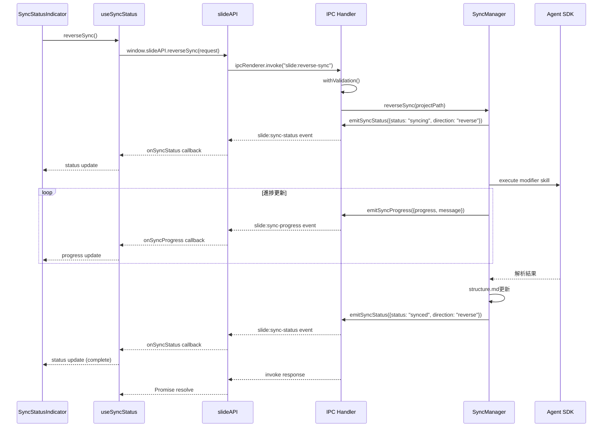

# IPC設計書 - index.html→structure.md 逆同期機能

## メタ情報

| 項目     | 内容                             |
| -------- | -------------------------------- |
| 機能名   | slide-reverse-sync               |
| タスクID | task-feat-slide-reverse-sync-001 |
| 作成日   | 2026-01-10                       |
| Phase    | 2                                |
| スキル   | electron-ipc-patterns            |

---

## 1. 概要

本仕様書では、逆同期機能における Electron IPC 通信設計を定義する。
Main Process と Renderer Process 間の同期状態通知、コマンド送信のインターフェースを規定する。

---

## 2. IPC チャンネル一覧

### 2.1 既存チャンネル（slide機能）

| チャンネル            | 方向            | 説明           | 既存/新規 |
| --------------------- | --------------- | -------------- | --------- |
| `slide:get-status`    | Renderer → Main | 同期状態取得   | 既存      |
| `slide:sync`          | Renderer → Main | 順方向同期実行 | 既存      |
| `slide:cancel`        | Renderer → Main | 同期キャンセル | 既存      |
| `slide:sync-status`   | Main → Renderer | 同期状態通知   | 既存      |
| `slide:sync-progress` | Main → Renderer | 進捗通知       | 既存      |

### 2.2 新規チャンネル（逆同期）

| チャンネル           | 方向            | 説明           | 新規 |
| -------------------- | --------------- | -------------- | ---- |
| `slide:reverse-sync` | Renderer → Main | 逆方向同期実行 | 新規 |

---

## 3. チャンネル仕様

### 3.1 slide:get-status（既存）

**用途**: 現在の同期状態を取得

**Request**:

```typescript
interface GetStatusRequest {
  projectPath: string;
}
```

**Response**:

```typescript
interface GetStatusResponse {
  success: boolean;
  data?: SyncStatus;
  error?: IPCError;
}

interface SyncStatus {
  status: "synced" | "out-of-sync" | "syncing" | "error";
  lastSyncedAt?: number;
  error?: string;
  direction?: "forward" | "reverse";
}
```

---

### 3.2 slide:sync（既存）

**用途**: 順方向同期（structure.md → index.html）を実行

**Request**:

```typescript
interface SyncRequest {
  projectPath: string;
}
```

**Response**:

```typescript
interface SyncResponse {
  success: boolean;
  error?: IPCError;
}
```

---

### 3.3 slide:reverse-sync（新規）

**用途**: 逆方向同期（index.html → structure.md）を実行

**Request**:

```typescript
interface ReverseSyncRequest {
  projectPath: string;
}
```

**Response**:

```typescript
interface ReverseSyncResponse {
  success: boolean;
  data?: {
    changes: StructureChange[];
    updatedAt: number;
  };
  error?: IPCError;
}

interface StructureChange {
  type: "add" | "modify" | "remove";
  section: string;
  content: string;
  reason: string;
}
```

**使用例**:

```typescript
// Renderer Process
const result = await window.slideAPI.reverseSync({
  projectPath: "/path/to/project",
});

if (result.success) {
  console.log("逆同期完了:", result.data?.changes.length, "件の変更");
} else {
  console.error("逆同期失敗:", result.error?.message);
}
```

---

### 3.4 slide:cancel（既存・拡張）

**用途**: 実行中の同期処理をキャンセル

**Request**:

```typescript
interface CancelRequest {
  projectPath: string;
}
```

**Response**:

```typescript
interface CancelResponse {
  success: boolean;
  error?: IPCError;
}
```

**拡張点**: 順方向・逆方向どちらの同期処理もキャンセル可能

---

### 3.5 slide:sync-status（既存・拡張）

**用途**: Main Process から Renderer Process への同期状態通知

**方向**: Main → Renderer（イベント送信）

**Payload**:

```typescript
interface SyncStatusPayload {
  projectPath: string;
  status: "synced" | "out-of-sync" | "syncing" | "error";
  direction: "forward" | "reverse"; // 新規追加
  error?: string;
  timestamp: number;
}
```

**拡張点**: `direction` フィールドを追加し、同期方向を識別可能に

---

### 3.6 slide:sync-progress（既存・拡張）

**用途**: 同期処理の進捗を通知

**方向**: Main → Renderer（イベント送信）

**Payload**:

```typescript
interface SyncProgressPayload {
  projectPath: string;
  progress: number; // 0-100
  message: string;
  direction: "forward" | "reverse"; // 新規追加
}
```

**拡張点**: `direction` フィールドを追加

---

## 4. Preload API 設計

### 4.1 window.slideAPI インターフェース

```typescript
interface SlideAPI {
  // 既存
  getStatus(request: GetStatusRequest): Promise<GetStatusResponse>;
  sync(request: SyncRequest): Promise<SyncResponse>;
  cancel(request: CancelRequest): Promise<CancelResponse>;

  // 新規
  reverseSync(request: ReverseSyncRequest): Promise<ReverseSyncResponse>;

  // イベント購読
  onSyncStatus(callback: (payload: SyncStatusPayload) => void): () => void;
  onSyncProgress(callback: (payload: SyncProgressPayload) => void): () => void;
}
```

### 4.2 Preload スクリプト実装

```typescript
// apps/desktop/src/preload/slideAPI.ts
import { contextBridge, ipcRenderer } from "electron";

const slideAPI: SlideAPI = {
  // 既存メソッド
  getStatus: (request) => ipcRenderer.invoke("slide:get-status", request),
  sync: (request) => ipcRenderer.invoke("slide:sync", request),
  cancel: (request) => ipcRenderer.invoke("slide:cancel", request),

  // 新規メソッド
  reverseSync: (request) => ipcRenderer.invoke("slide:reverse-sync", request),

  // イベント購読
  onSyncStatus: (callback) => {
    const handler = (_event: IpcRendererEvent, payload: SyncStatusPayload) => {
      callback(payload);
    };
    ipcRenderer.on("slide:sync-status", handler);
    return () => ipcRenderer.removeListener("slide:sync-status", handler);
  },

  onSyncProgress: (callback) => {
    const handler = (
      _event: IpcRendererEvent,
      payload: SyncProgressPayload,
    ) => {
      callback(payload);
    };
    ipcRenderer.on("slide:sync-progress", handler);
    return () => ipcRenderer.removeListener("slide:sync-progress", handler);
  },
};

contextBridge.exposeInMainWorld("slideAPI", slideAPI);
```

---

## 5. Main Process ハンドラー設計

### 5.1 IPC ハンドラー登録

```typescript
// apps/desktop/src/main/slide/ipc-handlers.ts
import { ipcMain, BrowserWindow } from "electron";
import { syncManager } from "./sync-manager";

export const registerSlideIPCHandlers = (): void => {
  // 既存ハンドラー
  ipcMain.handle("slide:get-status", async (_event, request) => {
    return withValidation(async () => {
      const status = await syncManager.getStatus(request.projectPath);
      return { success: true, data: status };
    });
  });

  ipcMain.handle("slide:sync", async (_event, request) => {
    return withValidation(async () => {
      await syncManager.sync(request.projectPath);
      return { success: true };
    });
  });

  // 新規ハンドラー
  ipcMain.handle("slide:reverse-sync", async (_event, request) => {
    return withValidation(async () => {
      const result = await syncManager.reverseSync(request.projectPath);
      return {
        success: true,
        data: {
          changes: result.changes,
          updatedAt: Date.now(),
        },
      };
    });
  });

  ipcMain.handle("slide:cancel", async (_event, request) => {
    return withValidation(async () => {
      syncManager.cancel();
      return { success: true };
    });
  });
};
```

### 5.2 イベント送信ヘルパー

```typescript
// apps/desktop/src/main/slide/ipc-emitter.ts
import { BrowserWindow } from "electron";

export const emitSyncStatus = (payload: SyncStatusPayload): void => {
  const windows = BrowserWindow.getAllWindows();
  windows.forEach((window) => {
    if (!window.isDestroyed()) {
      window.webContents.send("slide:sync-status", payload);
    }
  });
};

export const emitSyncProgress = (payload: SyncProgressPayload): void => {
  const windows = BrowserWindow.getAllWindows();
  windows.forEach((window) => {
    if (!window.isDestroyed()) {
      window.webContents.send("slide:sync-progress", payload);
    }
  });
};
```

---

## 6. セキュリティ設計

### 6.1 チャンネルホワイトリスト

```typescript
// apps/desktop/src/preload/channels.ts
export const SLIDE_CHANNELS = {
  invoke: [
    "slide:get-status",
    "slide:sync",
    "slide:reverse-sync",
    "slide:cancel",
  ],
  on: ["slide:sync-status", "slide:sync-progress"],
} as const;
```

### 6.2 withValidation ラッパー

```typescript
import { ipcMain, IpcMainInvokeEvent } from "electron";

const withValidation = async <T>(
  handler: () => Promise<T>,
  event?: IpcMainInvokeEvent,
): Promise<IPCResponse<T>> => {
  try {
    // 1. sender検証
    if (event) {
      const senderWindow = BrowserWindow.fromWebContents(event.sender);
      if (!senderWindow) {
        return {
          success: false,
          error: { code: "INVALID_SENDER", message: "不正なリクエスト元" },
        };
      }

      // 2. DevTools からの呼び出し検出
      if (event.sender.getURL().startsWith("devtools://")) {
        return {
          success: false,
          error: {
            code: "DEVTOOLS_ACCESS",
            message: "DevToolsからのアクセスは禁止",
          },
        };
      }
    }

    // 3. ハンドラー実行
    const result = await handler();
    return { success: true, data: result };
  } catch (error) {
    return {
      success: false,
      error: {
        code: "HANDLER_ERROR",
        message: error instanceof Error ? error.message : String(error),
      },
    };
  }
};
```

### 6.3 パス検証

```typescript
const validateProjectPath = (projectPath: string): boolean => {
  // パストラバーサル攻撃防止
  const normalizedPath = path.normalize(projectPath);

  // 許可されたベースディレクトリ内かチェック
  const allowedBasePaths = [app.getPath("documents"), app.getPath("home")];

  return allowedBasePaths.some((basePath) =>
    normalizedPath.startsWith(basePath),
  );
};
```

---

## 7. エラーハンドリング

### 7.1 IPC エラー型

```typescript
interface IPCError {
  code: IPCErrorCode;
  message: string;
  details?: unknown;
}

type IPCErrorCode =
  | "INVALID_SENDER"
  | "DEVTOOLS_ACCESS"
  | "VALIDATION_FAILED"
  | "HANDLER_ERROR"
  | "NOT_FOUND"
  | "PERMISSION_DENIED"
  | "TIMEOUT"
  | "SYNC_IN_PROGRESS"
  | "AGENT_SDK_ERROR";
```

### 7.2 エラーコードとメッセージ

| コード              | 説明                   | ユーザー向けメッセージ         |
| ------------------- | ---------------------- | ------------------------------ |
| `INVALID_SENDER`    | 不正なリクエスト元     | 不正なリクエストです           |
| `DEVTOOLS_ACCESS`   | DevToolsからのアクセス | 不正なアクセスです             |
| `VALIDATION_FAILED` | 入力バリデーション失敗 | 入力内容を確認してください     |
| `HANDLER_ERROR`     | ハンドラー実行エラー   | 処理中にエラーが発生しました   |
| `NOT_FOUND`         | リソースが見つからない | 対象が見つかりません           |
| `PERMISSION_DENIED` | アクセス権限なし       | アクセス権限がありません       |
| `TIMEOUT`           | タイムアウト           | 処理がタイムアウトしました     |
| `SYNC_IN_PROGRESS`  | 同期処理実行中         | 同期処理が実行中です           |
| `AGENT_SDK_ERROR`   | Agent SDK エラー       | AI解析中にエラーが発生しました |

---

## 8. 状態管理との連携

### 8.1 React Hook（useSyncStatus）

```typescript
// apps/desktop/src/renderer/hooks/useSyncStatus.ts
import { useState, useEffect, useCallback } from "react";

interface UseSyncStatusOptions {
  projectPath: string;
  autoRefresh?: boolean;
}

interface UseSyncStatusReturn {
  status: SyncStatus | null;
  isLoading: boolean;
  error: string | null;
  refresh: () => Promise<void>;
  sync: () => Promise<void>;
  reverseSync: () => Promise<void>;
  cancel: () => Promise<void>;
}

export const useSyncStatus = (
  options: UseSyncStatusOptions,
): UseSyncStatusReturn => {
  const [status, setStatus] = useState<SyncStatus | null>(null);
  const [isLoading, setIsLoading] = useState(false);
  const [error, setError] = useState<string | null>(null);

  const refresh = useCallback(async () => {
    const result = await window.slideAPI.getStatus({
      projectPath: options.projectPath,
    });
    if (result.success && result.data) {
      setStatus(result.data);
    }
  }, [options.projectPath]);

  const sync = useCallback(async () => {
    setIsLoading(true);
    setError(null);
    const result = await window.slideAPI.sync({
      projectPath: options.projectPath,
    });
    setIsLoading(false);
    if (!result.success) {
      setError(result.error?.message ?? "同期に失敗しました");
    }
  }, [options.projectPath]);

  const reverseSync = useCallback(async () => {
    setIsLoading(true);
    setError(null);
    const result = await window.slideAPI.reverseSync({
      projectPath: options.projectPath,
    });
    setIsLoading(false);
    if (!result.success) {
      setError(result.error?.message ?? "逆同期に失敗しました");
    }
  }, [options.projectPath]);

  const cancel = useCallback(async () => {
    await window.slideAPI.cancel({ projectPath: options.projectPath });
    setIsLoading(false);
  }, [options.projectPath]);

  // イベント購読
  useEffect(() => {
    const unsubscribeStatus = window.slideAPI.onSyncStatus((payload) => {
      if (payload.projectPath === options.projectPath) {
        setStatus({
          status: payload.status,
          direction: payload.direction,
          error: payload.error,
        });
        if (payload.status !== "syncing") {
          setIsLoading(false);
        }
      }
    });

    return () => {
      unsubscribeStatus();
    };
  }, [options.projectPath]);

  // 初期取得
  useEffect(() => {
    refresh();
  }, [refresh]);

  return {
    status,
    isLoading,
    error,
    refresh,
    sync,
    reverseSync,
    cancel,
  };
};
```

---

## 9. シーケンス図

### 9.1 逆同期実行フロー



---

## 10. テスト観点

### 10.1 IPC 通信テスト

| テストケース                 | 検証内容                         |
| ---------------------------- | -------------------------------- |
| 正常系: reverseSync          | レスポンス形式、変更内容の正確性 |
| 異常系: 不正パス             | VALIDATION_FAILED エラー         |
| 異常系: 同時実行             | SYNC_IN_PROGRESS エラー          |
| イベント: status通知         | 状態変更がUIに反映されること     |
| イベント: progress通知       | 進捗がUIに反映されること         |
| キャンセル: 実行中キャンセル | 処理中断、状態リセット           |

### 10.2 セキュリティテスト

| テストケース     | 検証内容                 |
| ---------------- | ------------------------ |
| DevTools呼び出し | DEVTOOLS_ACCESS エラー   |
| パストラバーサル | PERMISSION_DENIED エラー |
| 未許可チャンネル | 呼び出しブロック         |

---

## 11. 関連ドキュメント

| ドキュメント         | パス                                                                        |
| -------------------- | --------------------------------------------------------------------------- |
| APIエンドポイント    | `.claude/skills/aiworkflow-requirements/references/api-endpoints.md`        |
| Agent SDK仕様        | `.claude/skills/aiworkflow-requirements/references/interfaces-agent-sdk.md` |
| アーキテクチャ設計書 | `outputs/phase-2/architecture-design.md`                                    |
| ドメインモデル       | `outputs/phase-2/domain-model.md`                                           |
| API仕様書            | `outputs/phase-2/api-specification.md`                                      |
