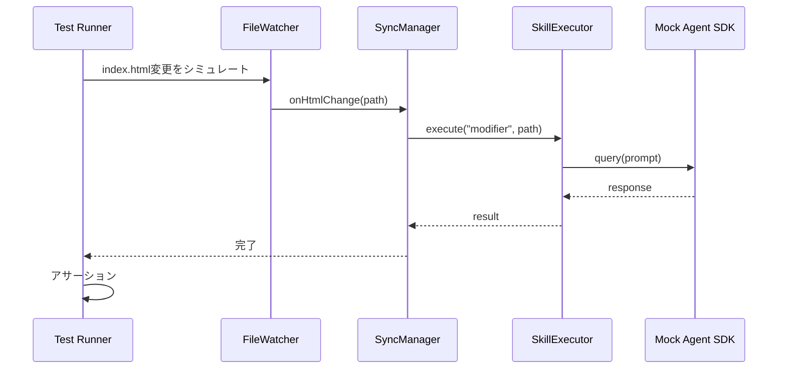

# 統合テスト設計書 - index.html→structure.md 逆同期機能

## メタ情報

| 項目     | 内容                             |
| -------- | -------------------------------- |
| 機能名   | slide-reverse-sync               |
| タスクID | task-feat-slide-reverse-sync-001 |
| 作成日   | 2026-01-10                       |
| Phase    | 4                                |
| スキル   | integration-testing              |

---

## 1. 概要

本設計書では、逆同期機能の統合テストについて定義する。
コンポーネント間の連携、データフロー、IPC通信を検証し、
エンドツーエンドでの機能動作を確認する。

---

## 2. 統合テスト範囲

### 2.1 テスト対象フロー

```
┌──────────────────────────────────────────────────────────────────┐
│                      統合テスト対象範囲                             │
├──────────────────────────────────────────────────────────────────┤
│                                                                    │
│   index.html変更                                                   │
│        │                                                           │
│        ▼                                                           │
│   ┌─────────────┐    ┌─────────────┐    ┌─────────────┐          │
│   │ FileWatcher │ ──▶│ SyncManager │ ──▶│   Skill     │          │
│   │             │    │             │    │  Executor   │          │
│   └─────────────┘    └─────────────┘    └─────────────┘          │
│                            │                    │                  │
│                            │                    ▼                  │
│                            │            ┌─────────────┐           │
│                            │            │  Modifier   │           │
│                            │            │   Skill     │           │
│                            │            └─────────────┘           │
│                            │                    │                  │
│                            ▼                    ▼                  │
│                      ┌─────────────┐    ┌─────────────┐          │
│                      │ IPC Handler │    │   Agent     │          │
│                      │             │    │    SDK      │          │
│                      └─────────────┘    └─────────────┘          │
│                            │                    │                  │
│                            ▼                    ▼                  │
│                      ┌─────────────┐    structure.md更新          │
│                      │  Renderer   │                               │
│                      │  (UI更新)   │                               │
│                      └─────────────┘                               │
└──────────────────────────────────────────────────────────────────┘
```

### 2.2 テスト分類

| 分類               | 説明                           | 優先度 |
| ------------------ | ------------------------------ | ------ |
| ファイル変更フロー | 変更検知→同期→更新の一連の流れ | 高     |
| 無限ループ防止     | 双方向での循環防止             | 高     |
| IPC通信            | Main↔Renderer間の状態同期      | 中     |
| エラー回復         | 障害発生時の回復処理           | 中     |
| 並行処理           | 同時リクエスト時の挙動         | 低     |

---

## 3. テストケース詳細

### IT-01: HTML変更→逆同期トリガー

**目的**: index.html変更が逆同期をトリガーすることを確認

**前提条件**:

- 統合テスト環境が起動済み
- モックAgent SDKが設定済み

**テストフロー**:



**テストコード**:

```typescript
describe("IT-01: HTML変更→逆同期トリガー", () => {
  it("should trigger reverseSync on html change", async () => {
    // Arrange
    const projectPath = "/test/project";
    const mockAgent = createMockAgentSDK();
    const fileWatcher = createSlideWatcher(projectPath);
    const syncManager = createSyncManager(createSkillExecutor(mockAgent));

    // ファイル変更コールバックを接続
    fileWatcher.onHtmlChange((path) => {
      syncManager.reverseSync(projectPath);
    });

    fileWatcher.start();

    // Act
    await simulateFileChange(`${projectPath}/index.html`);

    // Assert
    expect(mockAgent.query).toHaveBeenCalled();
    expect(mockAgent.query).toHaveBeenCalledWith(
      expect.stringContaining("index.html"),
      expect.any(Object),
    );
  });
});
```

---

### IT-02: structure.md更新確認

**目的**: 逆同期成功時にstructure.mdが正しく更新されることを確認

**テストコード**:

```typescript
describe("IT-02: structure.md更新確認", () => {
  it("should update structure.md on successful sync", async () => {
    // Arrange
    const projectPath = await createTestProject({
      "index.html": "<html><h1>Updated Title</h1></html>",
      "structure.md": "# Original Title",
    });

    const mockAgent = createMockAgentSDK({
      response: JSON.stringify({
        success: true,
        updatedStructure: "# Updated Title",
        changes: [
          {
            type: "modify",
            section: "title",
            content: "Updated Title",
            reason: "H1変更",
          },
        ],
      }),
    });

    // Act
    await runReverseSyncFlow(projectPath, mockAgent);

    // Assert
    const updatedStructure = await fs.readFile(
      `${projectPath}/structure.md`,
      "utf-8",
    );
    expect(updatedStructure).toContain("# Updated Title");
  });
});
```

---

### IT-03: 双方向無限ループ防止

**目的**: 順方向→逆方向→順方向の無限ループが発生しないことを確認

**テストコード**:

```typescript
describe("IT-03: 双方向無限ループ防止", () => {
  it("should prevent infinite loop on bidirectional changes", async () => {
    // Arrange
    const projectPath = await createTestProject();
    const syncCallCount = { forward: 0, reverse: 0 };

    const fileWatcher = createSlideWatcher(projectPath);
    const syncManager = createSyncManager(createMockSkillExecutor());

    // コールバック登録
    fileWatcher.onStructureChange(async () => {
      syncCallCount.forward++;
      const result = await syncManager.sync(projectPath);
      // html skill による変更をマーク
      fileWatcher.markAsSkillChange(`${projectPath}/index.html`, "html");
    });

    fileWatcher.onHtmlChange(async () => {
      syncCallCount.reverse++;
      const result = await syncManager.reverseSync(projectPath);
      // modifier skill による変更をマーク
      fileWatcher.markAsSkillChange(`${projectPath}/structure.md`, "modifier");
    });

    fileWatcher.start();

    // Act: structure.md変更をトリガー
    await simulateFileChange(`${projectPath}/structure.md`);

    // 少し待機して連鎖が発生しないことを確認
    await new Promise((resolve) => setTimeout(resolve, 2000));

    // Assert
    expect(syncCallCount.forward).toBe(1); // 1回のみ
    expect(syncCallCount.reverse).toBe(0); // 逆同期は発生しない
  });
});
```

---

### IT-04: IPCイベント発火確認

**目的**: 同期処理中に正しいIPCイベントが発火されることを確認

**テストコード**:

```typescript
describe("IT-04: IPCイベント発火確認", () => {
  it("should emit correct IPC events during sync", async () => {
    // Arrange
    const projectPath = "/test/project";
    const events: Array<{ channel: string; payload: unknown }> = [];

    // IPCイベントをキャプチャ
    mockIpcMain.on("slide:sync-status", (payload) => {
      events.push({ channel: "slide:sync-status", payload });
    });
    mockIpcMain.on("slide:sync-progress", (payload) => {
      events.push({ channel: "slide:sync-progress", payload });
    });

    // Act
    await runReverseSyncFlow(projectPath);

    // Assert
    // 開始イベント
    expect(events).toContainEqual(
      expect.objectContaining({
        channel: "slide:sync-status",
        payload: expect.objectContaining({
          status: "syncing",
          direction: "reverse",
        }),
      }),
    );

    // 進捗イベント
    const progressEvents = events.filter(
      (e) => e.channel === "slide:sync-progress",
    );
    expect(progressEvents.length).toBeGreaterThan(0);

    // 完了イベント
    expect(events).toContainEqual(
      expect.objectContaining({
        channel: "slide:sync-status",
        payload: expect.objectContaining({
          status: "synced",
          direction: "reverse",
        }),
      }),
    );
  });
});
```

---

### IT-05: 同時リクエスト処理

**目的**: 同時に複数の同期リクエストが発生した場合の挙動を確認

**テストコード**:

```typescript
describe("IT-05: 同時リクエスト処理", () => {
  it("should handle concurrent sync requests", async () => {
    // Arrange
    const projectPath = "/test/project";
    const syncManager = createSyncManager(createMockSkillExecutor());

    // Act: 同時に複数のリクエストを発行
    const promise1 = syncManager.reverseSync(projectPath);
    const promise2 = syncManager.reverseSync(projectPath);

    // Assert: 2つ目はエラーまたはキューイング
    await expect(promise1).resolves.toBeDefined();
    // 実装によっては2つ目はエラーになるか、キューに入る
    await expect(promise2).rejects.toThrow("Sync already in progress");
  });
});
```

---

### IT-06: Agent SDK障害からの回復

**目的**: Agent SDK障害発生後に回復できることを確認

**テストコード**:

```typescript
describe("IT-06: Agent SDK障害からの回復", () => {
  it("should recover from Agent SDK failure", async () => {
    // Arrange
    const projectPath = "/test/project";
    let callCount = 0;

    const mockAgent = createMockAgentSDK({
      queryHandler: () => {
        callCount++;
        if (callCount <= 2) {
          throw new Error("Network error");
        }
        return JSON.stringify({
          success: true,
          changes: [],
          updatedStructure: "# OK",
        });
      },
    });

    // Act
    const result = await runReverseSyncFlowWithRetry(projectPath, mockAgent);

    // Assert
    expect(callCount).toBe(3); // 2回失敗 + 1回成功
    expect(result.success).toBe(true);
  });
});
```

---

## 4. テストユーティリティ

### 4.1 モックファクトリ

```typescript
// tests/utils/mock-factories.ts

/**
 * モックAgent SDKを作成
 */
export const createMockAgentSDK = (options?: MockAgentOptions) => {
  return {
    query: vi.fn().mockImplementation((prompt, queryOptions) => {
      if (options?.queryHandler) {
        return options.queryHandler(prompt, queryOptions);
      }
      return (
        options?.response ??
        JSON.stringify({
          success: true,
          changes: [],
          updatedStructure: "# Test",
        })
      );
    }),
    abort: vi.fn(),
    getStatus: vi.fn().mockResolvedValue({ status: "initialized" }),
    onMessage: vi.fn(),
  };
};

/**
 * モックSkillExecutorを作成
 */
export const createMockSkillExecutor = (
  options?: MockExecutorOptions,
): SkillExecutor => {
  return {
    execute: vi.fn().mockResolvedValue({
      success: true,
      changes: options?.changes ?? [],
      duration: 1000,
    }),
    cancel: vi.fn(),
    isExecuting: vi.fn().mockReturnValue(false),
    onProgress: vi.fn(),
  };
};

/**
 * テストプロジェクトを作成
 */
export const createTestProject = async (
  files?: Record<string, string>,
): Promise<string> => {
  const tmpDir = await fs.mkdtemp(path.join(os.tmpdir(), "slide-test-"));

  const defaultFiles = {
    "structure.md": "# Test Structure\n\n## Slide 1\nContent",
    "index.html": "<html><body><h1>Test</h1></body></html>",
  };

  const filesToCreate = { ...defaultFiles, ...files };

  for (const [filename, content] of Object.entries(filesToCreate)) {
    await fs.writeFile(path.join(tmpDir, filename), content);
  }

  return tmpDir;
};
```

### 4.2 テストヘルパー

```typescript
// tests/utils/test-helpers.ts

/**
 * ファイル変更をシミュレート
 */
export const simulateFileChange = async (filePath: string): Promise<void> => {
  // chokidarのモックイベントを発火
  const mockWatcher = getMockWatcherInstance();
  mockWatcher.emit("change", filePath);

  // debounce待機
  await new Promise((resolve) => setTimeout(resolve, 600));
};

/**
 * 逆同期フローを実行
 */
export const runReverseSyncFlow = async (
  projectPath: string,
  mockAgent?: MockAgentAPI,
): Promise<ReverseSyncResult> => {
  const agent = mockAgent ?? createMockAgentSDK();
  const executor = createSkillExecutor(agent);
  const syncManager = createSyncManager(executor);

  return syncManager.reverseSync(projectPath);
};

/**
 * リトライ付き逆同期フローを実行
 */
export const runReverseSyncFlowWithRetry = async (
  projectPath: string,
  mockAgent: MockAgentAPI,
  maxRetries: number = 3,
): Promise<ReverseSyncResult> => {
  const executor = createSkillExecutor(mockAgent);
  const syncManager = createSyncManager(executor);

  let lastError: Error | null = null;

  for (let i = 0; i < maxRetries; i++) {
    try {
      return await syncManager.reverseSync(projectPath);
    } catch (error) {
      lastError = error as Error;
      await new Promise((resolve) => setTimeout(resolve, 1000 * (i + 1)));
    }
  }

  throw lastError;
};
```

---

## 5. テスト環境セットアップ

### 5.1 セットアップファイル

```typescript
// tests/setup/integration-setup.ts

import { vi, beforeEach, afterEach, afterAll } from "vitest";

// グローバルモック
vi.mock("chokidar");
vi.mock("fs/promises");
vi.mock("electron", () => ({
  ipcMain: {
    handle: vi.fn(),
    on: vi.fn(),
    emit: vi.fn(),
  },
  BrowserWindow: {
    getAllWindows: vi.fn().mockReturnValue([]),
  },
}));

// テストごとのセットアップ
beforeEach(() => {
  vi.clearAllMocks();
  vi.useFakeTimers();
});

afterEach(() => {
  vi.useRealTimers();
});

// テスト終了時のクリーンアップ
afterAll(async () => {
  // 一時ファイルの削除
  await cleanupTestProjects();
});
```

### 5.2 Vitest設定

```typescript
// vitest.config.integration.ts

import { defineConfig } from "vitest/config";

export default defineConfig({
  test: {
    include: ["**/*.integration.test.ts"],
    setupFiles: ["./tests/setup/integration-setup.ts"],
    testTimeout: 30000,
    hookTimeout: 10000,
  },
});
```

---

## 6. テスト実行計画

### 6.1 実行順序

| 順序 | テストID | 依存関係 |
| ---- | -------- | -------- |
| 1    | IT-01    | なし     |
| 2    | IT-02    | IT-01    |
| 3    | IT-03    | IT-01    |
| 4    | IT-04    | IT-01    |
| 5    | IT-05    | IT-01    |
| 6    | IT-06    | IT-01    |

### 6.2 実行コマンド

```bash
# 統合テストのみ実行
pnpm --filter @repo/desktop test:integration

# 特定のテストスイートを実行
pnpm --filter @repo/desktop test:integration -- --grep "IT-03"

# カバレッジ付き
pnpm --filter @repo/desktop test:integration:coverage
```

---

## 7. 成功基準

### 7.1 テストパス基準

| 基準             | 値               |
| ---------------- | ---------------- |
| 全テストパス     | 必須             |
| テスト実行時間   | 60秒以内         |
| フレーキーテスト | 0件              |
| スキップテスト   | 0件（TDD完了後） |

### 7.2 カバレッジ基準

| メトリクス       | 目標 |
| ---------------- | ---- |
| 統合パス網羅率   | 100% |
| エラーパス網羅率 | 80%  |

---

## 8. 関連ドキュメント

| ドキュメント   | パス                                     |
| -------------- | ---------------------------------------- |
| テスト仕様書   | `outputs/phase-4/test-specification.md`  |
| テストケース   | `outputs/phase-4/test-cases.md`          |
| アーキテクチャ | `outputs/phase-2/architecture-design.md` |
| IPC設計書      | `outputs/phase-2/ipc-design.md`          |
