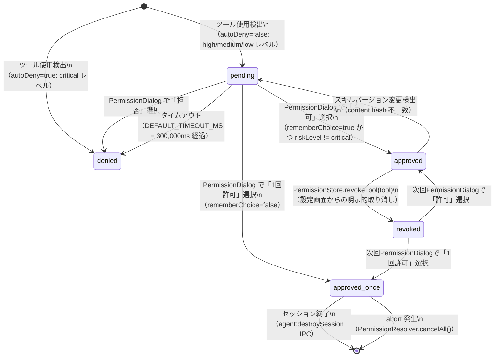

# 権限状態フロー定義書

## メタ情報

| 項目       | 値                                       |
| ---------- | ---------------------------------------- |
| 成果物ID   | OUT-2                                    |
| タスクID   | TASK-SKILL-LIFECYCLE-06                  |
| Phase      | 1: 要件定義                              |
| 作成日     | 2026-03-16                               |
| 対応AC     | AC-1（確認方式の定義）、AC-2（状態遷移） |
| 依存成果物 | OUT-1（risk-level-classification.md）    |

---

## 1. 権限4モードの定義

| モード          | 説明                                                   | 永続化先                                 | スコープ                      |
| --------------- | ------------------------------------------------------ | ---------------------------------------- | ----------------------------- |
| `denied`        | 拒否。ユーザーが明示的に許可するまで実行不可           | なし（isToolAllowed=false がデフォルト） | リクエスト単位                |
| `approved_once` | 今回のみ許可。セッション終了で自動失効                 | in-memory（sessionMemory）               | セッション単位（`sessionId`） |
| `approved`      | 恒久許可。アプリ再起動後も有効                         | electron-store                           | 永続（アプリ再起動後も有効）  |
| `revoked`       | 恒久許可を取り消した状態。次回ツール呼び出し時に再確認 | electron-store から削除                  | 取り消し操作後即時            |

---

## 2. 状態遷移図（Mermaid形式）

---

## 3. 状態遷移条件詳細

| 遷移元          | 遷移先          | トリガー条件                                                           | 実行者                   |
| --------------- | --------------- | ---------------------------------------------------------------------- | ------------------------ |
| `[初期状態]`    | `denied`        | `riskLevel === "critical"` かつ autoDeny=true                          | SkillExecutor            |
| `[初期状態]`    | `pending`       | `PermissionStore.isToolAllowed(tool) === false` かつ autoDeny=false    | SkillExecutor            |
| `pending`       | `approved`      | `respondToSkillPermission(true, true)` かつ `riskLevel !== "critical"` | Renderer（ユーザー操作） |
| `pending`       | `approved_once` | `respondToSkillPermission(true, false)`                                | Renderer（ユーザー操作） |
| `pending`       | `denied`        | `respondToSkillPermission(false, false)`                               | Renderer（ユーザー操作） |
| `pending`       | `denied`        | `DEFAULT_TIMEOUT_MS`（300,000ms）経過で Promise が reject              | PermissionResolver       |
| `approved`      | `revoked`       | `PermissionStore.revokeTool(tool)` が `true` を返却                    | 設定画面 UI              |
| `approved`      | `pending`       | スキルの content hash が前回許可時の hash と不一致                     | SkillExecutor            |
| `revoked`       | `approved`      | 次回権限ダイアログで `respondToSkillPermission(true, true)`            | Renderer（ユーザー操作） |
| `revoked`       | `approved_once` | 次回権限ダイアログで `respondToSkillPermission(true, false)`           | Renderer（ユーザー操作） |
| `approved_once` | `[消失]`        | `agent:destroySession({ sessionId })` IPC が発行                       | SessionManager           |
| `approved_once` | `[消失]`        | `PermissionResolver.cancelAll()` が呼び出された（abort 時）            | SkillExecutor            |

---

## 4. PermissionResolver 8ステップフロー

| ステップ | 実行者        | アクション                                                                     | 権限状態への影響                               |
| -------- | ------------- | ------------------------------------------------------------------------------ | ---------------------------------------------- |
| 1        | SkillExecutor | ツール使用を検出。`ToolRiskLevel` を `TOOL_RISK_CONFIG` で判定                 | なし                                           |
| 2        | SkillExecutor | `PermissionStore` で既存承認（`approved` 状態）を確認                          | なし                                           |
| 3        | SkillExecutor | 承認あり → ツール実行許可（フロー終了）。承認なし → ステップ4へ                | `approved` ならフロー終了                      |
| 4        | SkillExecutor | `autoDenyDefault` チェック。`riskLevel === "critical"` の場合 autoDeny=true    | なし                                           |
| 5        | SkillExecutor | autoDeny=true → 自動拒否 → abort フローへ（フロー終了）                        | `denied` で確定                                |
| 6        | Main Process  | autoDeny=false → IPC で Renderer に `SkillPermissionRequest` を送信            | `pending` に遷移                               |
| 7        | Renderer      | `PermissionDialog` でユーザーに確認。ユーザーが応答を選択                      | `pending` を維持                               |
| 8        | IPC Handler   | `PermissionResolver.resolveRequest(response)` を呼び出し。応答に基づき状態確定 | `approved` / `approved_once` / `denied` に遷移 |

---

## 5. セッション管理

| 項目                     | 仕様                                                                                                                                |
| ------------------------ | ----------------------------------------------------------------------------------------------------------------------------------- |
| session スコープの定義   | `sessionId` を単位とした期間。アプリ再起動で消滅する                                                                                |
| `approved_once` の保存先 | `sessionMemory: Map<sessionId, Set<toolName>>`（in-memory のみ。electron-store に非保存）                                           |
| セッション終了トリガー   | `agent:destroySession({ sessionId })` IPC、またはアプリプロセス終了                                                                 |
| セッション終了時の処理   | `sessionMemory.delete(sessionId)` で該当セッションの全 `approved_once` を一括削除                                                   |
| `sessionId` の一意性     | `agent:createSession` IPC 呼び出し時に Main Process の `SessionManager` が生成。同一スキル再実行でも新しい `sessionId` が発行される |

---

## 6. abort フロー（4ステップ）

| ステップ | アクション                                                                               | 実行者         |
| -------- | ---------------------------------------------------------------------------------------- | -------------- |
| 1        | `PermissionResolver.cancelAll()` — 全 pending リクエストを reject し `denied` として処理 | SkillExecutor  |
| 2        | 該当 `sessionId` の全 `sessionEntries`（`approved_once`）を削除する                      | SessionManager |
| 3        | 実行ログに abort イベントを記録する                                                      | SkillExecutor  |
| 4        | Renderer に `skill:execution:aborted` IPC を送信する                                     | Main Process   |

### abort 後の権限状態変化

| 状態            | abort 後の変化                                          |
| --------------- | ------------------------------------------------------- |
| `pending`       | `denied` に変更（cancelAll により全 pending が reject） |
| `approved_once` | `[消失]`（sessionMemory から削除）                      |
| `approved`      | `approved` のまま変更なし（永続化済みのため影響なし）   |
| `denied`        | `denied` のまま変更なし                                 |

---

## 7. タイムアウト仕様

| 定数名               | 値       | 単位      |
| -------------------- | -------- | --------- |
| `DEFAULT_TIMEOUT_MS` | `300000` | ms（5分） |

タイムアウト発生時の処理フロー:

1. `PermissionResolver.waitForResponse(requestId)` が 300,000ms 経過後に Promise を reject する
2. 権限状態を `denied` として処理する（フェイルセキュア原則: 障害時は安全側に倒す）
3. 承認履歴に `decision: "denied"` かつ `triggerContext: "timeout"` として記録する
4. SkillExecutor はツール呼び出しをスキップし、エラーレスポンスをスキル実行ログに記録する

---

## 8. AC対応マッピング

| AC   | 対応内容                                                  | 本文書の対応セクション                                                    |
| ---- | --------------------------------------------------------- | ------------------------------------------------------------------------- |
| AC-1 | 危険操作の権限境界定義（4段階リスク分類、確認方式の定義） | セクション4（8ステップフロー）、セクション7（タイムアウト）               |
| AC-2 | 承認取り消しフロー（失効条件、手動取り消し、状態遷移）    | セクション1〜3（状態定義・遷移図・遷移条件）、セクション6（abort フロー） |
| AC-3 | 説明責任UI（INS-01〜03、ScoringGate連携）                 | セクション5（`approved_once` セッションスコープが INS-03 表示条件に使用） |
| AC-4 | 公開前安全性ゲート（SafetyGatePort、SafetyGateResult）    | セクション3（`approved` 状態の存在確認が SafetyCheckId の判定に使用）     |
