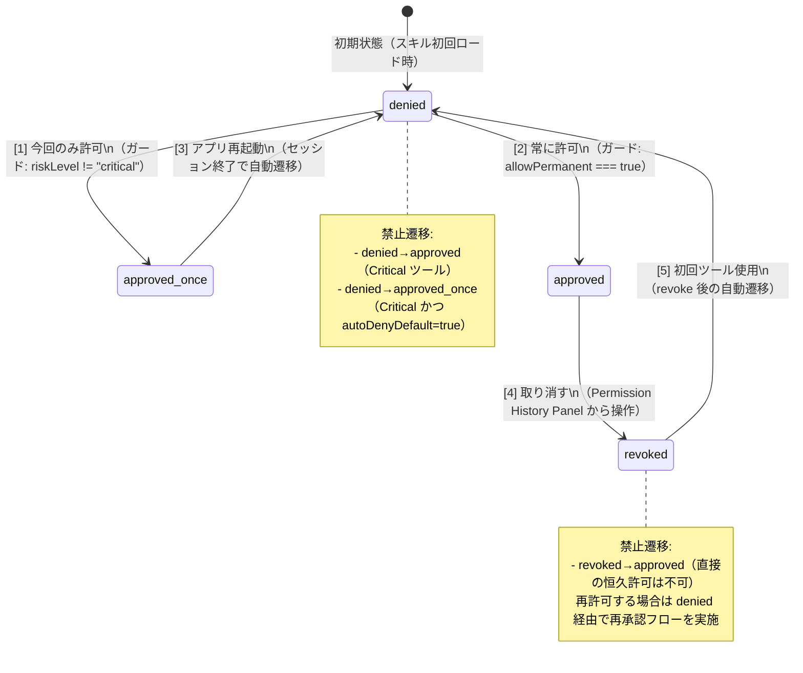

# 権限状態マシン定義（正式版）

<!-- Task-06 Phase 5 成果物: 権限状態4モードの遷移定義 -->

## メタ情報

| 項目         | 内容                                                 |
| ------------ | ---------------------------------------------------- |
| 作成フェーズ | Phase 5（実装仕様）                                  |
| 依存成果物   | Phase 2 設計書, Phase 4 テスト設計書                 |
| 参照テストID | TC-SM-001（有効遷移）, TC-SM-002（禁止遷移）         |
| 検証方法     | scripts/validate-trust-governance-design.ts の項目 5 |

---

## 状態定義

| 状態名        | 説明                                                                     | electron-store 永続化 |
| ------------- | ------------------------------------------------------------------------ | --------------------- |
| denied        | 拒否または未許可。デフォルト状態。                                       | しない                |
| approved_once | 今回のセッションのみ許可。アプリ再起動で denied に戻る。                 | しない（メモリのみ）  |
| approved      | 恒久許可。electron-store に永続化され、アプリ再起動後も有効。            | する                  |
| revoked       | 取り消し済み。履歴テーブルには decision:"revoked" として記録を保持する。 | しない                |

---

## 状態遷移図（Mermaid）

---

## 有効遷移一覧（5パス）

### パス 1: denied → approved_once

- **トリガー**: PermissionDialog の「今回のみ許可」ボタン押下
- **ガード条件**: `riskLevel !== "critical"`（Critical ツールへの一時許可は禁止）
- **事後条件**:
  - `PermissionStore.allowTool({ expiryPolicy: "session", ... })` が呼ばれる
  - electron-store には書き込まない（セッション終了で自動消滅）
  - 承認履歴テーブルに `decision: "approved_once"` が記録される

### パス 2: denied → approved

- **トリガー**: PermissionDialog の「常に許可」ボタン押下
- **ガード条件**: `TOOL_RISK_CONFIG[riskLevel].allowPermanent === true`（medium / low のみ）
- **事後条件**:
  - `PermissionStore.allowTool({ expiryPolicy: "permanent", ... })` が呼ばれる
  - electron-store に `AllowedToolEntryV2` が書き込まれる
  - 承認履歴テーブルに `decision: "approved_permanent"` が記録される

### パス 3: approved_once → denied

- **トリガー**: アプリ再起動（セッション終了）
- **ガード条件**: なし（自動遷移）
- **事後条件**:
  - `PermissionStore.revokeSessionEntries(sessionId)` が呼ばれる
  - `expiryPolicy === "session"` の全エントリが削除される
  - 履歴テーブルへの追記なし（セッション終了は正常フロー）

### パス 4: approved → revoked

- **トリガー**: Permission History Panel の「取り消す」ボタン押下
- **ガード条件**: なし
- **事後条件**:
  - `PermissionStore.revokeTool(toolName)` が呼ばれる
  - electron-store から該当エントリが削除される
  - 承認履歴テーブルに `decision: "revoked"` が記録される（元の approved エントリを上書きせず追記）

### パス 5: revoked → denied

- **トリガー**: revoke 後の初回ツール使用（自動遷移）
- **ガード条件**: なし（revoked エントリが存在しない場合、isToolAllowed が false を返すことで自動発生）
- **事後条件**:
  - `PermissionStore.isToolAllowed(toolName)` が false を返す
  - 次回ツール使用時に PermissionDialog が表示される

---

## 禁止遷移一覧（4パス）

### 禁止パス 1: denied → approved（Critical ツール）

- **禁止理由**: `TOOL_RISK_CONFIG["critical"].allowPermanent === false`（不変条件）
- **検出方法**: PermissionDialog が「常に許可」ボタンを表示しない
- **テスト**: TC-SM-002-1

### 禁止パス 2: denied → approved_once（Critical ツール かつ autoDenyDefault）

- **禁止理由**: `TOOL_RISK_CONFIG["critical"].autoDenyDefault === true` かつ `allowApproveOnce === false`
- **検出方法**: PermissionDialog を表示せずに `decision: "denied"` を返す
- **テスト**: TC-SM-002-2

### 禁止パス 3: approved → approved（同一状態への遷移）

- **禁止理由**: 冪等性。同一 toolName に対して `allowTool` を2回呼ぶと上書きになる（エラーは発生しない）
- **検出方法**: 2回目の allowTool 呼び出しは上書き処理。新規承認履歴は追記しない
- **テスト**: TC-SM-002-3

### 禁止パス 4: revoked → approved（直接の恒久許可）

- **禁止理由**: revoke 後に直接 approved に遷移する経路は存在しない。必ず denied 経由で再承認フローを実施する
- **検出方法**: `revoke` 後に `allowTool` を呼ぶと denied → approved の通常フローとして扱われる（revoked 状態から approved への直接遷移ではない）
- **テスト**: TC-SM-002-4

---

## ガード条件まとめ

| 遷移                 | ガード条件式                                            | 違反時の動作                   |
| -------------------- | ------------------------------------------------------- | ------------------------------ |
| denied→approved_once | `TOOL_RISK_CONFIG[riskLevel].allowApproveOnce === true` | ボタン非表示。自動 denied 返却 |
| denied→approved      | `TOOL_RISK_CONFIG[riskLevel].allowPermanent === true`   | ボタン非表示                   |
| denied（自動拒否）   | `TOOL_RISK_CONFIG[riskLevel].autoDenyDefault === true`  | Dialog 非表示で即時 denied     |
