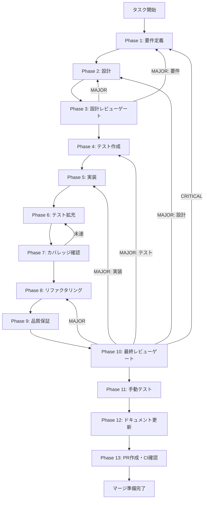

# TASK-RT-06: claude-sdk-message-contract-normalization

## 概要

Claude Code SDK の `query()` は `system/init`、`assistant`、`result` など複数種の `SDKMessage` をストリームで返し、`session_id`、permission denial、result subtype などの重要情報を含む。本タスクは、この SDK 生イベントを lane 内の安定契約へ正規化し、常に最新の `.claude/skills/skill-creator/` を動的に読んで実行する主線を壊さずに、UI / WorkflowEngine / session resume が一貫した入力を受け取れるようにする。

## メタ情報

| 項目         | 内容                                      |
| ------------ | ----------------------------------------- |
| タスクID     | TASK-RT-06                                |
| タスク名     | claude-sdk-message-contract-normalization |
| 分類         | バグ修正 / SDK 契約安定化                 |
| 対象機能     | Claude Code SDK SDKMessage 正規化         |
| 優先度       | 高（RT: Runtime）                         |
| 見積もり規模 | 中規模                                    |
| ステータス   | spec_created                              |
| 作成日       | 2026-03-29                                |

## タスク概要

### 目的

Claude Code SDK の `SDKMessage` を lane 正規化イベントへ変換するための安定契約を確立し、UI / WorkflowEngine / session resume が一貫した入力を受け取れるようにする。

### 背景

Claude Code SDK の `query()` は `system/init`、`assistant`、`result` など複数種の `SDKMessage` をストリームで返し、`session_id`、permission denial、result subtype などの重要情報を含む。現状これらの生イベントがそのまま UI や WorkflowEngine に漏れており、後続実装（session resume、file writer、hooks）が SDK 内部構造に直接依存する不安定な状態にある。

### 最終ゴール

`query()` 実行の全結果が lane 正規化イベント（`SkillCreatorSdkEvent`）として揃い、`session_id` が session resume にそのまま引き渡せ、permission denial や result subtype が UI へ欠落なく届き、`.claude/skills/skill-creator/` の provenance が結果へ紐付く状態。

### 成果物一覧

| 種別         | 成果物                    | 配置先                                             |
| ------------ | ------------------------- | -------------------------------------------------- |
| 型定義       | SkillCreatorSdkEvent 型   | `packages/shared/src/types/skillCreator.ts`        |
| 実装         | SDKMessage normalizer     | `apps/desktop/src/main/services/runtime/`          |
| テスト       | normalizer ユニットテスト | `apps/desktop/src/main/services/runtime/*.test.ts` |
| ドキュメント | Phase別成果物             | `outputs/phase-*/`                                 |
| PR           | GitHub Pull Request       | GitHub UI                                          |

## 受入基準

| ID   | 基準                                                                                    |
| ---- | --------------------------------------------------------------------------------------- |
| AC-1 | Claude Code SDK の `SDKMessage` を lane 専用の正規化イベント型へ変換できる              |
| AC-2 | `session_id`、`result.subtype`、permission denial、stop reason が正規化結果に保持される |
| AC-3 | UI / IPC / WorkflowEngine が SDK 生イベントではなく正規化イベントを消費する             |
| AC-4 | `.claude/skills/skill-creator/` の source root / provenance が正規化結果へ紐付く        |
| AC-5 | `system/init` 不在、途中中断、permission denial、tool error の edge case を扱える       |
| AC-6 | 既存の `skill-creator` 動的読込と `query()` 実行主線を変更しない                        |

## スコープ

**含む**:

- Claude Code SDK `SDKMessage` → lane 正規化イベント型の定義
- `system/init` / `assistant` / `result` / error 系メッセージの分類
- `session_id` / provenance / permission denial / result subtype の保持
- Facade / IPC / renderer へ渡す payload の統一
- ストリーム順序と replay 可能性の定義
- ユニットテスト・統合テスト

**含まない**:

- `.claude/skills/skill-creator/` の内容固定化やハードコード
- `query()` 呼び出しそのものの実装置き換え
- permission policy 本体の実装（TASK-P0-09 の責務）
- session persistence UI（TASK-P0-08 の責務）

## 依存関係

| 種別       | 参照先                           | 役割                                       |
| ---------- | -------------------------------- | ------------------------------------------ |
| upstream   | `../requirements-draft.md`       | `query()` 主線と session 要件              |
| upstream   | `../root-workflow-pack/index.md` | lane 共通不変条件                          |
| downstream | TASK-RT-03                       | 結果パネル表示の入力契約                   |
| downstream | TASK-P0-05                       | execute 書き出し時の result 解釈           |
| downstream | TASK-P0-08                       | session resume の `session_id` 契約        |
| downstream | TASK-P0-09                       | permission / hooks / audit の event source |

## 現行コードアンカー

| ファイル                                                              | 現状の役割                  | TASK-RT-06 での扱い                    |
| --------------------------------------------------------------------- | --------------------------- | -------------------------------------- |
| `apps/desktop/src/main/services/runtime/RuntimeSkillCreatorFacade.ts` | `query()` 実行結果の橋渡し  | SDKMessage 正規化の entry point を追加 |
| `apps/desktop/src/main/ipc/creatorHandlers.ts`                        | renderer へのレスポンス変換 | 正規化 payload を forward              |
| `apps/desktop/src/preload/skill-creator-api.ts`                       | preload API 定義            | ストリーム / result payload を同期     |
| `packages/shared/src/types/skillCreator.ts`                           | 共有型定義                  | lane 正規化イベント型を追加            |

## 要件レビュー一次結論

| 観点                 | 結論                                                                                                                            |
| -------------------- | ------------------------------------------------------------------------------------------------------------------------------- |
| 真の論点             | SDK 生イベントがそのまま UI / Workflow に漏れると、`session_id`、permission denial、result subtype の重要情報を安定して扱えない |
| 依存関係・責務境界   | SDKMessage の解釈は Facade 手前で閉じ、UI は lane 契約だけを消費する                                                            |
| 価値とコストの不均衡 | 一度正規化層を置くと、session / file writer / hooks の後続実装が単純化する                                                      |
| 改善優先順位         | 1. 型定義 2. normalizer 3. Facade 統合 4. IPC payload 5. renderer 消費点調整                                                    |
| 4条件評価            | 価値性: 高 / 実現性: 高 / 整合性: 高 / 運用性: 高                                                                               |

## タスク分解サマリー

| ID     | フェーズ | サブタスク名       | 責務                               | 依存 |
| ------ | -------- | ------------------ | ---------------------------------- | ---- |
| T-01-1 | Phase 1  | 要件定義           | SDK message 種別と正規化要件の固定 | -    |
| T-02-1 | Phase 2  | 設計               | 正規化イベント型と normalizer 設計 | T-01 |
| T-03-1 | Phase 3  | 設計レビューゲート | dynamic skill-creator 主線維持確認 | T-02 |
| T-04-1 | Phase 4  | テスト作成         | normalizer テストケース定義        | T-03 |
| T-05-1 | Phase 5  | 実装               | 型追加・normalizer・Facade 統合    | T-04 |
| T-06-1 | Phase 6  | テスト拡充         | edge case テスト追加               | T-05 |
| T-07-1 | Phase 7  | カバレッジ確認     | message 種別 coverage 可視化       | T-06 |
| T-08-1 | Phase 8  | リファクタリング   | 重複変換ロジック削減               | T-07 |
| T-09-1 | Phase 9  | 品質保証           | 後方互換性・主線維持監査           | T-08 |
| T-10-1 | Phase 10 | 最終レビューゲート | AC-1〜AC-6 充足確認                | T-09 |
| T-11-1 | Phase 11 | 手動テスト         | UI 正規化イベント表示確認          | T-10 |
| T-12-1 | Phase 12 | ドキュメント更新   | 実装ガイド・仕様同期               | T-11 |
| T-13-1 | Phase 13 | PR作成             | change summary 整理                | T-12 |

**総サブタスク数**: 13個

## 実行フロー図



## Phase 一覧

| Phase | 名称               | 仕様書                                                         | ステータス |
| ----- | ------------------ | -------------------------------------------------------------- | ---------- |
| 1     | 要件定義           | [phase-1-requirements.md](./phase-1-requirements.md)           | completed  |
| 2     | 設計               | [phase-2-design.md](./phase-2-design.md)                       | completed  |
| 3     | 設計レビューゲート | [phase-3-design-review.md](./phase-3-design-review.md)         | completed  |
| 4     | テスト作成         | [phase-4-test-creation.md](./phase-4-test-creation.md)         | pending    |
| 5     | 実装               | [phase-5-implementation.md](./phase-5-implementation.md)       | pending    |
| 6     | テスト拡充         | [phase-6-test-expansion.md](./phase-6-test-expansion.md)       | pending    |
| 7     | カバレッジ確認     | [phase-7-coverage-check.md](./phase-7-coverage-check.md)       | pending    |
| 8     | リファクタリング   | [phase-8-refactoring.md](./phase-8-refactoring.md)             | pending    |
| 9     | 品質保証           | [phase-9-quality-assurance.md](./phase-9-quality-assurance.md) | pending    |
| 10    | 最終レビューゲート | [phase-10-final-review.md](./phase-10-final-review.md)         | pending    |
| 11    | 手動テスト         | [phase-11-manual-test.md](./phase-11-manual-test.md)           | pending    |
| 12    | ドキュメント更新   | [phase-12-documentation.md](./phase-12-documentation.md)       | pending    |
| 13    | PR作成             | [phase-13-pr-creation.md](./phase-13-pr-creation.md)           | pending    |

## テストカバレッジ目標

### ユニットテスト

| 指標              | 最低基準 | 推奨基準 |
| ----------------- | -------- | -------- |
| Line Coverage     | 80%      | 90%      |
| Branch Coverage   | 60%      | 70%      |
| Function Coverage | 80%      | 90%      |

### 結合テスト

| 指標                        | 目標 |
| --------------------------- | ---- |
| normalizer 変換パターン     | 100% |
| Facade 統合ポイント         | 100% |
| 正常系シナリオ              | 100% |
| 異常系シナリオ（edge case） | 80%+ |
| 後続タスク入力契約          | 100% |

## 統合テスト連携（Phase 1〜11で必須）

| Phase | 統合テスト連携アクション                                              |
| ----- | --------------------------------------------------------------------- |
| 1     | SDK message 種別と後続タスク入力契約（RT-03/P0-05/P0-08/P0-09）を明記 |
| 2     | normalizer - Facade - IPC の統合ポイントと型契約を設計に反映          |
| 3     | 統合テスト観点のレビューゲートを実施                                  |
| 4     | normalizer 変換パターンの統合テストシナリオを作成                     |
| 5     | Facade / IPC / renderer 統合の実装とテスト支援コード整備              |
| 6     | edge case（中断・permission denial・resumed session）の統合テスト拡充 |
| 7     | 統合テストの再実行とカバレッジゲート判定                              |
| 8     | リファクタ後の統合テスト継続成功を確認                                |
| 9     | 品質保証で統合テスト結果を確認                                        |
| 10    | 最終レビューで統合テスト結果を確認                                    |
| 11    | 手動統合テスト（UI 正規化イベント表示）を確認                         |

## Phase完了時の必須アクション

**各Phase完了時に以下を必ず実行すること:**

1. **タスク100%実行**: Phase内で指定された全タスクを完全に実行
2. **成果物確認**: 全ての必須成果物が生成されていることを検証
3. **実行記録**: 実行タスクの結果を記録
4. **artifacts.json更新**: Phase完了ステータスを更新
5. **Phase末端の実行確認**: 各タスクを100%実行し、各タスクを完遂した旨を必ず明記

```bash
# Phase完了時の検証コマンド
node .claude/skills/task-specification-creator/scripts/validate-phase-output.js docs/30-workflows/step-08-par-task-rt-06-claude-sdk-message-contract-normalization --phase {{PHASE_NUMBER}}

# Phase完了・成果物登録
node .claude/skills/task-specification-creator/scripts/complete-phase.js \
  --workflow docs/30-workflows/step-08-par-task-rt-06-claude-sdk-message-contract-normalization --phase {{PHASE_NUMBER}} --artifacts "..."
```

## ディレクトリ構成

```text
step-08-par-task-rt-06-claude-sdk-message-contract-normalization/
├── index.md
├── artifacts.json
├── phase-1-requirements.md
├── phase-2-design.md
├── phase-3-design-review.md
├── phase-4-test-creation.md
├── phase-5-implementation.md
├── phase-6-test-expansion.md
├── phase-7-coverage-check.md
├── phase-8-refactoring.md
├── phase-9-quality-assurance.md
├── phase-10-final-review.md
├── phase-11-manual-test.md
├── phase-12-documentation.md
├── phase-13-pr-creation.md
└── outputs/
```

## 実装者向けクイックガイド

### 着手条件

- Claude Code SDK の `query()` / `SDKMessage` / `session_id` 契約を読了している
- `.claude/skills/skill-creator/` を常に動的解決する前提を理解している
- 既存 `RuntimeSkillCreatorFacade` の `query()` bridge を把握している

### 想定変更ポイント

- `packages/shared/src/types/skillCreator.ts` — 正規化イベント型追加
- `apps/desktop/src/main/services/runtime/RuntimeSkillCreatorFacade.ts` — SDKMessage normalizer 統合
- `apps/desktop/src/main/ipc/creatorHandlers.ts` — 正規化 payload 返却
- renderer state / result panel — 生イベント依存の排除

### 非対象

- skill-creator の固定プロンプト化
- 動的ロードの停止
- permission policy / hooks 本体

### 完了イメージ

- `query()` 実行の全結果が lane 正規化イベントとして揃う
- `session_id` が session resume にそのまま引き渡せる
- permission denial や result subtype が UI へ欠落なく届く
- `.claude/skills/skill-creator/` の provenance が結果へ紐付く

### 並列実行メモ

- TASK-RT-06 は他の Step 08 タスクと並列可能
- `packages/shared/src/types/skillCreator.ts` は RT-01/02/05 と競合しやすい
