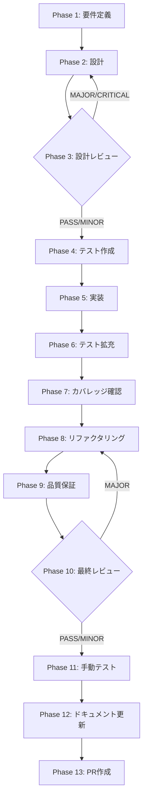

# TASK-P0-02: verify→improve→re-verify 閉ループ修復

## メタ情報

| 項目           | 内容                                                                |
| -------------- | ------------------------------------------------------------------- |
| タスクID       | TASK-P0-02                                                          |
| タスク名       | verify→improve→re-verify 閉ループ修復                               |
| 分類           | バグ修正・実装改善                                                  |
| 対象機能       | SkillCreatorWorkflowEngine phase transition                         |
| 優先度         | P0（最高）                                                          |
| 見積もり規模   | 中規模                                                              |
| ステータス     | completed                                                           |
| 発見元         | p0-verify-manifest-remediation-pack 監査                            |
| 作成日         | 2026-03-29                                                          |
| 更新日         | 2026-03-30                                                          |
| 依存タスク     | TASK-P0-01（verify engine 本体） ✅ 完了済み                        |
| 後続タスク     | なし                                                                |
| 関連Issue      | #1725                                                               |
| 親ワークフロー | skill-creator-agent-sdk-lane/p0-verify-manifest-remediation-pack.md |

---

## タスク概要

### 目的

verify→improve→re-verify の閉ループが実装上成立しない問題を修正する。`recordVerifyPass()` が存在せず verify 成功時の状態遷移が未定義であり、`requestReverify()` の gate も improve フェーズ限定になっていない。

### 背景

WorkflowEngine は execute→verify→improve の前半経路を持つが、以下の欠陥がある:

1. `recordVerifyPass()` メソッドが存在しない — verify 成功時の phase 遷移が未定義
2. improve→execute は存在するが improve→verify（re-verify）への直接遷移がない
3. `requestReverify()` は存在するが improve フェーズ限定の gate が未実装で、verify pass 後などでも再検証を受け付けうる
4. SkillCreatorVerifyResult の status `"pass"` に対応するハンドラがない

### 最終ゴール

1. `recordVerifyPass()` を WorkflowEngine に追加し verify 成功時の phase 遷移を定義する
2. improve→verify 遷移を追加し re-verify ループを成立させる
3. execute→verify(fail)→improve→verify(pass) の完全サイクルをテスト可能にする
4. UI snapshot が verify の pass/fail/pending 状態を正しく反映する

---

## 受入条件

| AC   | 条件                                                                         | 検証方法       |
| ---- | ---------------------------------------------------------------------------- | -------------- |
| AC-1 | `recordVerifyPass()` メソッドが WorkflowEngine に存在する                    | ユニットテスト |
| AC-2 | verify→improve phase 遷移が正しく動作する                                    | ユニットテスト |
| AC-3 | improve→verify (re-verify) phase 遷移が動作する                              | ユニットテスト |
| AC-4 | execute→verify(fail)→improve→verify(pass) の完全サイクルがテスト可能         | 統合テスト     |
| AC-5 | UI snapshot が verify の pass/fail/pending 状態を正しく反映する              | 手動テスト     |
| AC-6 | `requestReverify()` が verification engine 結果に応じて re-verify を制御する | ユニットテスト |

---

## スコープ

- **含む**: 閉ループの phase 遷移修復、`recordVerifyPass()` 実装、improve→verify 遷移追加、`requestReverify()` gate 是正、UI snapshot 連携、Phase 11/12 証跡整備、canonical spec 同期
- **含まない**: verify engine 本体（P0-01）、manifest 配置（P0-03/04）、WorkflowEngine の全面再設計

---

## 依存関係

| 種別       | 参照先                                                                   | 役割                                     |
| ---------- | ------------------------------------------------------------------------ | ---------------------------------------- |
| upstream   | `../skill-creator-agent-sdk-lane/requirements-draft.md`                  | FR-04 verify / FR-05 improve 契約の要件  |
| upstream   | `../skill-creator-agent-sdk-lane/root-workflow-pack/index.md`            | lane 共通不変条件と責務分離方針          |
| upstream   | `../skill-creator-agent-sdk-lane/p0-verify-manifest-remediation-pack.md` | P0 是正パックの背景と設計原則            |
| upstream   | TASK-P0-01 (verify engine layer1/2)                                      | verification engine 本体の実装           |
| peer       | TASK-SDK-02 (WorkflowEngine)                                             | verify phase の state owner              |
| downstream | なし                                                                     | 本タスクは閉ループ修復の最終ピースとなる |

## 現行コードアンカー

| ファイル                                                               | 現状の役割                                        | TASK-P0-02 での扱い                                            |
| ---------------------------------------------------------------------- | ------------------------------------------------- | -------------------------------------------------------------- |
| `apps/desktop/src/main/services/runtime/SkillCreatorWorkflowEngine.ts` | verify / improve / re-verify の状態遷移 owner     | `recordVerifyPass()`、improve→verify、improve-only gate を実装 |
| `apps/desktop/src/main/services/runtime/RuntimeSkillCreatorFacade.ts`  | verify detail / reverify の public bridge         | 既存 `verifySkill()` / `reverifyWorkflow()` surface を維持     |
| `apps/desktop/src/main/ipc/creatorHandlers.ts`                         | verify / improve の IPC エントリポイント          | 既存 handler を変更せず current contract を維持                |
| `packages/shared/src/types/skillCreator.ts`                            | workflow / verify / checkpoint の shared contract | `verifyResult` shape は既存のまま利用                          |

## システム仕様参照（aiworkflow-requirements連携）

各 Phase の「参照資料」セクションに以下のシステム仕様を含めること:

| 参照資料                  | パス                                                                                                  | 内容                                               |
| ------------------------- | ----------------------------------------------------------------------------------------------------- | -------------------------------------------------- |
| Skill Creator Service仕様 | `.claude/skills/aiworkflow-requirements/references/interfaces-agent-sdk-skill-reference.md`           | SkillCreatorService、Facade injection パターン     |
| Agent IPC チャネル仕様    | `.claude/skills/aiworkflow-requirements/references/api-ipc-agent-core.md`                             | agent:execute、agent:verify 等の IPC チャネル定義  |
| IPC契約チェックリスト     | `.claude/skills/aiworkflow-requirements/references/ipc-contract-checklist.md`                         | IPC修正時の Main/Preload/型定義 同時更新チェック   |
| スキル実行IPCセキュリティ | `.claude/skills/aiworkflow-requirements/references/security-skill-ipc-core.md`                        | パストラバーサル防止、コマンドインジェクション防止 |
| Skill lifecycle hooks     | `.claude/skills/aiworkflow-requirements/references/interfaces-agent-sdk-skill-details.md`             | Skill lifecycle hooks 仕様                         |
| テスト標準化              | `.claude/skills/aiworkflow-requirements/references/lessons-learned-skill-lifecycle-test-hardening.md` | Main Process ハンドラの単体テスト標準化            |

---

## 要件レビュー一次結論

| 観点                 | 結論                                                                                                                                                                |
| -------------------- | ------------------------------------------------------------------------------------------------------------------------------------------------------------------- |
| 真の論点             | verify 成功時の状態遷移が未定義で閉ループが成立しない問題を、`recordVerifyPass()` と improve→verify 遷移の追加で閉じること                                          |
| 依存関係・責務境界   | WorkflowEngine は状態遷移 owner。VerificationEngine（P0-01）は検証ロジック owner。本タスクは両者をつなぐ閉ループ遷移の修復に集中する                                |
| 価値とコストの不均衡 | メソッド追加と遷移テーブル拡張で実装可能。コスト低・価値高（verify が機能しなければ品質保証が成立しない）                                                           |
| 改善優先順位         | 1. `recordVerifyPass()` 追加 2. improve→verify 遷移追加 3. `requestReverify()` を improve-only gate に修正 4. IPC handler 影響確認 5. UI snapshot は既存 shape 維持 |
| 4条件評価            | 価値性: P0（品質保証の前提）/ 実現性: 高（遷移テーブル拡張）/ 整合性: P0-01 の engine を利用 / 運用性: 完全サイクルテスト可能                                       |

---

## 成果物一覧

| Phase | 名称             | 成果物                                                                                                                                                                                                                        |
| ----- | ---------------- | ----------------------------------------------------------------------------------------------------------------------------------------------------------------------------------------------------------------------------- |
| 1     | 要件定義         | `phase-1-requirements.md`, `outputs/phase-1/requirements-definition.md`                                                                                                                                                       |
| 2     | 設計             | `phase-2-design.md`, `outputs/phase-2/design-document.md`                                                                                                                                                                     |
| 3     | 設計レビュー     | `phase-3-design-review.md`, `outputs/phase-3/review-result.md`                                                                                                                                                                |
| 4     | テスト作成       | `outputs/phase-4/test-specifications.md`                                                                                                                                                                                      |
| 5     | 実装             | `outputs/phase-5/implementation-record.md`                                                                                                                                                                                    |
| 6     | テスト拡充       | `outputs/phase-6/extended-test-record.md`                                                                                                                                                                                     |
| 7     | カバレッジ確認   | `outputs/phase-7/coverage-report.md`                                                                                                                                                                                          |
| 8     | リファクタリング | `outputs/phase-8/refactoring-record.md`                                                                                                                                                                                       |
| 9     | 品質保証         | `outputs/phase-9/quality-report.md`                                                                                                                                                                                           |
| 10    | 最終レビュー     | `outputs/phase-10/final-review-result.md`                                                                                                                                                                                     |
| 11    | 手動テスト       | `outputs/phase-11/manual-test-result.md`                                                                                                                                                                                      |
| 12    | ドキュメント更新 | `implementation-guide.md`, `system-spec-update-summary.md`, `documentation-changelog.md`, `unassigned-task-detection.md`, `skill-feedback-report.md`, `phase12-task-spec-compliance-check.md` + `outputs/artifacts.json` 同期 |
| 13    | PR作成           | `outputs/phase-13/change-summary.md`                                                                                                                                                                                          |

---

## タスク分解サマリ（Phase 1-13）



| Phase | 名称             | パターン | 依存     | ゲート |
| ----- | ---------------- | -------- | -------- | ------ |
| 1     | 要件定義         | seq      | -        | -      |
| 2     | 設計             | seq      | Phase 1  | -      |
| 3     | 設計レビュー     | seq      | Phase 2  | GATE   |
| 4     | テスト作成       | seq      | Phase 3  | -      |
| 5     | 実装             | seq      | Phase 4  | -      |
| 6     | テスト拡充       | seq      | Phase 5  | -      |
| 7     | カバレッジ確認   | seq      | Phase 6  | -      |
| 8     | リファクタリング | seq      | Phase 7  | -      |
| 9     | 品質保証         | seq      | Phase 8  | -      |
| 10    | 最終レビュー     | seq      | Phase 9  | GATE   |
| 11    | 手動テスト       | seq      | Phase 10 | -      |
| 12    | ドキュメント更新 | par      | Phase 11 | -      |
| 13    | PR作成           | seq      | Phase 12 | -      |

---

## テストカバレッジ目標

### ユニットテスト

| 指標              | 最低基準 | 推奨基準 |
| ----------------- | -------- | -------- |
| Line Coverage     | 80%      | 90%      |
| Branch Coverage   | 60%      | 70%      |
| Function Coverage | 80%      | 90%      |

### テスト対象と目標

| カテゴリ | 対象                                                   | 目標     | テストファイル                       |
| -------- | ------------------------------------------------------ | -------- | ------------------------------------ |
| ユニット | `recordVerifyPass()` phase 遷移                        | 100%     | `SkillCreatorWorkflowEngine.test.ts` |
| ユニット | verify→improve / improve→verify 遷移                   | 100%     | `SkillCreatorWorkflowEngine.test.ts` |
| ユニット | `requestReverify()` eligibility と engine 統合         | 100%     | `SkillCreatorWorkflowEngine.test.ts` |
| ユニット | verify 結果の分岐 / `reverifyWorkflow()`               | 100%     | `RuntimeSkillCreatorFacade.test.ts`  |
| 統合     | execute→verify(fail)→improve→verify(pass) 完全サイクル | E2E 検出 | 統合テスト                           |

### 結合テスト

| 指標                             | 目標 |
| -------------------------------- | ---- |
| 遷移テーブル全 edge              | 100% |
| 正常系シナリオ（完全サイクル）   | 100% |
| 異常系シナリオ（不正遷移ガード） | 80%+ |

---

## Phase 完了時アクション

各 Phase 完了時に以下を実行:

```bash
node .claude/skills/task-specification-creator/scripts/complete-phase.js \
  --workflow step-10-seq-task-p0-02-verify-improve-reverify-closed-loop \
  --phase <PHASE_NUMBER>
```

---

## 出力ファイル構成

```
docs/30-workflows/step-10-seq-task-p0-02-verify-improve-reverify-closed-loop/
├── index.md
├── artifacts.json
├── phase-1-requirements.md
├── phase-2-design.md
├── phase-3-design-review.md
├── phase-4-test-creation.md
├── phase-5-implementation.md
├── phase-6-test-expansion.md
├── phase-7-coverage-check.md
├── phase-8-refactoring.md
├── phase-9-quality-assurance.md
├── phase-10-final-review.md
├── phase-11-manual-test.md
├── phase-12-documentation.md
├── phase-13-pr-creation.md
└── outputs/
    ├── phase-1/ ~ phase-13/
    └── phase-11/screenshots/
```
