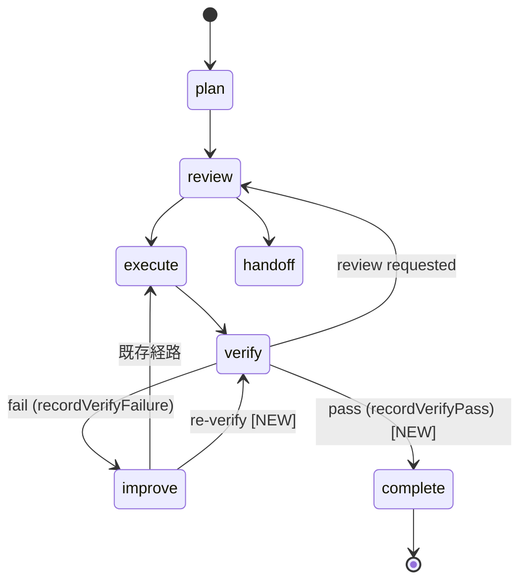

# Phase 2: 設計

## メタ情報

| 項目       | 内容                                             |
| ---------- | ------------------------------------------------ |
| Phase      | 2                                                |
| Phase名    | 設計                                             |
| 対象機能   | TASK-P0-02 verify→improve→re-verify 閉ループ修復 |
| 前提Phase  | Phase 1: 要件定義                                |
| 次Phase    | Phase 3: 設計レビュー                            |
| ステータス | pending                                          |
| 作成日     | 2026-03-29                                       |
| 更新日     | 2026-03-30                                       |

## 目的

`recordVerifyPass()` のシグネチャ設計、improve→verify 遷移の追加、verification engine との統合方式、UI snapshot への反映方法を確定する。

## 実行タスク

### Task 1: recordVerifyPass() シグネチャ設計

`recordVerifyFailure()` と対称的なインターフェースで設計する:

```typescript
// 既存: recordVerifyFailure() (WorkflowEngine.ts:258-285)
recordVerifyFailure(
  planId: string,
  message: string,
  nextAction: "review" | "improve" = "improve",
): SkillCreatorWorkflowStateSnapshot

// 新規: recordVerifyPass()
recordVerifyPass(
  planId: string,
  checks: RuntimeSkillCreatorVerifyCheck[],
): SkillCreatorWorkflowStateSnapshot
```

設計ポイント:

- `checks` 引数で VerificationEngine の結果を受け取る（P0-01 の `verify()` の戻り値と同型）
- verify pass 後の遷移先は `"complete"` phase（新規追加）
- 戻り値は既存の snapshot パターンに準拠する

### Task 2: phase 遷移テーブル修正設計

現行遷移テーブル（WorkflowEngine.ts:579-580付近）に以下を追加:

```typescript
// 現行
const VALID_TRANSITIONS: Record<string, string[]> = {
  plan: ["review"],
  review: ["execute", "handoff"],
  execute: ["verify"],
  verify: ["review", "improve"], // ← pass 時の遷移先がない
  improve: ["execute"], // ← re-verify への直接遷移がない
  // ...
};

// 修正後
const VALID_TRANSITIONS: Record<string, string[]> = {
  plan: ["review"],
  review: ["execute", "handoff"],
  execute: ["verify"],
  verify: ["review", "improve", "complete"], // ← pass 時に complete へ遷移
  improve: ["execute", "verify"], // ← re-verify 直接遷移を追加
  complete: [], // ← terminal state
  // ...
};
```



### Task 3: verification engine 統合設計

P0-01 の SkillCreatorVerificationEngine からの data flow を設計する:

```
Facade.verifySkill(skillDir)
  → VerificationEngine.verify(skillDir)
  → RuntimeSkillCreatorVerifyCheck[]
  → determineVerifyStatus(checks)
     → "skip"               : engine 未注入（空配列）
     → "pass"               : 全チェック pass（warning なし）
     → "pass_with_warnings" : fail なし、warning あり
     → "fail"               : 1件以上 fail
```

- verify ステータス判定ロジック（**方針 B + Y** を採用）:

  ```typescript
  type VerifyStatus = "skip" | "pass" | "pass_with_warnings" | "fail";

  function determineVerifyStatus(
    checks: RuntimeSkillCreatorVerifyCheck[],
  ): VerifyStatus {
    // engine 未注入時は空配列 → 検証スキップを明示
    if (checks.length === 0) return "skip";

    const hasFail = checks.some((c) => c.status === "fail");
    if (hasFail) return "fail";

    const hasWarning = checks.some((c) => c.severity === "warning");
    if (hasWarning) return "pass_with_warnings";

    return "pass";
  }
  ```

- **設計根拠**:
  - `"skip"`: graceful degradation を維持しつつ、「検証していない」ことをUI/ログで明示する。暗黙の pass を防ぐ
  - `"pass_with_warnings"`: warning を記録しつつフローはブロックしない。UIで⚠️表示し開発者に注意を促す
  - `"pass"` / `"fail"`: 従来通りの明確な分岐
- `recordVerifyPass()` は `"pass"` と `"pass_with_warnings"` の両方で呼び出す。`"skip"` 時は遷移せずスキップを記録のみ
- `requestReverify()` の eligibility check を新遷移と整合させる:
  - improve phase からの re-verify: eligibility check を緩和し、improve phase からの直接遷移を許可する
  - verify phase からの再 verify: 既存の disabled conditions を維持する

### Task 4: UI snapshot 変更設計

SkillCreatorSnapshot（`getCreatorSnapshot` の戻り値）に verify 状態を追加:

```typescript
interface SkillCreatorWorkflowStateSnapshot {
  // 既存フィールド
  phase: string;
  planId: string;
  // ...

  // 新規追加
  verifyStatus?: "pending" | "pass" | "pass_with_warnings" | "fail" | "skip";
  verifyChecks?: RuntimeSkillCreatorVerifyCheck[];
  lastVerifyTimestamp?: string;
}
```

IPC 経路:

- `creatorHandlers.ts` で verify 結果を snapshot に含めて renderer に通知する
- 既存の `getCreatorSnapshot` IPC ハンドラを拡張する（新規ハンドラ追加は不要）

### Task 5: RuntimeSkillCreatorFacade 統合設計

Facade に以下のメソッドを追加/修正:

```typescript
// 新規: verify 結果に基づく閉ループ処理
async processVerifyResult(planId: string, skillDir: string): Promise<VerifyStatus> {
  const checks = await this.verifySkill(skillDir);
  const status = determineVerifyStatus(checks);

  switch (status) {
    case "skip":
      // engine 未注入 — 遷移せずスキップを記録
      this.workflowEngine.recordVerifySkip(planId);
      break;
    case "pass":
    case "pass_with_warnings":
      // 成功（warning 含む）— complete へ遷移
      this.workflowEngine.recordVerifyPass(planId, checks);
      break;
    case "fail":
      // 失敗 — improve へ遷移
      const failMessages = checks.filter(c => c.status === "fail").map(c => c.message);
      this.workflowEngine.recordVerifyFailure(planId, failMessages.join("; "), "improve");
      break;
  }
  return status;
}

// 新規: improve 後の re-verify
async requestReVerify(planId: string, skillDir: string): Promise<void> {
  // improve phase から直接 verify phase へ遷移
  this.workflowEngine.transitionToVerify(planId);
  await this.processVerifyResult(planId, skillDir);
}
```

## 参照資料

| 資料名             | パス                                                                       | 説明                         |
| ------------------ | -------------------------------------------------------------------------- | ---------------------------- |
| 要件定義           | `phase-1-requirements.md`                                                  | AC-1〜AC-6                   |
| WorkflowEngine     | `apps/desktop/src/main/services/runtime/SkillCreatorWorkflowEngine.ts`     | 遷移テーブル修正対象         |
| RuntimeFacade      | `apps/desktop/src/main/services/runtime/RuntimeSkillCreatorFacade.ts`      | Facade 統合対象              |
| VerificationEngine | `apps/desktop/src/main/services/runtime/SkillCreatorVerificationEngine.ts` | P0-01 実装済みの verify 本体 |
| creatorHandlers    | `apps/desktop/src/main/ipc/creatorHandlers.ts`                             | IPC handler 更新対象         |
| skillCreator types | `packages/shared/src/types/skillCreator.ts`                                | SkillCreatorVerifyResult 型  |

### システム仕様（aiworkflow-requirements）

> 実装前に必ず以下のシステム仕様を確認し、既存設計との整合性を確保してください。

| 参照資料                  | パス                                                                                        | 内容                                                                      |
| ------------------------- | ------------------------------------------------------------------------------------------- | ------------------------------------------------------------------------- |
| Skill Creator Service仕様 | `.agents/skills/aiworkflow-requirements/references/interfaces-agent-sdk-skill-reference.md` | SkillCreatorService、Facade injection パターン、verify/improve の詳細仕様 |
| Agent IPC チャネル仕様    | `.agents/skills/aiworkflow-requirements/references/api-ipc-agent-core.md`                   | IPC チャネル定義。verify 結果通知の IPC 設計に参照                        |
| IPC契約チェックリスト     | `.agents/skills/aiworkflow-requirements/references/ipc-contract-checklist.md`               | IPC修正時の Main/Preload/型定義 同時更新チェック                          |
| スキル実行IPCセキュリティ | `.agents/skills/aiworkflow-requirements/references/security-skill-ipc-core.md`              | IPC handler のセキュリティパターン                                        |
| Skill lifecycle hooks     | `.agents/skills/aiworkflow-requirements/references/interfaces-agent-sdk-skill-details.md`   | Skill lifecycle hooks 仕様。improve/verify の hook 連携                   |

## 統合テスト連携

- 遷移テーブルの全 edge を Phase 4 のテストケースに落とす
- UI snapshot の verify 状態が renderer テストで観測可能であることを確認する
- Facade の `processVerifyResult()` と `requestReVerify()` の統合テストを Phase 6 で追加する

## 多角的チェック観点

| 観点               | 適用判断                                       | 確認内容                                                   |
| ------------------ | ---------------------------------------------- | ---------------------------------------------------------- |
| アーキテクチャ     | state machine 遷移テーブル変更のため適用       | dead state がないこと、既存遷移との矛盾がないこと          |
| IPC通信            | verify 結果の snapshot 通知設計のため適用      | IPC契約チェックリスト準拠（Main/Preload/型定義の同時更新） |
| セキュリティ       | IPC handler 変更のため適用                     | sender検証、ホワイトリスト登録、パストラバーサル防止       |
| エラーハンドリング | verify 失敗時の improve 遷移ロジックのため適用 | graceful degradation（engine 未注入時は空配列）の維持      |

## 成果物

| 成果物 | パス                                 | 説明                                            |
| ------ | ------------------------------------ | ----------------------------------------------- |
| 設計書 | `outputs/phase-2/design-document.md` | シグネチャ、遷移テーブル、統合設計、UI snapshot |

## 完了条件

- [ ] `recordVerifyPass(planId, checks)` のシグネチャが確定している
- [ ] phase 遷移テーブルに `verify→complete` と `improve→verify` が追加されている
- [ ] `complete` terminal state が定義されている
- [ ] verification engine との統合 data flow が `allPass` 判定基準を含めて設計されている
- [ ] UI snapshot に `verifyStatus` / `verifyChecks` が追加されている
- [ ] Facade に `processVerifyResult()` / `requestReVerify()` が設計されている
- [ ] aiworkflow-requirements の関連仕様との整合性を確認した
- [ ] 本Phase内の全タスクを100%実行完了

## タスク100%実行確認【必須】

- [ ] 本Phase内の全タスクを100%実行完了
- [ ] 各タスクの成果物が生成されている
- [ ] artifacts.jsonが更新されている
- [ ] Phase末端で各タスクを100%完了し、完了を明記している

## 次Phase

→ [Phase 3: 設計レビュー](./phase-3-design-review.md)
