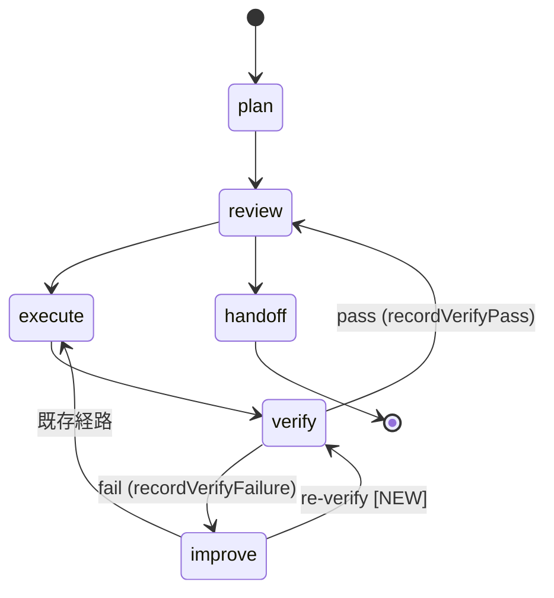

# Phase 2: 設計

## メタ情報

| 項目       | 内容                                             |
| ---------- | ------------------------------------------------ |
| Phase      | 2                                                |
| Phase名    | 設計                                             |
| 対象機能   | TASK-P0-02 verify→improve→re-verify 閉ループ修復 |
| 前提Phase  | Phase 1: 要件定義                                |
| 次Phase    | Phase 3: 設計レビュー                            |
| ステータス | completed                                        |
| 作成日     | 2026-03-29                                       |
| 更新日     | 2026-03-30                                       |

## 目的

`recordVerifyPass()` のシグネチャ設計、improve→verify 遷移の追加、verification engine との統合方式、UI snapshot への反映方法を確定する。

## 実行タスク

### Task 1: `recordVerifyPass()` シグネチャ設計

`recordVerifyFailure()` と対称な最小 API を設計する。

```typescript
// 既存: recordVerifyFailure() (WorkflowEngine.ts:258-285)
recordVerifyFailure(
  planId: string,
  message: string,
  nextAction: "review" | "improve" = "improve",
): SkillCreatorWorkflowStateSnapshot

// 新規: recordVerifyPass()
recordVerifyPass(
  planId: string,
  checks: RuntimeSkillCreatorVerifyCheck[],
): SkillCreatorWorkflowStateSnapshot
```

設計ポイント:

- `checks` は `SkillCreatorVerificationEngine.verify()` の戻り値をそのまま受ける
- `verifyResult.status` は `pending` / `pass` / `fail` の 3 値のまま維持する
- `verify pass` は新しい終端を増やさず、既存の `verify -> review` edge を再利用する
- raw `checks` は UI snapshot に増やさず、artifact / detail surface 側へ集約する

### Task 2: phase 遷移テーブル修正設計

現行遷移テーブル（`SkillCreatorWorkflowEngine.ts`）に対して最小修正を行う:

```typescript
const VALID_TRANSITIONS: Record<string, string[]> = {
  plan: ["review"],
  review: ["execute", "handoff"],
  execute: ["verify"],
  verify: ["review", "improve"],
  improve: ["execute", "verify"],
  handoff: [],
};
```



- 追加の終端状態や派生ステータスは追加しない
- `verify -> review` は pass の既存 edge として維持する
- `improve -> verify` だけを新設し、再実行を経由しない re-verify を許可する

### Task 3: verification engine 統合設計

`RuntimeSkillCreatorFacade.verifySkill(skillDir)` から返る `RuntimeSkillCreatorVerifyCheck[]` を次の規則で扱う:

1. `checks.length === 0`
   - verification engine 未注入の no-op として扱う
   - 既存 snapshot を保持し、状態遷移は発生させない
2. `checks.some((check) => check.severity === "error")`
   - `recordVerifyFailure(planId, message, "improve")` を呼ぶ
3. それ以外
   - `recordVerifyPass(planId, checks)` を呼ぶ

- warning は pass を阻害しない
- `requestReverify()` は improve phase のみ許可し、review / verify からの再検証は拒否する
- 既存の disabled conditions（terminal_handoff / no execute result / last execution failed）は維持する

### Task 4: UI snapshot 変更設計

`SkillCreatorWorkflowUiSnapshot` は既存 shape を維持する。

- `verifyChecks` は追加しない
- `lastVerifyTimestamp` は追加しない
- verify 状態は既存の `verifyResult` で表現する
- 詳細結果は `RuntimeSkillCreatorVerifyDetail.checks` と verify artifact で表現する
- `creatorHandlers.ts` の IPC 契約は既存の `skill-creator:get-verify-detail` / `skill-creator:reverify-workflow` を維持する

### Task 5: RuntimeSkillCreatorFacade 統合設計

Facade は public surface を増やしすぎず、verify 結果の分岐を内部へ集約する。

- `verifySkill(skillDir)` は checks を返すだけに留める
- `recordVerifyPass()` / `recordVerifyFailure()` の呼び分けは runtime orchestration 層で行う
- `reverifyWorkflow(planId)` は既存 bridge のまま `requestReverify(planId)` に委譲する
- 新しい IPC channel は追加しない

## 参照資料

| 資料名             | パス                                                                       | 説明                         |
| ------------------ | -------------------------------------------------------------------------- | ---------------------------- |
| 要件定義           | `phase-1-requirements.md`                                                  | AC-1〜AC-6                   |
| WorkflowEngine     | `apps/desktop/src/main/services/runtime/SkillCreatorWorkflowEngine.ts`     | 遷移テーブル修正対象         |
| RuntimeFacade      | `apps/desktop/src/main/services/runtime/RuntimeSkillCreatorFacade.ts`      | Facade 統合対象              |
| VerificationEngine | `apps/desktop/src/main/services/runtime/SkillCreatorVerificationEngine.ts` | P0-01 実装済みの verify 本体 |
| creatorHandlers    | `apps/desktop/src/main/ipc/creatorHandlers.ts`                             | IPC handler 更新対象         |
| skillCreator types | `packages/shared/src/types/skillCreator.ts`                                | SkillCreatorVerifyResult 型  |

### システム仕様（aiworkflow-requirements）

> 実装前に必ず以下のシステム仕様を確認し、既存設計との整合性を確保してください。

| 参照資料                  | パス                                                                                        | 内容                                                                      |
| ------------------------- | ------------------------------------------------------------------------------------------- | ------------------------------------------------------------------------- |
| Skill Creator Service仕様 | `.claude/skills/aiworkflow-requirements/references/interfaces-agent-sdk-skill-reference.md` | SkillCreatorService、Facade injection パターン、verify/improve の詳細仕様 |
| Agent IPC チャネル仕様    | `.claude/skills/aiworkflow-requirements/references/api-ipc-agent-core.md`                   | IPC チャネル定義。verify 結果通知の IPC 設計に参照                        |
| IPC契約チェックリスト     | `.claude/skills/aiworkflow-requirements/references/ipc-contract-checklist.md`               | IPC修正時の Main/Preload/型定義 同時更新チェック                          |
| スキル実行IPCセキュリティ | `.claude/skills/aiworkflow-requirements/references/security-skill-ipc-core.md`              | IPC handler のセキュリティパターン                                        |
| Skill lifecycle hooks     | `.claude/skills/aiworkflow-requirements/references/interfaces-agent-sdk-skill-details.md`   | Skill lifecycle hooks 仕様。improve/verify の hook 連携                   |

## 統合テスト連携

- 遷移テーブルの全 edge を Phase 4 のテストケースに落とす
- UI snapshot の verify 状態が renderer テストで観測可能であることを確認する
- verify checks の pass / fail 分岐と `reverifyWorkflow()` の統合テストを Phase 6 で追加する

## 多角的チェック観点

| 観点               | 適用判断                                       | 確認内容                                                   |
| ------------------ | ---------------------------------------------- | ---------------------------------------------------------- |
| アーキテクチャ     | state machine 遷移テーブル変更のため適用       | dead state がないこと、既存遷移との矛盾がないこと          |
| IPC通信            | verify 結果の snapshot 通知設計のため適用      | IPC契約チェックリスト準拠（Main/Preload/型定義の同時更新） |
| セキュリティ       | IPC handler 変更のため適用                     | sender検証、ホワイトリスト登録、パストラバーサル防止       |
| エラーハンドリング | verify 失敗時の improve 遷移ロジックのため適用 | graceful degradation（engine 未注入時は空配列）の維持      |

## 成果物

| 成果物 | パス                                 | 説明                                            |
| ------ | ------------------------------------ | ----------------------------------------------- |
| 設計書 | `outputs/phase-2/design-document.md` | シグネチャ、遷移テーブル、統合設計、UI snapshot |

## 完了条件

- [x] `recordVerifyPass(planId, checks)` のシグネチャが確定している
- [x] phase 遷移テーブルに `improve→verify` が追加されている
- [x] `verifyResult.status = pass` の処理方針が既存 `verify→review` edge 再利用として設計されている
- [x] verification engine との統合 data flow が no-op / pass / fail で分岐している
- [x] UI snapshot は既存 `verifyResult` / `getVerifyDetail()` で十分であることが確認されている
- [x] Facade は public surface を増やさず `reverifyWorkflow()` を維持する方針である
- [x] aiworkflow-requirements の関連仕様との整合性を確認した
- [x] 本Phase内の全タスクを100%実行完了

## タスク100%実行確認【必須】

- [x] 本Phase内の全タスクを100%実行完了
- [x] 各タスクの成果物が生成されている
- [x] artifacts.jsonが更新されている
- [x] Phase末端で各タスクを100%完了し、完了を明記している

## 次Phase

→ [Phase 3: 設計レビュー](./phase-3-design-review.md)
