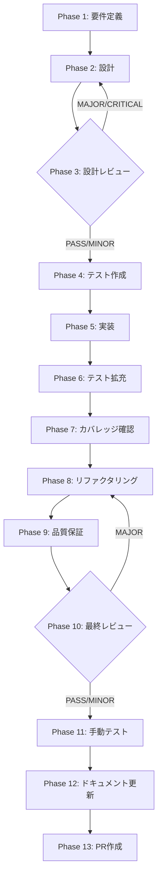

# TASK-P0-04: ManifestLoader default activation

## メタ情報

| 項目           | 内容                                                      |
| -------------- | --------------------------------------------------------- |
| タスクID       | TASK-P0-04                                                |
| タスク名       | ManifestLoader default activation                         |
| 分類           | 実装改善                                                  |
| 対象機能       | RuntimeSkillCreatorFacade dynamic resource pipeline       |
| 優先度         | 高                                                        |
| 見積もり規模   | 中規模                                                    |
| ステータス     | spec_created                                              |
| 依存タスク     | TASK-P0-03                                                |
| 後続タスク     | なし                                                      |
| 作成日         | 2026-03-29                                                |
| 親ワークフロー | step-10-seq-task-p0-04-manifest-loader-default-activation |

---

## タスク概要

### 目的

ManifestLoader がデフォルトで有効になるよう、Facade 初期化時に sourceResolver / resourcePlanner / resolvedResourceReader を自動インスタンス化し、dynamic resource pipeline をデフォルトで活性化する。

### 背景

現状の課題は、dynamic resource pipeline が外部注入不足に依存しており、manifest 自動発見と fallback の契約が起動構成ごとにぶれる点にあった。しかし ipc/index.ts での wiring では PhaseResourcePlanner のみ注入されており、他2つが欠落するため dynamic resource pipeline の自動活性化が保証されていなかった。

`loadWorkflowManifest()` も `explicitRoot` が提供された場合のみ呼ばれるため、manifest の自動発見ができていない。

### 最終ゴール

1. Facade 初期化時に3コンポーネントを自動インスタンス化する
2. `plan()` / `improve()` がデフォルトで dynamic resource pipeline を試行する
3. `loadWorkflowManifest()` が source resolver candidates から manifest を自動発見する
4. manifest が見つからない場合は static loader へ graceful degradation する
5. 既存の static loader パスを破壊しない

---

## 受入条件

| AC   | 条件                                                                                     | 検証方法        |
| ---- | ---------------------------------------------------------------------------------------- | --------------- |
| AC-1 | sourceResolver が Facade 初期化時に自動インスタンス化される                              | ユニットテスト  |
| AC-2 | resourcePlanner が Facade 初期化時に自動インスタンス化される                             | ユニットテスト  |
| AC-3 | resolvedResourceReader が Facade 初期化時に自動インスタンス化される                      | ユニットテスト  |
| AC-4 | `plan()` / `improve()` がコンポーネント自動生成下で dynamic resource pipeline を試行する | ユニットテスト  |
| AC-5 | `loadWorkflowManifest()` が source resolver candidates から manifest を発見する          | 統合テスト      |
| AC-6 | manifest 未発見時に static loader fallback が正常動作する                                | ユニットテスト  |
| AC-7 | 既存テストが変更なしで通過する                                                           | CI / テスト実行 |

---

## スコープ

### 含む

- Facade の初期化ロジック変更（コンストラクタまたは init メソッド）
- 3コンポーネントの自動インスタンス化
- manifest 自動発見ロジック
- fallback chain の実装
- ipc/index.ts の wiring 調整

### 含まない

- manifest ファイル自体の作成（TASK-P0-03 のスコープ）
- verify engine の実装（TASK-P0-01 のスコープ）
- SkillCreatorSourceResolver / PhaseResourcePlanner / ResolvedResourceReader の内部ロジック変更

---

## 依存関係

| 種別     | 参照先                                      | 役割                                             |
| -------- | ------------------------------------------- | ------------------------------------------------ |
| upstream | `../requirements-draft.md`                  | skill-creator 全体の要件                         |
| upstream | `../root-workflow-pack/index.md`            | lane 共通不変条件と責務分離方針                  |
| upstream | `../p0-verify-manifest-remediation-pack.md` | P0 是正パックの背景と設計原則                    |
| upstream | TASK-P0-03 (manifest 本番配置)              | 本タスクが読み込む manifest ファイルの作成・配置 |
| peer     | TASK-P0-01 (verify engine layer1/2)         | verify engine と dynamic pipeline は独立して動作 |
| peer     | TASK-P0-02 (閉ループ修復)                   | 閉ループは pipeline 活性化後に完全動作する       |

## 現行コードアンカー

| ファイル                                                                       | 現状の役割                                                                                                        | TASK-P0-04 での扱い                                                                            |
| ------------------------------------------------------------------------------ | ----------------------------------------------------------------------------------------------------------------- | ---------------------------------------------------------------------------------------------- |
| `apps/desktop/src/main/services/runtime/RuntimeSkillCreatorFacade.ts` (937行)  | dynamic resource pipeline の有効化条件と fallback 契約を持つ。`loadWorkflowManifest()` は explicitRoot 必須だった | 初期化時に3コンポーネントを自動インスタンス化し、manifest 自動発見と degraded error 契約を追加 |
| `apps/desktop/src/main/services/runtime/SkillCreatorSourceResolver.ts` (174行) | source resolver。外部注入が必要                                                                                   | Facade 初期化時に自動インスタンス化する                                                        |
| `apps/desktop/src/main/services/runtime/PhaseResourcePlanner.ts`               | resource planner。ipc/index.ts で唯一注入されている                                                               | 既存注入を維持しつつ自動インスタンス化の対象に含める                                           |
| `apps/desktop/src/main/services/runtime/ResolvedResourceReader.ts`             | resolved resource reader。外部注入が必要                                                                          | Facade 初期化時に自動インスタンス化する                                                        |
| `apps/desktop/src/main/ipc/index.ts`                                           | Facade の wiring。PhaseResourcePlanner のみ注入                                                                   | wiring を調整し3コンポーネント注入または自動化を反映                                           |

## 要件レビュー一次結論

| 観点                 | 結論                                                                                                                                           |
| -------------------- | ---------------------------------------------------------------------------------------------------------------------------------------------- |
| 真の論点             | dynamic resource pipeline が外部注入の欠落によりデフォルト無効である問題を、Facade 初期化時の自動インスタンス化で閉じること                    |
| 依存関係・責務境界   | Facade は3コンポーネントの生成と lifecycle を管理する。各コンポーネントの内部ロジックは変更しない。manifest ファイルは P0-03 が提供する        |
| 価値とコストの不均衡 | コンストラクタでのインスタンス化と fallback chain 追加で実装可能。コスト中・価値高（pipeline が動かなければ manifest の意味がない）            |
| 改善優先順位         | 1. Facade 初期化ロジック変更 2. 3コンポーネント自動生成 3. manifest 自動発見 4. fallback chain 5. ipc/index.ts wiring 調整                     |
| 4条件評価            | 価値性: 高（pipeline 活性化の前提）/ 実現性: 高（既存クラスのインスタンス化）/ 整合性: 既存 static loader と共存 / 運用性: fallback で安全劣化 |

---

## 成果物一覧

| Phase | 名称             | 成果物                                                                                                                                                                                                                                                                                                   |
| ----- | ---------------- | -------------------------------------------------------------------------------------------------------------------------------------------------------------------------------------------------------------------------------------------------------------------------------------------------------- |
| 1     | 要件定義         | `outputs/phase-1/requirements-definition.md`                                                                                                                                                                                                                                                             |
| 2     | 設計             | `outputs/phase-2/design-document.md`                                                                                                                                                                                                                                                                     |
| 3     | 設計レビュー     | `outputs/phase-3/review-result.md`                                                                                                                                                                                                                                                                       |
| 4     | テスト作成       | `outputs/phase-4/test-specifications.md`                                                                                                                                                                                                                                                                 |
| 5     | 実装             | `outputs/phase-5/implementation-record.md`                                                                                                                                                                                                                                                               |
| 6     | テスト拡充       | `outputs/phase-6/extended-test-record.md`                                                                                                                                                                                                                                                                |
| 7     | カバレッジ確認   | `outputs/phase-7/coverage-report.md`                                                                                                                                                                                                                                                                     |
| 8     | リファクタリング | `outputs/phase-8/refactoring-record.md`                                                                                                                                                                                                                                                                  |
| 9     | 品質保証         | `outputs/phase-9/quality-report.md`                                                                                                                                                                                                                                                                      |
| 10    | 最終レビュー     | `outputs/phase-10/final-review-result.md`                                                                                                                                                                                                                                                                |
| 11    | 手動テスト       | `outputs/phase-11/manual-test-checklist.md` / `outputs/phase-11/manual-test-result.md` / `outputs/phase-11/discovered-issues.md` / `outputs/phase-11/screenshot-plan.json`                                                                                                                               |
| 12    | ドキュメント更新 | `outputs/phase-12/implementation-guide.md` / `outputs/phase-12/system-spec-update-summary.md` / `outputs/phase-12/documentation-changelog.md` / `outputs/phase-12/unassigned-task-detection.md` / `outputs/phase-12/skill-feedback-report.md` / `outputs/phase-12/phase12-task-spec-compliance-check.md` |
| 13    | PR作成           | `outputs/phase-13/change-summary.md` / `outputs/phase-13/local-check-result.md`                                                                                                                                                                                                                          |

---

## タスク分解サマリ（Phase 1-13）



| Phase | 名称             | パターン | 依存     | ゲート |
| ----- | ---------------- | -------- | -------- | ------ |
| 1     | 要件定義         | seq      | -        | -      |
| 2     | 設計             | seq      | Phase 1  | -      |
| 3     | 設計レビュー     | seq      | Phase 2  | GATE   |
| 4     | テスト作成       | seq      | Phase 3  | -      |
| 5     | 実装             | seq      | Phase 4  | -      |
| 6     | テスト拡充       | seq      | Phase 5  | -      |
| 7     | カバレッジ確認   | seq      | Phase 6  | -      |
| 8     | リファクタリング | seq      | Phase 7  | -      |
| 9     | 品質保証         | seq      | Phase 8  | -      |
| 10    | 最終レビュー     | seq      | Phase 9  | GATE   |
| 11    | 手動テスト       | seq      | Phase 10 | -      |
| 12    | ドキュメント更新 | par      | Phase 11 | -      |
| 13    | PR作成           | seq      | Phase 12 | -      |

---

## テストカバレッジ目標

| カテゴリ | 対象                                                   | 目標                |
| -------- | ------------------------------------------------------ | ------------------- |
| ユニット | Facade 初期化時の3コンポーネント自動インスタンス化     | 100%                |
| ユニット | dynamic resource pipeline 自動試行                     | 100%                |
| ユニット | static loader fallback                                 | 100%                |
| 統合     | manifest 自動発見 → dynamic pipeline 活性化 E2E フロー | pipeline 活性化確認 |

---

## Phase 完了時アクション

各 Phase 完了時に以下を実行:

```bash
node .claude/skills/task-specification-creator/scripts/complete-phase.js \
  --workflow step-10-seq-task-p0-04-manifest-loader-default-activation \
  --phase <PHASE_NUMBER>
```

---

## 出力ファイル構成

```
docs/30-workflows/step-10-seq-task-p0-04-manifest-loader-default-activation/
├── index.md
├── artifacts.json
├── phase-1-requirements.md
├── phase-2-design.md
├── phase-3-design-review.md
├── phase-4-test-creation.md
├── phase-5-implementation.md
├── phase-6-test-expansion.md
├── phase-7-coverage-check.md
├── phase-8-refactoring.md
├── phase-9-quality-assurance.md
├── phase-10-final-review.md
├── phase-11-manual-test.md
├── phase-12-documentation.md
├── phase-13-pr-creation.md
└── outputs/
    ├── artifacts.json
    ├── phase-1/ ~ phase-13/
    ├── phase-11/manual-test-checklist.md
    ├── phase-11/manual-test-result.md
    ├── phase-11/discovered-issues.md
    ├── phase-11/screenshot-plan.json
    ├── phase-12/implementation-guide.md
    ├── phase-12/system-spec-update-summary.md
    ├── phase-12/documentation-changelog.md
    ├── phase-12/unassigned-task-detection.md
    ├── phase-12/skill-feedback-report.md
    ├── phase-12/phase12-task-spec-compliance-check.md
    ├── phase-13/change-summary.md
    └── phase-13/local-check-result.md
```
