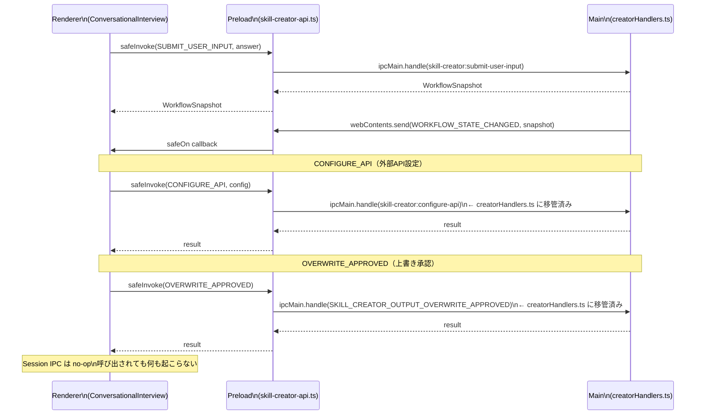
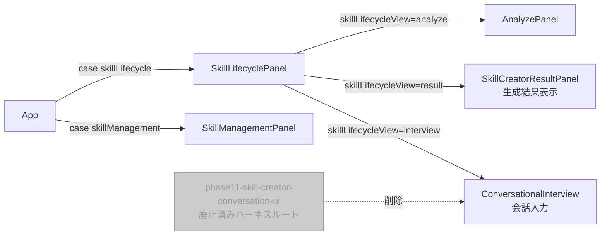

# System Spec Update Summary

## メタ情報

| 項目     | 内容                                  |
| -------- | ------------------------------------- |
| タスク   | TASK-UI-02 ConversationPanel 孤立解消 |
| 作成日   | 2026-04-06                            |
| フェーズ | Phase 12（ドキュメント更新）          |

---

## 1. コンポーネント関係図（統合後）

```mermaid
graph TD
    App[App.tsx] -->|case skillLifecycle| SLP[SkillLifecyclePanel]
    SLP -->|phase=interview| CI[ConversationalInterview]
    SLP -->|phase=result| SCRP[SkillCreatorResultPanel\ncomponents/skill/]
    CI --> W1[SingleSelectChips]
    CI --> W2[MultiSelectCheckbox]
    CI --> W3[FreeTextInput\ninterview-widgets/]
    CI --> W4[SecretInput]
    CI --> W5[ConfirmButtons]
    CI --> IPB[InterviewProgressBar]
    CI -->|useInterviewState| IS[(InterviewState\nローカルstate)]

    style SCP fill:#ccc,stroke:#999,color:#999
    SCP[SkillCreatorConversationPanel\n廃止済み\nexport {}] -.->|孤立| App
```

---

## 2. IPC 経路データフロー図



---

## 3. ルーティング構造（変更後）



---

## 4. 既存ドキュメントの更新要否

| ドキュメント                                                                                | 更新要否 | 理由                                                                                                    |
| ------------------------------------------------------------------------------------------- | -------- | ------------------------------------------------------------------------------------------------------- |
| `.agents/skills/aiworkflow-requirements/references/ui-ux-navigation.md`                     | 不要     | `SkillLifecyclePanel` 経由のルートは既存設計のまま維持                                                  |
| `.agents/skills/aiworkflow-requirements/references/interfaces-agent-sdk-skill-reference.md` | 不要     | Runtime IPC パターンは変更なし。Session IPC は正本仕様に存在しない                                      |
| `.agents/skills/aiworkflow-requirements/references/ipc-contract-checklist.md`               | 推奨     | CONFIGURE_API / OVERWRITE_APPROVED の creatorHandlers.ts 移管を追記                                     |
| `apps/desktop/src/renderer/phase11-skill-creator-conversation-ui.html`                      | 不要     | `capture-skill-creator-conversation-ui-phase11.mjs` の証跡ハーネスとして保持、production route ではない |
| `apps/desktop/src/preload/types.ts`                                                         | 推奨     | `skillCreatorSession` 型定義の削除（技術負債解消時）                                                    |
| `packages/shared/src/ipc/channels.ts`                                                       | 不要     | SKILL_CREATOR_SESSION_CHANNELS は shared 側では変更なし                                                 |

注: 上記の HTML ハーネスは Vite の `input` には含めず、スクリーンショット再生成用の補助資産としてのみ扱う。

---

## 5. 同値転記確認

Phase 9 QA レポートの CONDITIONAL 項目と本サマリーの整合確認:

| 項目                              | Phase 9 記録    | 本サマリー記録             | 一致 |
| --------------------------------- | --------------- | -------------------------- | ---- |
| SkillCreatorIpcBridge dead code   | CONDITIONAL LOW | 技術負債 #1（推奨更新）    | ✓    |
| skill-creator-session-api.ts stub | CONDITIONAL LOW | 廃止コンポーネント表に記載 | ✓    |
| 廃止ファイルの export {} stub     | CONDITIONAL LOW | 廃止コンポーネント表に記載 | ✓    |
| W-MC-06 maxSelect 未実装          | CONDITIONAL LOW | 未タスク検出 #1 に記録     | ✓    |
| IPC-ER-03 固定文字列のみ          | CONDITIONAL LOW | 未タスク検出 #2 に記録     | ✓    |
