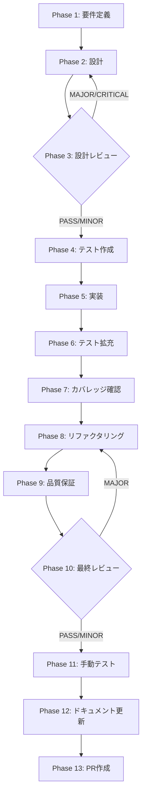

# UT-SDK-07-APPROVAL-REQUEST-SURFACE-001: Skill Creator preload / renderer に approval:request surface を追加

## メタ情報

| 項目           | 内容                                                                  |
| -------------- | --------------------------------------------------------------------- |
| タスクID       | UT-SDK-07-APPROVAL-REQUEST-SURFACE-001                                |
| タスク名       | Skill Creator preload / renderer に approval:request surface を追加   |
| 分類           | 実装                                                                  |
| 対象機能       | `approval:request` channel の Skill Creator 側受信 / UI 表示          |
| 優先度         | 中                                                                    |
| 見積もり規模   | 中規模                                                                |
| ステータス     | spec_created                                                          |
| 発見元         | TASK-SDK-07 Phase 12 AC-4 一部確認（approval request surface 未接続） |
| 作成日         | 2026-04-06                                                            |
| 更新日         | 2026-04-06                                                            |
| 依存タスク     | TASK-SDK-07（完了済み）                                               |
| 後続タスク     | なし                                                                  |
| 関連Issue      | #1694                                                                 |
| 親ワークフロー | step-12-par-task-ut-sdk-07-approval-request-surface-001               |

---

## タスク概要

### 目的

`approval:request` イベントを受信して UI に表示し、ユーザーが approve/reject を選択できる surface を Skill Creator に追加する。

### 背景

TASK-SDK-07 Phase 12 で AC-4 を確認した結果、disclosure 側は `getDisclosureInfo()` / `fetchDisclosureInfo()` で接続済みだが、**approval request surface**（Main → Renderer への `approval:request` push）が未接続のまま閉じた。`skillCreatorAPI.respondToApproval()` は実装済みだが、approval request を受け取って UI に表示する Renderer 側の surface が存在しない。

**問題点**:

- `approval:request` channel の Main → Renderer イベントを受信する listener が未実装
- ユーザーが approval/reject を判断するための UI コンポーネントが未実装
- `respondToApproval()` は実装済みだが、呼び出しトリガーとなる UI がない

**放置した場合の影響**:

- Skill Creator の危険操作（高権限 tool 実行など）が approval なしに進む
- AC-4 の「危険操作の確認（approval）」が Renderer レベルで機能しない

### 最終ゴール

1. `approval:request` channel の onEvent listener を preload に追加
2. `SkillLifecyclePanel` または専用コンポーネントで approval 確認 UI を表示
3. ユーザーの approve/reject 操作が `respondToApproval()` を呼び出す
4. approval TTL（300s）超過時の expired 表示対応

## 実行原則

- Phase 1 から Phase 13 までは直列で進める。
- ただし、各 Phase 内の調査・検証・証跡作成・実装候補比較は SubAgent に分割し、依存を壊さない範囲で並列実行する。
- skill準拠検証は「2つの skill と 4条件」、改善は「30種の思考法」、最終判断は「elegant / blocked / complete」の 3 段階で収束させる。

## SubAgent 編成

| SubAgent | 主責務                                                                                        | 主なPhase             | 並列可否       |
| -------- | --------------------------------------------------------------------------------------------- | --------------------- | -------------- |
| A        | `task-specification-creator` / `aiworkflow-requirements` 準拠検証、artifact / status 整合確認 | 1, 3, 9, 12, 13       | B / C と並列可 |
| B        | 30種の思考法による多角的分析、代替案比較、破棄判断                                            | 1, 2, 3, 8, 10, 12    | A / C と並列可 |
| C        | エレガント改善の実行、UI / IPC / テスト / 証跡の統合                                          | 4, 5, 6, 7, 8, 11, 12 | A / B と並列可 |
| Lead     | gate 判定、blocked / PASS / MINOR の収束、最終整合                                            | 3, 10, 12, 13         | 直列           |

## 30種の思考法適用マトリクス

| カテゴリ     | 思考法                                                               | このタスクでの主な用途                                  |
| ------------ | -------------------------------------------------------------------- | ------------------------------------------------------- |
| 論理分析系   | 批判的思考、演繹思考、帰納的思考、アブダクション、垂直思考           | skill 定義との矛盾抽出、変更分の妥当性確認、結論の反証  |
| 構造分解系   | 要素分解、MECE、2軸思考、プロセス思考                                | Phase / Task / Artifact / Dependency の分解、漏れの除去 |
| メタ・抽象系 | メタ思考、抽象化思考、ダブル・ループ思考                             | 前提そのものの妥当性、仕様の再定義、再発防止            |
| 発想・拡張系 | ブレインストーミング、水平思考、逆説思考、類推思考、if思考、素人思考 | UI surface / IPC / evidence の代替案探索、簡素化判断    |
| システム系   | システム思考、因果関係分析、因果ループ                               | approval request の発火から cleanup までの依存波及確認  |
| 戦略・価値系 | トレードオン思考、プラスサム思考、価値提案思考、戦略的思考           | 最小複雑性での要件充足、価値とコストの最適化            |
| 問題解決系   | why思考、改善思考、仮説思考、論点思考、KJ法                          | 根本原因特定、改善優先順位付け、未タスクの切り出し      |

---

## 受入条件

| AC   | 条件                                                         | 検証方法                    |
| ---- | ------------------------------------------------------------ | --------------------------- |
| AC-1 | `approval:request` onEvent が preload に登録されている       | コードレビュー / UT         |
| AC-2 | Renderer に approval 確認 UI が表示される                    | 手動テスト / screenshot     |
| AC-3 | approve/reject 操作が `respondToApproval()` と接続されている | UT / 統合テスト             |
| AC-4 | AC-4 enforcement の手動テスト screenshot あり                | Phase 11 スクリーンショット |

---

## スコープ

- **含む**: `approval:request` onEvent listener の preload 追加、approval 確認 UI コンポーネントの実装、`respondToApproval()` との接続、TTL expired 表示
- **含まない**: approval TTL の変更、Main 側の ApprovalGate 変更（既に実装済み）

---

## 依存関係

| 種別     | 参照先                                                   | 役割                                     |
| -------- | -------------------------------------------------------- | ---------------------------------------- |
| upstream | TASK-SDK-07（完了済み）                                  | ApprovalGate・respondToApproval の実装元 |
| upstream | `apps/desktop/src/preload/channels.ts`                   | APPROVAL_REQUEST channel 定義            |
| upstream | `apps/desktop/src/preload/skill-creator-api.ts`          | respondToApproval 実装済み               |
| upstream | `apps/desktop/src/main/ipc/approvalHandlers.ts`          | Main 側 approval handler                 |
| upstream | `apps/desktop/src/main/services/runtime/ApprovalGate.ts` | TTL / single-use 実装                    |

## 現行コードアンカー

| ファイル                                                             | 現状の役割                                    | TASK での扱い                       |
| -------------------------------------------------------------------- | --------------------------------------------- | ----------------------------------- |
| `apps/desktop/src/preload/channels.ts`                               | IPC チャネル定数定義（APPROVAL_REQUEST あり） | onEvent listener 追加の基盤         |
| `apps/desktop/src/preload/skill-creator-api.ts`                      | respondToApproval 実装済み                    | onApprovalRequest listener 追加対象 |
| `apps/desktop/src/renderer/components/skill/SkillLifecyclePanel.tsx` | Skill Lifecycle UI（approval 受信未実装）     | approval UI 表示ロジック追加対象    |
| `apps/desktop/src/main/ipc/approvalHandlers.ts`                      | Main 側 approval handler（実装済み）          | 参照のみ（変更なし）                |
| `apps/desktop/src/main/services/runtime/ApprovalGate.ts`             | TTL / single-use 実装（実装済み）             | 参照のみ（変更なし）                |

## システム仕様参照（aiworkflow-requirements連携）

| 参照資料                  | パス                                                                                        | 内容                                              |
| ------------------------- | ------------------------------------------------------------------------------------------- | ------------------------------------------------- |
| IPC契約チェックリスト     | `.claude/skills/aiworkflow-requirements/references/ipc-contract-checklist.md`               | IPC 修正時の Main/Preload/型定義 同時更新チェック |
| API IPC エージェント仕様  | `.claude/skills/aiworkflow-requirements/references/api-ipc-agent.md`                        | Skill Creator IPC チャネル一覧・型定義            |
| Skill Creator Service仕様 | `.claude/skills/aiworkflow-requirements/references/interfaces-agent-sdk-skill-reference.md` | approval IPC パターンの仕様                       |
| スキル実行IPCセキュリティ | `.claude/skills/aiworkflow-requirements/references/security-skill-ipc-core.md`              | IPC セキュリティパターン                          |

---

## 成果物一覧

| Phase | 名称              | 成果物                                                   |
| ----- | ----------------- | -------------------------------------------------------- |
| 1     | 要件定義          | `outputs/phase-1/requirements-definition.md`             |
| 2     | 設計              | `outputs/phase-2/architecture-design.md`                 |
| 3     | 設計レビュー      | `outputs/phase-3/design-review-result.md`                |
| 4     | テスト作成        | `outputs/phase-4/test-cases.md`                          |
| 5     | 実装              | `outputs/phase-5/implementation-summary.md`              |
| 6     | テスト拡充        | `outputs/phase-6/coverage-report.md`                     |
| 7     | カバレッジ確認    | `outputs/phase-7/coverage-verification.md`               |
| 8     | リファクタリング  | `outputs/phase-8/refactoring-log.md`                     |
| 9     | 品質保証          | `outputs/phase-9/quality-report.md`                      |
| 10    | 最終レビュー      | `outputs/phase-10/final-review-result.md`                |
| 11    | 手動テスト        | `outputs/phase-11/manual-test-result.md`                 |
|       |                   | `outputs/phase-11/screenshots/`（UI あり→必須）          |
| 12    | ドキュメント更新  | `outputs/phase-12/implementation-guide.md`               |
|       |                   | `outputs/phase-12/system-spec-update-summary.md`         |
|       |                   | `outputs/phase-12/documentation-changelog.md`            |
|       |                   | `outputs/phase-12/unassigned-task-detection.md`          |
|       |                   | `outputs/phase-12/skill-feedback-report.md`              |
|       |                   | `outputs/phase-12/phase12-task-spec-compliance-check.md` |
| 13    | PR作成（blocked） | `outputs/phase-13/local-check-result.md`                 |
|       |                   | `outputs/phase-13/change-summary.md`                     |
|       |                   | `outputs/phase-13/pr-info.md`                            |

---

## タスク分解サマリ（Phase 1-13）



| Phase | 名称             | パターン | 依存     | ゲート |
| ----- | ---------------- | -------- | -------- | ------ |
| 1     | 要件定義         | seq      | -        | -      |
| 2     | 設計             | seq      | Phase 1  | -      |
| 3     | 設計レビュー     | seq      | Phase 2  | GATE   |
| 4     | テスト作成       | seq      | Phase 3  | -      |
| 5     | 実装             | seq      | Phase 4  | -      |
| 6     | テスト拡充       | seq      | Phase 5  | -      |
| 7     | カバレッジ確認   | seq      | Phase 6  | -      |
| 8     | リファクタリング | seq      | Phase 7  | -      |
| 9     | 品質保証         | seq      | Phase 8  | -      |
| 10    | 最終レビュー     | seq      | Phase 9  | GATE   |
| 11    | 手動テスト       | seq      | Phase 10 | -      |
| 12    | ドキュメント更新 | par      | Phase 11 | -      |
| 13    | PR作成           | seq      | Phase 12 | -      |

---

## テストカバレッジ目標

### ユニットテスト

| 指標              | 最低基準 | 推奨基準 |
| ----------------- | -------- | -------- |
| Line Coverage     | 80%      | 90%      |
| Branch Coverage   | 60%      | 70%      |
| Function Coverage | 80%      | 90%      |

### テスト対象と目標

| カテゴリ | 対象                                                      | 目標 | テストファイル                   |
| -------- | --------------------------------------------------------- | ---- | -------------------------------- |
| ユニット | preload の onApprovalRequest listener                     | 90%  | `skill-creator-api.test.ts`      |
| ユニット | approval UI コンポーネント描画（pending/expired 状態）    | 80%  | `ApprovalRequestPanel.test.tsx`  |
| ユニット | approve/reject ボタン → respondToApproval() 呼び出し      | 90%  | コンポーネントテスト             |
| 統合     | Main approval push → Renderer UI 表示 → respondToApproval | 100% | `governance-bundle.test.ts` 拡張 |

---

## Phase 完了時アクション

各 Phase 完了時に以下を実行:

```bash
node .claude/skills/task-specification-creator/scripts/complete-phase.js \
  --workflow step-12-par-task-ut-sdk-07-approval-request-surface-001 \
  --phase <PHASE_NUMBER>
```

---

## 出力ファイル構成

```
docs/30-workflows/step-12-par-task-ut-sdk-07-approval-request-surface-001/
├── index.md
├── artifacts.json
├── phase-1-requirements.md
├── phase-2-design.md
├── phase-3-design-review.md
├── phase-4-test-creation.md
├── phase-5-implementation.md
├── phase-6-test-expansion.md
├── phase-7-coverage-check.md
├── phase-8-refactoring.md
├── phase-9-quality-assurance.md
├── phase-10-final-review.md
├── phase-11-manual-test.md
├── phase-12-documentation.md
├── phase-13-pr-creation.md
└── outputs/
    ├── .gitkeep
    ├── artifacts.json
    ├── phase-1/ ~ phase-13/
    └── phase-11/screenshots/
```

---

## 実装者向けクイックガイド

1. **Phase 1** で `channels.ts` の `APPROVAL_REQUEST` 定数と `skill-creator-api.ts` の `respondToApproval` 実装を確認し、未実装部分を特定する
2. **Phase 2** で `onApprovalRequest` listener の型定義と approval UI コンポーネントの設計を確定する
3. **Phase 3** のゲートを通過したら **Phase 4** でテストを先行作成する
4. **Phase 5** で preload listener 追加 → UI コンポーネント実装 → respondToApproval 接続の順で実装する
5. **Phase 11** で approval request の表示・操作・TTL expired のスクリーンショットを撮影する（UI 変更あり → 必須）
6. Phase 13 は blocked として `outputs/phase-13/local-check-result.md` と `outputs/phase-13/change-summary.md` を整え、PR はユーザー承認後に別途実施する
