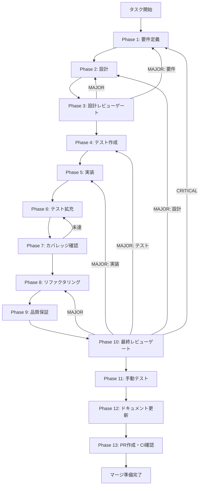

# UT-SDK-07-SHARED-IPC-CHANNEL-CONTRACT-001: shared-ipc-channel-contract-sync

## 概要

`packages/shared/src/ipc/channels.ts` と `apps/desktop/src/preload/channels.ts` の channel 名 parity を確認し、drift を修正する。TASK-SDK-07 で shared channel の再利用を前提としたが、shared 側に approval/execution 系チャネルが未定義であり、desktop 側のみに定義がある parity drift が発生している。

## メタ情報

| 項目         | 内容                                                                      |
| ------------ | ------------------------------------------------------------------------- |
| タスクID     | UT-SDK-07-SHARED-IPC-CHANNEL-CONTRACT-001                                 |
| タスク名     | shared-ipc-channel-contract-sync                                          |
| 分類         | 契約整合                                                                  |
| 対象機能     | shared IPC channel 定義と desktop preload allowlist の parity             |
| タスク分類   | code task                                                                 |
| 優先度       | 高                                                                        |
| 見積もり規模 | 小規模                                                                    |
| ステータス   | spec_created                                                              |
| 作成日       | 2026-03-29                                                                |
| Issue        | [#1696](https://github.com/dai-motoki/AIWorkflowOrchestrator/issues/1696) |

## タスク概要

### ユーザー指示

`packages/shared/src/ipc/channels.ts` を desktop 実装へ同期。`APPROVAL_RESPOND`, `APPROVAL_REQUEST`, `EXECUTION_GET_DISCLOSURE_INFO` の parity drift を解消する。

### 目的

`packages/shared/src/ipc/channels.ts` と `apps/desktop/src/preload/channels.ts` の channel 名 parity を確認し、drift を修正する。

### 背景

TASK-SDK-07 で shared channel の再利用を前提としたが、shared 側に approval/execution 系チャネルが未定義。desktop 側のみに定義があり parity drift が発生している。

### 最終ゴール

3チャネルが shared/desktop 両方で同一文字列として定義され、cross-layer parity テストが通ること。

### 成果物一覧

| 種別         | 成果物                    | 配置先                                                                       |
| ------------ | ------------------------- | ---------------------------------------------------------------------------- |
| 機能         | shared channel 定義追加   | `packages/shared/src/ipc/channels.ts`                                        |
| 機能         | desktop import 変更       | `apps/desktop/src/preload/channels.ts`                                       |
| テスト       | shared channel テスト     | `packages/shared/src/ipc/__tests__/channels.test.ts`                         |
| テスト       | desktop preload テスト    | `apps/desktop/src/preload/channels.test.ts`                                  |
| テスト       | cross-layer parity テスト | `apps/desktop/src/main/services/runtime/__tests__/governance-bundle.test.ts` |
| ドキュメント | Phase出力一式             | `outputs/phase-*/`                                                           |

## 受入基準

| ID   | 基準                                                                                   |
| ---- | -------------------------------------------------------------------------------------- |
| AC-1 | `APPROVAL_RESPOND` が shared/desktop 両方で同一文字列として定義されている              |
| AC-2 | `APPROVAL_REQUEST` が shared/desktop 両方で同一文字列として定義されている              |
| AC-3 | `EXECUTION_GET_DISCLOSURE_INFO` が shared/desktop 両方で同一文字列として定義されている |
| AC-4 | desktop 側の channel 定義が shared からの import に置き換えられている                  |
| AC-5 | cross-layer parity テストが全チャネルで pass する                                      |
| AC-6 | 既存の IPC handler / preload API に破壊的変更がない                                    |

## スコープ

**含む**:

- `packages/shared/src/ipc/channels.ts` への 3 チャネル定義追加
- `apps/desktop/src/preload/channels.ts` の import 切り替え
- shared channel のユニットテスト
- cross-layer parity テスト（shared ↔ desktop 文字列一致検証）
- Phase 1〜13 の成果物出力

**含まない**:

- IPC handler ロジックの変更
- preload API の機能追加
- 新規 channel の設計（既存 3 チャネルの parity 修正のみ）
- renderer 側の消費コード変更

## 依存関係

| 種別       | 参照先      | 役割                                           |
| ---------- | ----------- | ---------------------------------------------- |
| upstream   | TASK-SDK-07 | execution governance で shared channel を前提  |
| downstream | -           | parity 修正後は後続タスクの channel 参照が安定 |

## 現行コードアンカー

| ファイル                               | 現状の役割                | 本タスクでの扱い                |
| -------------------------------------- | ------------------------- | ------------------------------- |
| `packages/shared/src/ipc/channels.ts`  | shared IPC channel 定義   | 3チャネル定義を追加             |
| `apps/desktop/src/preload/channels.ts` | desktop preload allowlist | shared からの import に切り替え |
| `governance-bundle.test.ts`            | cross-layer parity テスト | 3チャネルの parity 検証を追加   |

## 要件レビュー一次結論

| 観点                 | 結論                                                                         |
| -------------------- | ---------------------------------------------------------------------------- |
| 真の論点             | shared/desktop 間で channel 名が二重管理されており、文字列不一致リスクがある |
| 依存関係・責務境界   | channel 定義の正本は shared に置き、desktop は import で参照する             |
| 価値とコストの不均衡 | 小規模な定義追加と import 変更で parity drift を解消でき、コスト対効果が高い |
| 改善優先順位         | 1. shared 定義追加 2. desktop import 変更 3. parity テスト 4. 既存テスト確認 |
| 4条件評価            | 価値性: 高 / 実現性: 高 / 整合性: 高 / 運用性: 高                            |

## タスク分解サマリー

| ID     | フェーズ | サブタスク名       | 責務                                        | 依存 |
| ------ | -------- | ------------------ | ------------------------------------------- | ---- |
| T-01-1 | Phase 1  | 要件定義           | 3チャネルの現状把握と parity 要件の確定     | -    |
| T-02-1 | Phase 2  | 設計               | shared 定義追加と desktop import 変更の設計 | T-01 |
| T-03-1 | Phase 3  | 設計レビューゲート | 既存 IPC 契約との整合性確認                 | T-02 |
| T-04-1 | Phase 4  | テスト作成         | parity テストケース定義                     | T-03 |
| T-05-1 | Phase 5  | 実装               | shared 定義追加・desktop import 切り替え    | T-04 |
| T-06-1 | Phase 6  | テスト拡充         | edge case テスト追加                        | T-05 |
| T-07-1 | Phase 7  | カバレッジ確認     | channel 定義 coverage 可視化                | T-06 |
| T-08-1 | Phase 8  | リファクタリング   | 重複定義の整理                              | T-07 |
| T-09-1 | Phase 9  | 品質保証           | 後方互換性・既存テスト維持確認              | T-08 |
| T-10-1 | Phase 10 | 最終レビューゲート | AC-1〜AC-6 充足確認                         | T-09 |
| T-11-1 | Phase 11 | 手動テスト         | Electron 起動時の IPC 通信確認              | T-10 |
| T-12-1 | Phase 12 | ドキュメント更新   | 実装ガイド・仕様同期                        | T-11 |
| T-13-1 | Phase 13 | PR作成             | change summary 整理・CI 確認                | T-12 |

**総サブタスク数**: 13個

## 実行フロー図



## Phase 一覧

| Phase | 名称               | 仕様書                                                         | ステータス |
| ----- | ------------------ | -------------------------------------------------------------- | ---------- |
| 1     | 要件定義           | [phase-1-requirements.md](./phase-1-requirements.md)           | pending    |
| 2     | 設計               | [phase-2-design.md](./phase-2-design.md)                       | pending    |
| 3     | 設計レビューゲート | [phase-3-design-review.md](./phase-3-design-review.md)         | pending    |
| 4     | テスト作成         | [phase-4-test-creation.md](./phase-4-test-creation.md)         | pending    |
| 5     | 実装               | [phase-5-implementation.md](./phase-5-implementation.md)       | pending    |
| 6     | テスト拡充         | [phase-6-test-expansion.md](./phase-6-test-expansion.md)       | pending    |
| 7     | カバレッジ確認     | [phase-7-coverage-check.md](./phase-7-coverage-check.md)       | pending    |
| 8     | リファクタリング   | [phase-8-refactoring.md](./phase-8-refactoring.md)             | pending    |
| 9     | 品質保証           | [phase-9-quality-assurance.md](./phase-9-quality-assurance.md) | pending    |
| 10    | 最終レビューゲート | [phase-10-final-review.md](./phase-10-final-review.md)         | pending    |
| 11    | 手動テスト         | [phase-11-manual-test.md](./phase-11-manual-test.md)           | pending    |
| 12    | ドキュメント更新   | [phase-12-documentation.md](./phase-12-documentation.md)       | pending    |
| 13    | PR作成             | [phase-13-pr-creation.md](./phase-13-pr-creation.md)           | pending    |

## テストカバレッジ目標

### ユニットテスト

| 指標              | 最低基準 | 推奨基準 |
| ----------------- | -------- | -------- |
| Line Coverage     | 80%      | 90%      |
| Branch Coverage   | 60%      | 70%      |
| Function Coverage | 80%      | 90%      |

### 結合テスト

| 指標                             | 目標 |
| -------------------------------- | ---- |
| channel 文字列 parity            | 100% |
| shared → desktop import 整合     | 100% |
| 正常系シナリオ                   | 100% |
| 異常系シナリオ（未定義 channel） | 80%+ |
| 既存 IPC handler 後方互換        | 100% |

## 統合テスト連携（Phase 1〜11で必須）

| Phase | 統合テスト連携アクション                                             |
| ----- | -------------------------------------------------------------------- |
| 1     | 3チャネルの現状文字列と desktop/shared 定義差分を明記                |
| 2     | shared 定義追加と desktop import 変更の統合ポイントを設計に反映      |
| 3     | 統合テスト観点のレビューゲートを実施                                 |
| 4     | cross-layer parity テストシナリオを作成                              |
| 5     | shared 定義追加・desktop import 切り替えの実装とテスト支援コード整備 |
| 6     | edge case（channel 未定義・重複定義・typo）の統合テスト拡充          |
| 7     | 統合テストの再実行とカバレッジゲート判定                             |
| 8     | リファクタ後の統合テスト継続成功を確認                               |
| 9     | 品質保証で統合テスト結果を確認                                       |
| 10    | 最終レビューで統合テスト結果を確認                                   |
| 11    | 手動統合テスト（Electron 起動時の IPC 通信）を確認                   |

## Phase完了時の必須アクション

**各Phase完了時に以下を必ず実行すること:**

1. **タスク100%実行**: Phase内で指定された全タスクを完全に実行
2. **成果物確認**: 全ての必須成果物が生成されていることを検証
3. **実行記録**: 実行タスクの結果を記録
4. **artifacts.json更新**: Phase完了ステータスを更新
5. **Phase末端の実行確認**: 各タスクを100%実行し、各タスクを完遂した旨を必ず明記

```bash
# Phase完了時の検証コマンド
node .claude/skills/task-specification-creator/scripts/validate-phase-output.js docs/30-workflows/step-ut-sdk-07-shared-ipc-channel-contract --phase {{PHASE_NUMBER}}

# Phase完了・成果物登録
node .claude/skills/task-specification-creator/scripts/complete-phase.js \
  --workflow docs/30-workflows/step-ut-sdk-07-shared-ipc-channel-contract --phase {{PHASE_NUMBER}} --artifacts "..."
```

## ディレクトリ構成

```text
step-ut-sdk-07-shared-ipc-channel-contract/
├── index.md
├── artifacts.json
├── phase-1-requirements.md
├── phase-2-design.md
├── phase-3-design-review.md
├── phase-4-test-creation.md
├── phase-5-implementation.md
├── phase-6-test-expansion.md
├── phase-7-coverage-check.md
├── phase-8-refactoring.md
├── phase-9-quality-assurance.md
├── phase-10-final-review.md
├── phase-11-manual-test.md
├── phase-12-documentation.md
├── phase-13-pr-creation.md
└── outputs/
```

## 実装者向けクイックガイド

### 着手条件

- `packages/shared/src/ipc/channels.ts` の現行定義を読了している
- `apps/desktop/src/preload/channels.ts` の allowlist 構造を把握している
- TASK-SDK-07 での shared channel 再利用前提を理解している

### 想定変更ポイント

- `packages/shared/src/ipc/channels.ts` — `APPROVAL_RESPOND`, `APPROVAL_REQUEST`, `EXECUTION_GET_DISCLOSURE_INFO` の定義追加
- `apps/desktop/src/preload/channels.ts` — `@repo/shared/src/ipc/channels` からの import に切り替え
- `packages/shared/src/ipc/__tests__/channels.test.ts` — 追加チャネルのテスト
- `apps/desktop/src/preload/channels.test.ts` — allowlist / shared channel 連携の既存テスト拡張
- `apps/desktop/src/main/services/runtime/__tests__/governance-bundle.test.ts` — cross-layer parity テスト追加
- `apps/desktop/src/preload/__tests__/skill-creator-api.governance.test.ts` — preload surface の shared 再利用確認
- `apps/desktop/src/main/ipc/__tests__/approvalHandlers.test.ts` — main handler 契約の回帰確認

### 非対象

- IPC handler ロジックの変更
- 新規 channel の設計
- preload API の機能追加
- renderer 側の消費コード変更

### 完了イメージ

- 3チャネルが `packages/shared/src/ipc/channels.ts` に定義されている
- `apps/desktop/src/preload/channels.ts` が shared からの import を使用している
- cross-layer parity テストが全チャネルで pass する
- 既存の IPC 通信に破壊的変更がない
