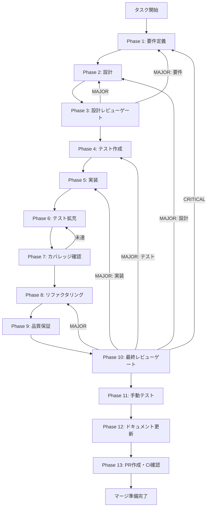

# system-prompt-db - タスク実行仕様書

## ユーザーからの元の指示

```
システムプロンプトのテンプレートを、現在のelectron-storeではなく、
Tursoデータベースに永続化し、デスクトップとWebで共有できるようにする。
```

## メタ情報

| 項目         | 内容                                   |
| ------------ | -------------------------------------- |
| タスクID     | TASK-CHAT-SYSPROMPT-DB-001             |
| タスク名     | システムプロンプトのデータベース永続化 |
| 分類         | 機能拡張                               |
| 対象機能     | チャット - システムプロンプト設定      |
| 優先度       | 高                                     |
| 見積もり規模 | 中規模                                 |
| ステータス   | 未実施                                 |
| 作成日       | 2026-01-22                             |
| Issue番号    | #375                                   |

---

## タスク概要

### 目的

システムプロンプトのテンプレートをTursoデータベースに保存し、デスクトップアプリとWebアプリ間でテンプレートを共有できるようにする。

### 背景

**現在の実装**:

- テンプレートは `electron-store` でローカル保存（`~/.config/AIWorkflowOrchestrator/config.json`）
- デスクトップアプリ専用、Webアプリとの共有不可
- Embedded Replicas によるオフライン対応なし

**問題点**:

- デバイス間でテンプレートを共有できない
- Webアプリで同じテンプレート機能を利用できない
- バックアップ・復元が困難
- ユーザー認証との連動がない（すべてのユーザーで共通）

### 最終ゴール

- システムプロンプトテンプレートがTursoデータベースに保存される
- ユーザー認証と連動し、ユーザーごとにテンプレートが管理される
- デスクトップアプリは Embedded Replicas を使用してオフライン対応
- Webアプリでも同じテンプレート機能が利用可能
- 既存のプリセットテンプレートは引き続き利用可能
- 既存のelectron-store実装とのマイグレーション機能

### 成果物一覧

| 種別         | 成果物                   | 配置先                                                      |
| ------------ | ------------------------ | ----------------------------------------------------------- |
| データベース | テーブルスキーマ定義     | `packages/shared/src/db/schema/systemPrompt.ts`             |
| データベース | マイグレーションファイル | `packages/shared/drizzle/migrations/*.sql`                  |
| 実装         | Repository実装           | `packages/shared/src/repositories/systemPrompt.ts`          |
| 実装         | Slice更新（DB連携）      | `apps/desktop/src/renderer/store/slices/*.ts`               |
| 実装         | マイグレーション関数     | `apps/desktop/src/main/migration/electronStoreMigration.ts` |
| テスト       | Repository単体テスト     | `packages/shared/src/repositories/*.test.ts`                |
| テスト       | Slice統合テスト          | `apps/desktop/src/renderer/store/slices/*.test.ts`          |
| ドキュメント | 設計ドキュメント         | `docs/30-workflows/system-prompt-db/outputs/`               |
| PR           | GitHub Pull Request      | GitHub UI                                                   |

---

## 参照ファイル

本仕様書のコマンド選定は以下を参照：

- `.claude/skills/aiworkflow-requirements/references/database-schema.md` - データベーススキーマ設計
- `.claude/skills/aiworkflow-requirements/references/architecture-patterns.md` - アーキテクチャパターン
- `.claude/skills/aiworkflow-requirements/references/ui-ux-system-prompt.md` - システムプロンプトUI仕様
- `.claude/skills/aiworkflow-requirements/references/interfaces-chat-history.md` - チャット履歴インターフェース参考

---

## タスク分解サマリー

| ID     | フェーズ | サブタスク名       | 責務                                     | 依存   |
| ------ | -------- | ------------------ | ---------------------------------------- | ------ |
| T-01-1 | Phase 1  | 要件定義           | DB永続化機能の要件を明文化               | -      |
| T-02-1 | Phase 2  | 設計               | スキーマ・Repository・マイグレーション   | T-01-1 |
| T-03-1 | Phase 3  | 設計レビューゲート | 要件・設計の妥当性検証                   | T-02-1 |
| T-04-1 | Phase 4  | テスト作成         | TDD: Red（失敗するテスト作成）           | T-03-1 |
| T-05-1 | Phase 5  | 実装               | TDD: Green（テストを通す実装）           | T-04-1 |
| T-06-1 | Phase 6  | テスト拡充         | カバレッジ目標達成に向けた追加テスト     | T-05-1 |
| T-07-1 | Phase 7  | カバレッジ確認     | カバレッジ目標検証・統合テスト実行       | T-06-1 |
| T-08-1 | Phase 8  | リファクタリング   | TDD: Refactor（品質改善）                | T-07-1 |
| T-09-1 | Phase 9  | 品質保証           | 静的解析・セキュリティ・性能             | T-08-1 |
| T-10-1 | Phase 10 | 最終レビューゲート | 全体品質・整合性検証                     | T-09-1 |
| T-11-1 | Phase 11 | 手動テスト検証     | UX・実環境動作確認                       | T-10-1 |
| T-12-1 | Phase 12 | ドキュメント更新   | ドキュメント更新・仕様反映・未タスク検出 | T-11-1 |
| T-13-1 | Phase 13 | PR作成             | コミット・PR・CI確認                     | T-12-1 |

**総サブタスク数**: 13個

---

## 実行フロー図



---

## Phase一覧

| Phase | 名称               | 仕様書                                                 | ステータス |
| ----- | ------------------ | ------------------------------------------------------ | ---------- |
| 1     | 要件定義           | [phase-1-requirements.md](phase-1-requirements.md)     | 未実施     |
| 2     | 設計               | [phase-2-design.md](phase-2-design.md)                 | 未実施     |
| 3     | 設計レビューゲート | [phase-3-design-review.md](phase-3-design-review.md)   | 未実施     |
| 4     | テスト作成         | [phase-4-test-creation.md](phase-4-test-creation.md)   | 未実施     |
| 5     | 実装               | [phase-5-implementation.md](phase-5-implementation.md) | 未実施     |
| 6     | テスト拡充         | [phase-6-test-expansion.md](phase-6-test-expansion.md) | 未実施     |
| 7     | カバレッジ確認     | [phase-7-coverage-check.md](phase-7-coverage-check.md) | 未実施     |
| 8     | リファクタリング   | [phase-8-refactoring.md](phase-8-refactoring.md)       | 未実施     |
| 9     | 品質保証           | [phase-9-quality.md](phase-9-quality.md)               | 未実施     |
| 10    | 最終レビューゲート | [phase-10-final-review.md](phase-10-final-review.md)   | 未実施     |
| 11    | 手動テスト         | [phase-11-manual-test.md](phase-11-manual-test.md)     | 未実施     |
| 12    | ドキュメント更新   | [phase-12-documentation.md](phase-12-documentation.md) | 未実施     |
| 13    | PR作成             | [phase-13-pr-creation.md](phase-13-pr-creation.md)     | 未実施     |

---

## テストカバレッジ目標

### ユニットテスト

| 指標              | 最低基準 | 推奨基準 |
| ----------------- | -------- | -------- |
| Line Coverage     | 80%      | 90%      |
| Branch Coverage   | 60%      | 70%      |
| Function Coverage | 80%      | 90%      |

### 結合テスト

| 指標                         | 目標 |
| ---------------------------- | ---- |
| Repository CRUD操作          | 100% |
| モジュール間インターフェース | 100% |
| 正常系シナリオ               | 100% |
| 異常系シナリオ               | 80%+ |
| マイグレーション処理         | 100% |

---

## 統合テスト連携（Phase 1〜11で必須）

各Phaseで以下の統合テスト連携アクションを実施すること:

| Phase | 統合テスト連携アクション                                    |
| ----- | ----------------------------------------------------------- |
| 1     | Repository API・認可・データフロー要件を要件に明記          |
| 2     | 統合ポイント（IPC・DB・State）を設計に反映                  |
| 3     | 統合テスト観点のレビューゲートを実施                        |
| 4     | Repository統合テストシナリオを作成                          |
| 5     | Repository・Slice・マイグレーションの実装とテスト支援コード |
| 6     | 統合テストの拡充（オフライン・同期・マイグレーション）      |
| 7     | 統合テストの再実行とゲート判定                              |
| 8     | リファクタ後の統合テスト継続成功を確認                      |
| 9     | 品質保証で統合テスト結果を確認                              |
| 10    | 最終レビューで統合テスト結果を確認                          |
| 11    | 手動統合テスト（マイグレーション・CRUD・オフライン）を確認  |

---

## 設計概要

### データベーススキーマ

```typescript
// packages/shared/src/db/schema/systemPrompt.ts
export const systemPromptTemplates = sqliteTable(
  "system_prompt_templates",
  {
    id: text("id")
      .primaryKey()
      .$defaultFn(() => crypto.randomUUID()),
    userId: text("user_id")
      .notNull()
      .references(() => users.id, { onDelete: "cascade" }),
    name: text("name").notNull(),
    content: text("content").notNull(),
    isPreset: integer("is_preset", { mode: "boolean" })
      .notNull()
      .default(false),
    createdAt: integer("created_at", { mode: "timestamp" })
      .notNull()
      .$defaultFn(() => new Date()),
    updatedAt: integer("updated_at", { mode: "timestamp" })
      .notNull()
      .$defaultFn(() => new Date()),
  },
  (table) => ({
    userIdIdx: index("system_prompt_templates_user_id_idx").on(table.userId),
    nameIdx: index("system_prompt_templates_name_idx").on(table.name),
    uniqueUserName: unique("unique_user_name").on(table.userId, table.name),
  }),
);
```

### Repository層インターフェース

```typescript
export interface ISystemPromptRepository {
  // CRUD操作
  findAllByUserId(userId: string): Promise<PromptTemplate[]>;
  findById(id: string): Promise<PromptTemplate | null>;
  create(
    userId: string,
    data: CreatePromptTemplateInput,
  ): Promise<PromptTemplate>;
  update(id: string, data: UpdatePromptTemplateInput): Promise<PromptTemplate>;
  delete(id: string): Promise<void>;

  // プリセット保護
  isPreset(id: string): Promise<boolean>;
}
```

### マイグレーション戦略

**ステップ1**: アプリ起動時に自動実行

- electron-storeから既存テンプレートを読み込み
- 現在のユーザーIDを取得
- Tursoデータベースに挿入（重複チェックあり）

**ステップ2**: electron-storeのクリーンアップ

- 移行成功後、electron-storeの`systemPromptTemplates`キーを削除
- バックアップ用に `.bak` ファイルを作成

**ステップ3**: フォールバック

- マイグレーション失敗時はelectron-storeに戻す
- エラーログを記録し、ユーザーに通知

---

## 技術スタック

| カテゴリ       | 技術                              |
| -------------- | --------------------------------- |
| データベース   | Turso + libSQL                    |
| ORM            | Drizzle ORM                       |
| オフライン対応 | Turso Embedded Replicas (Desktop) |
| 状態管理       | Zustand                           |
| テスト         | Vitest                            |
| 型安全性       | TypeScript                        |

---

## リスクと対策

| リスク                              | 影響度 | 対策                                 |
| ----------------------------------- | ------ | ------------------------------------ |
| マイグレーション失敗                | 高     | 自動バックアップ、フォールバック機能 |
| プリセットテンプレートの重複挿入    | 中     | unique制約、重複チェックロジック     |
| オフライン時のEmbedded Replicas遅延 | 低     | 同期待機時のローディング表示         |
| Webアプリでの実装工数増加           | 中     | Shared Repository層で実装を共通化    |

---

## Phase完了時の必須アクション

**各Phase完了時に以下を必ず実行すること:**

1. **タスク100%実行**: Phase内で指定された全タスクを完全に実行
2. **成果物確認**: 全ての必須成果物が生成されていることを検証
3. **実行記録**: 実行タスクの結果を記録
4. **artifacts.json更新**: Phase完了ステータスを更新
5. **Phase末端の実行確認**: 各タスクを100%実行し、各タスクを完遂した旨を必ず明記

```bash
# Phase完了時の検証コマンド
node .claude/skills/task-specification-creator/scripts/validate-phase-output.js docs/30-workflows/system-prompt-db --phase {{PHASE_NUMBER}}

# Phase完了・成果物登録
node .claude/skills/task-specification-creator/scripts/complete-phase.js \
  --workflow docs/30-workflows/system-prompt-db --phase {{PHASE_NUMBER}} --artifacts "..."
```

---

## 完了条件チェックリスト

### 機能要件

- [ ] システムプロンプトテンプレートがTursoに保存される
- [ ] ユーザー認証と連動し、ユーザーごとに管理される
- [ ] プリセットテンプレートは全ユーザーで共有される
- [ ] electron-storeからの自動マイグレーションが実行される
- [ ] Embedded ReplicasによるオフラインCRUD操作が可能

### 非機能要件

- [ ] 保存時のレスポンス時間 < 100ms
- [ ] 一覧取得時のレスポンス時間 < 200ms
- [ ] テストカバレッジ 80%以上
- [ ] マイグレーション成功率 100%（既存データ損失なし）

### 品質要件

- [ ] すべての単体テストが成功
- [ ] TypeScriptエラー 0件
- [ ] ESLintエラー 0件
- [ ] 手動テストで全機能動作確認
