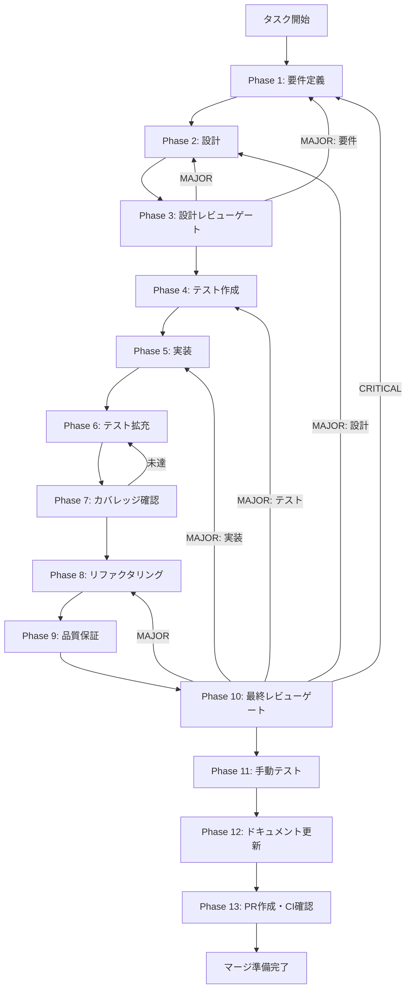

# システムプロンプトのLLM API統合 - タスク実行仕様書

## ユーザーからの元の指示

```
システムプロンプトがIPCで正しく送信されるようになったが、
実際のLLM APIへの統合はまだ完了していない。
aiHandlers.tsでモックレスポンスを返している箇所を、
実際のLLM API呼び出しに置き換える。
```

## メタ情報

| 項目         | 内容                            |
| ------------ | ------------------------------- |
| タスクID     | TASK-CHAT-SYSPROMPT-LLM-001     |
| Issue番号    | #376                            |
| タスク名     | システムプロンプトのLLM API統合 |
| 分類         | 機能完成                        |
| 対象機能     | チャット - LLM API連携          |
| 優先度       | 高                              |
| 見積もり規模 | 小規模                          |
| ステータス   | 未実施                          |
| 作成日       | 2026-01-23                      |

---

## タスク概要

### 目的

システムプロンプトを含むチャットメッセージを実際のLLM APIに送信し、AIからの応答を受け取る機能を完成させる。

### 背景

**現在の実装**:

- `apps/desktop/src/main/ipc/aiHandlers.ts` でsystemPromptをIPCで受信
- TODOコメントで将来のLLM API統合を明示
- モックレスポンスを返している（`"System prompt received: ..."`）

**問題点**:

- 実際のAI応答が返らない
- システムプロンプトが機能として動作しない
- ユーザーが期待する機能が未完成

**参照（最終レビューレポート M-001）**:

> 現状: aiHandlers.ts でモックレスポンスを返す
> 影響: システムプロンプトはIPCで正しく送信されているが、LLM APIへの実際の送信は未実装
> 対応: Phase 8（手動テスト）後、LLM API統合フェーズで対応

### 最終ゴール

- システムプロンプトが実際のLLM APIに送信される
- LLMからの応答がチャットUIに表示される
- 複数のLLMプロバイダー（OpenAI, Anthropic, Google, xAI）に対応
- システムプロンプトの内容に応じてAIの振る舞いが変わることを確認

### 成果物一覧

| 種別         | 成果物                            | 配置先                                             |
| ------------ | --------------------------------- | -------------------------------------------------- |
| 実装         | LLM API Client実装                | `apps/desktop/src/main/services/llmClient.ts`      |
| 実装         | aiHandlers更新（LLM API呼び出し） | `apps/desktop/src/main/ipc/aiHandlers.ts`          |
| 実装         | システムプロンプトメッセージ構築  | `apps/desktop/src/main/utils/buildMessages.ts`     |
| テスト       | LLM Client単体テスト              | `apps/desktop/src/main/services/llmClient.test.ts` |
| テスト       | aiHandlers統合テスト              | `apps/desktop/src/main/ipc/aiHandlers.test.ts`     |
| ドキュメント | 要件ドキュメント                  | `outputs/phase-1/`                                 |
| ドキュメント | 設計ドキュメント                  | `outputs/phase-2/`                                 |
| PR           | GitHub Pull Request               | GitHub UI                                          |

---

## 参照ファイル

本仕様書の実装は以下を参照:

- `docs/00-requirements/master_system_design.md` - システム要件
- `docs/00-requirements/03-technology-stack.md` - AIプロバイダー仕様
- `.claude/skills/aiworkflow-requirements/references/interfaces-llm.md` - LLMインターフェース仕様
- `.claude/skills/aiworkflow-requirements/references/interfaces-system-prompt.md` - システムプロンプトインターフェース仕様
- `.claude/skills/aiworkflow-requirements/references/technology-core.md` - 技術スタック

---

## タスク分解サマリー

| ID     | フェーズ | サブタスク名           | 責務                                            | 依存     |
| ------ | -------- | ---------------------- | ----------------------------------------------- | -------- |
| T-01-1 | Phase 1  | 要件定義               | LLM API統合の要件を明文化                       | -        |
| T-02-1 | Phase 2  | LLM Client設計         | AIプロバイダー抽象化、メッセージ構築設計        | T-01-1   |
| T-03-1 | Phase 3  | 設計レビュー           | 要件・設計の妥当性検証                          | T-02-1   |
| T-04-1 | Phase 4  | テスト作成             | API呼び出しのテスト作成（TDD: Red）             | T-03-1   |
| T-05-1 | Phase 5  | LLM Client実装         | Vercel AI SDK連携実装                           | T-04-1   |
| T-05-2 | Phase 5  | aiHandlers更新         | モックレスポンス → LLM Client呼び出しに切り替え | T-04-1   |
| T-06-1 | Phase 6  | テスト拡充             | カバレッジ目標達成に向けた追加テスト            | T-05-1~2 |
| T-07-1 | Phase 7  | テストカバレッジ確認   | カバレッジ目標検証                              | T-06-1   |
| T-08-1 | Phase 8  | コードリファクタリング | コード品質の改善                                | T-07-1   |
| T-09-1 | Phase 9  | 品質保証               | テスト実行・品質チェック                        | T-08-1   |
| T-10-1 | Phase 10 | 最終レビュー           | 全体的な品質・整合性検証                        | T-09-1   |
| T-11-1 | Phase 11 | 手動テスト検証         | 実際のLLM API呼び出しの手動確認                 | T-10-1   |
| T-12-1 | Phase 12 | ドキュメント更新       | 実装ガイド・システム仕様更新                    | T-11-1   |
| T-13-1 | Phase 13 | PR作成                 | 差分確認・コミット・PR作成・CI確認              | T-12-1   |

**総サブタスク数**: 14個

---

## 実行フロー図



---

## Phase一覧

| Phase | 名称               | 仕様書                                                 | ステータス |
| ----- | ------------------ | ------------------------------------------------------ | ---------- |
| 1     | 要件定義           | [phase-1-requirements.md](phase-1-requirements.md)     | 未実施     |
| 2     | 設計               | [phase-2-design.md](phase-2-design.md)                 | 未実施     |
| 3     | 設計レビューゲート | [phase-3-design-review.md](phase-3-design-review.md)   | 未実施     |
| 4     | テスト作成         | [phase-4-test-creation.md](phase-4-test-creation.md)   | 未実施     |
| 5     | 実装               | [phase-5-implementation.md](phase-5-implementation.md) | 未実施     |
| 6     | テスト拡充         | [phase-6-test-expansion.md](phase-6-test-expansion.md) | 未実施     |
| 7     | カバレッジ確認     | [phase-7-coverage-check.md](phase-7-coverage-check.md) | 未実施     |
| 8     | リファクタリング   | [phase-8-refactoring.md](phase-8-refactoring.md)       | 未実施     |
| 9     | 品質保証           | [phase-9-quality.md](phase-9-quality.md)               | 未実施     |
| 10    | 最終レビューゲート | [phase-10-final-review.md](phase-10-final-review.md)   | 未実施     |
| 11    | 手動テスト         | [phase-11-manual-test.md](phase-11-manual-test.md)     | 未実施     |
| 12    | ドキュメント更新   | [phase-12-documentation.md](phase-12-documentation.md) | 未実施     |
| 13    | PR作成             | [phase-13-pr-creation.md](phase-13-pr-creation.md)     | 未実施     |

---

## 技術スタック

| カテゴリ     | 技術                              |
| ------------ | --------------------------------- |
| AI SDK       | Vercel AI SDK                     |
| プロバイダー | OpenAI, Anthropic, Google AI, xAI |
| テスト       | Vitest, Mock API                  |
| 型安全性     | TypeScript, Zod                   |

---

## テストカバレッジ目標

### ユニットテスト

| 指標              | 最低基準 | 推奨基準 |
| ----------------- | -------- | -------- |
| Line Coverage     | 80%      | 90%      |
| Branch Coverage   | 60%      | 70%      |
| Function Coverage | 80%      | 90%      |

### 結合テスト

| 指標                         | 目標 |
| ---------------------------- | ---- |
| APIエンドポイント            | 100% |
| モジュール間インターフェース | 100% |
| 正常系シナリオ               | 100% |
| 異常系シナリオ               | 80%+ |
| 外部連携ポイント             | 100% |

---

## リスクと対策

| リスク               | 影響度 | 対策                               |
| -------------------- | ------ | ---------------------------------- |
| APIキーが未設定      | 高     | エラーハンドリング、ユーザーに通知 |
| APIレート制限        | 中     | リトライ戦略、エラーメッセージ     |
| ストリーミング未対応 | 低     | 将来拡張として記録                 |
| プロバイダー間の差異 | 中     | 抽象化層で吸収                     |

---

## Phase完了時の必須アクション

**各Phase完了時に以下を必ず実行すること:**

1. **タスク100%実行**: Phase内で指定された全タスクを完全に実行
2. **成果物確認**: 全ての必須成果物が生成されていることを検証
3. **実行記録**: 実行タスクの結果を記録
4. **artifacts.json更新**: Phase完了ステータスを更新
5. **Phase末端の実行確認**: 各タスクを100%実行し、各タスクを完遂した旨を必ず明記

```bash
# Phase完了時の検証コマンド
node .claude/skills/task-specification-creator/scripts/validate-phase-output.js docs/30-workflows/system-prompt-llm-api --phase {{PHASE_NUMBER}}

# Phase完了・成果物登録
node .claude/skills/task-specification-creator/scripts/complete-phase.js \
  --workflow docs/30-workflows/system-prompt-llm-api --phase {{PHASE_NUMBER}} --artifacts "..."
```

---

## 完了条件チェックリスト

### 機能要件

- [ ] システムプロンプト付きメッセージがLLM APIに送信される
- [ ] LLMからの応答がチャットUIに表示される
- [ ] 4つのプロバイダーすべてで動作する
- [ ] エラー時に適切なメッセージが表示される

### 非機能要件

- [ ] 初回トークン応答時間 < 2秒（目標）
- [ ] テストカバレッジ 80%以上
- [ ] TypeScriptエラー 0件

### 品質要件

- [ ] すべての単体テストが成功
- [ ] ESLintエラー 0件
- [ ] 手動テストで全プロバイダー動作確認

---

## 更新履歴

| 日付       | 版  | 変更内容 | 作成者 |
| ---------- | --- | -------- | ------ |
| 2026-01-23 | 1.0 | 初版作成 | Claude |
