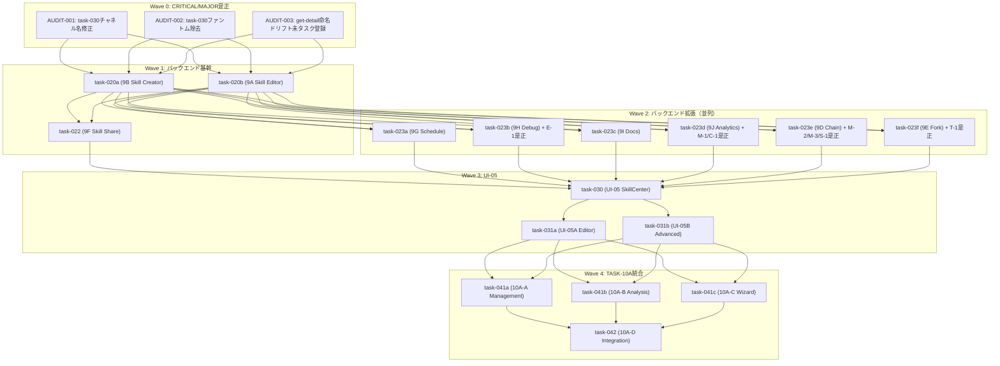

# task-013D 実行順序再設計 — SubAgent A/B/C 監査結果統合と最終実行順序確定

## 1. メタ情報

| 項目         | 値                                                                                                                                                                                         |
| ------------ | ------------------------------------------------------------------------------------------------------------------------------------------------------------------------------------------ |
| タスクID     | TASK-013D-SEQUENCE-REDESIGN                                                                                                                                                                |
| 親タスク     | TASK-013-UI-BACKEND-CONSISTENCY                                                                                                                                                            |
| 担当         | SubAgent-D                                                                                                                                                                                 |
| ステータス   | 完了                                                                                                                                                                                       |
| 作成日       | 2026-02-25                                                                                                                                                                                 |
| 入力         | task-013a, task-013b, task-013c の監査結果                                                                                                                                                 |
| 正本基準     | `docs/30-workflows/skill-import-agent-system/tasks/task-00-unified-implementation-sequence/task-000-master-index.md`, `.claude/skills/aiworkflow-requirements/references/task-workflow.md` |
| 実装パターン | `.claude/skills/aiworkflow-requirements/references/architecture-implementation-patterns.md`（S19-S21参照）                                                                                 |

## 2. 目的

SubAgent A（IPC契約監査）、B（データフロー監査）、C（UI責務境界監査）の3監査結果を統合し、task-9 → UI-05 → TASK-10A の実行順序を直列/並列付きで矛盾なく確定する。CRITICAL/MAJOR 指摘の是正タイミングを各Waveに配置し、実装フェーズ移行時にそのまま実行計画として転用可能な最終順序表を生成する。

## 3. 実行タスク

| #   | タスク名                       | 説明                                                                 |
| --- | ------------------------------ | -------------------------------------------------------------------- |
| 1   | A/B/C 検出結果の統合分類       | 全検出結果をCRITICAL/MAJOR/MEDIUM/LOW/INFOに統一分類する             |
| 2   | 必須直列区間の確定             | CRITICAL/MAJOR修正の依存関係から直列制約を導出する                   |
| 3   | 並列可能区間の確定             | 相互独立なタスクグループを特定し並列化可能性を検証する               |
| 4   | Wave構成の設計                 | Wave 0〜5の構成を確定し各Waveの開始/完了条件を定義する               |
| 5   | 依存関係DAGの作成              | mermaid記法で全タスクの依存関係を視覚化する                          |
| 6   | 成果物3ファイルの作成          | final-execution-sequence.md、parallelization-boundary.md、本ファイル |
| 7   | task-013本文とindex.mdへの反映 | 最終確定結果を親仕様書とチームインデックスに反映する                 |
| 8   | 統合監査レポートの更新         | A/B/C/D全体のレポートを最終版に更新する                              |

## 4. 参照資料

| 資料名              | パス                                                                                                                 | 内容                    |
| ------------------- | -------------------------------------------------------------------------------------------------------------------- | ----------------------- |
| SubAgent-A 監査結果 | `docs/30-workflows/completed-tasks/task-013-subagent-team/task-013a-contract-audit.md`                               | IPC契約差分5件          |
| SubAgent-B 監査結果 | `docs/30-workflows/completed-tasks/task-013-subagent-team/task-013b-dataflow-audit.md`                               | データフロー差分7件     |
| SubAgent-C 監査結果 | `docs/30-workflows/completed-tasks/task-013-subagent-team/task-013c-ui-boundary-audit.md`                            | UI責務境界考慮事項6件   |
| 契約差分マトリクス  | `docs/30-workflows/completed-tasks/task-013-subagent-team/outputs/contract-diff-matrix.md`                           | 全56チャネル差分一覧    |
| Date境界ルール      | `docs/30-workflows/completed-tasks/task-013-subagent-team/outputs/ipc-date-boundary-rules.md`                        | 18フィールド準拠状況    |
| イベントpayload整合 | `docs/30-workflows/completed-tasks/task-013-subagent-team/outputs/event-payload-consistency.md`                      | DebugEvent型推奨定義    |
| Props-DTO対応表     | `docs/30-workflows/completed-tasks/task-013-subagent-team/outputs/ui-props-dto-mapping.md`                           | 全コンポーネントMapping |
| UI責務テーブル      | `docs/30-workflows/completed-tasks/task-013-subagent-team/outputs/ui-layer-responsibility-table.md`                  | 全ビュー責務分担        |
| チャネル所有権      | `docs/30-workflows/completed-tasks/task-013-subagent-team/outputs/channel-ownership-table.md`                        | 全57チャネル所有権      |
| 統合インデックス    | `docs/30-workflows/skill-import-agent-system/tasks/task-00-unified-implementation-sequence/task-000-master-index.md` | 現行実行順序基準        |
| タスク台帳          | `.claude/skills/aiworkflow-requirements/references/task-workflow.md`                                                 | 依存/完了状況の正本     |
| 実装パターン        | `.claude/skills/aiworkflow-requirements/references/architecture-implementation-patterns.md`                          | S19-S21判断基準         |

## 5. A/B/C 監査結果の統合サマリ

### 5.1 全検出結果一覧（統一分類）

| #   | 検出ID                    | 検出元 | 統一重要度 | カテゴリ                    | 対象                                                        | 修正方針                                                                             | 是正Wave |
| --- | ------------------------- | ------ | ---------- | --------------------------- | ----------------------------------------------------------- | ------------------------------------------------------------------------------------ | -------- |
| 1   | AUDIT-001-CHANNEL-NAME    | A      | CRITICAL   | チャネル名不一致            | task-030 `skill:detail` → 正本 `skill:get-detail`           | task-030セクション11を`skill:get-detail`に修正                                       | Wave 0   |
| 2   | AUDIT-002-PHANTOM-CHANNEL | A      | CRITICAL   | ファントムチャネル          | task-030 `skill:readMarkdown` — 定義なし                    | task-030から削除し`skill:readFile`で代替する旨を明記                                 | Wave 0   |
| 3   | AUDIT-003-NAMING-DRIFT    | A      | MAJOR      | P45命名ドリフト             | `skill:get-detail` 引数名 `skillId` → 実態は `skillName`    | UT-FIX-SKILL-GETDETAIL-NAMING-DRIFT-001として未タスク登録                            | Wave 0   |
| 4   | E-1-DEBUGEVENT-UNDEF      | B      | MAJOR      | 型定義欠落                  | TASK-9H `DebugEvent` Discriminated Union未定義              | 7バリアントのDiscriminated Union型を`debug.ts`型定義セクションに追加                 | Wave 2   |
| 5   | T-1-FORKMETADATA-UNDEF    | B      | MEDIUM     | 型定義欠落                  | TASK-9E `ForkMetadata` インターフェース未定義               | `fork.ts`にForkMetadataインターフェースを追加（`forkedAt: string; // ISO 8601`含む） | Wave 2   |
| 6   | M-2-ISO8601-ANNOTATION    | B      | MEDIUM     | ISO 8601注記欠落            | TASK-9D `SkillChainDefinition.createdAt`                    | `@format ISO 8601` JSDocと`// ISO 8601`コメントを追加                                | Wave 2   |
| 7   | M-3-ISO8601-ANNOTATION    | B      | MEDIUM     | ISO 8601注記欠落            | TASK-9D `SkillChainDefinition.updatedAt`                    | M-2と同形式で追加                                                                    | Wave 2   |
| 8   | S-1-SECTION-MISSING       | B      | MEDIUM     | セクション欠落              | TASK-9D IPCシリアライズ方針セクション                       | 他6タスクと同形式の方針セクションを追加                                              | Wave 2   |
| 9   | M-1-NULLABLE-INCONSIST    | B      | LOW        | nullable不整合              | TASK-9J `SkillUsageSummary.lastUsed` string → string\|null  | 既存未タスクUT-IPC-DATA-FLOW-NULLABLE-CONSISTENCY-001で追跡中                        | Wave 2   |
| 10  | C-1-CODE-EXAMPLE          | B      | LOW        | コード例不整合              | TASK-9J recordEventコード例 `new Date()` → `.toISOString()` | コード例を修正                                                                       | Wave 2   |
| 11  | AUDIT-004-TRIM-VALID      | A      | MINOR      | P42バリデーション未確認     | `skill:get-detail`の`.trim()`チェック                       | 実装コードで有無を検証（Wave 0のAUDIT-003修正時に同時対応）                          | Wave 0   |
| 12  | AUDIT-005-EXEC-SEMANTICS  | A      | MINOR      | 引数セマンティクス要確認    | `skill:execute`の`skillId`がIDかskillNameか                 | 実装コード確認（skill:executeは実際にハッシュIDを使用するなら命名は正しい）          | Wave 1   |
| 13  | C-BOUNDARY-1-DATE         | C      | INFO       | Date型IPC変換の仕様明記推奨 | DebugPanel DebugSession.startedAt                           | task-031bのDebugPanel仕様にDate復元パターンを明記                                    | Wave 3   |
| 14  | C-BOUNDARY-2-CRON         | C      | INFO       | 境界注意（許容範囲）        | ScheduleManager Cron解析のRenderer配置                      | 現状維持（要監視）。タイムゾーン複雑化時はMain移管                                   | Wave 3   |
| 15  | C-BOUNDARY-3-LARGEFILE    | C      | INFO       | 境界注意（将来課題）        | SkillEditorView 大ファイルIPC転送                           | 将来的に分割読み込み/ストリーミングを検討                                            | —        |
| 16  | C-BOUNDARY-4-DEBUGFREQ    | C      | INFO       | 境界注意（将来課題）        | DebugPanel DebugEvent高頻度発火                             | 高頻度時はMain側でバッチング検討                                                     | —        |

### 5.2 重要度別集計

| 重要度   | 件数   | 是正必須 |
| -------- | ------ | -------- |
| CRITICAL | 2      | 必須     |
| MAJOR    | 2      | 必須     |
| MEDIUM   | 4      | 推奨     |
| LOW      | 2      | 任意     |
| MINOR    | 2      | 確認のみ |
| INFO     | 4      | 参考     |
| **合計** | **16** | —        |

### 5.3 SubAgent別検出サマリ

| SubAgent | 検出件数 | CRITICAL | MAJOR | MEDIUM | LOW   | MINOR | INFO  |
| -------- | -------- | -------- | ----- | ------ | ----- | ----- | ----- |
| A        | 5        | 2        | 1     | 0      | 0     | 2     | 0     |
| B        | 7        | 0        | 1     | 4      | 2     | 0     | 0     |
| C        | 4        | 0        | 0     | 0      | 0     | 0     | 4     |
| **合計** | **16**   | **2**    | **2** | **4**  | **2** | **2** | **4** |

## 6. 実行手順

### Step 1: Wave構成の確定

#### Wave 0: CRITICAL/MAJOR仕様是正（直列）

**目的**: 後続Wave全てに影響するチャネル名不一致とファントムチャネルを是正し、実装前提を確立する。

| 順序 | 是正対象  | 是正内容                                                                    | 対象ファイル                          |
| ---- | --------- | --------------------------------------------------------------------------- | ------------------------------------- |
| 0-1  | AUDIT-001 | task-030セクション11の`skill:detail`を`skill:get-detail`に修正              | `task-030-ui-05-skill-center-view.md` |
| 0-2  | AUDIT-002 | task-030セクション11の`skill:readMarkdown`を削除し`skill:readFile`代替記載  | `task-030-ui-05-skill-center-view.md` |
| 0-3  | AUDIT-003 | `skill:get-detail`の未タスク登録（UT-FIX-SKILL-GETDETAIL-NAMING-DRIFT-001） | 未タスク指示書作成                    |
| 0-4  | AUDIT-004 | `skill:get-detail`の`.trim()`チェック有無をAUDIT-003修正時に同時確認        | 実装コード確認（AUDIT-003と同時）     |

**開始条件**: task-012（UT-SKILL-IPC-PRELOAD-EXTENSION-001）が完了済みであること
**完了条件**: task-030のチャネル名が正本と一致し、ファントムチャネルが除去されていること

#### Wave 1: バックエンド基幹仕様（部分並列）

**目的**: Skill Creator（task-9B）とSkill Editor（task-9A）の基幹バックエンド仕様を確定し、Skill Share（task-9F）の前提を整える。

| 順序 | タスク  | 仕様書ファイル                       | 並列性                  | AUDIT-005確認 |
| ---- | ------- | ------------------------------------ | ----------------------- | ------------- |
| 1-1  | task-9B | `task-020a-task-9b-skill-creator.md` | 020a ∥ 020b（並列可能） | —             |
| 1-2  | task-9A | `task-020b-task-9a-skill-editor.md`  | 020a ∥ 020b（並列可能） | —             |
| 1-3  | task-9F | `task-022-task-9f-skill-share.md`    | 020a完了後（直列）      | —             |

**開始条件**: Wave 0完了
**完了条件**: task-020a、task-020b、task-022の仕様が正本準拠で確定していること

```
020a ─┐
      ├→ 022
020b ─┘
```

#### Wave 2: バックエンド拡張仕様（並列 + 是正統合）

**目的**: task-9D〜9Jの6タスクを並列実行し、SubAgent-B検出のMEDIUM/LOW指摘を各タスク内で是正する。

| 順序 | タスク  | 仕様書ファイル                         | 並列性 | 統合是正対象                              |
| ---- | ------- | -------------------------------------- | ------ | ----------------------------------------- |
| 2-1  | task-9G | `task-023a-task-9g-skill-schedule.md`  | 並列   | なし（全準拠済み）                        |
| 2-2  | task-9H | `task-023b-task-9h-skill-debug.md`     | 並列   | E-1: DebugEvent型定義追加                 |
| 2-3  | task-9I | `task-023c-task-9i-skill-docs.md`      | 並列   | なし（全準拠済み）                        |
| 2-4  | task-9J | `task-023d-task-9j-skill-analytics.md` | 並列   | M-1: nullable修正、C-1: コード例修正      |
| 2-5  | task-9D | `task-023e-task-9d-skill-chain.md`     | 並列   | M-2/M-3: ISO注記追加、S-1: セクション追加 |
| 2-6  | task-9E | `task-023f-task-9e-skill-fork.md`      | 並列   | T-1: ForkMetadata型定義追加               |

**開始条件**: Wave 1のtask-020a/020bが完了していること（task-022完了は不要）
**完了条件**: 6タスク全ての仕様が正本準拠で確定し、統合是正が完了していること

```
023a（9G）─┐
023b（9H）─┤
023c（9I）─┤ 全て並列
023d（9J）─┤
023e（9D）─┤
023f（9E）─┘
```

#### Wave 3: UI-05 仕様（030先行 → 031a/031b並列）

**目的**: SkillCenterView（task-030）のUI入口仕様を先行確定し、SkillEditorView（task-031a）とSkillAdvancedViews（task-031b）を並列実行する。

| 順序 | タスク | 仕様書ファイル                             | 並列性       | INFO是正対象                  |
| ---- | ------ | ------------------------------------------ | ------------ | ----------------------------- |
| 3-1  | UI-05  | `task-030-ui-05-skill-center-view.md`      | 先行（直列） | Wave 0でAUDIT-001/002是正済み |
| 3-2  | UI-05A | `task-031a-ui-05a-skill-editor-view.md`    | 031a ∥ 031b  | なし                          |
| 3-3  | UI-05B | `task-031b-ui-05b-skill-advanced-views.md` | 031a ∥ 031b  | C-BOUNDARY-1/2: Date/Cron注記 |

**開始条件**: Wave 2の全6タスクが完了していること（UI仕様がバックエンド契約に依存するため）
**完了条件**: 全3ビューの仕様が正本準拠で確定し、Props-DTO対応が検証されていること

```
030 ─┬→ 031a
     └→ 031b
```

#### Wave 4: TASK-10A 統合（部分並列 + 直列）

**目的**: Skill管理パネル（10A-A）、分析ビュー（10A-B）、作成ウィザード（10A-C）を並列確定し、最終統合（10A-D）で全体整合を保証する。

| 順序 | タスク     | 仕様書ファイル                             | 並列性                 |
| ---- | ---------- | ------------------------------------------ | ---------------------- |
| 4-1  | TASK-10A-A | `task-041a-task-10a-a-management-panel.md` | 041a ∥ 041b ∥ 041c     |
| 4-2  | TASK-10A-B | `task-041b-task-10a-b-analysis-view.md`    | 041a ∥ 041b ∥ 041c     |
| 4-3  | TASK-10A-C | `task-041c-task-10a-c-create-wizard.md`    | 041a ∥ 041b ∥ 041c     |
| 4-4  | TASK-10A-D | `task-042-task-10a-d-integration.md`       | 041a/b/c完了後（直列） |

**開始条件**: Wave 3の全UIタスクが完了していること
**完了条件**: task-042の統合仕様が全前提タスクとの整合を確認済みであること

```
041a ─┐
041b ─┼→ 042
041c ─┘
```

#### Wave 5: SubAgent成果物統合（直列）

**目的**: SubAgent A/B/C/D の監査成果を最終統合し、task-013 本文を確定版に更新する。

| 順序 | 作業                     | 成果物                                                                                                                       |
| ---- | ------------------------ | ---------------------------------------------------------------------------------------------------------------------------- |
| 5-1  | A/B/C検出結果の最終統合  | `subagent-audit-report-2026-02-25.md`（更新）                                                                                |
| 5-2  | 最終順序表の確定         | `final-execution-sequence.md`（確定版）                                                                                      |
| 5-3  | 並列化境界の確定         | `parallelization-boundary.md`（確定版）                                                                                      |
| 5-4  | task-013本文への最終反映 | `docs/30-workflows/skill-import-agent-system/tasks/completed-task/task-013-task9-ui-backend-consistency-improvements-001.md` |
| 5-5  | index.mdの最終更新       | `docs/30-workflows/completed-tasks/task-013-subagent-team/index.md`                                                          |

**開始条件**: Wave 0〜4の全成果物が生成されていること（仕様書作成タスクとしてはWave 0完了時点で実行可能）
**完了条件**: 全ドキュメントの記述が矛盾なく一貫していること

### Step 2: 依存関係DAG



### Step 3: 並列化境界の判断根拠

| 並列グループ          | 独立性の根拠                                                                                | 共有リソース                   | IPC衝突リスク |
| --------------------- | ------------------------------------------------------------------------------------------- | ------------------------------ | ------------- |
| 020a ∥ 020b           | Skill CreatorとSkill Editorは異なるサービス（生成 vs ファイル操作）で責務が分離             | `SkillService`（読み取りのみ） | なし          |
| 023a〜023f（6タスク） | 各機能は独立したIPCチャネル名前空間（chain:/schedule:/debug:/docs:/analytics:/fork:）を使用 | なし                           | なし          |
| 031a ∥ 031b           | SkillEditorViewとAdvancedViewsは異なるUI画面で操作対象が分離                                | agentSlice（読み取り共有）     | なし          |
| 041a ∥ 041b ∥ 041c    | Management/Analysis/WizardはTASK-10Aの独立サブビューで依存関係なし                          | なし                           | なし          |

### Step 4: TASK-10A統合への接続ルール

| ルール | 内容                                                                                                  |
| ------ | ----------------------------------------------------------------------------------------------------- |
| R-1    | TASK-10A-A/B/Cは、Wave 3の全UIタスク（030/031a/031b）完了後に開始する                                 |
| R-2    | TASK-10A-Dは、TASK-10A-A/B/C全完了後に直列実行する                                                    |
| R-3    | TASK-10A-Dの統合検証で、SubAgent-Aの全56チャネルが正本と一致していることを再検証する                  |
| R-4    | TASK-10A-Dの統合検証で、SubAgent-Bの18 Dateフィールドが全てISO 8601準拠であることを再検証する         |
| R-5    | TASK-10A-Dの統合検証で、SubAgent-Cの境界逸脱リスク4件が「現状維持」判定のまま変化していないことを確認 |

## 7. 成果物

| #   | ファイル名                            | パス（相対）                                                        | 内容                                     |
| --- | ------------------------------------- | ------------------------------------------------------------------- | ---------------------------------------- |
| 1   | `task-013d-sequence-redesign.md`      | `docs/30-workflows/completed-tasks/task-013-subagent-team/`         | 本ファイル（統合分析＋実行順序設計仕様） |
| 2   | `final-execution-sequence.md`         | `docs/30-workflows/completed-tasks/task-013-subagent-team/outputs/` | 最終確定版実行順序表                     |
| 3   | `parallelization-boundary.md`         | `docs/30-workflows/completed-tasks/task-013-subagent-team/outputs/` | 並列化境界定義書                         |
| 4   | `subagent-audit-report-2026-02-25.md` | `docs/30-workflows/completed-tasks/task-013-subagent-team/outputs/` | A/B/C/D統合監査レポート（更新）          |

## 8. 完了条件

- [x] A/B/C全検出結果（16件）が統一分類テーブルに統合されている
- [x] CRITICAL 2件とMAJOR 2件の是正タイミングがWaveに配置されている
- [x] Wave 0〜5の構成が確定し、各Waveの開始/完了条件が定義されている
- [x] 依存関係DAGがmermaid記法で作成されている
- [x] 並列化境界の判断根拠テーブルが作成されている
- [x] TASK-10A統合への接続ルール（R-1〜R-5）が定義されている
- [x] `final-execution-sequence.md` が完全作成されている
- [x] `parallelization-boundary.md` が完全作成されている
- [x] task-013本文のWave構成が最終確定版に更新されている
- [x] index.mdにSubAgent-Dの成果が反映されている
- [x] 統合監査レポートがA/B/C/D全体版に更新されている
- [x] 実装未実施（仕様書作成のみ）であること

## 9. 次Phase

本仕様書により確定した実行順序に従い、Wave 0（CRITICAL/MAJOR是正）から実装フェーズに移行する。Wave 0の仕様書是正はドキュメント修正のみのため、task-030のEditで即座に着手可能。Wave 1以降は各タスクのPhase 1-13ワークフローに従って実行する。
