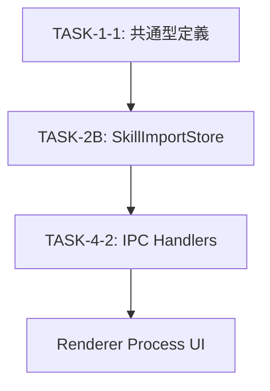

# IPC連携要件定義: TASK-4-2（IPC Handlers）

## 概要

SkillImportStore と IPC Handlers（TASK-4-2）の連携要件を定義する。
ストアは Main Process で動作し、IPC Handler を通じて Renderer Process からアクセスされる。

---

## 1. アーキテクチャ概要

```
┌─────────────────────────────────────────────────────────┐
│                    Renderer Process                      │
│  ┌─────────────────────────────────────────────────┐    │
│  │            React Components (UI)                 │    │
│  │     - SkillImportPanel                          │    │
│  │     - SkillSettingsDialog                       │    │
│  │     - PermissionPrompt                          │    │
│  └───────────────────────────────────────────────────┘    │
│                           │                              │
│                    ipcRenderer.invoke()                   │
│                           ↓                              │
├─────────────────────────── IPC ──────────────────────────┤
│                           ↓                              │
│  ┌───────────────────────────────────────────────────┐    │
│  │          IPC Handlers (TASK-4-2)                  │    │
│  │  - skill:getImported                             │    │
│  │  - skill:addImport                               │    │
│  │  - skill:removeImport                            │    │
│  │  - skill:getSettings / updateSettings            │    │
│  │  - skill:rememberPermission                      │    │
│  │  - skill:cache operations                        │    │
│  └───────────────────────────────────────────────────┘    │
│                           │                              │
│                    直接呼び出し（同期）                    │
│                           ↓                              │
│  ┌───────────────────────────────────────────────────┐    │
│  │        SkillImportStore (TASK-2B)                 │    │
│  │  - getImported()                                 │    │
│  │  - addImport()                                   │    │
│  │  - removeImport()                                │    │
│  │  - getSettings() / updateSettings()              │    │
│  │  - rememberPermission()                          │    │
│  │  - setCache() / getCache()                       │    │
│  └───────────────────────────────────────────────────┘    │
│                           │                              │
│                    electron-store                        │
│                           ↓                              │
│  ┌───────────────────────────────────────────────────┐    │
│  │          skill-imports.json                       │    │
│  │  (永続化ファイル)                                 │    │
│  └───────────────────────────────────────────────────┘    │
│                                                          │
│                    Main Process                          │
└─────────────────────────────────────────────────────────┘
```

---

## 2. 同期/非同期動作の決定

### 2.1 ストアメソッドの動作

| メソッド                  | 動作 | 理由                          |
| ------------------------- | ---- | ----------------------------- |
| getImported()             | 同期 | electron-store は同期読み込み |
| addImport()               | 同期 | electron-store は同期書き込み |
| removeImport()            | 同期 | electron-store は同期書き込み |
| exists()                  | 同期 | メモリ内データの確認          |
| updateLastUsed()          | 同期 | electron-store は同期書き込み |
| getSettings()             | 同期 | electron-store は同期読み込み |
| updateSettings()          | 同期 | electron-store は同期書き込み |
| rememberPermission()      | 同期 | electron-store は同期書き込み |
| getRememberedPermission() | 同期 | electron-store は同期読み込み |
| setCache()                | 同期 | electron-store は同期書き込み |
| getCache()                | 同期 | electron-store は同期読み込み |
| invalidateCache()         | 同期 | electron-store は同期書き込み |

### 2.2 IPC Handler の動作

```typescript
// IPC Handler は常に Promise を返す
// electron の ipcMain.handle() の仕様

ipcMain.handle("skill:getImported", async () => {
  // 同期メソッドを呼び出すが、IPC は非同期
  return skillImportStore.getImported();
});

ipcMain.handle("skill:addImport", async (_, skillName: string) => {
  skillImportStore.addImport(skillName);
  return { success: true };
});
```

---

## 3. IPC チャンネル定義

### 3.1 チャンネル名規約

```typescript
// プレフィックス: 'skill:'
// 形式: 'skill:{action}'

const SKILL_IPC_CHANNELS = {
  // インポート管理
  GET_IMPORTED: "skill:getImported",
  ADD_IMPORT: "skill:addImport",
  REMOVE_IMPORT: "skill:removeImport",
  EXISTS: "skill:exists",
  UPDATE_LAST_USED: "skill:updateLastUsed",

  // 設定管理
  GET_SETTINGS: "skill:getSettings",
  UPDATE_SETTINGS: "skill:updateSettings",

  // 権限管理
  REMEMBER_PERMISSION: "skill:rememberPermission",
  GET_REMEMBERED_PERMISSION: "skill:getRememberedPermission",

  // キャッシュ管理
  SET_CACHE: "skill:setCache",
  GET_CACHE: "skill:getCache",
  INVALIDATE_CACHE: "skill:invalidateCache",
} as const;
```

### 3.2 リクエスト/レスポンス型

```typescript
// packages/shared/src/types/skill-ipc.ts（将来定義）

// インポート管理
interface GetImportedResponse {
  skills: ImportedSkillData[];
}

interface AddImportRequest {
  skillName: string;
}

interface AddImportResponse {
  success: boolean;
  error?: string;
}

interface RemoveImportRequest {
  skillName: string;
}

interface RemoveImportResponse {
  success: boolean;
}

interface ExistsRequest {
  skillName: string;
}

interface ExistsResponse {
  exists: boolean;
}

// 設定管理
interface GetSettingsRequest {
  skillName: string;
}

interface GetSettingsResponse {
  settings: SkillSettings;
}

interface UpdateSettingsRequest {
  skillName: string;
  settings: Partial<SkillSettings>;
}

interface UpdateSettingsResponse {
  success: boolean;
}

// 権限管理
interface RememberPermissionRequest {
  skillName: string;
  toolName: string;
  decision: "allow" | "deny";
}

interface RememberPermissionResponse {
  success: boolean;
}

interface GetRememberedPermissionRequest {
  skillName: string;
  toolName: string;
}

interface GetRememberedPermissionResponse {
  permission: "allow" | "deny" | null;
}

// キャッシュ管理
interface SetCacheRequest {
  skillName: string;
  metadata: SkillMetadata;
}

interface SetCacheResponse {
  success: boolean;
}

interface GetCacheRequest {
  skillName: string;
}

interface GetCacheResponse {
  metadata: SkillMetadata | null;
  cachedAt: string | null;
}

interface InvalidateCacheRequest {
  skillName: string;
}

interface InvalidateCacheResponse {
  success: boolean;
}
```

---

## 4. エラーハンドリング方針

### 4.1 エラー分類

| エラー種別      | 発生箇所   | 対応             |
| --------------- | ---------- | ---------------- |
| ValidationError | ストア/IPC | 入力検証エラー   |
| StoreError      | ストア     | ストア操作エラー |
| IPCError        | IPC        | 通信エラー       |

### 4.2 エラーコード定義

```typescript
// error-handling.md に準拠

const SKILL_STORE_ERRORS = {
  // Validation Error (1000-1999)
  INVALID_SKILL_NAME: "ERR_1001", // スキル名が不正
  SKILL_NOT_FOUND: "ERR_2001", // スキルが見つからない（Business Error）
  SKILL_ALREADY_EXISTS: "ERR_2003", // スキルが既に存在（Business Error）

  // Internal Error (5000-5999)
  STORE_READ_ERROR: "ERR_5001", // ストア読み込みエラー
  STORE_WRITE_ERROR: "ERR_5001", // ストア書き込みエラー
} as const;
```

### 4.3 IPC レスポンスへのエラー変換

```typescript
// IPC Handler でのエラーハンドリング

ipcMain.handle("skill:addImport", async (_, skillName: string) => {
  try {
    // バリデーション
    if (!skillName || typeof skillName !== "string") {
      return {
        success: false,
        error: {
          code: "ERR_1001",
          message: "Invalid skill name",
        },
      };
    }

    // 重複チェック
    if (skillImportStore.exists(skillName)) {
      return {
        success: false,
        error: {
          code: "ERR_2003",
          message: "Skill already imported",
        },
      };
    }

    skillImportStore.addImport(skillName);
    return { success: true };
  } catch (error) {
    // 予期しないエラー
    return {
      success: false,
      error: {
        code: "ERR_5001",
        message: error instanceof Error ? error.message : "Unknown error",
      },
    };
  }
});
```

---

## 5. 型の共有方法

### 5.1 型定義ファイルの配置

```
packages/shared/src/types/
├── skill.ts              # 既存: SkillMetadata, ImportedSkill 等
├── skill-store.ts        # 新規: ImportedSkillData, SkillSettings
└── skill-ipc.ts          # 新規: IPC リクエスト/レスポンス型
```

### 5.2 エクスポート

```typescript
// packages/shared/src/types/index.ts

export type {
  // skill.ts
  SkillMetadata,
  ImportedSkill,

  // skill-store.ts
  ImportedSkillData,
  SkillSettings,
  SkillStoreSchema,

  // skill-ipc.ts
  GetImportedResponse,
  AddImportRequest,
  // ...
} from "./skill";
```

---

## 6. テスト分離境界

### 6.1 単体テスト（ストア）

```typescript
// apps/desktop/src/main/settings/__tests__/skillImportStore.test.ts

describe("SkillImportStore", () => {
  // ストアの単体テスト
  // - CRUD操作
  // - 設定管理
  // - 権限記憶
  // - キャッシュ管理
  // - マイグレーション
});
```

**テスト範囲**:

- ストアメソッドの動作
- デフォルト値の適用
- バリデーション
- マイグレーション

**モック不要**:

- electron-store（実際のファイル I/O をテスト）

### 6.2 統合テスト（IPC）

```typescript
// apps/desktop/src/__tests__/skill-ipc.integration.test.ts

describe("Skill IPC Handlers", () => {
  // IPC Handler の統合テスト
  // - ストアとの連携
  // - エラーハンドリング
  // - レスポンス形式
});
```

**テスト範囲**:

- IPC チャンネルの登録
- リクエスト/レスポンスの形式
- エラー伝播
- ストアとの連携

**モック対象**:

- `ipcMain.handle()` / `ipcRenderer.invoke()`

---

## 7. 連携インターフェースまとめ

### 7.1 ストア → IPC Handler

| ストアメソッド            | IPC Handler 呼び出し | 戻り値変換                  |
| ------------------------- | -------------------- | --------------------------- |
| getImported()             | 直接呼び出し         | 配列をそのまま返却          |
| addImport()               | 直接呼び出し         | { success: true }           |
| removeImport()            | 直接呼び出し         | { success: true }           |
| exists()                  | 直接呼び出し         | { exists: boolean }         |
| getSettings()             | 直接呼び出し         | { settings: SkillSettings } |
| updateSettings()          | 直接呼び出し         | { success: true }           |
| rememberPermission()      | 直接呼び出し         | { success: true }           |
| getRememberedPermission() | 直接呼び出し         | { permission: ... }         |
| setCache()                | 直接呼び出し         | { success: true }           |
| getCache()                | 直接呼び出し         | { metadata: ... }           |
| invalidateCache()         | 直接呼び出し         | { success: true }           |

### 7.2 依存関係



---

## 8. 結論

### 8.1 決定事項

| 項目                 | 決定                              |
| -------------------- | --------------------------------- |
| ストアメソッドの動作 | 全て同期                          |
| IPC Handler の動作   | 非同期（ipcMain.handle 仕様）     |
| エラーハンドリング   | error-handling.md に準拠          |
| 型共有               | packages/shared/src/types/ で定義 |
| テスト分離           | ストア単体テスト / IPC 統合テスト |

### 8.2 TASK-4-2 への引き継ぎ事項

1. **IPC チャンネル定義**: `SKILL_IPC_CHANNELS` を使用
2. **リクエスト/レスポンス型**: 本ドキュメントの型定義を参照
3. **エラーハンドリング**: エラーコードと変換パターンを踏襲
4. **テスト**: 統合テストで本ストアとの連携を検証
