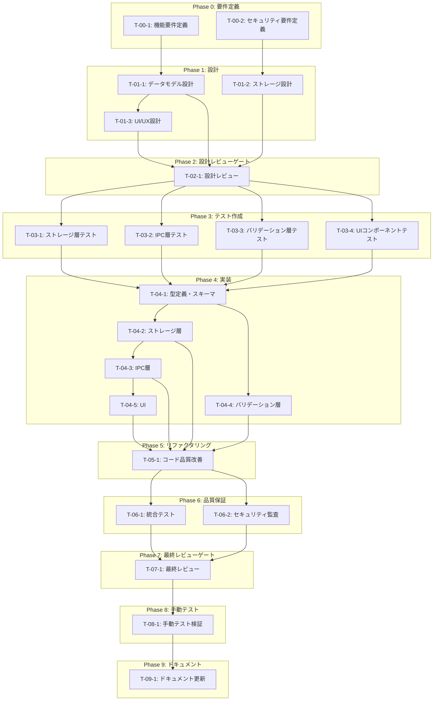

# AIプロバイダーAPIキー管理システム - タスク実行仕様書

## ユーザーからの元の指示

```
AIプロバイダーAPIキー管理システムの実装。ユーザーがUIからAPIキーを登録・更新・削除でき、
Electron safeStorageに暗号化保存され、APIキーの有効性を検証できるシステムを構築する。
```

## メタ情報

| 項目             | 内容                              |
| ---------------- | --------------------------------- |
| タスクID         | TASK-USER-DATA-01                 |
| タスク名         | AIプロバイダーAPIキー管理システム |
| 分類             | 新規機能                          |
| 対象機能         | ユーザーデータ永続化              |
| 優先度           | 高                                |
| 見積もり規模     | 中規模                            |
| ステータス       | ✅ 完了                           |
| 完了日           | 2025-12-10                        |
| 発見元           | ユーザー要件                      |
| 発見日           | 2025-12-10                        |
| 発見エージェント | タスク分解プロンプト              |

---

## タスク概要

### 目的

ユーザーのAIプロバイダーAPIキー（OpenAI、Anthropic、Google、xAI）を安全に永続化し、セッションをまたいで利用できるようにする。

### 背景

AIWorkflowOrchestratorは複数のAIプロバイダーと連携してワークフローを実行する。現在はAPIキーの安全な永続化機構が未実装のため、セッションごとにユーザーがAPIキーを再入力する必要があり、ユーザー体験が著しく低下している。また、APIキーの不適切な保存によるセキュリティリスクも存在する。

### 最終ゴール

- ユーザーがUIからAPIキーを登録・更新・削除できる
- APIキーがセキュアストレージ（Electron safeStorage）に暗号化保存される
- APIキーの有効性を各プロバイダーAPIで検証できる
- オフライン時もローカル保存されたキーを使用可能

### 成果物一覧

| 種別         | 成果物                   | 配置先                                                         |
| ------------ | ------------------------ | -------------------------------------------------------------- |
| 機能         | APIキー管理IPCハンドラー | `apps/desktop/src/main/ipc/apiKeyHandlers.ts`                  |
| 機能         | APIキーストレージ        | `apps/desktop/src/main/infrastructure/apiKeyStorage.ts`        |
| 機能         | APIキー検証サービス      | `packages/shared/infrastructure/ai/apiKeyValidator.ts`         |
| UI           | APIキー設定画面          | `apps/desktop/src/renderer/views/SettingsView/ApiKeysSection/` |
| 型定義       | APIキー型定義            | `packages/shared/types/api-keys.ts`                            |
| テスト       | ユニットテスト           | 各ファイルの`__tests__/`ディレクトリ                           |
| ドキュメント | 設定手順書               | `docs/30-workflows/api-key-management/`                        |

---

## 参照ファイル

本仕様書のコマンド・エージェント・スキル選定は以下を参照：

- `docs/00-requirements/master_system_design.md` - システム要件
- `.claude/commands/ai/command_list.md` - /ai:コマンド定義
- `.claude/agents/agent_list.md` - エージェント定義
- `.claude/skills/skill_list.md` - スキル定義

---

## タスク分解サマリー

| ID     | フェーズ | サブタスク名               | 責務                         | 依存    |
| ------ | -------- | -------------------------- | ---------------------------- | ------- |
| T-00-1 | Phase 0  | 機能要件定義               | 機能要件の明確化             | -       |
| T-00-2 | Phase 0  | セキュリティ要件定義       | 非機能要件（セキュリティ）   | -       |
| T-01-1 | Phase 1  | データモデル設計           | 型定義・スキーマ設計         | T-00-1  |
| T-01-2 | Phase 1  | ストレージ設計             | セキュアストレージ・IPC設計  | T-00-2  |
| T-01-3 | Phase 1  | UI/UX設計                  | 設定画面UI設計               | T-01-1  |
| T-02-1 | Phase 2  | 設計レビュー               | 設計の妥当性検証             | T-01-\* |
| T-03-1 | Phase 3  | ストレージ層テスト作成     | safeStorageテスト            | T-02-1  |
| T-03-2 | Phase 3  | IPC層テスト作成            | IPCハンドラーテスト          | T-02-1  |
| T-03-3 | Phase 3  | バリデーション層テスト作成 | APIキー検証テスト            | T-02-1  |
| T-03-4 | Phase 3  | UIコンポーネントテスト作成 | コンポーネントテスト         | T-02-1  |
| T-04-1 | Phase 4  | 型定義・スキーマ実装       | APIキー型・Zodスキーマ       | T-03-\* |
| T-04-2 | Phase 4  | ストレージ層実装           | 暗号化ストレージ実装         | T-04-1  |
| T-04-3 | Phase 4  | IPC層実装                  | IPCハンドラー実装            | T-04-2  |
| T-04-4 | Phase 4  | バリデーション層実装       | 各プロバイダー検証ロジック   | T-04-1  |
| T-04-5 | Phase 4  | UI実装                     | 設定画面コンポーネント       | T-04-3  |
| T-05-1 | Phase 5  | コード品質改善             | リファクタリング             | T-04-\* |
| T-06-1 | Phase 6  | 統合テスト実行             | 全テスト実行・カバレッジ確認 | T-05-1  |
| T-06-2 | Phase 6  | セキュリティ監査           | セキュリティ観点での検証     | T-05-1  |
| T-07-1 | Phase 7  | 最終レビュー               | 品質・整合性検証             | T-06-\* |
| T-08-1 | Phase 8  | 手動テスト                 | ユーザー視点での動作確認     | T-07-1  |
| T-09-1 | Phase 9  | ドキュメント更新           | システムドキュメント更新     | T-08-1  |

**総サブタスク数**: 21個

---

## 実行フロー図



---

## Phase 0: 要件定義

### T-00-1: 機能要件定義

#### 目的

APIキー管理機能の機能要件を明確化し、受け入れ基準を定義する。

#### 背景

「何を作るか」の定義が曖昧なままでは、手戻りが大量発生する。要件を検証可能な形式で定義することで、実装の方向性を明確にする。

#### 責務（単一責務）

機能要件の定義のみを担当する。

#### Claude Code スラッシュコマンド

> ⚠️ 以下はターミナルコマンドではなく、Claude Code内で実行するスラッシュコマンドです

```
/ai:gather-requirements api-key-management
```

- **参照**: `.claude/commands/ai/command_list.md`

#### 使用エージェント

- **エージェント**: `.claude/agents/req-analyst.md`
- **選定理由**: 要求工学の専門家として、曖昧な要望を検証可能な要件に変換できる
- **参照**: `.claude/agents/agent_list.md`

#### 活用スキル

| スキル名                               | 活用方法                              |
| -------------------------------------- | ------------------------------------- |
| .claude/skills/requirements-engineering/SKILL.md               | MoSCoW優先度でAPIキー管理要件を整理   |
| .claude/skills/acceptance-criteria-writing/SKILL.md            | Given-When-Then形式で受け入れ基準定義 |
| .claude/skills/functional-non-functional-requirements/SKILL.md | 機能要件の明確化                      |

- **参照**: `.claude/skills/skill_list.md`

#### 成果物

| 成果物     | パス                                                   | 内容         |
| ---------- | ------------------------------------------------------ | ------------ |
| 要件定義書 | `docs/30-workflows/api-key-management/requirements.md` | 機能要件定義 |

#### 完了条件

- [ ] 対応AIプロバイダー一覧の確定（OpenAI、Anthropic、Google、xAI）
- [ ] 各操作（登録・取得・削除・検証・一覧）の要件定義
- [ ] 受け入れ基準の定義完了

#### 依存関係

- **前提**: なし
- **後続**: T-01-1

---

### T-00-2: セキュリティ要件定義

#### 目的

APIキー管理機能のセキュリティ要件を明確化する。

#### 背景

APIキーの漏洩はクラウド破産や情報漏洩につながる重大なリスクとなる。セキュリティ要件を事前に明確化することで、安全な実装を担保する。

#### 責務（単一責務）

セキュリティ要件（非機能要件）の定義のみを担当する。

#### Claude Code スラッシュコマンド

> ⚠️ 以下はターミナルコマンドではなく、Claude Code内で実行するスラッシュコマンドです

```
/ai:gather-requirements api-key-security
```

- **参照**: `.claude/commands/ai/command_list.md`

#### 使用エージェント

- **エージェント**: `.claude/agents/req-analyst.md`
- **選定理由**: 非機能要件（セキュリティ）の定義に精通
- **参照**: `.claude/agents/agent_list.md`

#### 活用スキル

| スキル名                               | 活用方法                   |
| -------------------------------------- | -------------------------- |
| .claude/skills/functional-non-functional-requirements/SKILL.md | セキュリティNFRの明確化    |
| .claude/skills/acceptance-criteria-writing/SKILL.md            | セキュリティ要件の検証基準 |

- **参照**: `.claude/skills/skill_list.md`

#### 成果物

| 成果物             | パス                                                            | 内容             |
| ------------------ | --------------------------------------------------------------- | ---------------- |
| セキュリティ要件書 | `docs/30-workflows/api-key-management/security-requirements.md` | セキュリティ要件 |

#### 完了条件

- [ ] 暗号化要件の明文化
- [ ] アクセス制御要件の定義
- [ ] ログ出力からの機密情報漏洩防止要件

#### 依存関係

- **前提**: なし
- **後続**: T-01-2

---

## Phase 1: 設計

### T-01-1: データモデル設計

#### 目的

APIキーの保存形式とデータ構造を設計する。

#### 背景

データモデルはシステムの基盤となる。TypeScriptの型安全性を活かした設計により、実装時のバグを予防する。

#### 責務（単一責務）

APIキーエンティティの型定義とZodスキーマ設計のみを担当する。

#### Claude Code スラッシュコマンド

> ⚠️ 以下はターミナルコマンドではなく、Claude Code内で実行するスラッシュコマンドです

```
/ai:design-domain-model api-key
```

- **参照**: `.claude/commands/ai/command_list.md`

#### 使用エージェント

- **エージェント**: `.claude/agents/domain-modeler.md`
- **選定理由**: DDDに基づいたデータモデル設計の専門家
- **参照**: `.claude/agents/agent_list.md`

#### 活用スキル

| スキル名              | 活用方法                           |
| --------------------- | ---------------------------------- |
| .claude/skills/domain-driven-design/SKILL.md  | エンティティと値オブジェクトの定義 |
| .claude/skills/value-object-patterns/SKILL.md | APIキーの不変性保証                |
| .claude/skills/type-safety-patterns/SKILL.md  | TypeScript厳格型定義               |

- **参照**: `.claude/skills/skill_list.md`

#### 成果物

| 成果物       | パス                                                 | 内容             |
| ------------ | ---------------------------------------------------- | ---------------- |
| 型定義設計書 | `docs/30-workflows/api-key-management/data-model.md` | データモデル設計 |

#### 完了条件

- [ ] AIプロバイダー列挙型の定義
- [ ] APIキーエンティティ型の定義
- [ ] Zodバリデーションスキーマ設計

#### 依存関係

- **前提**: T-00-1
- **後続**: T-01-3, T-02-1

---

### T-01-2: ストレージ設計

#### 目的

セキュアストレージの設計とIPC通信フローを定義する。

#### 背景

Electronではmain/rendererプロセス間のセキュアな通信が必須。safeStorage APIを活用した暗号化保存とIPC設計を行う。

#### 責務（単一責務）

セキュアストレージ層とIPC通信の設計のみを担当する。

#### Claude Code スラッシュコマンド

> ⚠️ 以下はターミナルコマンドではなく、Claude Code内で実行するスラッシュコマンドです

```
/ai:design-architecture secure-storage
```

- **参照**: `.claude/commands/ai/command_list.md`

#### 使用エージェント

- **エージェント**: `.claude/agents/electron-architect.md`
- **選定理由**: Electronアーキテクチャ設計とセキュリティの専門家
- **参照**: `.claude/agents/agent_list.md`

#### 活用スキル

| スキル名                    | 活用方法                   |
| --------------------------- | -------------------------- |
| .claude/skills/electron-architecture/SKILL.md       | Main/Renderer分離とIPC設計 |
| .claude/skills/electron-security-hardening/SKILL.md | セキュアストレージ設計     |

- **参照**: `.claude/skills/skill_list.md`

#### 成果物

| 成果物 | パス                                                   | 内容           |
| ------ | ------------------------------------------------------ | -------------- |
| 設計書 | `docs/30-workflows/api-key-management/architecture.md` | ストレージ設計 |

#### 完了条件

- [ ] IPCチャネル設計完了
- [ ] 暗号化フロー図作成
- [ ] エラーハンドリング設計

#### 依存関係

- **前提**: T-00-2
- **後続**: T-02-1

---

### T-01-3: UI/UX設計

#### 目的

APIキー設定画面のUI/UXを設計する。

#### 背景

ユーザーがセキュリティを意識せずに安全にAPIキーを管理できるUIが必要。マスク表示やコピー防止などのセキュリティ対策を組み込んだ設計を行う。

#### 責務（単一責務）

設定画面のUI/UX設計のみを担当する。

#### Claude Code スラッシュコマンド

> ⚠️ 以下はターミナルコマンドではなく、Claude Code内で実行するスラッシュコマンドです

```
/ai:create-component ApiKeySettings organism
```

- **参照**: `.claude/commands/ai/command_list.md`

#### 使用エージェント

- **エージェント**: `.claude/agents/ui-designer.md`
- **選定理由**: UIコンポーネント設計とアクセシビリティの専門家
- **参照**: `.claude/agents/agent_list.md`

#### 活用スキル

| スキル名                   | 活用方法               |
| -------------------------- | ---------------------- |
| .claude/skills/design-system-architecture/SKILL.md | デザイントークン適用   |
| .claude/skills/accessibility-wcag/SKILL.md         | WCAG準拠のフォーム設計 |
| .claude/skills/apple-hig-guidelines/SKILL.md       | macOS向けUI最適化      |

- **参照**: `.claude/skills/skill_list.md`

#### 成果物

| 成果物   | パス                                                | 内容                 |
| -------- | --------------------------------------------------- | -------------------- |
| UI設計書 | `docs/30-workflows/api-key-management/ui-design.md` | 画面設計・操作フロー |

#### 完了条件

- [ ] ワイヤーフレーム作成
- [ ] コンポーネント構成図
- [ ] マスク表示仕様定義
- [ ] 検証ステータス表示仕様

#### 依存関係

- **前提**: T-01-1
- **後続**: T-02-1

---

## Phase 2: 設計レビューゲート

### T-02-1: 設計レビュー

#### 目的

実装開始前に設計の妥当性を複数エージェントで検証する。

#### 背景

設計ミスが実装後に発見されると修正コストが大幅に増加する。「Shift Left」原則に基づき、問題を可能な限り早期に検出する。

#### レビュー参加エージェント

| エージェント       | レビュー観点         | 選定理由                       |
| ------------------ | -------------------- | ------------------------------ |
| .claude/agents/arch-police.md       | アーキテクチャ整合性 | Clean Architecture原則遵守確認 |
| .claude/agents/sec-auditor.md       | セキュリティ設計     | 暗号化・アクセス制御の適切性   |
| .claude/agents/electron-security.md | Electronセキュリティ | safeStorage実装の安全性        |
| .claude/agents/domain-modeler.md    | ドメインモデル妥当性 | エンティティ設計の適切性       |

- **参照**: `.claude/agents/agent_list.md`

#### レビューチェックリスト

**アーキテクチャ整合性** (.claude/agents/arch-police.md)

- [ ] レイヤー違反がないか
- [ ] 依存関係逆転の原則(DIP)が守られているか
- [ ] 既存設計との整合性

**セキュリティ設計** (.claude/agents/sec-auditor.md)

- [ ] 暗号化方式の適切性
- [ ] アクセス制御の設計
- [ ] ログ出力からの機密情報漏洩防止

**Electronセキュリティ** (.claude/agents/electron-security.md)

- [ ] safeStorageの正しい使用
- [ ] IPC通信の安全性
- [ ] Renderer側からの直接アクセス防止

**ドメインモデル妥当性** (.claude/agents/domain-modeler.md)

- [ ] エンティティ・値オブジェクトの境界が適切か
- [ ] ドメインルールが正しく表現されているか

#### レビュー結果判定

- **PASS**: 全レビュー観点で問題なし → Phase 3へ進行
- **MINOR**: 軽微な指摘あり → 指摘対応後Phase 3へ進行
- **MAJOR**: 重大な問題あり → 影響範囲に応じて戻り先を決定

#### 戻り先決定基準

| 問題の種類 | 戻り先              |
| ---------- | ------------------- |
| 要件の問題 | Phase 0（要件定義） |
| 設計の問題 | Phase 1（設計）     |

#### 完了条件

- [ ] 全レビュー観点でPASS判定
- [ ] 指摘事項の対応完了

#### 依存関係

- **前提**: T-01-1, T-01-2, T-01-3
- **後続**: T-03-1, T-03-2, T-03-3, T-03-4

---

## Phase 3: テスト作成 (TDD: Red)

### T-03-1: ストレージ層テスト作成

#### 目的

APIキーストレージのテストを作成し、Red状態を確認する。

#### 背景

TDDの原則に従い、実装より先にテストを作成することで、期待される動作を明確にする。

#### 責務（単一責務）

safeStorageを使用したストレージ層のテスト作成のみを担当する。

#### Claude Code スラッシュコマンド

> ⚠️ 以下はターミナルコマンドではなく、Claude Code内で実行するスラッシュコマンドです

```
/ai:generate-unit-tests apps/desktop/src/main/infrastructure/apiKeyStorage.ts
```

- **参照**: `.claude/commands/ai/command_list.md`

#### 使用エージェント

- **エージェント**: `.claude/agents/unit-tester.md`
- **選定理由**: TDD原則に基づいたテスト作成の専門家
- **参照**: `.claude/agents/agent_list.md`

#### 活用スキル

| スキル名                | 活用方法                   |
| ----------------------- | -------------------------- |
| .claude/skills/tdd-principles/SKILL.md          | Red-Green-Refactorサイクル |
| .claude/skills/test-doubles/SKILL.md            | safeStorageのモック作成    |
| .claude/skills/boundary-value-analysis/SKILL.md | エッジケーステスト         |

- **参照**: `.claude/skills/skill_list.md`

#### 成果物

| 成果物         | パス                                                                   | 内容           |
| -------------- | ---------------------------------------------------------------------- | -------------- |
| テストファイル | `apps/desktop/src/main/infrastructure/__tests__/apiKeyStorage.test.ts` | ユニットテスト |

#### TDD検証: Red状態確認

```bash
pnpm --filter @repo/desktop test:run apiKeyStorage
```

- [ ] テストが失敗することを確認（Red状態）

#### 完了条件

- [ ] 保存テスト作成
- [ ] 取得テスト作成
- [ ] 削除テスト作成
- [ ] 暗号化テスト作成
- [ ] 一覧取得テスト作成

#### 依存関係

- **前提**: T-02-1
- **後続**: T-04-1

---

### T-03-2: IPC層テスト作成

#### 目的

APIキーIPCハンドラーのテストを作成する。

#### 背景

IPC層はmain/renderer間の通信を担う重要なレイヤー。適切なテストにより、通信の信頼性を担保する。

#### 責務（単一責務）

IPCハンドラーのテスト作成のみを担当する。

#### Claude Code スラッシュコマンド

> ⚠️ 以下はターミナルコマンドではなく、Claude Code内で実行するスラッシュコマンドです

```
/ai:generate-unit-tests apps/desktop/src/main/ipc/apiKeyHandlers.ts
```

- **参照**: `.claude/commands/ai/command_list.md`

#### 使用エージェント

- **エージェント**: `.claude/agents/unit-tester.md`
- **参照**: `.claude/agents/agent_list.md`

#### 活用スキル

| スキル名        | 活用方法         |
| --------------- | ---------------- |
| .claude/skills/tdd-principles/SKILL.md  | テストファースト |
| .claude/skills/test-doubles/SKILL.md    | IPCのモック作成  |
| .claude/skills/vitest-advanced/SKILL.md | 非同期テスト     |

- **参照**: `.claude/skills/skill_list.md`

#### 成果物

| 成果物         | パス                                                         | 内容      |
| -------------- | ------------------------------------------------------------ | --------- |
| テストファイル | `apps/desktop/src/main/ipc/__tests__/apiKeyHandlers.test.ts` | IPCテスト |

#### TDD検証: Red状態確認

```bash
pnpm --filter @repo/desktop test:run apiKeyHandlers
```

- [ ] テストが失敗することを確認（Red状態）

#### 完了条件

- [ ] apiKey:save ハンドラーテスト
- [ ] apiKey:get ハンドラーテスト
- [ ] apiKey:delete ハンドラーテスト
- [ ] apiKey:validate ハンドラーテスト
- [ ] apiKey:list ハンドラーテスト
- [ ] エラーハンドリングテスト

#### 依存関係

- **前提**: T-02-1
- **後続**: T-04-1

---

### T-03-3: バリデーション層テスト作成

#### 目的

APIキー検証サービスのテストを作成する。

#### 背景

各AIプロバイダーのAPIキー検証ロジックは、外部APIとの通信を伴う。モックを活用した信頼性の高いテストを作成する。

#### 責務（単一責務）

APIキー検証サービスのテスト作成のみを担当する。

#### Claude Code スラッシュコマンド

> ⚠️ 以下はターミナルコマンドではなく、Claude Code内で実行するスラッシュコマンドです

```
/ai:generate-unit-tests packages/shared/infrastructure/ai/apiKeyValidator.ts
```

- **参照**: `.claude/commands/ai/command_list.md`

#### 使用エージェント

- **エージェント**: `.claude/agents/unit-tester.md`
- **参照**: `.claude/agents/agent_list.md`

#### 活用スキル

| スキル名                | 活用方法            |
| ----------------------- | ------------------- |
| .claude/skills/tdd-principles/SKILL.md          | テストファースト    |
| .claude/skills/test-doubles/SKILL.md            | 外部APIのモック作成 |
| .claude/skills/boundary-value-analysis/SKILL.md | 無効なキーのテスト  |

- **参照**: `.claude/skills/skill_list.md`

#### 成果物

| 成果物         | パス                                                                  | 内容                 |
| -------------- | --------------------------------------------------------------------- | -------------------- |
| テストファイル | `packages/shared/infrastructure/ai/__tests__/apiKeyValidator.test.ts` | バリデーションテスト |

#### TDD検証: Red状態確認

```bash
pnpm --filter @repo/shared test:run apiKeyValidator
```

- [ ] テストが失敗することを確認（Red状態）

#### 完了条件

- [ ] OpenAI検証テスト（正常系・異常系）
- [ ] Anthropic検証テスト（正常系・異常系）
- [ ] Google検証テスト（正常系・異常系）
- [ ] xAI検証テスト（正常系・異常系）
- [ ] ネットワークエラーテスト

#### 依存関係

- **前提**: T-02-1
- **後続**: T-04-1

---

### T-03-4: UIコンポーネントテスト作成

#### 目的

APIキー設定画面のUIコンポーネントテストを作成する。

#### 背景

UIコンポーネントはユーザーとのインタラクションを担う。Testing Libraryを活用し、ユーザー視点のテストを作成する。

#### 責務（単一責務）

UIコンポーネントのテスト作成のみを担当する。

#### Claude Code スラッシュコマンド

> ⚠️ 以下はターミナルコマンドではなく、Claude Code内で実行するスラッシュコマンドです

```
/ai:generate-component-tests apps/desktop/src/renderer/views/SettingsView/ApiKeysSection
```

- **参照**: `.claude/commands/ai/command_list.md`

#### 使用エージェント

- **エージェント**: `.claude/agents/frontend-tester.md`
- **選定理由**: フロントエンドテスト戦略の専門家
- **参照**: `.claude/agents/agent_list.md`

#### 活用スキル

| スキル名           | 活用方法               |
| ------------------ | ---------------------- |
| .claude/skills/tdd-principles/SKILL.md     | テストファースト       |
| .claude/skills/accessibility-wcag/SKILL.md | アクセシビリティテスト |

- **参照**: `.claude/skills/skill_list.md`

#### 成果物

| 成果物         | パス                                                                               | 内容                 |
| -------------- | ---------------------------------------------------------------------------------- | -------------------- |
| テストファイル | `apps/desktop/src/renderer/views/SettingsView/ApiKeysSection/__tests__/*.test.tsx` | コンポーネントテスト |

#### TDD検証: Red状態確認

```bash
pnpm --filter @repo/desktop test:run ApiKeysSection
```

- [ ] テストが失敗することを確認（Red状態）

#### 完了条件

- [ ] APIキー入力フォームテスト
- [ ] キー一覧表示テスト（マスク処理）
- [ ] 削除確認ダイアログテスト
- [ ] 検証ステータス表示テスト
- [ ] アクセシビリティテスト

#### 依存関係

- **前提**: T-02-1
- **後続**: T-04-1

---

## Phase 4: 実装 (TDD: Green)

### T-04-1: 型定義・スキーマ実装

#### 目的

APIキー関連の型定義とZodスキーマを実装する。

#### 背景

型定義は実装の基盤となる。TypeScriptの厳格な型システムとZodのランタイム検証を組み合わせ、型安全性を担保する。

#### 責務（単一責務）

型定義とZodスキーマの実装のみを担当する。

#### Claude Code スラッシュコマンド

> ⚠️ 以下はターミナルコマンドではなく、Claude Code内で実行するスラッシュコマンドです

```
/ai:create-schema api-key
```

- **参照**: `.claude/commands/ai/command_list.md`

#### 使用エージェント

- **エージェント**: `.claude/agents/schema-def.md`
- **選定理由**: Zodスキーマ定義の専門家
- **参照**: `.claude/agents/agent_list.md`

#### 活用スキル

| スキル名             | 活用方法            |
| -------------------- | ------------------- |
| .claude/skills/zod-validation/SKILL.md       | APIキースキーマ定義 |
| .claude/skills/type-safety-patterns/SKILL.md | 厳格な型安全性確保  |

- **参照**: `.claude/skills/skill_list.md`

#### 成果物

| 成果物 | パス                                | 内容                   |
| ------ | ----------------------------------- | ---------------------- |
| 型定義 | `packages/shared/types/api-keys.ts` | APIキー型・Zodスキーマ |

#### TDD検証: Green状態確認

```bash
pnpm --filter @repo/shared test:run
```

- [ ] 型定義関連のテストが成功することを確認（Green状態）

#### 完了条件

- [ ] AIプロバイダー列挙型
- [ ] APIキーエンティティ型
- [ ] Zodバリデーションスキーマ
- [ ] IPC通信用DTO型

#### 依存関係

- **前提**: T-03-1, T-03-2, T-03-3, T-03-4
- **後続**: T-04-2, T-04-4

---

### T-04-2: ストレージ層実装

#### 目的

セキュアストレージ層を実装する。

#### 背景

Electron safeStorage APIを使用してOSのキーチェーンに安全にAPIキーを保存する。

#### 責務（単一責務）

暗号化ストレージの実装のみを担当する。

#### Claude Code スラッシュコマンド

> ⚠️ 以下はターミナルコマンドではなく、Claude Code内で実行するスラッシュコマンドです

```
/ai:implement-business-logic api-key-storage
```

- **参照**: `.claude/commands/ai/command_list.md`

#### 使用エージェント

- **エージェント**: `.claude/agents/logic-dev.md`
- **選定理由**: ビジネスロジック実装の専門家
- **参照**: `.claude/agents/agent_list.md`

#### 活用スキル

| スキル名             | 活用方法           |
| -------------------- | ------------------ |
| .claude/skills/clean-code-practices/SKILL.md | 可読性の高いコード |
| .claude/skills/test-doubles/SKILL.md         | テスト容易性の確保 |

- **参照**: `.claude/skills/skill_list.md`

#### 成果物

| 成果物     | パス                                                    | 内容             |
| ---------- | ------------------------------------------------------- | ---------------- |
| ストレージ | `apps/desktop/src/main/infrastructure/apiKeyStorage.ts` | 暗号化ストレージ |

#### TDD検証: Green状態確認

```bash
pnpm --filter @repo/desktop test:run apiKeyStorage
```

- [ ] テストが成功することを確認（Green状態）

#### 完了条件

- [ ] safeStorage暗号化保存
- [ ] 復号化取得
- [ ] 削除処理
- [ ] 一覧取得（キー名のみ）

#### 依存関係

- **前提**: T-04-1
- **後続**: T-04-3, T-05-1

---

### T-04-3: IPC層実装

#### 目的

APIキー管理のIPCハンドラーを実装する。

#### 背景

Main ProcessとRenderer Process間の安全な通信を実現する。contextBridgeを使用してセキュアなAPI公開を行う。

#### 責務（単一責務）

IPCハンドラーとPreload APIの実装のみを担当する。

#### Claude Code スラッシュコマンド

> ⚠️ 以下はターミナルコマンドではなく、Claude Code内で実行するスラッシュコマンドです

```
/ai:implement-business-logic api-key-ipc
```

- **参照**: `.claude/commands/ai/command_list.md`

#### 使用エージェント

- **エージェント**: `.claude/agents/electron-architect.md`
- **選定理由**: ElectronのIPC設計に精通
- **参照**: `.claude/agents/agent_list.md`

#### 活用スキル

| スキル名              | 活用方法        |
| --------------------- | --------------- |
| .claude/skills/electron-architecture/SKILL.md | IPC通信パターン |

- **参照**: `.claude/skills/skill_list.md`

#### 成果物

| 成果物        | パス                                          | 内容        |
| ------------- | --------------------------------------------- | ----------- |
| IPCハンドラー | `apps/desktop/src/main/ipc/apiKeyHandlers.ts` | IPC実装     |
| Preload       | `apps/desktop/src/preload/apiKeyApi.ts`       | Preload API |

#### TDD検証: Green状態確認

```bash
pnpm --filter @repo/desktop test:run apiKeyHandlers
```

- [ ] テストが成功することを確認（Green状態）

#### 完了条件

- [ ] `apiKey:save` ハンドラー
- [ ] `apiKey:get` ハンドラー
- [ ] `apiKey:delete` ハンドラー
- [ ] `apiKey:validate` ハンドラー
- [ ] `apiKey:list` ハンドラー
- [ ] Preload API公開

#### 依存関係

- **前提**: T-04-2
- **後続**: T-04-5, T-05-1

---

### T-04-4: バリデーション層実装

#### 目的

各AIプロバイダーのAPIキー検証ロジックを実装する。

#### 背景

APIキーの有効性を保存前に検証することで、無効なキーによるエラーを予防する。

#### 責務（単一責務）

APIキー検証サービスの実装のみを担当する。

#### Claude Code スラッシュコマンド

> ⚠️ 以下はターミナルコマンドではなく、Claude Code内で実行するスラッシュコマンドです

```
/ai:create-api-gateway ai-provider-validator
```

- **参照**: `.claude/commands/ai/command_list.md`

#### 使用エージェント

- **エージェント**: `.claude/agents/gateway-dev.md`
- **選定理由**: 外部API連携の専門家
- **参照**: `.claude/agents/agent_list.md`

#### 活用スキル

| スキル名            | 活用方法                      |
| ------------------- | ----------------------------- |
| .claude/skills/api-client-patterns/SKILL.md | 各プロバイダーAPIクライアント |
| .claude/skills/retry-strategies/SKILL.md    | 検証リトライ処理              |

- **参照**: `.claude/skills/skill_list.md`

#### 成果物

| 成果物       | パス                                                   | 内容         |
| ------------ | ------------------------------------------------------ | ------------ |
| バリデーター | `packages/shared/infrastructure/ai/apiKeyValidator.ts` | 検証サービス |

#### TDD検証: Green状態確認

```bash
pnpm --filter @repo/shared test:run apiKeyValidator
```

- [ ] テストが成功することを確認（Green状態）

#### 完了条件

- [ ] OpenAI検証（/models エンドポイント使用）
- [ ] Anthropic検証（/messages エンドポイント使用）
- [ ] Google検証（Gemini API使用）
- [ ] xAI検証（Grok API使用）

#### 依存関係

- **前提**: T-04-1
- **後続**: T-05-1

---

### T-04-5: UI実装

#### 目的

APIキー設定画面のUIコンポーネントを実装する。

#### 背景

ユーザーがセキュアにAPIキーを管理できるUIを提供する。マスク表示やステータス表示でユーザビリティとセキュリティを両立する。

#### 責務（単一責務）

設定画面UIコンポーネントの実装のみを担当する。

#### Claude Code スラッシュコマンド

> ⚠️ 以下はターミナルコマンドではなく、Claude Code内で実行するスラッシュコマンドです

```
/ai:create-component ApiKeysSection organism
```

- **参照**: `.claude/commands/ai/command_list.md`

#### 使用エージェント

- **エージェント**: `.claude/agents/ui-designer.md`
- **参照**: `.claude/agents/agent_list.md`

#### 活用スキル

| スキル名                   | 活用方法             |
| -------------------------- | -------------------- |
| .claude/skills/design-system-architecture/SKILL.md | デザイントークン適用 |
| .claude/skills/accessibility-wcag/SKILL.md         | WCAG準拠実装         |

- **参照**: `.claude/skills/skill_list.md`

#### 成果物

| 成果物         | パス                                                           | 内容   |
| -------------- | -------------------------------------------------------------- | ------ |
| コンポーネント | `apps/desktop/src/renderer/views/SettingsView/ApiKeysSection/` | 設定UI |

#### TDD検証: Green状態確認

```bash
pnpm --filter @repo/desktop test:run ApiKeysSection
```

- [ ] テストが成功することを確認（Green状態）

#### 完了条件

- [ ] APIキー入力フォーム
- [ ] キー一覧表示（マスク）
- [ ] 削除確認ダイアログ
- [ ] 検証ステータス表示
- [ ] ローディング状態表示

#### 依存関係

- **前提**: T-04-3
- **後続**: T-05-1

---

## Phase 5: リファクタリング (TDD: Refactor)

### T-05-1: コード品質改善

#### 目的

実装コードの品質を改善する。

#### 背景

TDDのRefactorフェーズとして、動作を変えずにコード品質を向上させる。重複の排除、命名の改善、構造の整理を行う。

#### 責務（単一責務）

コード品質改善のみを担当する。

#### Claude Code スラッシュコマンド

> ⚠️ 以下はターミナルコマンドではなく、Claude Code内で実行するスラッシュコマンドです

```
/ai:refactor apps/desktop/src/main/infrastructure/apiKeyStorage.ts
```

- **参照**: `.claude/commands/ai/command_list.md`

#### 使用エージェント

- **エージェント**: `.claude/agents/code-quality.md`
- **選定理由**: コード品質管理の専門家
- **参照**: `.claude/agents/agent_list.md`

#### 活用スキル

| スキル名               | 活用方法   |
| ---------------------- | ---------- |
| .claude/skills/clean-code-practices/SKILL.md   | 可読性向上 |
| .claude/skills/refactoring-techniques/SKILL.md | 重複排除   |

- **参照**: `.claude/skills/skill_list.md`

#### TDD検証: 継続Green確認

```bash
pnpm --filter @repo/desktop test:run
pnpm --filter @repo/shared test:run
```

- [ ] リファクタリング後もテストが成功することを確認

#### 完了条件

- [ ] Lintエラーなし
- [ ] 型エラーなし
- [ ] 重複コード排除
- [ ] 命名の一貫性確保

#### 依存関係

- **前提**: T-04-2, T-04-3, T-04-4, T-04-5
- **後続**: T-06-1, T-06-2

---

## Phase 6: 品質保証

### T-06-1: 統合テスト実行

#### 目的

全体の統合テストを実行し品質を確認する。

#### 背景

個々のユニットテストに加え、コンポーネント間の連携を検証する統合テストを実施する。

#### 責務（単一責務）

統合テスト実行とカバレッジ確認のみを担当する。

#### Claude Code スラッシュコマンド

> ⚠️ 以下はターミナルコマンドではなく、Claude Code内で実行するスラッシュコマンドです

```
/ai:run-all-tests --coverage
```

- **参照**: `.claude/commands/ai/command_list.md`

#### 使用エージェント

- **エージェント**: `.claude/agents/unit-tester.md`
- **参照**: `.claude/agents/agent_list.md`

#### 完了条件

- [ ] 全テスト成功
- [ ] カバレッジ80%以上

#### 依存関係

- **前提**: T-05-1
- **後続**: T-07-1

---

### T-06-2: セキュリティ監査

#### 目的

セキュリティの観点から実装を監査する。

#### 背景

APIキー管理はセキュリティ上重要な機能。実装がセキュリティ要件を満たしていることを検証する。

#### 責務（単一責務）

セキュリティ監査のみを担当する。

#### Claude Code スラッシュコマンド

> ⚠️ 以下はターミナルコマンドではなく、Claude Code内で実行するスラッシュコマンドです

```
/ai:security-audit auth
```

- **参照**: `.claude/commands/ai/command_list.md`

#### 使用エージェント

- **エージェント**: `.claude/agents/sec-auditor.md`
- **参照**: `.claude/agents/agent_list.md`

#### 完了条件

- [ ] 暗号化実装の確認
- [ ] ログからの機密情報漏洩なし
- [ ] IPC通信の安全性確認
- [ ] Rendererからの直接アクセス防止確認

#### 依存関係

- **前提**: T-05-1
- **後続**: T-07-1

---

## Phase 7: 最終レビューゲート

### T-07-1: 最終レビュー

#### 目的

リリース前の最終品質確認を行う。

#### 背景

Phase 6の自動検証だけでは検出できない設計判断やベストプラクティス違反を人間的視点で確認する。

#### レビュー参加エージェント

| エージェント  | レビュー観点       | 選定理由             |
| ------------- | ------------------ | -------------------- |
| .claude/agents/code-quality.md | コード品質         | 保守性・可読性確認   |
| .claude/agents/arch-police.md  | アーキテクチャ遵守 | 設計原則準拠確認     |
| .claude/agents/sec-auditor.md  | セキュリティ       | 最終セキュリティ確認 |
| .claude/agents/unit-tester.md  | テスト品質         | テストカバレッジ確認 |

- **参照**: `.claude/agents/agent_list.md`

#### 対象領域別追加レビュー

| 対象領域       | エージェント       | レビュー観点                     |
| -------------- | ------------------ | -------------------------------- |
| フロントエンド | .claude/agents/ui-designer.md       | アクセシビリティ、ユーザビリティ |
| Electron       | .claude/agents/electron-security.md | IPC安全性、CSP設定               |

#### レビューチェックリスト

**コード品質** (.claude/agents/code-quality.md)

- [ ] コーディング規約準拠
- [ ] 適切なエラーハンドリング
- [ ] 過度な複雑性の排除

**アーキテクチャ遵守** (.claude/agents/arch-police.md)

- [ ] Clean Architecture原則準拠
- [ ] レイヤー間依存関係の適切性
- [ ] SOLID原則への準拠

**セキュリティ** (.claude/agents/sec-auditor.md)

- [ ] OWASP Top 10対応
- [ ] 機密情報の適切な取り扱い

**テスト品質** (.claude/agents/unit-tester.md)

- [ ] テストカバレッジ十分
- [ ] 境界値・異常系テスト

#### レビュー結果判定

- **PASS**: 全レビュー観点で問題なし → Phase 8へ進行
- **MINOR**: 軽微な指摘あり → 指摘対応後Phase 8へ進行
- **MAJOR**: 重大な問題あり → 影響範囲に応じて戻り先を決定

#### 完了条件

- [ ] 全レビュー観点でPASS

#### 依存関係

- **前提**: T-06-1, T-06-2
- **後続**: T-08-1

---

## Phase 8: 手動テスト検証

### T-08-1: 手動テスト

#### 目的

自動テストでは検証できないユーザー体験・UI/UX・実環境動作を手動で確認する。

#### 背景

自動テストはロジックの正しさを検証するが、実際のユーザー操作フロー、視覚的なUI/UXは手動確認が必要。

#### テスト分類

機能テスト、UI/UXテスト、統合テスト

#### 使用エージェント

- **エージェント**: `.claude/agents/frontend-tester.md`
- **選定理由**: フロントエンドテスト戦略の専門家
- **参照**: `.claude/agents/agent_list.md`

#### 手動テストケース

| No  | カテゴリ | テスト項目         | 前提条件       | 操作手順                                              | 期待結果               | 実行結果 | 備考 |
| --- | -------- | ------------------ | -------------- | ----------------------------------------------------- | ---------------------- | -------- | ---- |
| 1   | 機能     | APIキー登録        | 設定画面表示   | 1. プロバイダー選択 2. キー入力 3. 検証ボタン 4. 保存 | 検証成功、保存完了     | -        | -    |
| 2   | 機能     | APIキー取得        | キー登録済み   | 1. アプリ再起動 2. 設定画面表示                       | キーがマスク表示       | -        | -    |
| 3   | 機能     | APIキー削除        | キー登録済み   | 1. 削除ボタン 2. 確認ダイアログOK                     | キー削除、一覧から消去 | -        | -    |
| 4   | 機能     | 無効なキー検証     | 設定画面表示   | 1. 無効なキー入力 2. 検証ボタン                       | エラーメッセージ表示   | -        | -    |
| 5   | UI/UX    | マスク表示         | キー登録済み   | 1. キー一覧確認                                       | キーが\*\*\*\*で表示   | -        | -    |
| 6   | UI/UX    | 検証中状態         | 設定画面表示   | 1. キー入力 2. 検証ボタン                             | ローディング表示       | -        | -    |
| 7   | 異常系   | ネットワークエラー | オフライン状態 | 1. キー検証ボタン                                     | 適切なエラーメッセージ | -        | -    |

#### 成果物

| 成果物           | パス                                                          | 内容           |
| ---------------- | ------------------------------------------------------------- | -------------- |
| テスト結果報告書 | `docs/30-workflows/api-key-management/manual-test-results.md` | 手動テスト結果 |

#### 完了条件

- [ ] すべての手動テストケースが実行済み
- [ ] すべてのテストケースがPASS
- [ ] 発見された不具合が修正済みまたは記録済み

#### 依存関係

- **前提**: T-07-1
- **後続**: T-09-1

---

## Phase 9: ドキュメント更新・未完了タスク記録

### T-09-1: ドキュメント更新

#### 目的

システムドキュメントを更新し、未完了タスクを記録する。

#### 前提条件

- [ ] Phase 6の品質ゲートをすべて通過
- [ ] Phase 7の最終レビューゲートを通過
- [ ] Phase 8の手動テストが完了
- [ ] すべてのテストが成功

---

#### サブタスク 9.1: システムドキュメント更新

##### 更新対象ドキュメント

| ドキュメント                                       | 更新内容                          |
| -------------------------------------------------- | --------------------------------- |
| `docs/00-requirements/17-security-guidelines.md`   | APIキー管理のセキュリティ要件追加 |
| `docs/00-requirements/13-environment-variables.md` | 環境変数（該当する場合）          |

##### Claude Code スラッシュコマンド

> ⚠️ 以下はターミナルコマンドではなく、Claude Code内で実行するスラッシュコマンドです

```
/ai:update-all-docs
```

- **参照**: `.claude/commands/ai/command_list.md`

##### 使用エージェント

- **エージェント**: `.claude/agents/spec-writer.md`
- **参照**: `.claude/agents/agent_list.md`

##### 更新原則

- 概要のみ記載（詳細な実装説明は不要）
- システム構築に必要十分な情報のみ追記
- 既存ドキュメントの構造・フォーマットを維持
- Single Source of Truth原則を遵守

---

#### サブタスク 9.2: 未完了タスク・追加タスク記録

##### 出力先

`docs/30-workflows/unassigned-task/`

##### 記録対象タスク

レビューで発見された以下の項目を未完了タスクとして記録：

- Phase 7レビューでMINOR判定された未対応項目
- Phase 8手動テストで発見されたが今回スコープ外の改善点
- 将来的に必要となる拡張機能

##### ファイル命名規則

- 要件系: `requirements-{{機能領域}}.md`
- 改善系: `task-{{改善領域}}-improvements.md`

---

#### 完了条件

- [ ] 要件ドキュメント更新
- [ ] 設定手順書作成
- [ ] 未完了タスクの記録（該当する場合）

---

## 品質ゲートチェックリスト

### 機能検証

- [ ] 全ユニットテスト成功
- [ ] 全統合テスト成功

### コード品質

- [ ] Lintエラーなし
- [ ] 型エラーなし
- [ ] コードフォーマット適用済み

### テスト網羅性

- [ ] カバレッジ80%以上

### セキュリティ

- [ ] 脆弱性スキャン完了
- [ ] 重大な脆弱性なし
- [ ] APIキーがログに出力されていない
- [ ] safeStorageで暗号化保存されている

---

## リスクと対策

| リスク                | 影響度 | 発生確率 | 対策                                             | 対応サブタスク |
| --------------------- | ------ | -------- | ------------------------------------------------ | -------------- |
| safeStorageが利用不可 | 高     | 低       | 代替保存方式（警告付き平文保存）のフォールバック | T-04-2         |
| APIキー漏洩           | 高     | 低       | ログからの除外、暗号化必須                       | T-00-2, T-06-2 |
| プロバイダーAPI変更   | 中     | 中       | 検証ロジックの抽象化、インターフェース分離       | T-04-4         |
| 無効なキーの保存      | 中     | 中       | 保存前の検証必須化                               | T-04-3, T-04-4 |

---

## 前提条件

- Electron safeStorage APIが利用可能であること
- 既存の認証システム（Supabase Auth）が動作していること
- IPC通信の基盤が構築済みであること
- 設定画面（SettingsView）が存在すること

---

## 備考

### 技術的制約

- Electron Main ProcessでのみsafeStorage APIにアクセス可能
- Renderer Processからは直接APIキーにアクセスできない
- 各AIプロバイダーのAPI仕様に依存

### 参考資料

- [Electron safeStorage API](https://www.electronjs.org/docs/latest/api/safe-storage)
- [OpenAI API Authentication](https://platform.openai.com/docs/api-reference/authentication)
- [Anthropic API Authentication](https://docs.anthropic.com/en/api/authentication)
- [Google AI API](https://ai.google.dev/docs)
- [xAI Grok API](https://docs.x.ai/)

### 既存実装の参照

- `apps/desktop/src/main/infrastructure/secureStorage.ts` - 既存セキュアストレージ実装
- `apps/desktop/src/main/ipc/` - 既存IPCハンドラー
- `apps/desktop/src/renderer/views/SettingsView/` - 既存設定画面
