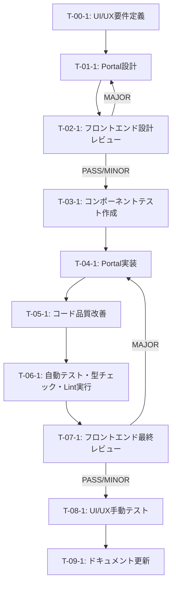

# アバターメニューz-index修正 - タスク実行仕様書

## ユーザーからの元の指示

```
アバター編集メニュー（z-[9999]）が連携サービスのGlassPanelに隠れてボタンを押せない。
backdrop-blurを使用しているGlassPanelが新しいスタッキングコンテキストを作成するため、
子要素のz-indexが正しく機能していない。
```

## メタ情報

| 項目         | 内容                        |
| ------------ | --------------------------- |
| タスクID     | AUTH-UI-002                 |
| タスク名     | アバターメニューz-index修正 |
| 分類         | バグ修正                    |
| 対象機能     | AccountSection              |
| 優先度       | 高                          |
| 見積もり規模 | 小規模                      |
| ステータス   | 未実施                      |
| 発見元       | ユーザーフィードバック      |
| 発見日       | 2025-12-10                  |
| 関連タスク   | AUTH-UI-001                 |

---

## タスク概要

### 目的

アバター編集メニューが常に最前面に表示され、ユーザーがボタンをクリック可能な状態にすることで、アバター管理機能を正常に使用できるようにする。

### 背景

AUTH-UI-001でz-index値を`z-[9999]`に修正したが、Profile CardのGlassPanelが`backdrop-blur`を使用しており、新しいスタッキングコンテキストを作成するため、メニューのz-indexが親要素内でしか効果を持たない。その結果、連携サービスセクション（別のGlassPanel）の下にメニューが隠れ、ユーザーがボタンをクリックできない状態になっている。

### 最終ゴール

ReactのcreatePortalを使用してアバター編集メニューを`document.body`直下にレンダリングし、GlassPanelのスタッキングコンテキストから脱出させることで、メニューが連携サービスセクションの上に正しく表示される状態を実現する。

### 成果物一覧

| 種別         | 成果物                                 | 配置先                                                                   |
| ------------ | -------------------------------------- | ------------------------------------------------------------------------ |
| 機能         | Portal化されたアバター編集メニュー     | apps/desktop/src/renderer/components/organisms/AccountSection/index.tsx  |
| テスト       | コンポーネントテスト（Portal検証）     | apps/desktop/src/renderer/components/organisms/AccountSection/**tests**/ |
| ドキュメント | 手動テストレポート                     | docs/30-workflows/auth-ui-z-index-fix/                                   |
| 品質         | テストカバレッジレポート、Lintレポート | coverage/, .eslintcache                                                  |

---

## 参照ファイル

本仕様書のコマンド・エージェント・スキル選定は以下を参照：

- `docs/00-requirements/master_system_design.md` - システム要件
- `.claude/commands/ai/command_list.md` - /ai:コマンド定義
- `.claude/agents/agent_list.md` - エージェント定義
- `.claude/skills/skill_list.md` - スキル定義

---

## タスク分解サマリー

| ID     | フェーズ              | サブタスク名                       | 責務                                                   | 依存   |
| ------ | --------------------- | ---------------------------------- | ------------------------------------------------------ | ------ |
| T-00-1 | 要件定義              | UI/UX要件定義                      | アバターメニューの表示要件とユーザビリティ要件を明確化 | なし   |
| T-01-1 | 設計                  | Portal設計                         | createPortal活用設計、メニュー位置計算ロジック設計     | T-00-1 |
| T-02-1 | 設計レビューゲート    | フロントエンド設計レビュー         | UI設計とReact Portalアーキテクチャの妥当性検証         | T-01-1 |
| T-03-1 | テスト作成 (TDD: Red) | コンポーネントテスト作成           | Portal検証テストケース作成、Red状態確認                | T-02-1 |
| T-04-1 | 実装 (TDD: Green)     | Portal実装                         | createPortalによるメニュー実装、位置計算ロジック実装   | T-03-1 |
| T-05-1 | リファクタリング      | コード品質改善                     | カスタムフック抽出、命名改善、重複コード排除           | T-04-1 |
| T-06-1 | 品質保証              | 自動テスト・型チェック・Lint実行   | 全テスト成功、型エラーゼロ、Lintクリア確認             | T-05-1 |
| T-07-1 | 最終レビューゲート    | フロントエンド最終レビュー         | コード品質、テスト品質、アクセシビリティの最終検証     | T-06-1 |
| T-08-1 | 手動テスト検証        | UI/UX手動テスト                    | 実際のユーザー操作でメニュー表示・クリック可能性を検証 | T-07-1 |
| T-09-1 | ドキュメント更新      | システムドキュメント更新（必要時） | UI/UXガイドライン更新（該当する場合）                  | T-08-1 |

**総サブタスク数**: 10個

---

## 実行フロー図



---

## Phase 0: 要件定義

### T-00-1: UI/UX要件定義

#### 目的

アバターメニューの表示要件、ユーザビリティ要件、アクセシビリティ要件を明文化し、実装の明確な基準を定義する。

#### 背景

GlassPanelのスタッキングコンテキスト問題により、ユーザーがアバター管理機能を使用できない状態が発生している。Portal化によりこの問題を解決するにあたり、単に技術的修正だけでなく、ユーザー体験の向上も考慮した要件定義が必要。

#### 責務（単一責務）

アバター編集メニューのUI/UX要件を明確に定義すること。

#### Claude Code スラッシュコマンド

> ⚠️ 以下はターミナルコマンドではなく、Claude Code内で実行するスラッシュコマンドです

```
/ai:create-user-stories AccountSection
```

- **参照**: `.claude/commands/ai/command_list.md`

#### 使用エージェント

- **エージェント**: @ui-designer
- **選定理由**: UI/UXの専門家であり、ユーザー中心の要件定義とアクセシビリティ要件の策定に最適。Atomic Design/モジュラー設計の経験からコンポーネント単位での要件定義が可能。
- **参照**: `.claude/agents/agent_list.md`

#### 活用スキル

| スキル名                       | 活用方法                                                   |
| ------------------------------ | ---------------------------------------------------------- |
| **design-system-architecture** | デザイントークン準拠のメニュー視覚設計、一貫性確保         |
| **accessibility-wcag**         | WCAG 2.1準拠のキーボードナビゲーション、フォーカス管理要件 |
| **apple-hig-guidelines**       | macOS HIG準拠のメニュー配置、シャドウ、角丸設計            |

- **参照**: `.claude/skills/skill_list.md`

#### 成果物

| 成果物               | パス                                                  | 内容                                                   |
| -------------------- | ----------------------------------------------------- | ------------------------------------------------------ |
| 要件定義ドキュメント | docs/30-workflows/auth-ui-z-index-fix/requirements.md | ユーザーストーリー、受け入れ基準、アクセシビリティ要件 |

#### 完了条件

- [ ] ユーザーストーリーが作成されている（Given-When-Then形式）
- [ ] アクセシビリティ要件が明記されている（WCAG 2.1 AA準拠）
- [ ] メニュー表示・非表示の動作要件が定義されている
- [ ] メニュー外クリック時の閉じる動作が要件化されている

#### 依存関係

- **前提**: なし
- **後続**: T-01-1（Portal設計）

---

## Phase 1: 設計

### T-01-1: Portal設計

#### 目的

ReactのcreatePortalを活用したアバターメニューのアーキテクチャ設計を行い、位置計算ロジックとイベント処理の詳細を設計する。

#### 背景

GlassPanelのスタッキングコンテキストから脱出するために、DOM階層を変更する必要がある。createPortalはコンポーネント構造を維持しながらDOMツリーの任意の位置にレンダリングできるため、最適な解決策となる。

#### 責務（単一責務）

React Portal を用いたアバターメニューの技術設計を行うこと。

#### Claude Code スラッシュコマンド

> ⚠️ 以下はターミナルコマンドではなく、Claude Code内で実行するスラッシュコマンドです

```
/ai:design-architecture clean
```

- **参照**: `.claude/commands/ai/command_list.md`

#### 使用エージェント

- **エージェント**: @ui-designer
- **選定理由**: React Portalパターンの設計経験を持ち、コンポーネントcomposition、Headless UI原則に精通している。位置計算ロジックとイベント管理の設計に最適。
- **参照**: `.claude/agents/agent_list.md`

#### 活用スキル

| スキル名                           | 活用方法                                               |
| ---------------------------------- | ------------------------------------------------------ |
| **component-composition-patterns** | createPortal活用、状態管理（メニュー開閉、位置情報）   |
| **custom-hooks-patterns**          | 位置計算ロジックのカスタムフック化（useMenuPosition）  |
| **react-hooks-advanced**           | useRef（アンカー要素参照）、useState（位置・開閉状態） |

- **参照**: `.claude/skills/skill_list.md`

#### 成果物

| 成果物           | パス                                            | 内容                                                     |
| ---------------- | ----------------------------------------------- | -------------------------------------------------------- |
| 設計ドキュメント | docs/30-workflows/auth-ui-z-index-fix/design.md | Portal設計詳細、位置計算アルゴリズム、イベント処理フロー |

#### 完了条件

- [ ] createPortal実装方針が設計されている
- [ ] メニュー位置計算ロジック（getBoundingClientRect）が設計されている
- [ ] メニュー外クリック検出ロジック（useEffect + addEventListener）が設計されている
- [ ] スタイリング方針（fixed position、z-index）が明記されている

#### 依存関係

- **前提**: T-00-1（UI/UX要件定義）
- **後続**: T-02-1（フロントエンド設計レビュー）

---

## Phase 2: 設計レビューゲート

### T-02-1: フロントエンド設計レビュー

#### 目的

実装開始前にUI設計とReact Portalアーキテクチャの妥当性を検証し、アクセシビリティ、パフォーマンス、保守性の観点から問題を早期発見する。

#### 背景

Portal実装は正しく設計しないとフォーカス管理やキーボードナビゲーションの問題を引き起こす可能性がある。Shift Left原則に基づき、設計段階で問題を排除する。

#### レビュー参加エージェント

| エージェント     | レビュー観点   | 選定理由                                            |
| ---------------- | -------------- | --------------------------------------------------- |
| @ui-designer     | UI/UX設計      | デザインシステム整合性、HIG準拠、ユーザビリティ評価 |
| @frontend-tester | テスタビリティ | Portal要素のテスト可能性、E2Eテストシナリオ設計     |
| @code-quality    | コード品質     | React Portalのベストプラクティス準拠、保守性評価    |

- **参照**: `.claude/agents/agent_list.md`

#### レビューチェックリスト

**UI/UX設計** (@ui-designer)

- [ ] メニュー位置が適切に計算されているか（ビューポート境界考慮）
- [ ] アクセシビリティ要件（WCAG 2.1 AA）が満たされているか
- [ ] フォーカス管理戦略が明確か（開閉時のフォーカス遷移）
- [ ] Apple HIG準拠のメニュースタイルか

**テスタビリティ** (@frontend-tester)

- [ ] Portal要素がテストで選択可能か（role="menu"属性）
- [ ] メニュー開閉状態がテスト検証可能か
- [ ] E2Eテストで位置計算が検証可能か

**コード品質** (@code-quality)

- [ ] React Portalのベストプラクティスに従っているか
- [ ] メモリリークリスク（イベントリスナー解除）が考慮されているか
- [ ] コンポーネントの責務が単一か

#### レビュー結果

- **判定**: PASS/MINOR/MAJOR
- **指摘事項**: レビュー実行時に記入
- **対応方針**: レビュー実行時に記入

#### 戻り先決定（MAJORの場合）

| 問題の種類 | 戻り先              |
| ---------- | ------------------- |
| 要件の問題 | Phase 0（要件定義） |
| 設計の問題 | Phase 1（設計）     |

#### 完了条件

- [ ] 全レビュー観点でチェック完了
- [ ] PASS判定またはMINOR判定（指摘対応済み）
- [ ] レビュー結果が記録されている

#### 依存関係

- **前提**: T-01-1（Portal設計）
- **後続**: T-03-1（コンポーネントテスト作成）

---

## Phase 3: テスト作成 (TDD: Red)

### T-03-1: コンポーネントテスト作成

#### 目的

実装前にテストを作成し、Portal要素のレンダリング、位置計算、メニュー開閉動作、外クリック検出を検証するテストケースを定義する。

#### 背景

TDD原則に基づき、テストファーストで開発を進める。Portal要素は通常のReactツリー外にレンダリングされるため、テスト方法に工夫が必要。

#### 責務（単一責務）

Portal検証テストケースを作成し、Red状態を確認すること。

#### Claude Code スラッシュコマンド

> ⚠️ 以下はターミナルコマンドではなく、Claude Code内で実行するスラッシュコマンドです

```
/ai:generate-unit-tests apps/desktop/src/renderer/components/organisms/AccountSection/index.tsx
```

- **参照**: `.claude/commands/ai/command_list.md`

#### 使用エージェント

- **エージェント**: @frontend-tester
- **選定理由**: React Testing Library、Vitestに精通し、Portalコンポーネントのテスト戦略（document.body.querySelector）に詳しい。境界値分析、エッジケース網羅の専門家。
- **参照**: `.claude/agents/agent_list.md`

#### 活用スキル

| スキル名                    | 活用方法                                        |
| --------------------------- | ----------------------------------------------- |
| **tdd-principles**          | Red-Green-Refactorサイクル、テストファースト    |
| **vitest-advanced**         | React Testing Library統合、非同期テスト、モック |
| **boundary-value-analysis** | メニュー位置の境界値テスト（ビューポート端）    |
| **test-naming-conventions** | Should形式テスト命名、Given-When-Then構造       |

- **参照**: `.claude/skills/skill_list.md`

#### 成果物

| 成果物               | パス                                                                                   | 内容                                                         |
| -------------------- | -------------------------------------------------------------------------------------- | ------------------------------------------------------------ |
| コンポーネントテスト | apps/desktop/src/renderer/components/organisms/AccountSection/**tests**/index.test.tsx | Portal検証テスト、位置計算テスト、イベントハンドリングテスト |

#### TDD検証: Red状態確認

```bash
pnpm --filter @repo/desktop test:run AccountSection
```

- [ ] テストが失敗することを確認（Red状態）

#### 完了条件

- [ ] Portal要素が`document.body`直下にレンダリングされることを検証するテストがある
- [ ] メニューが`fixed`ポジションでレンダリングされることを検証するテストがある
- [ ] メニュー外クリックで閉じることを検証するテストがある
- [ ] テストが失敗（Red状態）していることを確認

#### 依存関係

- **前提**: T-02-1（フロントエンド設計レビュー）
- **後続**: T-04-1（Portal実装）

---

## Phase 4: 実装 (TDD: Green)

### T-04-1: Portal実装

#### 目的

createPortalを使用してアバター編集メニューを`document.body`直下にレンダリングし、位置計算ロジックとメニュー外クリック処理を実装する。

#### 背景

設計とテストが完了し、実装フェーズに入る。TDD原則に基づき、テストを通すための最小限の実装を行う。

#### 責務（単一責務）

React Portal によるアバターメニュー実装を行うこと。

#### Claude Code スラッシュコマンド

> ⚠️ 以下はターミナルコマンドではなく、Claude Code内で実行するスラッシュコマンドです

```
/ai:create-component AccountSection organism
```

- **参照**: `.claude/commands/ai/command_list.md`

#### 使用エージェント

- **エージェント**: @ui-designer
- **選定理由**: React Portal実装、コンポーネントcomposition、カスタムフック実装の専門家。UI/UXとコード品質の両方を考慮した実装が可能。
- **参照**: `.claude/agents/agent_list.md`

#### 活用スキル

| スキル名                           | 活用方法                                             |
| ---------------------------------- | ---------------------------------------------------- |
| **component-composition-patterns** | createPortal活用、Controlled Component パターン      |
| **custom-hooks-patterns**          | useMenuPosition カスタムフック実装                   |
| **react-hooks-advanced**           | useRef、useState、useEffect の適切な活用             |
| **accessibility-wcag**             | role="menu"、aria-labelledby、キーボードイベント実装 |

- **参照**: `.claude/skills/skill_list.md`

#### 成果物

| 成果物                   | パス                                                                    | 内容                                             |
| ------------------------ | ----------------------------------------------------------------------- | ------------------------------------------------ |
| 修正されたAccountSection | apps/desktop/src/renderer/components/organisms/AccountSection/index.tsx | createPortal実装、位置計算ロジック、イベント処理 |

#### TDD検証: Green状態確認

```bash
pnpm --filter @repo/desktop test:run AccountSection
```

- [ ] テストが成功することを確認（Green状態）

#### 完了条件

- [ ] createPortalでメニューを`document.body`直下にレンダリング
- [ ] `getBoundingClientRect()`でメニュー位置を計算
- [ ] メニュー外クリックで閉じる動作を実装
- [ ] 全テストが成功（Green状態）

#### 依存関係

- **前提**: T-03-1（コンポーネントテスト作成）
- **後続**: T-05-1（コード品質改善）

---

## Phase 5: リファクタリング (TDD: Refactor)

### T-05-1: コード品質改善

#### 目的

動作を変えずにコード品質を改善する。位置計算ロジックをカスタムフックに抽出し、命名を改善し、重複コードを排除する。

#### 背景

Green状態を達成したが、コードの保守性と可読性をさらに向上させる必要がある。リファクタリング後もテストが成功することを確認する。

#### 責務（単一責務）

コードのリファクタリングを行い、品質を向上させること。

#### Claude Code スラッシュコマンド

> ⚠️ 以下はターミナルコマンドではなく、Claude Code内で実行するスラッシュコマンドです

```
/ai:refactor apps/desktop/src/renderer/components/organisms/AccountSection/index.tsx
```

- **参照**: `.claude/commands/ai/command_list.md`

#### 使用エージェント

- **エージェント**: @code-quality
- **選定理由**: Clean Code原則、SOLID原則、リファクタリングパターンの専門家。コード品質の客観的評価が可能。
- **参照**: `.claude/agents/agent_list.md`

#### 活用スキル

| スキル名                   | 活用方法                                |
| -------------------------- | --------------------------------------- |
| **refactoring-techniques** | Extract Method、Replace Temp with Query |
| **clean-code-practices**   | 意味のある命名、小さな関数、DRY原則     |
| **custom-hooks-patterns**  | useMenuPosition カスタムフック抽出      |

- **参照**: `.claude/skills/skill_list.md`

#### 成果物

| 成果物                             | パス                                                                    | 内容                                   |
| ---------------------------------- | ----------------------------------------------------------------------- | -------------------------------------- |
| リファクタリング後のAccountSection | apps/desktop/src/renderer/components/organisms/AccountSection/index.tsx | カスタムフック抽出、命名改善、重複排除 |

#### TDD検証: 継続Green確認

```bash
pnpm --filter @repo/desktop test:run AccountSection
```

- [ ] リファクタリング後もテストが成功することを確認

#### 完了条件

- [ ] カスタムフック（useMenuPosition）が抽出されている
- [ ] 変数・関数名が意味を表している
- [ ] 重複コードが排除されている
- [ ] 全テストが継続成功

#### 依存関係

- **前提**: T-04-1（Portal実装）
- **後続**: T-06-1（自動テスト・型チェック・Lint実行）

---

## Phase 6: 品質保証

### T-06-1: 自動テスト・型チェック・Lint実行

#### 目的

定義された品質基準をすべて満たすことを検証する。テスト成功、型エラーゼロ、Lintクリアを確認する。

#### 背景

品質ゲートを設け、次フェーズへ進む前に自動検証できる品質基準をクリアする。

#### 責務（単一責務）

自動化された品質検証を実行し、品質ゲートをクリアすること。

#### Claude Code スラッシュコマンド

> ⚠️ 以下はターミナルコマンドではなく、Claude Code内で実行するスラッシュコマンドです

```
/ai:run-all-tests --coverage
```

- **参照**: `.claude/commands/ai/command_list.md`

#### 使用エージェント

- **エージェント**: @frontend-tester
- **選定理由**: テスト実行、カバレッジ分析、品質メトリクス評価の専門家。
- **参照**: `.claude/agents/agent_list.md`

#### 活用スキル

| スキル名            | 活用方法                                           |
| ------------------- | -------------------------------------------------- |
| **vitest-advanced** | テストカバレッジ測定、テスト並列実行、レポート生成 |
| **tdd-principles**  | テスト網羅性評価、テストファースト原則の検証       |

- **参照**: `.claude/skills/skill_list.md`

#### 成果物

| 成果物       | パス                    | 内容                                             |
| ------------ | ----------------------- | ------------------------------------------------ |
| 品質レポート | coverage/, .eslintcache | カバレッジレポート、Lintレポート、型チェック結果 |

#### 完了条件

- [ ] 全ユニットテスト成功
- [ ] 型エラーなし（`pnpm --filter @repo/desktop exec tsc --noEmit`）
- [ ] Lintエラーなし（`pnpm lint`）
- [ ] テストカバレッジ80%以上

#### 依存関係

- **前提**: T-05-1（コード品質改善）
- **後続**: T-07-1（フロントエンド最終レビュー）

---

## 品質ゲートチェックリスト

### 機能検証

- [ ] 全ユニットテスト成功
- [ ] 全統合テスト成功（該当する場合）

### コード品質

- [ ] Lintエラーなし
- [ ] 型エラーなし
- [ ] コードフォーマット適用済み

### テスト網羅性

- [ ] カバレッジ基準達成（80%以上）

---

## Phase 7: 最終レビューゲート

### T-07-1: フロントエンド最終レビュー

#### 目的

実装完了後、ドキュメント更新前に全体的な品質・整合性を検証する。コード品質、テスト品質、アクセシビリティを最終確認する。

#### 背景

Phase 6の自動検証だけでは検出できない設計判断やベストプラクティス違反を人間的視点で確認する。

#### レビュー参加エージェント

| エージェント     | レビュー観点     | 選定理由                                           |
| ---------------- | ---------------- | -------------------------------------------------- |
| @code-quality    | コード品質       | Clean Code原則準拠、可読性・保守性評価             |
| @frontend-tester | テスト品質       | テストカバレッジ、境界値・異常系テストの十分性評価 |
| @ui-designer     | アクセシビリティ | WCAG準拠、キーボードナビゲーション、フォーカス管理 |

- **参照**: `.claude/agents/agent_list.md`

#### レビューチェックリスト

**コード品質** (@code-quality)

- [ ] コーディング規約への準拠
- [ ] 可読性・保守性の確保
- [ ] 適切なエラーハンドリング
- [ ] メモリリークリスクの不在（イベントリスナー解除）

**テスト品質** (@frontend-tester)

- [ ] テストカバレッジが十分か（80%以上）
- [ ] テストケースが適切に設計されているか
- [ ] 境界値・異常系のテストがあるか
- [ ] テストの可読性・保守性

**アクセシビリティ** (@ui-designer)

- [ ] WCAG 2.1 AA準拠
- [ ] キーボードナビゲーション完全対応
- [ ] ARIAロール・属性の適切な使用
- [ ] フォーカス管理が正しく実装されている

#### レビュー結果

- **判定**: PASS/MINOR/MAJOR/CRITICAL
- **指摘事項**: レビュー実行時に記入
- **対応方針**: レビュー実行時に記入
- **未完了タスク数**: 0件（想定）

#### 戻り先決定（MAJOR/CRITICALの場合）

| 問題の種類       | 戻り先                      |
| ---------------- | --------------------------- |
| 設計の問題       | Phase 1（設計）             |
| テスト設計の問題 | Phase 3（テスト作成）       |
| 実装の問題       | Phase 4（実装）             |
| コード品質の問題 | Phase 5（リファクタリング） |

#### 完了条件

- [ ] 全レビュー観点でチェック完了
- [ ] PASS判定またはMINOR判定（指摘対応済み）
- [ ] レビュー結果が記録されている

#### 依存関係

- **前提**: T-06-1（自動テスト・型チェック・Lint実行）
- **後続**: T-08-1（UI/UX手動テスト）

---

## Phase 8: 手動テスト検証

### T-08-1: UI/UX手動テスト

#### 目的

自動テストでは検証できないユーザー体験、視覚的UI、実環境動作を手動で確認し、実際のユーザー視点での品質を担保する。

#### 背景

Portal実装により正しく表示されるか、実際のクリック操作で動作するか、既存機能に影響がないかを確認する。

#### テスト分類

UI/UXテスト、機能テスト、リグレッションテスト

#### 使用エージェント

- **エージェント**: @frontend-tester
- **選定理由**: E2Eテスト、UI/UXテスト、手動テストシナリオ設計の専門家。
- **参照**: `.claude/agents/agent_list.md`

#### 手動テストケース

| No  | カテゴリ               | テスト項目                         | 前提条件             | 操作手順                                                   | 期待結果                                         | 実行結果 | 備考 |
| --- | ---------------------- | ---------------------------------- | -------------------- | ---------------------------------------------------------- | ------------------------------------------------ | -------- | ---- |
| 1   | 機能テスト（正常系）   | アバターメニューが表示される       | ログイン済み         | 1. AccountSectionを開く<br>2. アバター編集ボタンをクリック | メニューが連携サービスセクションの上に表示される |          |      |
| 2   | 機能テスト（正常系）   | メニュー内ボタンがクリック可能     | メニューが開いている | 1. 「アップロード」ボタンをクリック                        | ファイル選択ダイアログが開く                     |          |      |
| 3   | 機能テスト（正常系）   | メニュー外クリックで閉じる         | メニューが開いている | 1. メニュー外の領域をクリック                              | メニューが閉じる                                 |          |      |
| 4   | UI/UXテスト            | メニュー位置が適切                 | メニューが開いている | 1. メニュー位置を目視確認                                  | アバターボタンの下（mt-2相当）に表示される       |          |      |
| 5   | UI/UXテスト            | z-indexが正しく機能                | メニューが開いている | 1. 連携サービスセクションとメニューの重なりを確認          | メニューが最前面に表示される                     |          |      |
| 6   | アクセシビリティテスト | キーボードでメニューを閉じる       | メニューが開いている | 1. Escキーを押下                                           | メニューが閉じる                                 |          |      |
| 7   | リグレッションテスト   | 既存のアバター機能が動作           | メニューが開いている | 1. 各メニュー項目をクリック                                | アップロード、変更、削除が正常に動作             |          |      |
| 8   | 境界値テスト           | ウィンドウ端でメニューが表示される | ウィンドウを縮小     | 1. ウィンドウを小さくする<br>2. アバターボタンをクリック   | メニューがビューポート内に収まる（はみ出さない） |          |      |

#### テスト実行手順

1. `pnpm --filter @repo/desktop dev` でアプリを起動
2. ログイン
3. AccountSectionに移動
4. 上記テストケースを順次実行
5. 実行結果を記録
6. 不具合発見時は未完了タスクとして記録

#### 成果物

| 成果物             | パス                                                        | 内容                                                 |
| ------------------ | ----------------------------------------------------------- | ---------------------------------------------------- |
| 手動テストレポート | docs/30-workflows/auth-ui-z-index-fix/manual-test-report.md | テスト実行結果、スクリーンショット、発見された不具合 |

#### 完了条件

- [ ] すべての手動テストケースが実行済み
- [ ] すべてのテストケースがPASS
- [ ] 発見された不具合が修正済みまたは未完了タスクとして記録済み

#### 依存関係

- **前提**: T-07-1（フロントエンド最終レビュー）
- **後続**: T-09-1（ドキュメント更新）

---

## Phase 9: ドキュメント更新・未完了タスク記録

### T-09-1: ドキュメント更新

#### 目的

タスク完了後、実装した内容をシステム要件ドキュメントに反映する（該当する場合）。

#### 前提条件

- [ ] Phase 6の品質ゲートをすべて通過
- [ ] Phase 7の最終レビューゲートを通過
- [ ] Phase 8の手動テストが完了
- [ ] すべてのテストが成功

---

#### サブタスク 9.1: システムドキュメント更新

##### 更新対象ドキュメント

このタスクはバグ修正であり、アーキテクチャやUI/UXガイドラインに影響を与える変更ではないため、システムドキュメントの更新は不要と判断される。ただし、以下のドキュメントに影響がある場合は更新を検討：

- **該当なし**（バグ修正のため）

##### Claude Code スラッシュコマンド

> ⚠️ 以下はターミナルコマンドではなく、Claude Code内で実行するスラッシュコマンドです

```
# 更新が必要な場合のみ実行
/ai:update-all-docs
```

- **参照**: `.claude/commands/ai/command_list.md`

##### 使用エージェント

- **エージェント**: @spec-writer（更新が必要な場合）
- **選定理由**: ドキュメント保守、Single Source of Truth原則遵守の専門家。
- **参照**: `.claude/agents/agent_list.md`

---

#### サブタスク 9.2: 未完了タスク・追加タスク記録

##### 出力先

`docs/30-workflows/unassigned-task/`

##### 記録対象タスク一覧

Phase 7、Phase 8で発見された未対応の課題（想定: 0件）

##### ファイル命名規則

- 要件系: `requirements-avatar-menu.md`
- 改善系: `task-avatar-menu-improvements.md`

##### 指示書としての品質基準

生成されるタスク指示書は以下を満たすこと：

**Why（なぜ必要か）**

- [ ] 背景が明確に記述されている
- [ ] 問題点・課題が具体的に説明されている
- [ ] 放置した場合の影響が記載されている

**What（何を達成するか）**

- [ ] 目的が明確に定義されている
- [ ] 最終ゴールが具体的に記述されている
- [ ] スコープ（含む/含まない）が明記されている
- [ ] 成果物が一覧化されている

**How（どのように実行するか）**

- [ ] 前提条件が明記されている
- [ ] 依存タスクが特定されている
- [ ] 必要な知識・スキルが記載されている
- [ ] 推奨アプローチが説明されている

**実行手順**

- [ ] フェーズ構成が明確である
- [ ] 各フェーズにClaude Codeスラッシュコマンド（/ai:xxx形式）が記載されている
- [ ] 使用エージェント・スキルが選定されている
- [ ] 各フェーズの成果物・完了条件が定義されている

**検証・完了**

- [ ] 完了条件チェックリストがある
- [ ] テストケース/検証方法が記載されている
- [ ] リスクと対策が検討されている

---

#### 完了条件

- [ ] システムドキュメント更新が完了（該当する場合）
- [ ] 未完了タスクが記録済み（該当する場合）
- [ ] 全完了条件をクリア

---

## リスクと対策

| リスク                                 | 影響度 | 発生確率 | 対策                                                      | 対応サブタスク |
| -------------------------------------- | ------ | -------- | --------------------------------------------------------- | -------------- |
| メニュー位置がビューポート外にはみ出す | 中     | 中       | getBoundingClientRectでビューポート境界を考慮した位置計算 | T-01-1, T-04-1 |
| フォーカス管理の不備                   | 中     | 低       | useEffect でメニュー開閉時のフォーカス遷移を実装          | T-04-1         |
| メモリリーク                           | 中     | 低       | useEffect cleanup でイベントリスナーを確実に解除          | T-04-1, T-07-1 |
| アクセシビリティ対応漏れ               | 中     | 低       | WCAG 2.1 AA準拠のARIA属性、キーボードナビゲーションを実装 | T-00-1, T-04-1 |
| 既存機能への影響                       | 高     | 低       | リグレッションテストで既存のアバター機能を確認            | T-08-1         |

---

## 前提条件

- React 18+のcreatePortal APIが利用可能
- Vitest、React Testing Libraryがセットアップ済み
- TailwindCSSが利用可能
- AccountSectionコンポーネントが存在

---

## 備考

### 技術的制約

- Portal要素は`document.body`直下にレンダリングされるため、親コンポーネントのスタイルが継承されない（fixedポジション、z-indexを明示的に指定）
- テストでPortal要素を選択する際は`document.body.querySelector`を使用

### 参考資料

- React Portal: https://react.dev/reference/react-dom/createPortal
- CSS stacking context: https://developer.mozilla.org/en-US/docs/Web/CSS/CSS_positioned_layout/Understanding_z-index/Stacking_context
- WCAG 2.1 Menu Pattern: https://www.w3.org/WAI/ARIA/apg/patterns/menu/

### 関連ファイル

- `apps/desktop/src/renderer/components/organisms/AccountSection/index.tsx`
