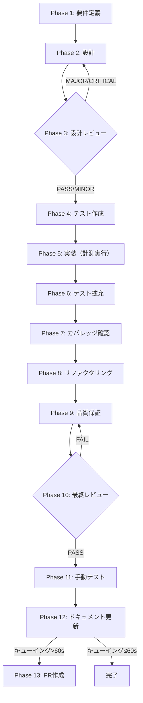

# TASK-CI-FUTURE-005: CI-M-01 実測確認（キューイング時間1分超判定）

## メタ情報

| 項目           | 内容                                          |
| -------------- | --------------------------------------------- |
| タスクID       | TASK-CI-FUTURE-005                            |
| タスク名       | CI-M-01 実測確認（キューイング時間1分超判定） |
| 分類           | パフォーマンス                                |
| 対象機能       | GitHub Actions CI                             |
| 優先度         | 高                                            |
| 見積もり規模   | 小規模                                        |
| ステータス     | pending                                       |
| 作成日         | 2026-04-15                                    |
| 親ワークフロー | -                                             |
| タスク分類     | NON_VISUAL / docs-only（コード変更なし）      |
| タスク種別     | NON_VISUAL / docs-only                        |
| 発見元         | TASK-CI-OPT-001 Phase 3 MINOR CI-M-01         |

---

## 現在の状態

- Phase 1〜13 は pending
- Phase 13 は条件付き（キューイング時間 1 分超の場合のみ実施）

## タスク概要

### 目的

TASK-CI-OPT-001 の PR マージ後に実際の CI 実行でキューイング時間を計測し、
シャード数 17 の継続可否を最終決定する。

### 背景

TASK-CI-OPT-001 Phase 3 の設計レビューゲートにおいて、シャード数 16→17 への変更が MINOR 指摘
CI-M-01 として記録された。

シャード数を 17 にした場合、第2波ジョブが一斉起動する際の同時ジョブ数は以下のようになる：

```
test-desktop × 17 + typecheck × 1 + test-shared × 1 + e2e × 1 = 20 ジョブ
```

GitHub Free Tier の並列実行上限は 20 ジョブであり、ちょうど上限に到達する。
実際の CI 実行でキューイングが発生するかどうかは GitHub 側のジョブスケジューリング実装に依存するため、
PR マージ後の実測確認が必要とされた。

### 依存タスク

| タスクID        | タイトル                                                            | 状態               |
| --------------- | ------------------------------------------------------------------- | ------------------ |
| TASK-CI-OPT-001 | GitHub Actions CI 最適化（node_modules キャッシュ・シャード数調整） | 完了（PRマージ後） |

### 最終ゴール

- キューイング時間を `gh run view` コマンドで実測する
- 実測値に基づき、以下の二択を確定する：
  - **キューイング時間 1 分以内**: シャード数 17 を継続
  - **キューイング時間 1 分超**: `.github/workflows/ci.yml` のシャード数を 17→16 に戻す

---

## 受入条件

| ID   | 条件                                                                              |
| ---- | --------------------------------------------------------------------------------- |
| AC-1 | TASK-CI-OPT-001 マージ後の完了済み CI Run ID が特定されている                     |
| AC-2 | 17 シャード全ての `createdAt`・`startedAt` を取得し最大キューイング時間を算出済み |
| AC-3 | 最大キューイング時間が 60 秒以内 or 超過かの判定を確定済み                        |
| AC-4 | 判定結果に基づくアクション（継続 or 16 への戻し）を完了済み                       |
| AC-5 | TASK-CI-OPT-001 の CI-M-01 指摘が「解決済み」として記録されている                 |

---

## 成果物一覧

| Phase | 名称               | 成果物                                                                                                                                                                                                                                                                                              |
| ----- | ------------------ | --------------------------------------------------------------------------------------------------------------------------------------------------------------------------------------------------------------------------------------------------------------------------------------------------- |
| 1     | 要件定義           | `outputs/phase-1/requirements.md`                                                                                                                                                                                                                                                                   |
| 2     | 設計               | `outputs/phase-2/design.md`                                                                                                                                                                                                                                                                         |
| 3     | 設計レビュー       | `outputs/phase-3/review.md`                                                                                                                                                                                                                                                                         |
| 4     | テスト作成         | `outputs/phase-4/test-plan.md`                                                                                                                                                                                                                                                                      |
| 5     | 実装（計測実行）   | `outputs/phase-5/measurement-result.md`                                                                                                                                                                                                                                                             |
| 6     | テスト拡充         | `outputs/phase-6/test-expansion.md`                                                                                                                                                                                                                                                                 |
| 7     | カバレッジ確認     | `outputs/phase-7/coverage-report.md`                                                                                                                                                                                                                                                                |
| 8     | リファクタリング   | `outputs/phase-8/refactoring-notes.md`                                                                                                                                                                                                                                                              |
| 9     | 品質保証           | `outputs/phase-9/qa-report.md`                                                                                                                                                                                                                                                                      |
| 10    | 最終レビュー       | `outputs/phase-10/final-review.md`                                                                                                                                                                                                                                                                  |
| 11    | 手動テスト         | `outputs/phase-11/manual-test-result.md`                                                                                                                                                                                                                                                            |
| 12    | ドキュメント更新   | `outputs/phase-12/implementation-guide.md`, `outputs/phase-12/system-spec-update-summary.md`, `outputs/phase-12/documentation-changelog.md`, `outputs/phase-12/unassigned-task-detection.md`, `outputs/phase-12/skill-feedback-report.md`, `outputs/phase-12/phase12-task-spec-compliance-check.md` |
| 13    | PR作成（条件付き） | `outputs/phase-13/pr-creation-result.md`                                                                                                                                                                                                                                                            |

---

## 出力ファイル構成

```
docs/30-workflows/task-ci-future-005-queuing-time-verification/
├── index.md
├── artifacts.json
├── phase-1-requirements.md
├── phase-2-design.md
├── phase-3-design-review.md
├── phase-4-test-creation.md
├── phase-5-implementation.md
├── phase-6-test-expansion.md
├── phase-7-coverage-check.md
├── phase-8-refactoring.md
├── phase-9-quality-assurance.md
├── phase-10-final-review.md
├── phase-11-manual-test.md
├── phase-12-documentation.md
├── phase-13-pr-creation.md
└── outputs/
    ├── phase-1/
    ├── phase-2/
    ├── phase-3/
    ├── phase-4/
    ├── phase-5/
    ├── phase-6/
    ├── phase-7/
    ├── phase-8/
    ├── phase-9/
    ├── phase-10/
    ├── phase-11/
    ├── phase-12/
    └── phase-13/
```

---

## タスク分解サマリ（Phase 1-13）



| Phase | 名称               | パターン | 依存     | ゲート | ステータス |
| ----- | ------------------ | -------- | -------- | ------ | ---------- |
| 1     | 要件定義           | seq      | -        | -      | pending    |
| 2     | 設計               | seq      | Phase 1  | -      | pending    |
| 3     | 設計レビュー       | seq      | Phase 2  | GATE   | pending    |
| 4     | テスト作成         | seq      | Phase 3  | -      | pending    |
| 5     | 実装（計測実行）   | seq      | Phase 4  | -      | pending    |
| 6     | テスト拡充         | seq      | Phase 5  | -      | pending    |
| 7     | カバレッジ確認     | seq      | Phase 6  | -      | pending    |
| 8     | リファクタリング   | seq      | Phase 7  | -      | pending    |
| 9     | 品質保証           | seq      | Phase 8  | -      | pending    |
| 10    | 最終レビュー       | seq      | Phase 9  | GATE   | pending    |
| 11    | 手動テスト         | seq      | Phase 10 | -      | pending    |
| 12    | ドキュメント更新   | seq      | Phase 11 | -      | pending    |
| 13    | PR作成（条件付き） | cond     | Phase 12 | -      | pending    |

凡例: `seq`=順次実行, `cond`=条件付き実行

---

## 参照ファイル

- `docs/30-workflows/unassigned-task/TASK-CI-FUTURE-005-queuing-time-verification.md`（元仕様書）
- `docs/30-workflows/completed-tasks/task-ci-optimization-001/phase-3-design-review.md`（MINOR指摘CI-M-01の発見元）
- `.github/workflows/ci.yml`（シャード数設定の変更対象）

---

## 変更履歴

| Version | Date       | Changes  |
| ------- | ---------- | -------- |
| 1.0.0   | 2026-04-15 | 初版作成 |
