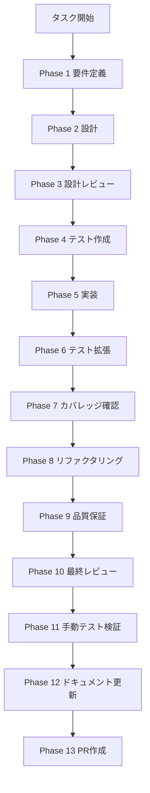

# task-ci-future-007-backend-codecov-upload - タスク実行仕様書

## メタ情報

| 項目         | 内容                                             |
| ------------ | ------------------------------------------------ |
| タスクID     | TASK-CI-FUTURE-007                               |
| タスク名     | @repo/backend Codecov カバレッジアップロード対応 |
| 分類         | CI 改善 / 仕様作成                               |
| 対象機能     | GitHub Actions CI / Codecov                      |
| タスク種別   | NON_VISUAL（CI設定変更のみ）                     |
| 優先度       | 低                                               |
| 見積もり規模 | 小規模                                           |
| ステータス   | phase12_completed                                |
| 作成日       | 2026-04-16                                       |
| 依存タスク   | TASK-CI-FUTURE-002                               |
| 関連タスク   | TASK-CI-OPT-001, TASK-CI-FUTURE-002              |

---

## 現在の状態

- `test-web` は `@repo/backend` を対象に 2 シャードで実行し、`push` + `refs/heads/main` のときだけカバレッジを付与する
- `coverage` ジョブは `desktop` と `backend` の両方を Codecov にアップロードする
- `apps/backend/vitest.config.ts` には `reporter: ["json", "lcov"]`、`reportsDirectory: "./coverage"`、`enabled: !!process.env.VITEST_SHARDED_COVERAGE` が設定されている
- `codecov.yml` には `backend` flag が定義されている
- Phase 11 は NON_VISUAL とし、スクリーンショットではなく CLI / CI ログ / coverage 証跡で確認する
- Phase 13 は user approval があるまで blocked のまま維持する

---

## Phase一覧

| Phase | 名称                 | 仕様書                                                       | ステータス |
| ----- | -------------------- | ------------------------------------------------------------ | ---------- |
| 1     | 要件定義             | [phase-1-requirements.md](phase-1-requirements.md)           | 完了       |
| 2     | 設計                 | [phase-2-design.md](phase-2-design.md)                       | 完了       |
| 3     | 設計レビューゲート   | [phase-3-design-review.md](phase-3-design-review.md)         | 完了       |
| 4     | テスト作成           | [phase-4-test-creation.md](phase-4-test-creation.md)         | 完了       |
| 5     | 実装                 | [phase-5-implementation.md](phase-5-implementation.md)       | 完了       |
| 6     | テスト拡張           | [phase-6-test-expansion.md](phase-6-test-expansion.md)       | 完了       |
| 7     | テストカバレッジ確認 | [phase-7-coverage-check.md](phase-7-coverage-check.md)       | 完了       |
| 8     | リファクタリング     | [phase-8-refactoring.md](phase-8-refactoring.md)             | 完了       |
| 9     | 品質保証             | [phase-9-quality-assurance.md](phase-9-quality-assurance.md) | 完了       |
| 10    | 最終レビューゲート   | [phase-10-final-review.md](phase-10-final-review.md)         | 完了       |
| 11    | 手動テスト検証       | [phase-11-manual-test.md](phase-11-manual-test.md)           | 完了       |
| 12    | ドキュメント更新     | [phase-12-documentation.md](phase-12-documentation.md)       | 完了       |
| 13    | PR作成               | [phase-13-pr-creation.md](phase-13-pr-creation.md)           | blocked    |

---

## 実行フロー

---

## 主要成果物

| 種別         | 成果物                                            | 配置先              |
| ------------ | ------------------------------------------------- | ------------------- |
| 仕様書       | Phase 1〜13 の詳細仕様                            | `phase-*.md`        |
| 台帳         | workflow 状態 / phase 状態                        | `artifacts.json`    |
| 補助証跡     | Phase 11 の非視覚テスト証跡                       | `outputs/phase-11/` |
| ドキュメント | Phase 12 の実装ガイド / 同期記録 / フィードバック | `outputs/phase-12/` |
