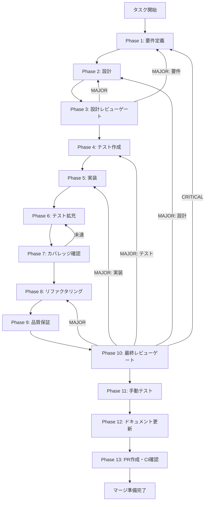

# task-knowledge-graph-store - タスク実行仕様書

## ユーザーからの元の指示

```
Knowledge Graph Store 実装
Knowledge Graphテーブル群に対するデータアクセス層を実装し、CRUD操作とグラフクエリをサポートする。
```

## メタ情報

| 項目         | 内容                                 |
| ------------ | ------------------------------------ |
| タスクID     | CONV-08-01                           |
| タスク名     | knowledge-graph-store-implementation |
| 分類         | 要件                                 |
| 対象機能     | Knowledge Graph データアクセス層     |
| 優先度       | 高                                   |
| 見積もり規模 | 大規模                               |
| ステータス   | 未実施                               |
| 作成日       | 2026-01-13                           |

---

## タスク概要

### 目的

Knowledge Graphテーブル群（entities, relations, relation_evidence, communities, entity_communities, chunk_entities）に対するデータアクセス層を実装し、CRUD操作とグラフクエリ機能を提供する。GraphRAG機能の実現に必要なリポジトリ層を構築する。

### 背景

CONV-04-05でKnowledge Graphテーブル群のスキーマ定義が完了した。GraphRAG機能を実現するためには、これらのテーブルに対するCRUD操作を提供するデータアクセス層（Store）が必要。現状ではスキーマ定義のみが存在し、アプリケーション層からKnowledge Graphデータにアクセスする手段がない。

### 最終ゴール

以下の機能が実装され、テストカバレッジ80%以上を達成している状態:

- **EntityStore**: エンティティのCRUD + 検索
- **RelationStore**: 関係のCRUD + グラフトラバーサル
- **CommunityStore**: コミュニティのCRUD + 階層操作
- **RelationEvidenceStore**: 関係証拠のCRUD
- **GraphQueryService**: パス検索、サブグラフ取得、BFSトラバーサル

### 成果物一覧

| 種別         | 成果物                | 配置先                                                          |
| ------------ | --------------------- | --------------------------------------------------------------- |
| 機能         | EntityStore           | `packages/shared/src/services/graph/entity-store.ts`            |
| 機能         | RelationStore         | `packages/shared/src/services/graph/relation-store.ts`          |
| 機能         | CommunityStore        | `packages/shared/src/services/graph/community-store.ts`         |
| 機能         | RelationEvidenceStore | `packages/shared/src/services/graph/relation-evidence-store.ts` |
| 機能         | GraphQueryService     | `packages/shared/src/services/graph/graph-query-service.ts`     |
| テスト       | ユニットテスト        | `packages/shared/src/services/graph/__tests__/*.test.ts`        |
| ドキュメント | 実装ガイド            | `outputs/phase-12/implementation-guide.md`                      |
| PR           | GitHub Pull Request   | GitHub UI                                                       |

---

## 参照ファイル

本仕様書の実装は以下を参照:

### システム仕様（aiworkflow-requirements）

> 実装前に必ず以下のシステム仕様を確認し、既存設計との整合性を確保してください。

| 参照資料                               | パス                                                                                        | 内容                      |
| -------------------------------------- | ------------------------------------------------------------------------------------------- | ------------------------- |
| Knowledge Graph Store インターフェース | `.claude/skills/aiworkflow-requirements/references/interfaces-rag-knowledge-graph-store.md` | Store API仕様・データ構造 |
| データベーススキーマ                   | `.claude/skills/aiworkflow-requirements/references/database-schema.md`                      | テーブル定義              |
| RAGアーキテクチャ                      | `.claude/skills/aiworkflow-requirements/references/architecture-rag.md`                     | RAG全体設計               |
| RAGインターフェース                    | `.claude/skills/aiworkflow-requirements/references/interfaces-rag.md`                       | RAG API仕様               |
| データベース実装                       | `.claude/skills/aiworkflow-requirements/references/database-implementation.md`              | DB実装パターン            |

---

## タスク分解サマリー

| ID     | フェーズ | サブタスク名                             | 責務                    | 依存 |
| ------ | -------- | ---------------------------------------- | ----------------------- | ---- |
| T-01-1 | Phase 1  | 要件抽出・受け入れ基準作成               | API仕様・AC定義         | -    |
| T-02-1 | Phase 2  | アーキテクチャ設計・インターフェース設計 | Store構造・型定義       | T-01 |
| T-03-1 | Phase 3  | 設計レビューゲート                       | 設計の妥当性検証        | T-02 |
| T-04-1 | Phase 4  | TDD: テスト作成（Red）                   | ユニット/統合テスト作成 | T-03 |
| T-05-1 | Phase 5  | TDD: 実装（Green）                       | Store・Service実装      | T-04 |
| T-06-1 | Phase 6  | テスト拡充                               | カバレッジ向上          | T-05 |
| T-07-1 | Phase 7  | カバレッジ確認                           | 基準達成確認            | T-06 |
| T-08-1 | Phase 8  | TDD: リファクタリング                    | コード品質改善          | T-07 |
| T-09-1 | Phase 9  | 品質保証                                 | Lint/型/セキュリティ    | T-08 |
| T-10-1 | Phase 10 | 最終レビューゲート                       | 全体品質検証            | T-09 |
| T-11-1 | Phase 11 | 手動テスト検証                           | 統合動作確認            | T-10 |
| T-12-1 | Phase 12 | ドキュメント更新                         | 実装ガイド・仕様更新    | T-11 |
| T-13-1 | Phase 13 | PR作成                                   | コミット・PR・CI確認    | T-12 |

**総サブタスク数**: 13個

---

## 実行フロー図



---

## Phase一覧

| Phase | 名称               | 仕様書                                                 | ステータス |
| ----- | ------------------ | ------------------------------------------------------ | ---------- |
| 1     | 要件定義           | [phase-1-requirements.md](phase-1-requirements.md)     | 未実施     |
| 2     | 設計               | [phase-2-design.md](phase-2-design.md)                 | 未実施     |
| 3     | 設計レビューゲート | [phase-3-design-review.md](phase-3-design-review.md)   | 未実施     |
| 4     | テスト作成         | [phase-4-test-creation.md](phase-4-test-creation.md)   | 未実施     |
| 5     | 実装               | [phase-5-implementation.md](phase-5-implementation.md) | 未実施     |
| 6     | テスト拡充         | [phase-6-test-expansion.md](phase-6-test-expansion.md) | 未実施     |
| 7     | カバレッジ確認     | [phase-7-coverage-check.md](phase-7-coverage-check.md) | 未実施     |
| 8     | リファクタリング   | [phase-8-refactoring.md](phase-8-refactoring.md)       | 未実施     |
| 9     | 品質保証           | [phase-9-quality.md](phase-9-quality.md)               | 未実施     |
| 10    | 最終レビューゲート | [phase-10-final-review.md](phase-10-final-review.md)   | 未実施     |
| 11    | 手動テスト         | [phase-11-manual-test.md](phase-11-manual-test.md)     | 未実施     |
| 12    | ドキュメント更新   | [phase-12-documentation.md](phase-12-documentation.md) | 未実施     |
| 13    | PR作成             | [phase-13-pr-creation.md](phase-13-pr-creation.md)     | 未実施     |

---

## テストカバレッジ目標

### ユニットテスト

| 指標              | 最低基準 | 推奨基準 |
| ----------------- | -------- | -------- |
| Line Coverage     | 80%      | 90%      |
| Branch Coverage   | 60%      | 70%      |
| Function Coverage | 80%      | 90%      |

### 結合テスト

| 指標                         | 目標 |
| ---------------------------- | ---- |
| APIエンドポイント            | 100% |
| モジュール間インターフェース | 100% |
| 正常系シナリオ               | 100% |
| 異常系シナリオ               | 80%+ |
| 外部連携ポイント             | 100% |

---

## 統合テスト連携（Phase 1〜11で必須）

各Phaseで以下の統合テスト連携アクションを実施すること:

| Phase | 統合テスト連携アクション                        |
| ----- | ----------------------------------------------- |
| 1     | 接続要件（Store API/データフロー）を要件に明記  |
| 2     | 統合ポイント/契約（API・スキーマ）を設計に反映  |
| 3     | 統合テスト観点のレビューゲートを実施            |
| 4     | 統合テストシナリオを全カテゴリで作成            |
| 5     | Store間連携・DB接続の実装とテスト支援コード整備 |
| 6     | 統合テストの拡充（全カテゴリのカバレッジ向上）  |
| 7     | 統合テストの再実行とゲート判定                  |
| 8     | リファクタ後の統合テスト継続成功を確認          |
| 9     | 品質保証で統合テスト結果を確認                  |
| 10    | 最終レビューで統合テスト結果を確認              |
| 11    | 手動統合テスト（Store API/DB接続）を確認        |

---

## Phase完了時の必須アクション

**各Phase完了時に以下を必ず実行すること:**

1. **タスク100%実行**: Phase内で指定された全タスクを完全に実行
2. **成果物確認**: 全ての必須成果物が生成されていることを検証
3. **実行記録**: 実行タスクの結果を記録
4. **artifacts.json更新**: Phase完了ステータスを更新
5. **Phase末端の実行確認**: 各タスクを100%実行し、各タスクを完遂した旨を必ず明記

```bash
# Phase完了時の検証コマンド
node .claude/skills/task-specification-creator/scripts/validate-phase-output.mjs docs/30-workflows/task-knowledge-graph-store --phase {{PHASE_NUMBER}}

# Phase完了・成果物登録
node .claude/skills/task-specification-creator/scripts/complete-phase.mjs \
  --workflow docs/30-workflows/task-knowledge-graph-store --phase {{PHASE_NUMBER}} --artifacts "..."
```

---

## 機能要件チェックリスト

### EntityStore

- [ ] addEntity: エンティティ追加（upsert）
- [ ] getEntity: IDでエンティティ取得
- [ ] getEntityByName: 名前でエンティティ取得（正規化名）
- [ ] updateEntity: エンティティ更新
- [ ] deleteEntity: エンティティ削除（CASCADE）
- [ ] searchEntities: 条件検索
- [ ] bulkUpsertEntities: バッチエンティティ追加

### RelationStore

- [ ] addRelation: 関係追加（証拠必須）
- [ ] getRelation: IDで関係取得
- [ ] deleteRelation: 関係削除
- [ ] getRelationsByEntity: エンティティの全関係取得
- [ ] bulkAddRelations: バッチ関係追加

### CommunityStore

- [ ] create: コミュニティ作成
- [ ] findById: ID検索
- [ ] findByLevel: レベル別検索
- [ ] findChildren: 子コミュニティ取得
- [ ] getMembers: メンバーエンティティ取得
- [ ] addMember: メンバー追加
- [ ] removeMember: メンバー削除

### GraphQueryService

- [ ] traverse: BFSトラバーサル
- [ ] findShortestPath: 最短経路探索
- [ ] getNeighbors: 隣接ノード取得
- [ ] getStats: グラフ統計取得

---

## リスクと対策

| リスク                       | 影響度 | 発生確率 | 対策                         |
| ---------------------------- | ------ | -------- | ---------------------------- |
| パフォーマンス問題           | 高     | 中       | バッチ処理、インデックス活用 |
| 循環参照によるN+1問題        | 中     | 中       | リレーショナルクエリ活用     |
| トランザクションデッドロック | 中     | 低       | アクセス順序の統一           |
| グラフクエリの複雑化         | 中     | 中       | 深度制限、ページネーション   |

---

## 関連ドキュメント

| ドキュメント                | パス                                                                   |
| --------------------------- | ---------------------------------------------------------------------- |
| タスク指示書                | `docs/30-workflows/unassigned-task/task-knowledge-graph-store.md`      |
| Knowledge Graphテーブル実装 | `docs/30-workflows/completed-tasks/conv-04-05-knowledge-graph-tables/` |
| Drizzle ORMスキル           | `.claude/skills/drizzle-orm/`                                          |
