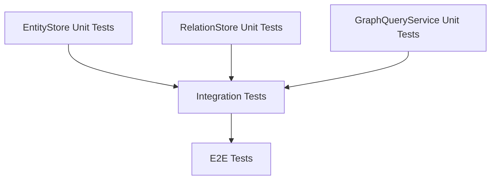

# Knowledge Graph Store 統合テスト設計

## メタ情報

| 項目       | 値                         |
| ---------- | -------------------------- |
| Phase      | 4                          |
| 機能名     | task-knowledge-graph-store |
| 作成日     | 2026-01-13                 |
| 作成者     | Claude Opus 4.5            |
| バージョン | 1.0.0                      |

---

## 1. 統合テスト概要

### 1.1 目的

- Store間の連携動作を検証
- DB層との整合性を確認
- トランザクション境界の正常動作を確認
- E2Eシナリオの動作検証

### 1.2 テスト範囲

```
┌─────────────────────────────────────────┐
│           Application Layer             │
├─────────────────────────────────────────┤
│   IKnowledgeGraphStore Interface        │
├─────────────────────────────────────────┤
│   ┌─────────┐ ┌─────────┐ ┌─────────┐   │
│   │ Entity  │ │Relation │ │Community│   │
│   │ Store   │ │ Store   │ │ Store   │   │
│   └────┬────┘ └────┬────┘ └────┬────┘   │
│        │           │           │        │
│   ┌────┴───────────┴───────────┴────┐   │
│   │      GraphQueryService          │   │
│   └──────────────┬──────────────────┘   │
├──────────────────┼──────────────────────┤
│                  │  Database Layer      │
│   ┌──────────────┴──────────────────┐   │
│   │        SQLite (in-memory)       │   │
│   └─────────────────────────────────┘   │
└─────────────────────────────────────────┘
```

---

## 2. 統合テストシナリオ

### 2.1 シナリオ1: Entity-Relation連携

**目的:** Entity作成後にRelationを作成し、正しく連携することを確認

```typescript
describe("Integration: Entity-Relation連携", () => {
  it("エンティティ作成後に関係を作成できる", async () => {
    // Step 1: 2つのエンティティを作成
    const entity1 = await store.upsertEntity({
      name: "Albert Einstein",
      type: "person",
    });
    const entity2 = await store.upsertEntity({
      name: "Theory of Relativity",
      type: "concept",
    });

    // Step 2: 関係を作成
    const relation = await store.addRelation({
      sourceEntityName: "Albert Einstein",
      targetEntityName: "Theory of Relativity",
      relationType: "CREATED",
      evidence: [
        {
          chunkId: createChunkId("chunk-1"),
          excerpt: "Einstein developed the theory of relativity.",
        },
      ],
    });

    // Step 3: 検証
    expect(relation.success).toBe(true);
    expect(relation.data.sourceEntityId).toBe(entity1.data.id);
    expect(relation.data.targetEntityId).toBe(entity2.data.id);
  });
});
```

**検証ポイント:**

- [x] Entity作成成功
- [x] エンティティ名からIDへの解決
- [x] Relation作成成功
- [x] 外部キー整合性

### 2.2 シナリオ2: CASCADE削除

**目的:** Entity削除時に関連Relationが正しくCASCADE削除されることを確認

```typescript
describe("Integration: CASCADE削除", () => {
  it("エンティティ削除時に関連する関係も削除される", async () => {
    // Setup: Entity 3つ、Relation 2つを作成
    // A --[KNOWS]--> B --[WORKS_AT]--> C

    // Step 1: Bを削除
    await store.deleteEntity(entityB.id);

    // Step 2: 検証
    // - A --[KNOWS]--> B の関係が削除されている
    // - B --[WORKS_AT]--> C の関係が削除されている
    const relationsOfA = await store.getRelations(entityA.id);
    const relationsOfC = await store.getRelations(entityC.id);

    expect(relationsOfA.data).toHaveLength(0);
    expect(relationsOfC.data).toHaveLength(0);
  });
});
```

**検証ポイント:**

- [x] CASCADE DELETE動作
- [x] relation_evidenceの連鎖削除
- [x] 残存Entityへの影響なし

### 2.3 シナリオ3: グラフ探索の整合性

**目的:** 複雑なグラフ構造でのtraverseとfindShortestPathの整合性を確認

```typescript
describe("Integration: グラフ探索の整合性", () => {
  it("複雑なグラフでBFS探索が正しく動作する", async () => {
    // Setup: 複雑なグラフ構造を作成
    //     A
    //    / \
    //   B   C
    //   |   |
    //   D---E
    //    \ /
    //     F

    // Step 1: Aからの探索
    const result = await store.traverse(entityA.id, { maxDepth: 3 });

    // Step 2: 検証
    expect(result.data.nodes).toHaveLength(6);
    expect(result.data.maxDepthReached).toBe(3);

    // Step 3: 最短パス検証
    const path = await store.findShortestPath(entityA.id, entityF.id);
    expect(path.data.length).toBe(3); // A -> B -> D -> F または A -> C -> E -> F
  });
});
```

**検証ポイント:**

- [x] 全ノード到達確認
- [x] 深度情報の正確性
- [x] 最短パスの正確性
- [x] 循環グラフ対応

### 2.4 シナリオ4: バッチ操作のトランザクション

**目的:** bulkUpsertEntities/bulkAddRelationsのトランザクション整合性を確認

```typescript
describe("Integration: バッチ操作トランザクション", () => {
  it("バッチ操作失敗時に全てロールバックされる", async () => {
    // Setup: 1件目は有効、2件目は自己ループ（無効）
    const relations = [
      {
        sourceEntityName: "A",
        targetEntityName: "B",
        relationType: "RELATED",
        evidence: [{ chunkId: "chunk-1", excerpt: "..." }],
      },
      {
        sourceEntityName: "C",
        targetEntityName: "C", // 自己ループ
        relationType: "SELF",
        evidence: [{ chunkId: "chunk-2", excerpt: "..." }],
      },
    ];

    // Step 1: バッチ実行
    const result = await store.bulkAddRelations(relations);

    // Step 2: 検証
    expect(result.success).toBe(false);
    expect(result.error).toBeInstanceOf(SelfLoopError);

    // Step 3: 1件目もロールバックされていることを確認
    const relationsOfA = await store.getRelations(entityA.id);
    expect(relationsOfA.data).toHaveLength(0);
  });
});
```

**検証ポイント:**

- [x] トランザクション開始
- [x] 部分的失敗時の全ロールバック
- [x] DB整合性維持

### 2.5 シナリオ5: 統計の整合性

**目的:** CRUD操作後の統計値が正確に更新されることを確認

```typescript
describe("Integration: 統計の整合性", () => {
  it("CRUD操作後に統計が正確に更新される", async () => {
    // Step 1: 初期状態の統計
    const initialStats = await store.getStats();

    // Step 2: Entity追加
    await store.upsertEntity({ name: "Test", type: "concept" });

    // Step 3: 統計更新確認
    const afterAddStats = await store.getStats();
    expect(afterAddStats.data.totalEntities).toBe(
      initialStats.data.totalEntities + 1,
    );

    // Step 4: Entity削除
    await store.deleteEntity(entityId);

    // Step 5: 統計更新確認
    const afterDeleteStats = await store.getStats();
    expect(afterDeleteStats.data.totalEntities).toBe(
      initialStats.data.totalEntities,
    );
  });
});
```

**検証ポイント:**

- [x] INSERT時のカウント増加
- [x] DELETE時のカウント減少
- [x] タイプ別カウントの正確性

---

## 3. E2Eシナリオ

### 3.1 ナレッジグラフ構築シナリオ

**シナリオ:** ドキュメントからエンティティと関係を抽出し、グラフを構築

```typescript
describe("E2E: ナレッジグラフ構築", () => {
  it("ドキュメントからグラフを構築し、探索できる", async () => {
    // Step 1: チャンクからエンティティを抽出・登録
    const entities = [
      { name: "TypeScript", type: "technology" },
      { name: "JavaScript", type: "technology" },
      { name: "Node.js", type: "technology" },
      { name: "Microsoft", type: "organization" },
    ];

    for (const entity of entities) {
      await store.upsertEntity(entity, chunkId);
    }

    // Step 2: 関係を抽出・登録
    const relations = [
      {
        sourceEntityName: "TypeScript",
        targetEntityName: "JavaScript",
        relationType: "COMPILES_TO",
        evidence: [{ chunkId, excerpt: "TypeScript compiles to JavaScript." }],
      },
      {
        sourceEntityName: "Microsoft",
        targetEntityName: "TypeScript",
        relationType: "DEVELOPED",
        evidence: [{ chunkId, excerpt: "Microsoft developed TypeScript." }],
      },
      {
        sourceEntityName: "Node.js",
        targetEntityName: "JavaScript",
        relationType: "RUNS",
        evidence: [{ chunkId, excerpt: "Node.js runs JavaScript." }],
      },
    ];

    for (const relation of relations) {
      await store.addRelation(relation);
    }

    // Step 3: グラフ探索で関連技術を取得
    const typescript = await store.getEntityByName("TypeScript");
    const result = await store.traverse(typescript.data.id, { maxDepth: 2 });

    // Step 4: 検証
    expect(result.data.nodes.map((n) => n.entity.name)).toContain("JavaScript");
    expect(result.data.nodes.map((n) => n.entity.name)).toContain("Microsoft");
  });
});
```

### 3.2 質問応答シナリオ

**シナリオ:** グラフを使って質問に対する関連情報を取得

```typescript
describe("E2E: 質問応答", () => {
  it("質問に関連するエンティティと関係を取得できる", async () => {
    // Setup: グラフ構築済み

    // Step 1: 質問に含まれるエンティティを検索
    const entity = await store.getEntityByName("TypeScript");

    // Step 2: 関連情報を取得
    const neighbors = await store.getNeighbors(entity.data.id, {
      direction: "both",
    });

    // Step 3: 関係の詳細を取得
    const relations = await store.getRelations(entity.data.id);

    // Step 4: 検証
    expect(neighbors.data.length).toBeGreaterThan(0);
    expect(relations.data.some((r) => r.relationType === "COMPILES_TO")).toBe(
      true,
    );
  });
});
```

---

## 4. テスト実行順序

### 4.1 依存関係



### 4.2 実行順序

1. **Phase 1**: EntityStore ユニットテスト
2. **Phase 2**: RelationStore ユニットテスト
3. **Phase 3**: GraphQueryService ユニットテスト
4. **Phase 4**: Store間統合テスト
5. **Phase 5**: E2Eシナリオテスト

---

## 5. テストデータ設計

### 5.1 基本グラフ構造

```
Person: Einstein ──[CREATED]──> Concept: Relativity
   │                               │
   │                               │
   └──[WORKED_AT]──> Organization: Princeton
                          │
                          │
                     Location: New Jersey
```

### 5.2 テストフィクスチャ

```typescript
const testFixtures = {
  entities: [
    { name: "Albert Einstein", type: "person" },
    { name: "Theory of Relativity", type: "concept" },
    { name: "Princeton University", type: "organization" },
    { name: "New Jersey", type: "location" },
  ],
  relations: [
    {
      source: "Albert Einstein",
      target: "Theory of Relativity",
      type: "CREATED",
    },
    {
      source: "Albert Einstein",
      target: "Princeton University",
      type: "WORKED_AT",
    },
    {
      source: "Princeton University",
      target: "New Jersey",
      type: "LOCATED_IN",
    },
  ],
};
```

---

## 6. 環境設定

### 6.1 テストDB設定

```typescript
// vitest.setup.ts
import { drizzle } from "drizzle-orm/better-sqlite3";
import Database from "better-sqlite3";

export async function setupTestDb() {
  const sqlite = new Database(":memory:");
  const db = drizzle(sqlite, { schema });

  // マイグレーション実行
  await migrate(db, { migrationsFolder: "./drizzle" });

  return db;
}
```

### 6.2 テスト分離

```typescript
describe("Integration Tests", () => {
  let db: Database;
  let store: IKnowledgeGraphStore;

  beforeEach(async () => {
    db = await setupTestDb();
    store = createKnowledgeGraphStore(db);
  });

  afterEach(async () => {
    // DBクリーンアップ
    await db.close();
  });
});
```

---

## 7. 参照ドキュメント

| ドキュメント         | パス                                     |
| -------------------- | ---------------------------------------- |
| テスト仕様書         | `outputs/phase-4/test-specification.md`  |
| テストケース一覧     | `outputs/phase-4/test-cases.md`          |
| インターフェース設計 | `outputs/phase-2/interface-design.md`    |
| アーキテクチャ設計   | `outputs/phase-2/architecture-design.md` |
