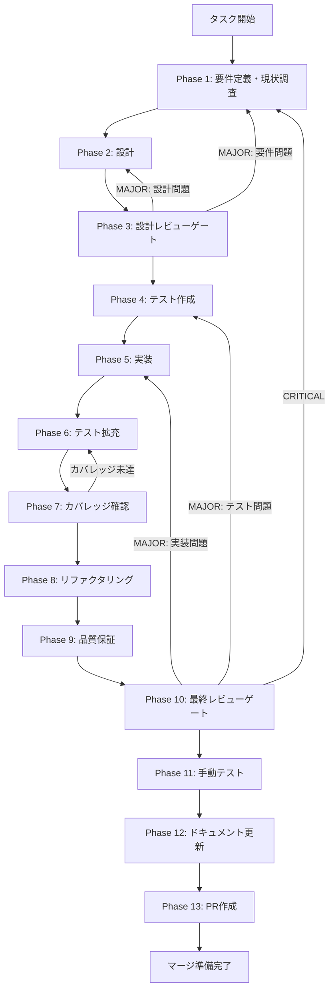

# task-p0-09-sdk-permission-hooks-governance - タスク実行仕様書

## ユーザーからの元の指示

```
GitHub Issue #1894 (TASK-P0-09: Claude Code SDK permission / hooks / audit ガバナンス)
に関するタスク仕様書を作成する。
実装は完了していないためタスク仕様書を作成すること。
コードの実装は行わない。
```

## メタ情報

| 項目         | 内容                                                                                   |
| ------------ | -------------------------------------------------------------------------------------- |
| タスクID     | TASK-P0-09                                                                             |
| タスク名     | Claude Code SDK permission / hooks / audit ガバナンス                                  |
| 分類         | セキュリティ・新機能（Feature Gap系）                                                  |
| 対象機能     | Skill Creator Agent SDK Lane - SDK実行ガバナンス                                       |
| 優先度       | 中                                                                                     |
| 見積もり規模 | 大規模                                                                                 |
| ステータス   | 未実施                                                                                 |
| 作成日       | 2026-04-06                                                                             |
| Issue        | #1894                                                                                  |
| 依存タスク   | TASK-RT-06, TASK-P0-03, TASK-P0-04 (全て先行完了必須)                                  |
| spec_path    | docs/30-workflows/unassigned-task/TASK-P0-09-claude-sdk-permission-hooks-governance.md |

---

## タスク概要

### 目的

Claude Code SDK の `query()` 実行前に、Facade 手前で permission / hooks 契約を正規化し、
phase 別（plan / execute / verify / improve）の安全境界を runtime で実効化する。
また audit 記録の基盤を整備し、Skill Creator 実行の可観測性を確保する。

### 背景

SDK `query()` を用いた Skill Creator 実行において、安全境界が未固定の状態：

1. **permission（allowedTools / permissionMode）の未固定**: phase 別の許可ツールセットが
   ハードコードまたは未設定のまま SDK に渡されている。
2. **hooks の未整備**: Skill Creator 実行専用の pre-execute / post-execute hooks が
   設計されていない。SDK セッション lifecycle イベントが audit 記録に接続されていない。
3. **audit 記録の欠如**: ツール呼び出し履歴の記録機構がなく、インシデント調査が困難。

### 最終ゴール

1. phase 別の `permissionMode` と `allowedTools` / `disallowedTools` が正しく SDK に渡される
2. Skill Creator 専用の hooks（onSessionStart / onPreToolUse / onPostToolUse / onSessionEnd）が
   SDK lifecycle に接続される
3. ツール呼び出し履歴（audit ログ）が session 単位で記録される
4. Facade 手前での permission / hooks 契約の正規化レイヤーが実装される
5. サブタスク（TASK-P0-09-U1）の前提条件が整う

### 実装対象ファイル

| ファイル                          | パス                                                                                | 変更種別  |
| --------------------------------- | ----------------------------------------------------------------------------------- | --------- |
| `SkillCreatorPermissionPolicy.ts` | `apps/desktop/src/main/services/runtime/governance/SkillCreatorPermissionPolicy.ts` | 新規/修正 |
| `SkillCreatorHooksFactory.ts`     | `apps/desktop/src/main/services/runtime/governance/SkillCreatorHooksFactory.ts`     | 新規/修正 |
| `SkillCreatorAuditSink.ts`        | `apps/desktop/src/main/services/runtime/governance/SkillCreatorAuditSink.ts`        | 新規      |
| `governance/index.ts`             | `apps/desktop/src/main/services/runtime/governance/index.ts`                        | 修正      |
| `RuntimeSkillCreatorFacade.ts`    | `apps/desktop/src/main/services/runtime/RuntimeSkillCreatorFacade.ts`               | 修正      |
| テスト                            | `apps/desktop/src/main/services/runtime/__tests__/governance/`                      | 新規      |

### スコープ境界

#### P0-09 の責務（本タスク）

- phase 別の permissionMode / allowedTools / disallowedTools 定義と SDK への適用
- Skill Creator 実行専用 hooks の設定（lifecycle hooks の実装）
- audit レコードの基本実装（in-memory ring buffer）
- Facade 手前での permission / hooks 契約正規化レイヤー

#### 他タスクの責務（本タスクのスコープ外）

- SDK メッセージ正規化レイヤー（TASK-RT-06 の責務 — 完了済み）
- manifest 配置（TASK-P0-03 の責務）
- ManifestLoader 有効化（TASK-P0-04 の責務）
- RuntimePolicyResolver 全体の再設計（TASK-SDK-07 で実装済み）
- path-scoped enforcement の実配線（TASK-P0-09-U1 の責務 — carry-forward）

---

## 参照ファイル

| 参照先                  | パス                                                                                            |
| ----------------------- | ----------------------------------------------------------------------------------------------- |
| unassigned-task 指示書  | `docs/30-workflows/unassigned-task/TASK-P0-09-claude-sdk-permission-hooks-governance.md`        |
| U1 サブタスク（A）      | `docs/30-workflows/unassigned-task/TASK-P0-09-U1-governance-actual-enforcement-completion.md`   |
| U1 サブタスク（B）      | `docs/30-workflows/unassigned-task/TASK-P0-09-U1-path-scoped-governance-runtime-enforcement.md` |
| aiworkflow-requirements | `.claude/skills/aiworkflow-requirements/references/`                                            |
| システム設計            | `docs/00-requirements/master_system_design.md`                                                  |

---

## タスク分解サマリー

| ID     | フェーズ | サブタスク名                 | 責務                                 | 依存 |
| ------ | -------- | ---------------------------- | ------------------------------------ | ---- |
| T-01-1 | Phase 1  | 現状調査・要件定義           | 実装状況確認・受入条件確定           | -    |
| T-02-1 | Phase 2  | 設計書作成                   | policy/hooks/audit/Facade 設計詳細化 | T-01 |
| T-03-1 | Phase 3  | 設計レビューゲート           | 設計品質検証・Phase 4 進行可否判定   | T-02 |
| T-04-1 | Phase 4  | テスト作成（TDD Red）        | governance テストケース全定義        | T-03 |
| T-05-1 | Phase 5  | 実装（TDD Green）            | 4ファイル実装・テスト PASS           | T-04 |
| T-06-1 | Phase 6  | テスト拡充                   | fail path・リングバッファ・edge case | T-05 |
| T-07-1 | Phase 7  | カバレッジ確認               | branch 80%・line 80%確認             | T-06 |
| T-08-1 | Phase 8  | リファクタリング             | 命名統一・重複除去・設計整合         | T-07 |
| T-09-1 | Phase 9  | 品質保証                     | typecheck・lint・full test PASS      | T-08 |
| T-10-1 | Phase 10 | 最終レビューゲート           | 受入条件全チェック・PASS/FAIL 判定   | T-09 |
| T-11-1 | Phase 11 | 手動テスト（NON_VISUAL）     | 自動テスト代替 PASS 記録             | T-10 |
| T-12-1 | Phase 12 | ドキュメント更新             | 実装ガイド・システム仕様更新         | T-11 |
| T-13-1 | Phase 13 | PR作成（ユーザー承認後のみ） | PR 作成・CI PASS 確認                | T-12 |

**総サブタスク数**: 13個

---

## 実行フロー図



---

## Phase一覧

| Phase | 名称               | 仕様書                                                       | ステータス |
| ----- | ------------------ | ------------------------------------------------------------ | ---------- |
| 1     | 要件定義           | [phase-1-requirements.md](phase-1-requirements.md)           | 未実施     |
| 2     | 設計               | [phase-2-design.md](phase-2-design.md)                       | 未実施     |
| 3     | 設計レビューゲート | [phase-3-design-review.md](phase-3-design-review.md)         | 未実施     |
| 4     | テスト作成         | [phase-4-test-creation.md](phase-4-test-creation.md)         | 未実施     |
| 5     | 実装               | [phase-5-implementation.md](phase-5-implementation.md)       | 未実施     |
| 6     | テスト拡充         | [phase-6-test-expansion.md](phase-6-test-expansion.md)       | 未実施     |
| 7     | カバレッジ確認     | [phase-7-coverage-check.md](phase-7-coverage-check.md)       | 未実施     |
| 8     | リファクタリング   | [phase-8-refactoring.md](phase-8-refactoring.md)             | 未実施     |
| 9     | 品質保証           | [phase-9-quality-assurance.md](phase-9-quality-assurance.md) | 未実施     |
| 10    | 最終レビューゲート | [phase-10-final-review.md](phase-10-final-review.md)         | 未実施     |
| 11    | 手動テスト         | [phase-11-manual-test.md](phase-11-manual-test.md)           | 未実施     |
| 12    | ドキュメント更新   | [phase-12-documentation.md](phase-12-documentation.md)       | 未実施     |
| 13    | PR作成             | [phase-13-pr-creation.md](phase-13-pr-creation.md)           | 未実施     |

---

## オーケストレーション

| フェーズ群 | SubAgent分担   | 実行形態 | 役割                                                                                                    |
| ---------- | -------------- | -------- | ------------------------------------------------------------------------------------------------------- |
| Phase 1-3  | A / B / C      | 並列可   | A: skill準拠差分抽出、B: 30種の思考法による設計監査、C: 依存関係・成果物・戻り先の整合確認              |
| Phase 4-11 | 内部タスク分割 | 直列中心 | 各 phase のタスクは phase 順に実行し、独立するファイル単位の確認や検証は並列化する                      |
| Phase 12   | A / B / C      | 並列可   | A: 実装ガイド・compliance、B: system spec / changelog、C: unassigned-task / skill feedback / validation |
| Phase 13   | -              | 保留     | ユーザーの明示承認後のみ実施する                                                                        |

---

## テストカバレッジ目標

### ユニットテスト

| 指標              | 最低基準 | 推奨基準 |
| ----------------- | -------- | -------- |
| Line Coverage     | 80%      | 90%      |
| Branch Coverage   | 80%      | 85%      |
| Function Coverage | 80%      | 90%      |

> **注意**: `SkillCreatorAuditSink.ts` の Branch Coverage は 80% 以上を必達とする。

### 統合テスト（governance 観点）

| 指標                                       | 目標 |
| ------------------------------------------ | ---- |
| governance phase 別 policy 網羅            | 100% |
| hooks lifecycle 全イベント（4種）          | 100% |
| Facade 統合（plan/execute/verify/improve） | 100% |
| audit sink ring buffer edge case           | 100% |

---

## Phase完了時の必須アクション

各Phase完了時に以下を必ず実行すること:

1. **タスク100%実行**: Phase内で指定された全タスクを完全に実行
2. **成果物確認**: 全ての必須成果物が生成されていることを検証
3. **artifacts.json更新**: Phase完了ステータスを更新
4. **完了記録**: 各タスクを完遂した旨を必ず明記

```bash
# Phase完了時の検証コマンド
node .claude/skills/task-specification-creator/scripts/validate-phase-output.js \
  docs/30-workflows/task-p0-09-sdk-permission-hooks-governance --phase {{PHASE_NUMBER}}

# Phase完了・成果物登録
node .claude/skills/task-specification-creator/scripts/complete-phase.js \
  --workflow docs/30-workflows/task-p0-09-sdk-permission-hooks-governance \
  --phase {{PHASE_NUMBER}} --artifacts "..."
```

---

## リスクと対策

| リスク                                                                         | 影響度 | 発生確率 | 対策                                                                 |
| ------------------------------------------------------------------------------ | ------ | -------- | -------------------------------------------------------------------- |
| 既存の governance ファイルが部分実装のため、全範囲の把握が困難                 | 高     | 中       | Phase 1 で全ファイルを精査し、実装済み/未実装/部分実装を一覧表で整理 |
| TASK-P0-09-U1 との実装境界が曖昧になり、本タスクのスコープが肥大化             | 中     | 中       | Phase 1 で U1 サブタスクの carry-forward 内容を確認し境界を明記      |
| `RuntimeSkillCreatorFacade.ts` が大きいため、governance 変更箇所の特定が難しい | 中     | 低       | Phase 2 で変更箇所を明示リストとして記録する                         |
| audit sink の in-memory 実装がメモリリークを引き起こす                         | 高     | 低       | ring buffer の maxEvents を設定し、session 終了時に clear() を呼ぶ   |
| TASK-RT-06 が完了していない場合、Facade 統合が競合する                         | 高     | 低       | Phase 1 開始前に依存タスクの完了状況を確認する                       |

---

## 変更履歴

| Version | Date       | Changes                                        |
| ------- | ---------- | ---------------------------------------------- |
| 1.0.0   | 2026-04-06 | 初版作成（Issue #1894 に基づくタスク仕様書化） |
