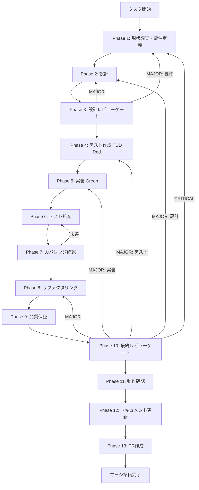

# TASK-P0-09-U1: path-scoped-governance-runtime-enforcement

## ユーザーからの元の指示

Issue #1932: TASK-P0-09のPhase 12で検出されたunassigned-task。RuntimeSkillCreatorFacadeのexecute/improve phaseでcanUseTool callbackにpath-scoped denyロジックが接続されていないセキュリティホールを修正する。

## メタ情報

| 項目         | 内容                                                     |
| ------------ | -------------------------------------------------------- |
| タスクID     | TASK-P0-09-U1                                            |
| タスク名     | path-scoped-governance-runtime-enforcement               |
| 分類         | セキュリティ                                             |
| 対象機能     | RuntimeSkillCreatorFacade / SkillCreatorPermissionPolicy |
| 優先度       | 高                                                       |
| 見積もり規模 | 小規模                                                   |
| ステータス   | phase_12_completed                                       |
| 発見元       | Phase 12（TASK-P0-09 unassigned-task-detection）         |
| 親タスク     | TASK-P0-09                                               |
| 作成日       | 2026-04-06                                               |
| Issue        | #1932                                                    |

---

## タスク概要

### 目的

`execute`（および `improve`）の SDK callback を `canUseTool(toolName, phase, context)` に接続し、path-scoped deny を runtime で実効化する。

### 背景

TASK-P0-09 で governance 基盤（policy/hooks/audit）を整備した。`execute` phase での tool-level enforcement は機能しているが、`SkillCreatorPermissionPolicy.evaluateContextPolicy()` が持つ **path-scoped deny** ロジックは SDK 実行経路に接続されておらず、runtime で発動していない。

### 実行方針

- Phase 1 と Phase 2 は別 SubAgent で並列に進め、Phase 3 はその結果を受けてレビューする。
- `execute` と `improve` は同じ path-scoped 配線の家族として扱い、共通 helper で同時に修正する。
- Phase 12 は `12-1`〜`12-5` を並列、`12-6` を最後に実行する。

**現在の実装（配線なし）**:

```typescript
private createExecuteGovernanceCanUseTool() {
  return async (
    toolName: string,
    _input: Record<string, unknown>,  // ← 使っていない
    options: { toolUseID: string },
  ) => {
    const decision = evaluateGovernanceToolUse(toolName, "execute");
    // ↑ context 引数なし → path-scoped 判定が発動しない
    ...
  };
}
```

### 最終ゴール

1. `execute` phase での Write/Edit 呼び出し時に `input.file_path`（または `input.path`）を `targetPath` として抽出し、`allowedSkillRoot` 外であれば `deny` を返す
2. `improve` phase でも同一の `targetPath` / `allowedSkillRoot` 配線が有効である
3. 既存 90 件 governance tests が全 PASS を維持する
4. path-scoped enforcement に関する統合テストが追加されて PASS する

### 受入基準

| ID   | 基準                                                                              |
| ---- | --------------------------------------------------------------------------------- |
| AC-1 | `execute` phase で skill root 外への Write/Edit が `deny` される                  |
| AC-2 | `execute` phase で skill root 内への Write/Edit が `allow` される                 |
| AC-3 | context が取得できない場合（`targetPath` なし）は tool-level 判定のみ（後方互換） |
| AC-4 | 既存 90 件 governance tests が全 PASS                                             |
| AC-5 | TypeScript 型エラーなし                                                           |

### スコープ

**含むもの**:

- `RuntimeSkillCreatorFacade.createExecuteGovernanceCanUseTool()` への `targetPath` 抽出と context 接続
- path-scoped enforcement に関するテスト追加
- `improve` phase の canUseTool context 接続

**含まないもの**:

- `SkillCreatorPermissionPolicy.evaluateContextPolicy()` の改変（実装済み・テスト済みのため）
- renderer 側 governance 表示 UI（将来スコープ）
- audit 永続化（将来スコープ）

### 成果物一覧

| 種別         | 成果物                               | 配置先                                                                |
| ------------ | ------------------------------------ | --------------------------------------------------------------------- |
| 実装         | RuntimeSkillCreatorFacade.ts（修正） | `apps/desktop/src/main/services/runtime/RuntimeSkillCreatorFacade.ts` |
| テスト       | governance統合テスト追加             | `apps/desktop/src/main/services/runtime/__tests__/governance/`        |
| ドキュメント | implementation-guide.md              | `outputs/phase-12/`                                                   |
| ドキュメント | system-spec-update-summary.md        | `outputs/phase-12/`                                                   |

---

## 参照ファイル

| 参照資料                        | パス                                                                                               |
| ------------------------------- | -------------------------------------------------------------------------------------------------- |
| TASK-P0-09-U1 指示書            | `docs/30-workflows/unassigned-task/TASK-P0-09-U1-path-scoped-governance-runtime-enforcement.md`    |
| TASK-P0-09 実装記録             | `docs/30-workflows/completed-tasks/step-10-seq-task-p0-09-claude-sdk-permission-hooks-governance/` |
| RuntimeSkillCreatorFacade.ts    | `apps/desktop/src/main/services/runtime/RuntimeSkillCreatorFacade.ts`                              |
| SkillCreatorPermissionPolicy.ts | `apps/desktop/src/main/services/runtime/governance/SkillCreatorPermissionPolicy.ts`                |
| governance テスト               | `apps/desktop/src/main/services/runtime/__tests__/governance/`                                     |

---

## タスク分解サマリー

| ID     | フェーズ | サブタスク名           | 責務                             | 依存 |
| ------ | -------- | ---------------------- | -------------------------------- | ---- |
| T-01-1 | Phase 1  | 現状調査・要件定義     | 接続すべき箇所と影響範囲を確定   | -    |
| T-02-1 | Phase 2  | 設計                   | 変更箇所と影響範囲を設計         | T-01 |
| T-03-1 | Phase 3  | 設計レビュー           | 既存テスト・型安全性への影響確認 | T-02 |
| T-04-1 | Phase 4  | テスト作成（TDD Red）  | 失敗するテストを先に書く         | T-03 |
| T-05-1 | Phase 5  | 実装（Green）          | テストを通す実装                 | T-04 |
| T-06-1 | Phase 6  | テスト拡充             | エッジケース追加                 | T-05 |
| T-07-1 | Phase 7  | カバレッジ確認         | branch coverage 80%+ 達成        | T-06 |
| T-08-1 | Phase 8  | リファクタリング       | 共通helper抽出・重複排除         | T-07 |
| T-09-1 | Phase 9  | 品質保証               | lint/typecheck/全テスト PASS     | T-08 |
| T-10-1 | Phase 10 | 最終レビュー           | 設計・実装・テストの仕様充足確認 | T-09 |
| T-11-1 | Phase 11 | 動作確認（NON_VISUAL） | テスト証跡記録                   | T-10 |
| T-12-1 | Phase 12 | ドキュメント更新       | 実装結果記録・次担当者引き継ぎ   | T-11 |
| T-13-1 | Phase 13 | PR作成                 | レビュー依頼                     | T-12 |

**総サブタスク数**: 13個

---

## 実行フロー図



---

## Phase一覧

| Phase | 名称                  | 仕様書                                                       | ステータス |
| ----- | --------------------- | ------------------------------------------------------------ | ---------- |
| 1     | 現状調査・要件定義    | [phase-1-requirements.md](phase-1-requirements.md)           | 完了       |
| 2     | 設計                  | [phase-2-design.md](phase-2-design.md)                       | 完了       |
| 3     | 設計レビューゲート    | [phase-3-design-review.md](phase-3-design-review.md)         | 完了       |
| 4     | テスト作成（TDD Red） | [phase-4-test-creation.md](phase-4-test-creation.md)         | 完了       |
| 5     | 実装（Green）         | [phase-5-implementation.md](phase-5-implementation.md)       | 完了       |
| 6     | テスト拡充            | [phase-6-test-expansion.md](phase-6-test-expansion.md)       | 完了       |
| 7     | カバレッジ確認        | [phase-7-coverage-check.md](phase-7-coverage-check.md)       | 完了       |
| 8     | リファクタリング      | [phase-8-refactoring.md](phase-8-refactoring.md)             | 完了       |
| 9     | 品質保証              | [phase-9-quality-assurance.md](phase-9-quality-assurance.md) | 完了       |
| 10    | 最終レビューゲート    | [phase-10-final-review.md](phase-10-final-review.md)         | 完了       |
| 11    | 動作確認              | [phase-11-manual-test.md](phase-11-manual-test.md)           | 完了       |
| 12    | ドキュメント更新      | [phase-12-documentation.md](phase-12-documentation.md)       | 完了       |
| 13    | PR作成                | [phase-13-pr-creation.md](phase-13-pr-creation.md)           | 未実施     |

---

## テストカバレッジ目標

| 指標              | 最低基準 | 推奨基準 |
| ----------------- | -------- | -------- |
| Line Coverage     | 80%      | 90%      |
| Branch Coverage   | 80%      | 90%      |
| Function Coverage | 80%      | 90%      |

---

## 苦戦箇所・知見（TASK-P0-09 実装時に蓄積）

### 知見 1: SDK callback から `targetPath` を安全に抽出

`input?.file_path ?? input?.path` の fallback パターンで両方を拾い、存在しない場合は context なし（tool-level 判定のみ）として扱うことで後方互換を保つ。

### 知見 2: 「判定ロジック層」と「配線層」の責任分離

`SkillCreatorPermissionPolicy.evaluateContextPolicy()` は実装・テスト済みのため改変禁止。配線層（`RuntimeSkillCreatorFacade`）のみを修正する。

### 知見 3: `improve` phase の配線漏れ防止

`createExecuteGovernanceCanUseTool()` と `createImproveGovernanceCanUseTool()` を同時に追加するか、共通 helper に切り出して漏れを防止する。

---

## リスクと対策

| リスク                                             | 影響度 | 発生確率 | 対策                                                       |
| -------------------------------------------------- | ------ | -------- | ---------------------------------------------------------- |
| SDK バージョンアップで `input` キー名が変わる      | 高     | 低       | `file_path ?? path` fallback パターンで吸収                |
| `skillRoot` が取得できない場合に false deny が発生 | 高     | 低       | `skillRoot` が空/undefined の場合は context なし扱いにする |
| `improve` phase の接続漏れ                         | 中     | 中       | Phase 5 実装時にチェックリストで `improve` も確認          |
| 既存テストの破壊                                   | 高     | 低       | Phase 4 前に全テストが PASS していることを確認してから着手 |
