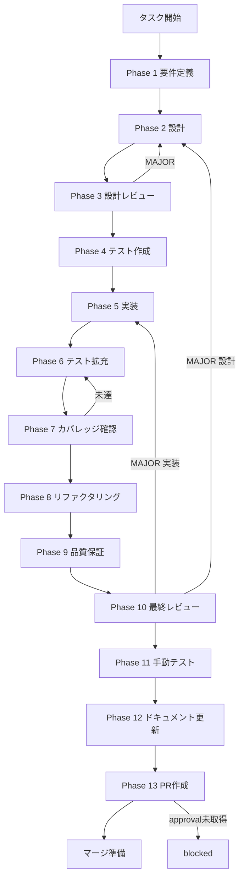

# task-rt-02-api-key-ui-adapter-status - タスク実行仕様書

## ユーザーからの元の指示

```text
TASK-RT-01 で実装した LLMAdapterStatus の状態遷移をUI側に反映し、
APIキー管理画面で adapter の状態（initializing / ready / failed）をユーザーに可視化する。
failed 状態時のリトライ導線もUI側で提供する。
```

## メタ情報

| 項目         | 内容                                             |
| ------------ | ------------------------------------------------ |
| タスクID     | TASK-RT-02-API-KEY-UI-ADAPTER-STATUS-INTEGRATION |
| タスク名     | APIキー管理画面 adapter status UI 連携           |
| 分類         | UI task                                          |
| 対象機能     | Settings / API Key 管理 / LLM health 表示        |
| 優先度       | 高                                               |
| 見積もり規模 | 中規模                                           |
| ステータス   | spec_created                                     |
| 作成日       | 2026-03-29                                       |
| GitHub Issue | #1705                                            |
| 親タスク     | TASK-RT-02                                       |

---

## タスク概要

### 目的

APIキー管理画面で、各プロバイダーの接続状態を「確認中 / 利用可能 / 要再試行」の形で即座に把握できるようにする。実装は `RuntimeSkillCreatorFacade` の private 状態を public contract 化するのではなく、既存の `apiKey.list` と `llm.checkHealth` を再利用して UI 局所状態で完結させる。

### 背景

TASK-RT-01 では Runtime Skill Creator 向けに `llmAdapterStatus` と `llmAdapterFailureReason` が導入された。一方、APIキー管理画面は `ApiKeysSection` が既に `apiKey.list/save/delete/validate` を介して独立に構成されており、Skill Creator 専用 runtime をそのまま Settings 画面の public surface に昇格させると、責務境界と IPC 契約が不要に広がる。

### 最終ゴール

- APIキー管理画面で各 provider 行に接続状態バッジを表示できる
- 登録済みキーに対して `llm.checkHealth(providerId)` を実行し、`connected` を `ready`、`disconnected/error` を `failed`、進行中を `initializing` として表示できる
- `failed` 行には再確認 CTA を表示し、再実行後に局所状態だけを更新できる
- 既存の API key 一覧取得・保存・削除フロー、および `llm` public IPC 契約を壊さない
- WCAG 2.1 AA に必要な status / busy / retry 導線を満たす

### エレガント方針

| 判断対象                                     | 採用       | 理由                                               |
| -------------------------------------------- | ---------- | -------------------------------------------------- |
| 新規 public IPC チャンネル追加               | しない     | 既存 `llm.checkHealth` で要件を満たせる            |
| 新規 shared 型追加                           | しない     | `HealthCheckResult` と既存 `ProviderStatus` で十分 |
| global `llmSlice` 拡張                       | 原則しない | Settings 局所関心を global store に持ち込まない    |
| `ApiKeysSection` 局所状態拡張                | する       | 既存実装と責務境界が最も自然                       |
| Runtime Skill Creator private 状態の直接露出 | しない     | Settings と Skill Creator runtime の境界を守る     |

---

## 30種思考法の適用結果

### 論理分析系

| 思考法         | 一次結論                                                                                    |
| -------------- | ------------------------------------------------------------------------------------------- |
| 批判的思考     | 「新規 IPC を増やす必要が本当にあるか」を再検証し、不要と判断                               |
| 演繹思考       | 既存 public contract があるなら、それを優先再利用すべきと結論                               |
| 帰納的思考     | 現行コードの `ApiKeysSection` / `llm.checkHealth` / `healthStatus` から局所実装が自然と判断 |
| アブダクション | 過剰設計の根本原因は RT-01 private runtime を UI task へ過剰転写したこと                    |
| 垂直思考       | 追加最小単位は Settings 局所 state と表示コンポーネントのみ                                 |

### 構造分解系

| 思考法       | 一次結論                                                                       |
| ------------ | ------------------------------------------------------------------------------ |
| 要素分解     | concern は `API key list` / `health check` / `view state` / `retry UX` の4点   |
| MECE         | API key 管理、health 表示、retry、a11y、テストを重複なく分離                   |
| 2軸思考      | `public/private` と `global/local` の2軸で、public+local を採用                |
| プロセス思考 | 画面表示は mount → list → per-provider health check → retry の直線フローに整理 |

### メタ・抽象系

| 思考法             | 一次結論                                                                   |
| ------------------ | -------------------------------------------------------------------------- |
| メタ思考           | 仕様が RT-01 の内部事情に引っ張られていた前提自体を見直した                |
| 抽象化思考         | 必要なのは「adapter 内部状態そのもの」ではなく「ユーザーに見せる接続状態」 |
| ダブル・ループ思考 | 「状態を通知するために新規イベントが必要」という前提を破棄した             |

### 発想・拡張系

| 思考法               | 一次結論                                                                 |
| -------------------- | ------------------------------------------------------------------------ |
| ブレインストーミング | 新規 IPC / polling / local health check / store reuse の候補を比較       |
| 水平思考             | Skill Creator runtime ではなく既存 LLM health 導線へ横展開した           |
| 逆説思考             | 「状態同期を増やさない方が状態不整合を減らせる」と捉え直した             |
| 類推思考             | `ApiKeysSection` は認証状況 UI に近く、chat runtime state とは別物と整理 |
| if思考               | 将来リアルタイム push が必要になっても、その時に限定拡張すればよい       |
| 素人思考             | ユーザーが欲しいのは「今使えるか」と「もう一度試す」の2点だと簡約化      |

### システム系

| 思考法       | 一次結論                                                             |
| ------------ | -------------------------------------------------------------------- |
| システム思考 | Main / Preload / Renderer / Settings UI の境界をこれ以上増やさない   |
| 因果関係分析 | public IPC 追加は preload/types/tests/spec sync の追従コストを増やす |
| 因果ループ   | 契約を増やすほど drift 検知と Phase 12 同期コストが増幅する          |

### 戦略・価値系

| 思考法           | 一次結論                                                     |
| ---------------- | ------------------------------------------------------------ |
| トレードオン思考 | リアルタイム push を捨て、低複雑性と高整合性を取る           |
| プラスサム思考   | UI価値を上げつつ IPC 契約増加を避けられる                    |
| 価値提案思考     | ユーザー価値は障害可視化と再試行であり、契約拡張自体ではない |
| 戦略的思考       | Settings 系 task は Settings 既存 contract に寄せる          |

### 問題解決系

| 思考法   | 一次結論                                                                     |
| -------- | ---------------------------------------------------------------------------- |
| why思考  | なぜ重いのか: RT-01 private state を public requirement と誤認したため       |
| 改善思考 | 既存 API 再利用 + 局所 state に統一                                          |
| 仮説思考 | health check 再実行だけで retry UX を成立できる仮説を採用                    |
| 論点思考 | 真の論点は「状態表示」ではなく「どの契約で露出するか」                       |
| KJ法     | 収束先を「public contract」「local state」「retry UX」「Phase12 sync」に集約 |

---

## タスク分解サマリー

| ID     | フェーズ | サブタスク名     | 責務                                         | 依存 |
| ------ | -------- | ---------------- | -------------------------------------------- | ---- |
| T-01-1 | Phase 1  | 要件定義         | スコープ、FR/NFR、受入基準、境界条件の確定   | -    |
| T-02-1 | Phase 2  | 設計             | 既存 API 再利用前提の UI / local state 設計  | T-01 |
| T-03-1 | Phase 3  | 設計レビュー     | private/public 境界と成果物整合の確認        | T-02 |
| T-04-1 | Phase 4  | テスト作成       | Red テスト設計                               | T-03 |
| T-05-1 | Phase 5  | 実装             | `ApiKeysSection` / status badge / retry 実装 | T-04 |
| T-06-1 | Phase 6  | テスト拡充       | 異常系・a11y・回帰テスト追加                 | T-05 |
| T-07-1 | Phase 7  | カバレッジ確認   | 対象 UI / helper の coverage 確認            | T-06 |
| T-08-1 | Phase 8  | リファクタリング | 表示変換と状態計算の重複排除                 | T-07 |
| T-09-1 | Phase 9  | 品質保証         | lint / type / tests / IPC drift audit        | T-08 |
| T-10-1 | Phase 10 | 最終レビュー     | AC と rollback point の確認                  | T-09 |
| T-11-1 | Phase 11 | 手動テスト       | UI evidence と accessibility walkthrough     | T-10 |
| T-12-1 | Phase 12 | ドキュメント更新 | 実装ガイド、spec sync、未タスク、feedback    | T-11 |
| T-13-1 | Phase 13 | PR作成           | user approval 後のみ実施                     | T-12 |

**総サブタスク数**: 13

---

## 実行フロー図



---

## 参照ファイル

- `.claude/skills/task-specification-creator/` - Phase 構造と Phase 12 close-out 基準
- `.claude/skills/aiworkflow-requirements/references/api-ipc-system-core.md` - 既存 `llm` public IPC 契約
- `.claude/skills/aiworkflow-requirements/references/security-electron-ipc-core.md` - `safeInvoke` / preload 公開境界
- `.claude/skills/aiworkflow-requirements/references/arch-state-management-core.md` - global slice 増設抑制の原則
- `apps/desktop/src/renderer/components/organisms/ApiKeysSection/index.tsx` - 現行 Settings UI
- `apps/desktop/src/main/handlers/llm.ts` - `handleCheckHealth()`
- `apps/desktop/src/main/infrastructure/apiKeyStorage.ts` - `listProviders()`

---

## Phase一覧

| Phase | 名称             | 仕様書                                                       | ステータス   |
| ----- | ---------------- | ------------------------------------------------------------ | ------------ |
| 1     | 要件定義         | [phase-1-requirements.md](phase-1-requirements.md)           | spec_created |
| 2     | 設計             | [phase-2-design.md](phase-2-design.md)                       | spec_created |
| 3     | 設計レビュー     | [phase-3-design-review.md](phase-3-design-review.md)         | spec_created |
| 4     | テスト作成       | [phase-4-test-creation.md](phase-4-test-creation.md)         | spec_created |
| 5     | 実装             | [phase-5-implementation.md](phase-5-implementation.md)       | spec_created |
| 6     | テスト拡充       | [phase-6-test-expansion.md](phase-6-test-expansion.md)       | spec_created |
| 7     | カバレッジ確認   | [phase-7-coverage-check.md](phase-7-coverage-check.md)       | spec_created |
| 8     | リファクタリング | [phase-8-refactoring.md](phase-8-refactoring.md)             | spec_created |
| 9     | 品質保証         | [phase-9-quality-assurance.md](phase-9-quality-assurance.md) | spec_created |
| 10    | 最終レビュー     | [phase-10-final-review.md](phase-10-final-review.md)         | spec_created |
| 11    | 手動テスト       | [phase-11-manual-test.md](phase-11-manual-test.md)           | spec_created |
| 12    | ドキュメント更新 | [phase-12-documentation.md](phase-12-documentation.md)       | spec_created |
| 13    | PR作成           | [phase-13-pr-creation.md](phase-13-pr-creation.md)           | blocked      |

---

## テストカバレッジ目標

| 指標              | 最低基準 | 主対象                                        |
| ----------------- | -------- | --------------------------------------------- |
| Line Coverage     | 80%      | status helper / `ApiKeysSection` / 新規 badge |
| Branch Coverage   | 60%      | ready/initializing/failed / retry / no-key    |
| Function Coverage | 80%      | refresh / derive / retry                      |

---

## Phase完了時の必須アクション

1. Phase 内タスクを全件実行し、未完了は明示的に blocked / N/A を判定する
2. `artifacts.json` と phase 本文の成果物名を 1:1 で保つ
3. Phase 12 では `outputs/phase-12/*.md` に planned wording を残さない
4. Phase 13 は user approval 未取得の限り `blocked` を維持する

```bash
node .claude/skills/task-specification-creator/scripts/validate-phase-output.js \
  docs/30-workflows/task-rt-02-api-key-ui-adapter-status --phase {{PHASE_NUMBER}}
```
