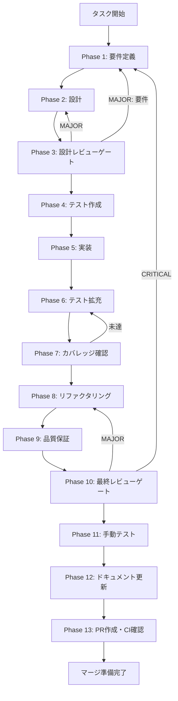

# TASK-SC-13: skill-creator:verify チャネル実装 - タスク実行仕様書

## ユーザーからの元の指示

```
Issue #1635: [TASK-SC-13] skill-creator:verify チャネル実装
skill-creator:verify IPC チャネルを実装し、生成されたスキルの検証機能（FR-4）を
RuntimeSkillCreatorFacade 経由で提供する。
```

## メタ情報

| 項目         | 内容                                                                          |
| ------------ | ----------------------------------------------------------------------------- |
| タスクID     | TASK-SC-13                                                                    |
| タスク名     | skill-creator-verify-channel-implementation                                   |
| タスク種別   | NON_VISUAL                                                                    |
| 分類         | 改善                                                                          |
| 対象機能     | SkillCreator                                                                  |
| 優先度       | 高                                                                            |
| 見積もり規模 | 中規模                                                                        |
| ステータス   | 未実施                                                                        |
| 作成日       | 2026-04-08                                                                    |
| GitHub Issue | #1635                                                                         |
| 元タスク仕様 | docs/30-workflows/unassigned-task/TASK-SC-13-VERIFY-CHANNEL-IMPLEMENTATION.md |

---

## タスク概要

### 目的

`skill-creator:verify` IPC チャネルを実装し、生成されたスキルの検証機能（FR-4）を
`RuntimeSkillCreatorFacade` 経由で提供する。`artifacts.json` の `ipcChannels` に
`skill-creator:verify` が定義済みだが、以下の4箇所が未実装であるため、既存の
`plan/execute/improve` パターンに従い統一的に実装する。

### 背景

TASK-SC-08-E2E-VALIDATION の E2E テスト実装時に発見された未実装チャネル。
以下の4箇所が未実装のデッドコード状態になっている：

1. `channels.ts`: `SKILL_CREATOR_VERIFY` 定数が未定義
2. `creatorHandlers.ts`: verify ハンドラが未登録
3. `skill-creator-api.ts`: Preload API に verify メソッドが未公開
4. `RuntimeSkillCreatorFacade.ts`: `verify()` メソッドが未定義

### 最終ゴール

- `skill-creator:verify` チャネルが正常に動作する
- verify レスポンスが `IpcResult<VerifyResult>` 形式である
- エラー時にサニタイズされたエラーメッセージが返る
- 既存の `plan/execute/improve` テストが影響を受けない
- TypeScript 型チェック PASS・関連テスト全件 PASS

### 成果物一覧

| 種別          | 成果物                                 | 配置先                                                                |
| ------------- | -------------------------------------- | --------------------------------------------------------------------- |
| 機能（型）    | VerifyResult 型定義                    | `packages/shared/src/types/skillCreator.ts`                           |
| 機能（IPC）   | SKILL_CREATOR_VERIFY 定数              | `packages/shared/src/ipc/channels.ts`                                 |
| 機能（Main）  | verify() メソッド                      | `apps/desktop/src/main/services/runtime/RuntimeSkillCreatorFacade.ts` |
| 機能（Main）  | verify ハンドラ                        | `apps/desktop/src/main/ipc/creatorHandlers.ts`                        |
| 機能（Pre）   | verifySkill() メソッド                 | `apps/desktop/src/preload/skill-creator-api.ts`                       |
| テスト（UT）  | verify ハンドラ UT                     | `apps/desktop/src/main/ipc/__tests__/creatorHandlers.verify.test.ts`  |
| テスト（E2E） | skill-creator-integration.test.ts 追加 | `apps/desktop/src/test/skill-creator-integration.test.ts`             |
| ドキュメント  | Phase 12 成果物一式                    | `outputs/phase-12/`                                                   |
| PR            | GitHub Pull Request                    | GitHub UI                                                             |

---

## 参照ファイル

| ファイル                                                            | 説明                                                          |
| ------------------------------------------------------------------- | ------------------------------------------------------------- |
| `docs/30-workflows/w5b-sc-e2e-terminal-handoff/artifacts.json` L141 | `skill-creator:verify` 定義済みチャネル                       |
| `apps/desktop/src/main/ipc/creatorHandlers.ts`                      | 既存ハンドラパターン（plan/execute/improve/applyImprovement） |
| `apps/desktop/src/test/helpers/skill-creator-test-helpers.ts`       | テストヘルパー                                                |
| `packages/shared/src/ipc/channels.ts`                               | IPC チャネル定数定義                                          |
| `packages/shared/src/types/skillCreator.ts`                         | 共有型定義                                                    |
| `apps/desktop/src/preload/skill-creator-api.ts`                     | Preload API                                                   |

---

## タスク分解サマリー

| ID     | フェーズ | サブタスク名                         | 責務                                     | 依存 |
| ------ | -------- | ------------------------------------ | ---------------------------------------- | ---- |
| T-01-1 | Phase 1  | P50チェック・スコープ確定            | 実装状態確認・受入基準定義               | -    |
| T-02-1 | Phase 2  | 型・IPC定数・実装設計                | VerifyResult型・チャネル定数・4層設計    | T-01 |
| T-03-1 | Phase 3  | 設計レビューゲート                   | Phase 4へ進行可否判定                    | T-02 |
| T-04-1 | Phase 4  | TDD Red: verify UT作成               | creatorHandlers.verify.test.ts 作成      | T-03 |
| T-04-2 | Phase 4  | TDD Red: E2E テストケース追加        | skill-creator-integration.test.ts 追記   | T-03 |
| T-05-1 | Phase 5  | 型定義追加 (VerifyResult)            | packages/shared/src/types 更新           | T-04 |
| T-05-2 | Phase 5  | channels.ts に定数追加               | SKILL_CREATOR_VERIFY 追加                | T-04 |
| T-05-3 | Phase 5  | RuntimeSkillCreatorFacade.verify()   | verify メソッド実装                      | T-04 |
| T-05-4 | Phase 5  | creatorHandlers.ts ハンドラ追加      | verify ハンドラ登録                      | T-04 |
| T-05-5 | Phase 5  | skill-creator-api.ts verifySkill追加 | Preload API 追加                         | T-04 |
| T-06-1 | Phase 6  | テスト拡充（fail path・境界値）      | 追加テストケース追加                     | T-05 |
| T-07-1 | Phase 7  | カバレッジ確認                       | 変更ファイルの line/branch coverage 確認 | T-06 |
| T-08-1 | Phase 8  | リファクタリング                     | Before/After/理由テーブル記録            | T-07 |
| T-09-1 | Phase 9  | 品質保証                             | typecheck・lint・test 全件 PASS          | T-08 |
| T-10-1 | Phase 10 | 最終レビューゲート                   | AC 全件検証・マージ可否判定              | T-09 |
| T-11-1 | Phase 11 | 手動テスト（NON_VISUAL）             | IPC 動作確認・証跡記録                   | T-10 |
| T-12-1 | Phase 12 | ドキュメント更新                     | implementation-guide 等 5成果物作成      | T-11 |
| T-13-1 | Phase 13 | PR 作成                              | ユーザー承認後に実施                     | T-12 |

**総サブタスク数**: 18個

---

## 実行フロー図



---

## Phase一覧

| Phase | 名称               | 仕様書                                                       | ステータス |
| ----- | ------------------ | ------------------------------------------------------------ | ---------- |
| 1     | 要件定義           | [phase-1-requirements.md](phase-1-requirements.md)           | 未実施     |
| 2     | 設計               | [phase-2-design.md](phase-2-design.md)                       | 未実施     |
| 3     | 設計レビューゲート | [phase-3-design-review.md](phase-3-design-review.md)         | 未実施     |
| 4     | テスト作成         | [phase-4-test-creation.md](phase-4-test-creation.md)         | 未実施     |
| 5     | 実装               | [phase-5-implementation.md](phase-5-implementation.md)       | 未実施     |
| 6     | テスト拡充         | [phase-6-test-expansion.md](phase-6-test-expansion.md)       | 未実施     |
| 7     | カバレッジ確認     | [phase-7-coverage-check.md](phase-7-coverage-check.md)       | 未実施     |
| 8     | リファクタリング   | [phase-8-refactoring.md](phase-8-refactoring.md)             | 未実施     |
| 9     | 品質保証           | [phase-9-quality-assurance.md](phase-9-quality-assurance.md) | 未実施     |
| 10    | 最終レビューゲート | [phase-10-final-review.md](phase-10-final-review.md)         | 未実施     |
| 11    | 手動テスト         | [phase-11-manual-test.md](phase-11-manual-test.md)           | 未実施     |
| 12    | ドキュメント更新   | [phase-12-documentation.md](phase-12-documentation.md)       | 未実施     |
| 13    | PR作成             | [phase-13-pr-creation.md](phase-13-pr-creation.md)           | 未実施     |

---

## テストカバレッジ目標

### ユニットテスト（変更ファイル対象）

| 指標              | 最低基準 | 推奨基準 |
| ----------------- | -------- | -------- |
| Line Coverage     | 85%      | 90%+     |
| Branch Coverage   | 70%      | 80%+     |
| Function Coverage | 90%      | 100%     |

### E2E テスト

| 項目                             | 目標 |
| -------------------------------- | ---- |
| verify 正常系シナリオ            | 100% |
| verify エラー系シナリオ          | 100% |
| 既存 plan/execute/improve テスト | PASS |

---

## 苦戦箇所（TASK-SC-08 実装知見）

| 苦戦箇所                     | 問題                                                                           | 解決策                                                                                                                             |
| ---------------------------- | ------------------------------------------------------------------------------ | ---------------------------------------------------------------------------------------------------------------------------------- |
| P60 IPC 応答形式             | 仕様書では `error: { code, message }` と想定していたが、実際は `error: string` | `creatorHandlers.ts` の `sanitizeErrorMessage()` パターンに統一する。テストでは `assertIpcError(result, "expected string")` を使用 |
| HandoffGuidance フィールド名 | 仕様書では `suggestedCommand` だが実装は `terminalCommand`                     | `@repo/shared/types/handoff.ts` の `HandoffGuidance` 型を正本とする                                                                |
| esbuild worktree 不一致      | worktree 環境で esbuild バージョン不一致（0.21.5 vs 0.27.4）                   | `pnpm install` で解決。worktree 作成直後に `pnpm install` を実行すること                                                           |

---

## Phase完了時の必須アクション

**各Phase完了時に以下を必ず実行すること:**

1. **タスク100%実行**: Phase内で指定された全タスクを完全に実行
2. **成果物確認**: 全ての必須成果物が生成されていることを検証
3. **実行記録**: 実行タスクの結果を記録
4. **artifacts.json更新**: Phase完了ステータスを更新
5. **Phase末端の実行確認**: 各タスクを100%実行し、完遂した旨を必ず明記

```bash
# Phase完了時の検証コマンド
node .claude/skills/task-specification-creator/scripts/validate-phase-output.js \
  docs/30-workflows/task-sc-13-verify-channel-implementation --phase {{PHASE_NUMBER}}

# Phase完了・成果物登録
node .claude/skills/task-specification-creator/scripts/complete-phase.js \
  --workflow docs/30-workflows/task-sc-13-verify-channel-implementation \
  --phase {{PHASE_NUMBER}} --artifacts "..."
```
