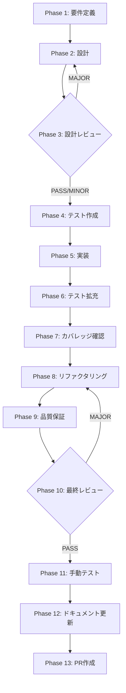

# TASK-UI-03-REMAINING: IPC renderer 移行完了

## メタ情報

| 項目         | 内容                                                          |
| ------------ | ------------------------------------------------------------- |
| タスクID     | TASK-UI-03-REMAINING                                          |
| タスク名     | IPC renderer 移行完了（旧経路2コンポーネント + 設計文書整備） |
| 分類         | リファクタリング                                              |
| タスク種別   | refactor / NON_VISUAL                                         |
| 対象機能     | Skill Creator IPC 通信層                                      |
| 優先度       | P0                                                            |
| 見積もり規模 | 小規模                                                        |
| 証跡方式     | NON_VISUAL（renderer は API 参照先のみ移行）                  |
| ステータス   | spec_created                                                  |
| 作成日       | 2026-04-07                                                    |
| 関連Issue    | #1940（TASK-UI-03 残件）                                      |
| 依存タスク   | TASK-UI-01、TASK-UI-02（完了済み）                            |

---

## タスク概要

### 目的

TASK-UI-02 で Session IPC 廃止・二重登録バグ修正・validateSender 均一化は完了したが、以下の未対応箇所が残っている。これを完了させ TASK-UI-03 の受入条件を全て満たす。

### 残存課題

#### 1. renderer コンポーネント 旧IPC経路の使用

| ファイル                                                                              | 行  | 旧経路                                                    | 移行先                                           |
| ------------------------------------------------------------------------------------- | --- | --------------------------------------------------------- | ------------------------------------------------ |
| `apps/desktop/src/renderer/components/skill/ImprovementProposalPanel.tsx`             | 73  | `window.electronAPI.skillCreator.applyRuntimeImprovement` | `window.skillCreatorAPI.applyRuntimeImprovement` |
| `apps/desktop/src/renderer/components/organisms/AgentView/GovernanceSummaryPanel.tsx` | 93  | `window.electronAPI.skillCreator.getGovernanceState`      | `window.skillCreatorAPI.getGovernanceState`      |

#### 2. 設計文書の未整備

- IPC分離契約設計ドキュメント（TASK-UI-03 本来の主要成果物）が未作成
- チャネル命名規則ガイドラインが未作成

### 要件レビュー一次結論

| 観点               | 結論                                                                                         |
| ------------------ | -------------------------------------------------------------------------------------------- |
| 真の論点           | renderer の direct reference を消し、`window.skillCreatorAPI` へ一本化する                   |
| 依存関係・責務境界 | renderer は `skillCreatorAPI` のみ、preload は互換シムを残して backward compatibility を維持 |
| 価値とコスト       | alias 全撤去は高コスト。renderer 移行 + ドキュメント同期 + NON_VISUAL 記録が最短             |
| 改善優先順位       | 1. renderer 参照移行 2. Phase 11 NON_VISUAL 証跡 3. Phase 12 6成果物 4. alias 方針明記       |
| 4条件評価          | 矛盾なし / 漏れなし / 整合性あり / 依存関係整合                                              |

### 最終ゴール

1. レンダラーからの `window.electronAPI.skillCreator` 直接参照を除去し、canonical API を `window.skillCreatorAPI` に固定する
2. `window.electronAPI.skillCreator` は preload の互換シムとして残し、新規 renderer からは参照しない
3. IPC分離契約設計ドキュメントを作成（session系 vs runtime系の責務境界を明文化）
4. チャネル命名規則ガイドラインを作成

---

## 受入条件

| AC   | 条件                                                                                | 検証方法           |
| ---- | ----------------------------------------------------------------------------------- | ------------------ |
| AC-1 | `ImprovementProposalPanel.tsx` が `window.skillCreatorAPI` 経路を使用している       | コードレビュー     |
| AC-2 | `GovernanceSummaryPanel.tsx` が `window.skillCreatorAPI` 経路を使用している         | コードレビュー     |
| AC-3 | renderer から `window.electronAPI.skillCreator` への直接参照が存在しない            | grep検索           |
| AC-4 | IPC分離契約設計ドキュメントが `outputs/phase-2/design-document.md` に存在する       | ファイル確認       |
| AC-5 | チャネル命名規則ガイドラインが `outputs/phase-6/channel-naming-guide.md` に存在する | ファイル確認       |
| AC-6 | `pnpm --filter @repo/desktop typecheck` がエラーなし                                | typecheck コマンド |
| AC-7 | `pnpm --filter @repo/desktop lint` がエラーなし                                     | lint コマンド      |
| AC-8 | 既存テストが全て PASS する                                                          | CI/ユニットテスト  |

---

## スコープ

- **含む**: 2コンポーネントのIPC経路移行（`window.electronAPI.skillCreator` → `window.skillCreatorAPI`）、IPC分離契約設計ドキュメント作成、チャネル命名規則ガイドライン作成
- **含まない**: 新規IPC チャネルの追加、UIコンポーネントのリデザイン、WorkflowEngine変更

---

## 現行コードアンカー

| ファイル                                                                              | 行  | 現状                                                                      | 対応                                                                               |
| ------------------------------------------------------------------------------------- | --- | ------------------------------------------------------------------------- | ---------------------------------------------------------------------------------- |
| `apps/desktop/src/renderer/components/skill/ImprovementProposalPanel.tsx`             | 73  | `window.electronAPI.skillCreator.applyRuntimeImprovement(...)`            | `window.skillCreatorAPI.applyRuntimeImprovement(...)` に変更                       |
| `apps/desktop/src/renderer/components/organisms/AgentView/GovernanceSummaryPanel.tsx` | 93  | `window.electronAPI.skillCreator.getGovernanceState` 参照                 | `window.skillCreatorAPI.getGovernanceState` に変更                                 |
| `apps/desktop/src/preload/index.ts`                                                   | 427 | `skillCreator: skillCreatorAPI` → `electronAPI.skillCreator` として公開中 | `window.skillCreatorAPI` を正、`electronAPI.skillCreator` は互換シムとして段階廃止 |

---

## 成果物一覧

| Phase | 名称             | 成果物                                                                                         |
| ----- | ---------------- | ---------------------------------------------------------------------------------------------- |
| 1     | 要件定義         | `outputs/phase-1/requirements-definition.md`                                                   |
| 2     | 設計             | `outputs/phase-2/design-document.md`                                                           |
| 3     | 設計レビュー     | `outputs/phase-3/design-review-gate.md`                                                        |
| 4     | テスト作成       | `outputs/phase-4/test-matrix.md`                                                               |
| 5     | 実装             | `outputs/phase-5/implementation-record.md`                                                     |
| 6     | テスト拡充       | `outputs/phase-6/test-expansion.md`                                                            |
| 7     | カバレッジ確認   | `outputs/phase-7/coverage-report.md`                                                           |
| 8     | リファクタリング | `outputs/phase-8/refactoring-log.md`                                                           |
| 9     | 品質保証         | `outputs/phase-9/qa-report.md`                                                                 |
| 10    | 最終レビュー     | `outputs/phase-10/final-review-result.md`                                                      |
| 11    | 手動テスト       | `outputs/phase-11/manual-test-checklist.md` / `manual-test-result.md` / `discovered-issues.md` |
| 12    | ドキュメント更新 | `outputs/phase-12/implementation-guide.md` ほか（6成果物）                                     |
| 13    | PR作成           | `outputs/phase-13/pr-creation-record.md`                                                       |

---

## タスク分解サマリ



---

## テストカバレッジ目標

| 指標              | 最低基準 | 推奨基準 |
| ----------------- | -------- | -------- |
| Line Coverage     | 80%      | 90%      |
| Branch Coverage   | 60%      | 70%      |
| Function Coverage | 80%      | 90%      |

---

## 出力ファイル構成

```
docs/30-workflows/task-ui-03-ipc-renderer-migration/
├── index.md
├── artifacts.json
├── phase-1-requirements.md
├── phase-2-design.md
├── phase-3-design-review.md
├── phase-4-test-creation.md
├── phase-5-implementation.md
├── phase-6-test-expansion.md
├── phase-7-coverage-check.md
├── phase-8-refactoring.md
├── phase-9-quality-assurance.md
├── phase-10-final-review.md
├── phase-11-manual-test.md
├── phase-12-documentation.md
├── phase-13-pr-creation.md
└── outputs/
    ├── artifacts.json
    ├── .gitkeep
    ├── phase-11/
    │   ├── manual-test-checklist.md
    │   ├── manual-test-result.md
    │   └── discovered-issues.md
    └── phase-12/
        ├── implementation-guide.md
        ├── system-spec-update-summary.md
        ├── documentation-changelog.md
        ├── unassigned-task-detection.md
        ├── skill-feedback-report.md
        └── phase12-task-spec-compliance-check.md
```
