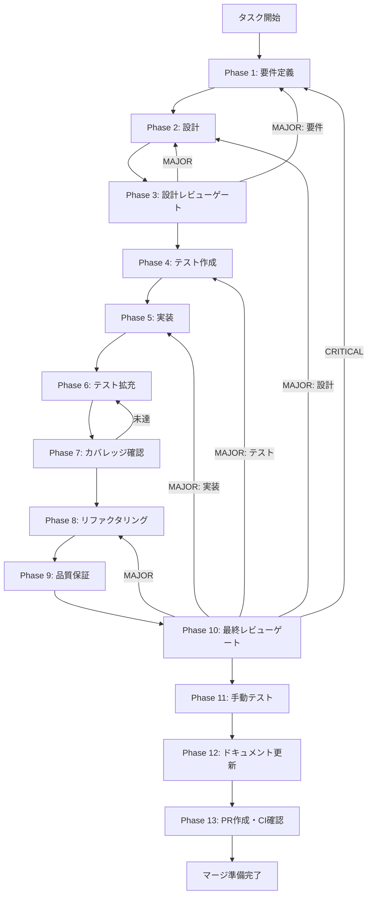

# task-ut-rt-01-execute-async-snapshot-error-message-001 - タスク実行仕様書

## ユーザーからの元の指示

```
TASK-UT-RT-01-EXECUTE-ASYNC-SNAPSHOT-ERROR-MESSAGE-001
`executeAsync()` での error message 形式統一
発見元: TASK-UT-RT-01-EXECUTE-IMPROVE-ADAPTER-GUARD-001 Phase 10 MINOR 指摘
```

## メタ情報

| 項目         | 内容                                                                |
| ------------ | ------------------------------------------------------------------- |
| タスクID     | TASK-UT-RT-01-EXECUTE-ASYNC-SNAPSHOT-ERROR-MESSAGE-001              |
| タスク名     | `executeAsync()` での error message 形式統一                        |
| 分類         | 改善（小規模）                                                      |
| 対象機能     | RuntimeSkillCreatorFacade — executeAsync / onWorkflowStateSnapshot  |
| 優先度       | 中                                                                  |
| 見積もり規模 | 小規模                                                              |
| ステータス   | in_progress                                                         |
| 作成日       | 2026-04-06                                                          |
| 発見元       | TASK-UT-RT-01-EXECUTE-IMPROVE-ADAPTER-GUARD-001 Phase 10 MINOR 指摘 |
| issue番号    | 1905                                                                |

---

## タスク概要

### 目的

`executeAsync()` が `execute()` から structured error（`success: false`）を受け取った場合も、その `error.message` を `onWorkflowStateSnapshot` に適切に伝搬させることで、Renderer 側でエラー理由を表示できるようにする。

### 背景

TASK-UT-RT-01-EXECUTE-IMPROVE-ADAPTER-GUARD-001 にて `execute()` / `improve()` に LLMAdapter ステータスガードが実装され、`RuntimeSkillCreatorExecuteErrorResponse`（`success: false` + `error.code` + `error.message`）の structured error 形式が導入された。

`executeAsync()` はその `execute()` を内部で呼び出す fire-and-forget 型ラッパーであるが、現状の実装では以下の問題がある：

- structured error パス（行 1032-1043）: `if (!snapshot)` 条件で snapshot が存在する場合は `onWorkflowStateSnapshot` にエラーメッセージが渡されない
- catch パス（行 1044-1057）: 同様に `if (!snapshot)` 条件で snapshot が存在する場合はエラーメッセージが渡されない

この結果、`onWorkflowStateSnapshot` へ渡る error message の形式が「例外ルート」と「structured error ルート」で不揃いになっており、Renderer 側で adapter guard のエラー理由が表示されない。

### 最終ゴール

- `executeAsync()` 内の全エラーパスで `onWorkflowStateSnapshot` に渡る error の形式が統一されている
- structured error の `error.message` が Renderer の snapshot または error 引数として届く
- `execute()` / `plan()` / `improve()` の adapter guard と同等品質の actionable message が UI に表示される

### 成果物一覧

| 種別         | 成果物                                                  | 配置先                                                                                                                     |
| ------------ | ------------------------------------------------------- | -------------------------------------------------------------------------------------------------------------------------- |
| 実装         | `RuntimeSkillCreatorFacade.ts`（`executeAsync()` 修正） | `apps/desktop/src/main/services/runtime/RuntimeSkillCreatorFacade.ts`                                                      |
| テスト       | structured error 伝搬シナリオのテスト（T-01〜T-06）     | `apps/desktop/src/main/services/runtime/__tests__/RuntimeSkillCreatorFacade.executeAsync.test.ts` または既存テストファイル |
| ドキュメント | Phase 1-13 仕様書                                       | `docs/30-workflows/task-ut-rt-01-execute-async-snapshot-error-message-001/`                                                |
| PR           | GitHub Pull Request                                     | GitHub UI                                                                                                                  |

---

## 参照ファイル

- `apps/desktop/src/main/services/runtime/RuntimeSkillCreatorFacade.ts` - 対象実装ファイル
- `packages/shared/src/types/skillCreator.ts` - 型定義（`RuntimeSkillCreatorExecuteErrorResponse` 等）
- `docs/30-workflows/unassigned-task/task-ut-rt-01-execute-async-snapshot-error-message-001.md` - 元タスク指示書
- `docs/30-workflows/ut-rt-01-execute-improve-adapter-guard-001/` - 親タスクワークフロー

---

## タスク分解サマリー

| ID     | フェーズ | サブタスク名       | 責務                                                              | 依存 |
| ------ | -------- | ------------------ | ----------------------------------------------------------------- | ---- |
| T-01-1 | Phase 1  | 要件定義           | スコープ・受入条件・inventory を固定する                          | -    |
| T-02-1 | Phase 2  | 設計               | エラー伝搬パス修正方針と topology を設計する                      | T-01 |
| T-03-1 | Phase 3  | 設計レビューゲート | Phase 4 へ進めるかを PASS/MINOR/MAJOR で判定する                  | T-02 |
| T-04-1 | Phase 4  | テスト作成         | T-01〜T-06 のテストケースを作成する（TDD Red）                    | T-03 |
| T-05-1 | Phase 5  | 実装               | `executeAsync()` のエラー伝搬パスを修正する                       | T-04 |
| T-06-1 | Phase 6  | テスト拡充         | fail path・回帰 guard・branch coverage を追加する                 | T-05 |
| T-07-1 | Phase 7  | カバレッジ確認     | 変更ブロックの line/branch カバレッジを計測する                   | T-06 |
| T-08-1 | Phase 8  | リファクタリング   | 重複・drift を削る                                                | T-07 |
| T-09-1 | Phase 9  | 品質保証           | typecheck / lint / test を一括判定する                            | T-08 |
| T-10-1 | Phase 10 | 最終レビューゲート | acceptance criteria と blocker を判定する                         | T-09 |
| T-11-1 | Phase 11 | 手動テスト         | NON_VISUAL（自動テスト代替）                                      | T-10 |
| T-12-1 | Phase 12 | ドキュメント更新   | 実装ガイド・仕様同期・未タスク・feedback・compliance check を完了 | T-11 |
| T-13-1 | Phase 13 | PR 作成            | ユーザー明示承認後のみ実施                                        | T-12 |

**総サブタスク数**: 13個

---

## 実行フロー図



---

## Phase 一覧

| Phase | 名称               | 仕様書                                                       | ステータス |
| ----- | ------------------ | ------------------------------------------------------------ | ---------- |
| 1     | 要件定義           | [phase-1-requirements.md](phase-1-requirements.md)           | 完了       |
| 2     | 設計               | [phase-2-design.md](phase-2-design.md)                       | 完了       |
| 3     | 設計レビューゲート | [phase-3-design-review.md](phase-3-design-review.md)         | 完了       |
| 4     | テスト作成         | [phase-4-test-creation.md](phase-4-test-creation.md)         | 未実施     |
| 5     | 実装               | [phase-5-implementation.md](phase-5-implementation.md)       | 未実施     |
| 6     | テスト拡充         | [phase-6-test-expansion.md](phase-6-test-expansion.md)       | 未実施     |
| 7     | カバレッジ確認     | [phase-7-coverage-check.md](phase-7-coverage-check.md)       | 未実施     |
| 8     | リファクタリング   | [phase-8-refactoring.md](phase-8-refactoring.md)             | 未実施     |
| 9     | 品質保証           | [phase-9-quality-assurance.md](phase-9-quality-assurance.md) | 未実施     |
| 10    | 最終レビューゲート | [phase-10-final-review.md](phase-10-final-review.md)         | 未実施     |
| 11    | 手動テスト         | [phase-11-manual-test.md](phase-11-manual-test.md)           | 未実施     |
| 12    | ドキュメント更新   | [phase-12-documentation.md](phase-12-documentation.md)       | 未実施     |
| 13    | PR 作成            | [phase-13-pr-creation.md](phase-13-pr-creation.md)           | 未実施     |

---

## テストカバレッジ目標

### ユニットテスト

| 指標              | 最低基準 | 推奨基準 |
| ----------------- | -------- | -------- |
| Line Coverage     | 80%      | 90%      |
| Branch Coverage   | 60%      | 70%      |
| Function Coverage | 80%      | 90%      |

---

## Phase 完了時の必須アクション

各 Phase 完了時に以下を必ず実行すること:

1. **タスク 100% 実行**: Phase 内で指定された全タスクを完全に実行
2. **成果物確認**: 全ての必須成果物が生成されていることを検証
3. **実行記録**: 実行タスクの結果を記録
4. **artifacts.json 更新**: Phase 完了ステータスを更新
5. **Phase 末端の実行確認**: 各タスクを 100% 実行し、完遂した旨を必ず明記
