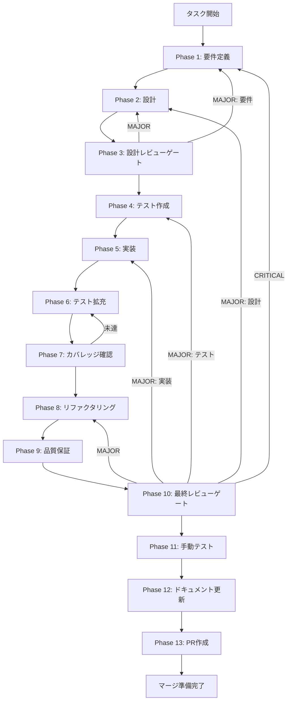

# task-ut-rt-01-exhaustive-check-execute-response-001 - タスク実行仕様書

## ユーザーからの元の指示

```
GitHub Issue #1993: [TASK-UT-RT-01-EXHAUSTIVE-CHECK-EXECUTE-RESPONSE-001]
executeAsync() レスポンス exhaustive check 導入
docs/30-workflows/ 配下にディレクトリを作成し、phase1-13 のタスク仕様書を作成する。
```

## メタ情報

| 項目         | 内容                                                          |
| ------------ | ------------------------------------------------------------- |
| タスクID     | TASK-UT-RT-01-EXHAUSTIVE-CHECK-EXECUTE-RESPONSE-001           |
| タスク名     | executeAsync() レスポンス exhaustive check 導入               |
| 分類         | リファクタリング / 品質改善（follow-up）                      |
| タスク種別   | NON_VISUAL                                                    |
| 対象機能     | RuntimeSkillCreatorFacade.executeAsync() のエラー判定ロジック |
| 優先度       | 中                                                            |
| 見積もり規模 | 小規模                                                        |
| ステータス   | 未実施                                                        |
| 作成日       | 2026-04-08                                                    |
| GitHub Issue | #1993                                                         |
| 親タスク     | TASK-UT-RT-01-EXECUTE-ASYNC-SNAPSHOT-ERROR-MESSAGE-001        |

---

## オーケストレーション

| Agent   | 役割                       | 並列可否             | 主な入力                                  | 主な出力                           |
| ------- | -------------------------- | -------------------- | ----------------------------------------- | ---------------------------------- |
| Agent 1 | skill準拠検証エージェント  | 可能                 | 2つの skill 定義、git diff、対象 workflow | 差異一覧、PASS/FAIL 表             |
| Agent 2 | 多角的思考分析エージェント | 可能                 | 30 種の思考法、差分、current facts        | 改善仮説、設計代替案               |
| Agent 3 | 改善統合エージェント       | 不可（Agent 1/2 後） | Agent 1/2 の結果                          | 仕様修正計画、ファイル別タスク分割 |

### 並列実行原則

- Phase 2 は Agent 1 と Agent 2 を並列実行する
- Phase 4 はファイル群ごとに SubAgent を分割し、独立パートは並列で進める
- Phase 12 は `phase-12-documentation.md` 系と `task-workflow` 系を分け、各 SubAgent の担当ファイルを 3 個以下に抑える
- 30 種の思考法は Agent 2 が 1 つの分析マトリクスへ集約し、30 個の SubAgent に分割しない

### 思考法適用方針

- 論理分析系: Phase 2 の設計可否判定
- 構造分解系: Phase 1 と Phase 12 のファイル分割
- メタ・抽象系: 前提の妥当性の見直し
- 発想・拡張系: 既存実装を破棄するかどうかの比較
- システム系: 依存関係・波及効果の確認
- 戦略・価値系: 最小複雑性と価値最大化の両立
- 問題解決系: 根本原因と改善仮説の切り分け

## タスク概要

### 目的

`executeAsync()` の union 型判定を `switch` + `satisfies never` による exhaustive check パターンに置換し、将来の union 型拡張に対してコンパイル時に漏れを検出できる構造に変更する。

### 背景

`RuntimeSkillCreatorFacade.executeAsync()` は `execute()` の戻り値である `RuntimeSkillCreatorExecuteResponse` union 型を受け取り、エラーか否かを inline 条件式で判定している。現在の判定ロジックは `success === false` チェックのみで union の各メンバーを discriminant で分岐していないため、将来 union 型に新メンバーが追加された場合にコンパイラが漏れを検出できない。

本タスクは `TASK-UT-RT-01-EXECUTE-ASYNC-SNAPSHOT-ERROR-MESSAGE-001` の Phase 3 設計レビューで発見された follow-up タスクである。

`RuntimeSkillCreatorExecuteResponse` は現在 3 メンバーで構成されている：

```typescript
export type RuntimeSkillCreatorExecuteResponse =
  | RuntimeSkillCreatorExecuteResult // success: boolean
  | { type: "terminal_handoff"; bundle: TerminalHandoffBundle }
  | RuntimeSkillCreatorExecuteErrorResponse; // success: false
```

### 最終ゴール

- `RuntimeSkillCreatorFacade.executeAsync()` が `classifyExecuteResult()` + `switch` + `assertNever` で 3 outcome を明示的に分岐している
- `RuntimeSkillCreatorExecuteResponse` の各 union メンバーが `success` / `error` / `terminal_handoff` の 3 outcome に漏れなく対応している
- `extractExecuteErrorMessage()` により error message の伝搬が一本化されている
- 各 union ケースに対応するユニットテストが追加されている
- 既存の `executeAsync()` 動作（phase 遷移、`onWorkflowStateSnapshot` 呼び出し）がリグレッションしていない

### 成果物一覧

| 種別         | 成果物                                                    | 配置先                                              |
| ------------ | --------------------------------------------------------- | --------------------------------------------------- |
| 実装         | RuntimeSkillCreatorFacade.ts（修正）                      | `apps/desktop/src/main/services/runtime/`           |
| テスト       | RuntimeSkillCreatorFacade.executeAsync.exhaustive.test.ts | `apps/desktop/src/main/services/runtime/__tests__/` |
| ドキュメント | implementation-guide.md                                   | `outputs/phase-12/`                                 |
| ドキュメント | system-spec-update-summary.md                             | `outputs/phase-12/`                                 |
| ドキュメント | documentation-changelog.md                                | `outputs/phase-12/`                                 |
| ドキュメント | unassigned-task-detection.md                              | `outputs/phase-12/`                                 |
| ドキュメント | skill-feedback-report.md                                  | `outputs/phase-12/`                                 |
| PR           | GitHub Pull Request                                       | GitHub UI                                           |

---

## 参照ファイル

本仕様書のコマンド選定は以下を参照：

- `apps/desktop/src/main/services/runtime/RuntimeSkillCreatorFacade.ts` - 対象ファイル
- `packages/shared/src/types/skillCreator.ts` - RuntimeSkillCreatorExecuteResponse 型定義（行 877-880）
- `docs/30-workflows/completed-tasks/task-ut-rt-01-execute-async-snapshot-error-message-001/index.md` - 親タスク仕様書
- `docs/30-workflows/completed-tasks/task-ut-rt-01-execute-async-snapshot-error-message-001/outputs/phase-12/unassigned-task-detection.md` - 発見ソース
- `.claude/skills/aiworkflow-requirements/references/arch-electron-services-details-part2.md` - executeResponse current contract
- `.claude/skills/aiworkflow-requirements/references/interfaces-agent-sdk-skill-reference.md` - runtime bridge current facts
- `.claude/skills/aiworkflow-requirements/references/task-workflow-completed.md` - 直近の completed fact
- `.claude/skills/aiworkflow-requirements/references/lessons-learned-rt02-stub-response-error-notification.md` - error contract 教訓
- `.claude/skills/task-specification-creator/SKILL.md` - Phase 1-13 定義

---

## タスク分解サマリー

| ID     | フェーズ | サブタスク名             | 責務                                         | 依存 |
| ------ | -------- | ------------------------ | -------------------------------------------- | ---- |
| T-01-1 | Phase 1  | 要件定義                 | union 型・影響範囲・受入条件確定             | -    |
| T-02-1 | Phase 2  | 設計                     | assertNever 配置・classifyExecuteResult 設計 | T-01 |
| T-03-1 | Phase 3  | 設計レビューゲート       | Phase 2 設計の妥当性確認                     | T-02 |
| T-04-1 | Phase 4  | テスト作成（TDD Red）    | 失敗テスト作成（TC-01〜TC-05）               | T-03 |
| T-05-1 | Phase 5  | 実装                     | assertNever + switch 化 + テスト Green       | T-04 |
| T-06-1 | Phase 6  | テスト拡充               | edge case・回帰ガード追加                    | T-05 |
| T-07-1 | Phase 7  | カバレッジ確認           | 変更関数の line/branch カバレッジ確認        | T-06 |
| T-08-1 | Phase 8  | リファクタリング         | コードの整理と命名確認                       | T-07 |
| T-09-1 | Phase 9  | 品質保証                 | typecheck / lint / test 一括確認             | T-08 |
| T-10-1 | Phase 10 | 最終レビューゲート       | 受入条件と blocker 最終確認                  | T-09 |
| T-11-1 | Phase 11 | 手動テスト（NON_VISUAL） | 自動テスト代替証跡記録                       | T-10 |
| T-12-1 | Phase 12 | ドキュメント更新         | implementation-guide / spec sync             | T-11 |
| T-13-1 | Phase 13 | PR 作成                  | ユーザー承認後に PR 作成                     | T-12 |

**総サブタスク数**: 13個

---

## 実行フロー図



---

## Phase 一覧

| Phase | 名称               | 仕様書                                                       | ステータス |
| ----- | ------------------ | ------------------------------------------------------------ | ---------- |
| 1     | 要件定義           | [phase-1-requirements.md](phase-1-requirements.md)           | 未実施     |
| 2     | 設計               | [phase-2-design.md](phase-2-design.md)                       | 未実施     |
| 3     | 設計レビューゲート | [phase-3-design-review.md](phase-3-design-review.md)         | 未実施     |
| 4     | テスト作成         | [phase-4-test-creation.md](phase-4-test-creation.md)         | 未実施     |
| 5     | 実装               | [phase-5-implementation.md](phase-5-implementation.md)       | 未実施     |
| 6     | テスト拡充         | [phase-6-test-expansion.md](phase-6-test-expansion.md)       | 未実施     |
| 7     | カバレッジ確認     | [phase-7-coverage-check.md](phase-7-coverage-check.md)       | 未実施     |
| 8     | リファクタリング   | [phase-8-refactoring.md](phase-8-refactoring.md)             | 未実施     |
| 9     | 品質保証           | [phase-9-quality-assurance.md](phase-9-quality-assurance.md) | 未実施     |
| 10    | 最終レビューゲート | [phase-10-final-review.md](phase-10-final-review.md)         | 未実施     |
| 11    | 手動テスト         | [phase-11-manual-test.md](phase-11-manual-test.md)           | 未実施     |
| 12    | ドキュメント更新   | [phase-12-documentation.md](phase-12-documentation.md)       | 未実施     |
| 13    | PR 作成            | [phase-13-pr-creation.md](phase-13-pr-creation.md)           | 未実施     |

---

## テストカバレッジ目標

### ユニットテスト（変更関数のみ）

| 指標              | 最低基準 | 推奨基準 |
| ----------------- | -------- | -------- |
| Line Coverage     | 90%      | 100%     |
| Branch Coverage   | 80%      | 100%     |
| Function Coverage | 100%     | 100%     |

---

## 統合テスト連携（Phase 1〜11 は必須）

| Phase | 統合テスト連携アクション                                          |
| ----- | ----------------------------------------------------------------- |
| 1     | `executeAsync()` の IPC/Renderer 側への影響範囲を要件に明記       |
| 2     | `classifyExecuteResult()` の内部契約を設計に反映                  |
| 3     | discriminant 分岐の正確性をレビューゲートで確認                   |
| 4     | 各 union ケース（3種）と error message 伝搬のテストシナリオを作成 |
| 5     | switch 化後の既存テスト（親タスクのテスト）継続 PASS を確認       |
| 6     | 追加テストで edge case と error message 伝搬を網羅                |
| 7     | 変更関数の coverage を検証                                        |
| 8     | リファクタリング後も既存テストが PASS することを確認              |
| 9     | typecheck + lint + test を一括確認                                |
| 10    | 最終レビューで受入条件全件を確認                                  |
| 11    | 自動テスト結果を手動テスト代替証跡として記録（NON_VISUAL）        |

---

## Phase 完了時の必須アクション

**各 Phase 完了時に以下を必ず実行すること:**

1. **タスク 100% 実行**: Phase 内で指定された全タスクを完全に実行
2. **成果物確認**: 全ての必須成果物が生成されていることを検証
3. **実行記録**: 実行タスクの結果を記録
4. **artifacts.json 更新**: Phase 完了ステータスを更新
5. **Phase 末端の実行確認**: 各タスクを 100% 実行し、各タスクを完遂した旨を必ず明記

```bash
# Phase 完了・成果物登録
node .claude/skills/task-specification-creator/scripts/complete-phase.js \
  --workflow docs/30-workflows/task-ut-rt-01-exhaustive-check-execute-response-001 \
  --phase {{PHASE_NUMBER}} --artifacts "..."

# 全体検証
node .claude/skills/task-specification-creator/scripts/validate-phase-output.js \
  docs/30-workflows/task-ut-rt-01-exhaustive-check-execute-response-001
```
