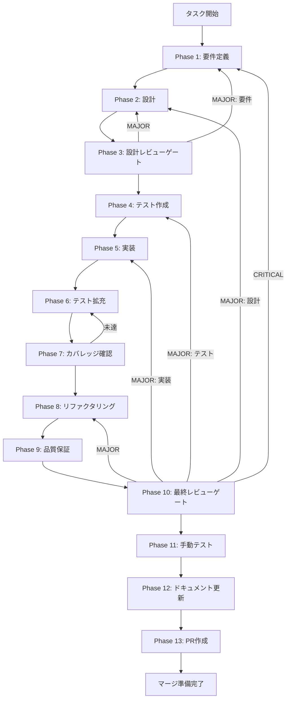

# task-ut-rt-01-verify-and-improve-loop-adapter-notification-001 - タスク実行仕様書

## ユーザーからの元の指示

```
GitHub Issue #1896: verifyAndImproveLoop()でのimprove adapter error通知整理
```

## メタ情報

| 項目         | 内容                                                                  |
| ------------ | --------------------------------------------------------------------- |
| タスクID     | TASK-UT-RT-01-VERIFY-AND-IMPROVE-LOOP-ADAPTER-NOTIFICATION-001        |
| タスク名     | task-ut-rt-01-verify-and-improve-loop-adapter-notification-001        |
| 分類         | follow-up / feature（コード変更タスク）                               |
| 対象機能     | RuntimeSkillCreatorFacade.verifyAndImproveLoop()                      |
| 優先度       | Medium                                                                |
| 見積もり規模 | 小規模                                                                |
| ステータス   | 未実施                                                                |
| 作成日       | 2026-04-06                                                            |
| 親タスク     | TASK-UT-RT-01-EXECUTE-IMPROVE-ADAPTER-GUARD-001（Phase 10 MINOR指摘） |
| 関連Issue    | #1896                                                                 |

---

## タスク概要

### 目的

`verifyAndImproveLoop()` 内の `improve()` アダプターエラー通知をランタイムガードと統一する。

### 背景

TASK-UT-RT-01-EXECUTE-IMPROVE-ADAPTER-GUARD-001 では `execute()` / `improve()` にそれぞれ `_llmAdapterStatus` ガードと `INotificationService.notify()` 呼び出しを実装した。しかし `verifyAndImproveLoop()` は内部で `improve()` を呼び出すループ構造を持ち、`improve()` が adapter エラーを返した場合のエラーコード伝播・通知文言が runtime guard（`execute()` / `improve()` 単体）と統一されているか検証・整理が必要である。

### 最終ゴール

- `improve()` が adapter エラーを返した場合に `INotificationService.notify()` が呼び出される
- 通知文言が `execute()` 単体ガードと同等の品質になっている
- `errorCode` フィールドが `RuntimeSkillCreatorVerifyAndImproveResult` に確実に伝播する
- 全テストがリグレッションなしでパスする

### 成果物一覧

| 種別         | 成果物                                                                      | 配置先                                                                                            |
| ------------ | --------------------------------------------------------------------------- | ------------------------------------------------------------------------------------------------- |
| 実装         | RuntimeSkillCreatorFacade.ts（通知追加）                                    | `apps/desktop/src/main/services/runtime/RuntimeSkillCreatorFacade.ts`                             |
| テスト       | RuntimeSkillCreatorFacade.notification.test.ts（T-VL-01〜07, T-REG-01追加） | `apps/desktop/src/main/services/runtime/__tests__/RuntimeSkillCreatorFacade.notification.test.ts` |
| ドキュメント | 各Phase出力                                                                 | `outputs/phase-*/`                                                                                |
| PR           | GitHub Pull Request（ユーザー承認後のみ）                                   | GitHub UI                                                                                         |

---

## 参照ファイル

| 参照先                           | パス                                                                                                  |
| -------------------------------- | ----------------------------------------------------------------------------------------------------- |
| 対象実装ファイル                 | `apps/desktop/src/main/services/runtime/RuntimeSkillCreatorFacade.ts`                                 |
| 既存テストファイル               | `apps/desktop/src/main/services/runtime/__tests__/RuntimeSkillCreatorFacade.adapter-status.test.ts`   |
| 旧未タスク仕様書                 | `docs/30-workflows/unassigned-task/task-ut-rt-01-verify-and-improve-loop-adapter-notification-001.md` |
| 親タスクワークフロー（Phase 10） | `docs/30-workflows/ut-rt-01-execute-improve-adapter-guard-001/phase-10-final-review.md`               |
| SkillCreatorWorkflowEngine       | `apps/desktop/src/main/services/runtime/SkillCreatorWorkflowEngine.ts`                                |

## 検証対象 skill

| skill                      | 主な確認観点                                                                                 |
| -------------------------- | -------------------------------------------------------------------------------------------- |
| task-specification-creator | Phase 1-13 の単一責務性、Phase 12 の必須 6 成果物、SubAgent 分割、コミット/PR 禁止、実行粒度 |
| aiworkflow-requirements    | canonical root、index / artifacts 同期、current facts、Phase 11/12 evidence、参照整合性      |

## SubAgent 編成

| SubAgent | 担当                                                         | 並列可否               |
| -------- | ------------------------------------------------------------ | ---------------------- |
| A        | 2つの skill 定義から必須項目を抽出し、漏れと衝突を一覧化する | B と並列               |
| B        | 本ブランチ差分と参照リンク drift を洗い出す                  | A と並列               |
| C        | 30種の思考法を適用して改善案を比較し、最小複雑性に絞る       | A/B の初期結果後に直列 |
| Lead     | A/B/C の結果を統合し、patch か再構成かを確定する             | 直列                   |

## 30種の思考法適用マトリクス

| カテゴリ     | 思考法                                                               | 本タスクでの適用対象                                |
| ------------ | -------------------------------------------------------------------- | --------------------------------------------------- |
| 論理分析系   | 批判的思考、演繹思考、帰納的思考、アブダクシン、垂直思考             | skill 準拠の漏れ・矛盾・推論妥当性の確認            |
| 構造分解系   | 要素分解、MECE、2軸思考、プロセス思考                                | Phase / 成果物 / 依存関係 / 変更対象の分解          |
| メタ・抽象系 | メタ思考、抽象化思考、ダブル・ループ思考                             | 仕様の前提そのものと責務境界の妥当性を再定義する    |
| 発想・拡張系 | ブレインストーミング、水平思考、逆説思考、類推思考、if思考、素人思考 | 代替案・再構成案・最小変更案の探索                  |
| システム系   | システム思考、因果関係分析、因果ループ                               | verify / improve / notify / snapshot の相互作用確認 |
| 戦略・価値系 | トレードオン思考、プラスサム思考、価値提案思考、戦略的思考           | 価値最大化と複雑性削減の両立                        |
| 問題解決系   | why思考、改善思考、仮説思考、論点思考、KJ法                          | 根本原因の特定、論点整理、改善仮説の収束            |

## スコープ

### 含む

- 変更分の skill 準拠検証
- 30種の思考法による多角的分析
- 参照パスと依存関係の整合化
- エレガントな最小変更の反映

### 含まない

- コミット、PR 作成、push
- ユーザー承認なしの破棄再構成
- Phase 13 の実行

## 特記事項

- Phase 1-3 を skill 準拠検証と多角的分析の主戦場とし、Phase 4-13 はその結果を消費する。
- 既存実装の破棄が最小複雑性になる場合は、Phase 3 の統合レビュー前にユーザー承認を得る。
- 並列実行は SubAgent A/B を先行し、C は初期結果の統合後に実施する。

---

## タスク分解サマリー

| ID     | フェーズ | サブタスク名                         | 責務                               | 依存   |
| ------ | -------- | ------------------------------------ | ---------------------------------- | ------ |
| T-01-1 | Phase 1  | 現行コード調査                       | 現状動作と変更箇所の特定           | -      |
| T-01-2 | Phase 1  | 機能要件定義                         | FR/AC定義                          | T-01-1 |
| T-01-3 | Phase 1  | エッジケース洗い出し                 | E-1〜E-5の対処方針確定             | T-01-2 |
| T-02-1 | Phase 2  | 通知追加箇所の設計                   | 実装方針の確定                     | T-01   |
| T-02-2 | Phase 2  | recordImproveFailureSnapshot設計確認 | phase保持ロジック確認              | T-02-1 |
| T-02-3 | Phase 2  | 変更ファイル一覧                     | 変更対象ファイル確定               | T-02-2 |
| T-03-1 | Phase 3  | 設計レビュー                         | SRP・最小変更・通知統一の評価      | T-02   |
| T-04-1 | Phase 4  | テストマトリクス作成                 | T-VL-01〜05の定義                  | T-03   |
| T-04-2 | Phase 4  | テストコード作成                     | T-VL-01〜05のコード実装            | T-04-1 |
| T-05-1 | Phase 5  | 実装                                 | notificationService?.notify()追加  | T-04   |
| T-06-1 | Phase 6  | テスト拡充                           | T-VL-06〜07, T-REG-01追加          | T-05   |
| T-07-1 | Phase 7  | カバレッジ確認                       | 追加箇所100%達成                   | T-06   |
| T-08-1 | Phase 8  | リファクタリング                     | 通知パターン統一確認               | T-07   |
| T-09-1 | Phase 9  | 品質保証                             | typecheck・lint・全テストPASS      | T-08   |
| T-10-1 | Phase 10 | 最終レビュー                         | AC-1〜AC-6チェック                 | T-09   |
| T-11-1 | Phase 11 | 手動テスト                           | NON_VISUAL判定・自動テスト代替記録 | T-10   |
| T-12-1 | Phase 12 | ドキュメント更新                     | 実装ガイド・システム仕様書更新     | T-11   |
| T-13-1 | Phase 13 | PR作成                               | ユーザー承認後にPR作成             | T-12   |

**総サブタスク数**: 18個

---

## 実行フロー図



---

## Phase一覧

| Phase | 名称               | 仕様書                                                       | ステータス |
| ----- | ------------------ | ------------------------------------------------------------ | ---------- |
| 1     | 要件定義           | [phase-1-requirements.md](phase-1-requirements.md)           | 未実施     |
| 2     | 設計               | [phase-2-design.md](phase-2-design.md)                       | 未実施     |
| 3     | 設計レビューゲート | [phase-3-design-review.md](phase-3-design-review.md)         | 未実施     |
| 4     | テスト作成         | [phase-4-test-creation.md](phase-4-test-creation.md)         | 未実施     |
| 5     | 実装               | [phase-5-implementation.md](phase-5-implementation.md)       | 未実施     |
| 6     | テスト拡充         | [phase-6-test-expansion.md](phase-6-test-expansion.md)       | 未実施     |
| 7     | カバレッジ確認     | [phase-7-coverage-check.md](phase-7-coverage-check.md)       | 未実施     |
| 8     | リファクタリング   | [phase-8-refactoring.md](phase-8-refactoring.md)             | 未実施     |
| 9     | 品質保証           | [phase-9-quality-assurance.md](phase-9-quality-assurance.md) | 未実施     |
| 10    | 最終レビューゲート | [phase-10-final-review.md](phase-10-final-review.md)         | 未実施     |
| 11    | 手動テスト         | [phase-11-manual-test.md](phase-11-manual-test.md)           | 未実施     |
| 12    | ドキュメント更新   | [phase-12-documentation.md](phase-12-documentation.md)       | 未実施     |
| 13    | PR作成             | [phase-13-pr-creation.md](phase-13-pr-creation.md)           | 未実施     |

---

## テストカバレッジ目標

### ユニットテスト

| 指標              | 最低基準 | 推奨基準 |
| ----------------- | -------- | -------- |
| Line Coverage     | 80%      | 90%      |
| Branch Coverage   | 60%      | 70%      |
| Function Coverage | 80%      | 90%      |

追加箇所（`improve()` エラーブロック）については100%を目標とする。

---

## Phase完了時の必須アクション

**各Phase完了時に以下を必ず実行すること:**

1. **タスク100%実行**: Phase内で指定された全タスクを完全に実行
2. **成果物確認**: 全ての必須成果物が生成されていることを検証
3. **実行記録**: 実行タスクの結果を記録
4. **artifacts.json更新**: Phase完了ステータスを更新
5. **Phase末端の実行確認**: 各タスクを100%実行し、各タスクを完遂した旨を必ず明記

```bash
# 品質チェックコマンド
pnpm --filter @repo/desktop typecheck
pnpm --filter @repo/desktop test -- --testPathPattern="notification"
pnpm --filter @repo/desktop test -- --testPathPattern="RuntimeSkillCreatorFacade"
pnpm lint
```
