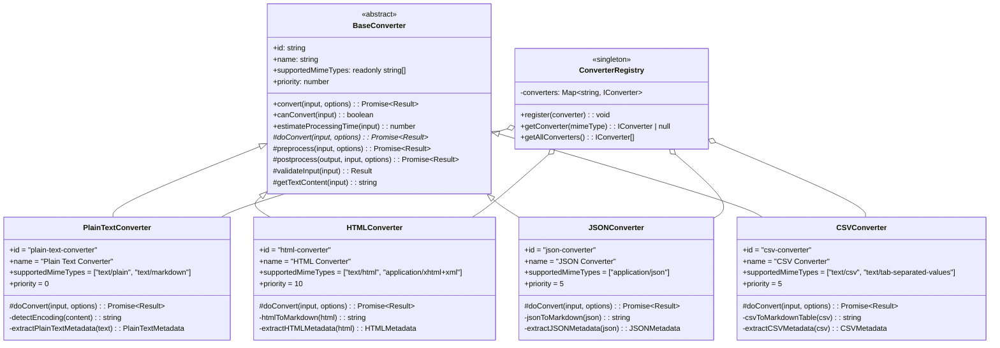
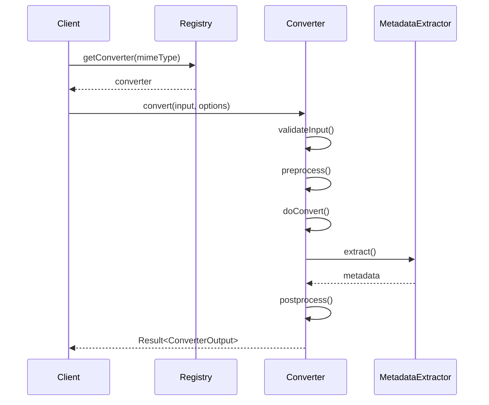

# テキストベースコンバーター アーキテクチャ設計書

## メタ情報

| 項目       | 内容                                                           |
| ---------- | -------------------------------------------------------------- |
| バージョン | 1.0.0                                                          |
| 作成日     | 2025-12-24                                                     |
| 作成者     | @claude (domain-modeler)                                       |
| ステータス | 設計中                                                         |
| 対象       | PlainTextConverter, HTMLConverter, JSONConverter, CSVConverter |
| 関連タスク | CONV-02-02                                                     |

---

## 1. 全体アーキテクチャ

### 1.1 クラス図



### 1.2 変換フロー



---

## 2. コンバーター詳細設計

### 2.1 PlainTextConverter

#### 概要

プレーンテキストおよびMarkdownファイルを処理するコンバーター。

#### サポートMIMEタイプ

- `text/plain`
- `text/markdown`

#### 変換ロジック

1. エンコーディング検出（chardetライブラリ使用）
2. テキストデコード
3. メタデータ抽出
   - 行数
   - 単語数
   - 文字数
   - Markdown構文の有無（見出し、コードブロック等）

#### カスタムメタデータ型

```typescript
interface PlainTextMetadata {
  encoding: string; // 検出されたエンコーディング
  lineCount: number; // 行数
  wordCount: number; // 単語数（空白区切り）
  characterCount: number; // 文字数
  hasMarkdownSyntax: boolean; // Markdown構文の有無
}
```

#### 依存ライブラリ

- `chardet` - エンコーディング検出

---

### 2.2 HTMLConverter

#### 概要

HTMLファイルをMarkdown形式に変換するコンバーター。

#### サポートMIMEタイプ

- `text/html`
- `application/xhtml+xml`

#### 変換ロジック

1. HTML解析
2. Markdown変換（turndownライブラリ使用）
3. メタデータ抽出
   - タイトル（`<title>`タグ）
   - メタタグ情報（author, description等）
   - 見出し構造
   - リンク情報

#### カスタムメタデータ型

```typescript
interface HTMLMetadata {
  title: string | null; // <title>タグの内容
  description: string | null; // meta descriptionの内容
  author: string | null; // meta authorの内容
  headings: Array<{ level: number; text: string }>; // 見出し構造
  linkCount: number; // リンク数
  imageCount: number; // 画像数
}
```

#### 依存ライブラリ

- `turndown` - HTML→Markdown変換

---

### 2.3 JSONConverter

#### 概要

JSONファイルを読みやすいMarkdown形式に変換するコンバーター。

#### サポートMIMEタイプ

- `application/json`

#### 変換ロジック

1. JSON解析
2. Markdown形式への整形
   - オブジェクトはMarkdownテーブル形式
   - 配列はリスト形式
   - ネストされた構造は見出しで階層化
3. メタデータ抽出
   - トップレベルのキー数
   - ネストの深さ
   - データサイズ

#### カスタムメタデータ型

```typescript
interface JSONMetadata {
  topLevelKeys: string[]; // トップレベルのキー一覧
  nestingDepth: number; // ネストの最大深度
  objectCount: number; // オブジェクト数
  arrayCount: number; // 配列数
  dataSize: number; // データサイズ（バイト）
}
```

#### 依存ライブラリ

- なし（標準のJSON.parse使用）

---

### 2.4 CSVConverter

#### 概要

CSV/TSVファイルをMarkdownテーブル形式に変換するコンバーター。

#### サポートMIMEタイプ

- `text/csv`
- `text/tab-separated-values`

#### 変換ロジック

1. CSV解析（papeparseライブラリ使用）
2. Markdownテーブル形式への変換
3. メタデータ抽出
   - 行数
   - カラム数
   - カラム名
   - データ型推定

#### カスタムメタデータ型

```typescript
interface CSVMetadata {
  rowCount: number; // 行数（ヘッダー除く）
  columnCount: number; // カラム数
  columns: string[]; // カラム名一覧
  delimiter: "," | "\t" | string; // デリミタ
  hasHeader: boolean; // ヘッダー行の有無
}
```

#### 依存ライブラリ

- `papaparse` - CSV解析

---

## 3. 共通処理設計

### 3.1 エラーハンドリング

すべてのコンバーターは`Result<T, RAGError>`型を使用してエラーを表現します。

```typescript
// 成功時
return ok({
  convertedContent: markdownText,
  extractedMetadata: metadata,
  processingTime: 0, // BaseConverterが自動設定
});

// エラー時
return err(
  createRAGError(ErrorCodes.CONVERSION_FAILED, "Failed to parse JSON", {
    converterId: this.id,
    fileId: input.fileId,
  }),
);
```

#### エラーコード定義

| エラーコード         | 説明                     | 使用場面                       |
| -------------------- | ------------------------ | ------------------------------ |
| `VALIDATION_ERROR`   | 入力バリデーションエラー | 必須フィールド欠如、不正な値   |
| `CONVERSION_FAILED`  | 変換処理失敗             | パース失敗、変換ロジックエラー |
| `ENCODING_ERROR`     | エンコーディングエラー   | 文字コード変換失敗             |
| `UNSUPPORTED_FORMAT` | 非サポート形式           | MIMEタイプ不一致、破損ファイル |

### 3.2 メタデータ抽出戦略

各コンバーターは以下の2段階でメタデータを抽出します：

1. **基本メタデータ**（BaseConverterが提供）
   - `ExtractedMetadata`型の標準フィールド
   - title, author, language, wordCount, lineCount等

2. **カスタムメタデータ**（各コンバーターが実装）
   - `custom`フィールドに格納
   - コンバーター固有の情報（encoding, headings, columns等）

```typescript
const metadata: ExtractedMetadata = {
  title: extractedTitle,
  author: null,
  language: detectLanguage(text),
  wordCount: text.split(/\s+/).length,
  lineCount: text.split("\n").length,
  charCount: text.length,
  headers: extractHeaders(text),
  codeBlocks: countCodeBlocks(text),
  links: extractLinks(text),
  custom: {
    // コンバーター固有のメタデータ
    encoding: detectedEncoding,
    hasMarkdownSyntax: hasMarkdown,
  },
};
```

### 3.3 テスト戦略

#### 単体テスト構成

各コンバーターに対して以下のテストを実施：

```
packages/shared/src/services/conversion/converters/__tests__/
├── plain-text-converter.test.ts
├── html-converter.test.ts
├── json-converter.test.ts
├── csv-converter.test.ts
└── fixtures/
    ├── plain/
    │   ├── utf8.txt
    │   ├── shiftjis.txt
    │   └── markdown.md
    ├── html/
    │   ├── simple.html
    │   └── complex.html
    ├── json/
    │   ├── simple.json
    │   └── nested.json
    └── csv/
        ├── simple.csv
        └── tsv.tsv
```

#### テストケース分類

| 分類                 | テスト内容               | 対象                 |
| -------------------- | ------------------------ | -------------------- |
| 正常系               | 標準的な入力での変換成功 | 全コンバーター       |
| 文字エンコーディング | UTF-8, Shift_JIS, EUC-JP | PlainText, HTML, CSV |
| 空ファイル           | 空コンテンツの処理       | 全コンバーター       |
| 大容量ファイル       | 10MB以上のファイル処理   | 全コンバーター       |
| 異常系               | 不正なフォーマット       | JSON, CSV            |
| メタデータ抽出       | 各種メタデータの正確性   | 全コンバーター       |

---

## 4. レジストリ登録設計

### 4.1 登録処理

`packages/shared/src/services/conversion/converters/index.ts`にて一括登録：

```typescript
import { ConverterRegistry } from "../registry";
import { PlainTextConverter } from "./plain-text-converter";
import { HTMLConverter } from "./html-converter";
import { JSONConverter } from "./json-converter";
import { CSVConverter } from "./csv-converter";

/**
 * すべてのテキストコンバーターをグローバルレジストリに登録
 */
export function registerTextConverters(): void {
  const registry = ConverterRegistry.getInstance();

  // 優先度順に登録（高優先度から）
  registry.register(new HTMLConverter()); // priority: 10
  registry.register(new JSONConverter()); // priority: 5
  registry.register(new CSVConverter()); // priority: 5
  registry.register(new PlainTextConverter()); // priority: 0
}

// エクスポート
export { PlainTextConverter } from "./plain-text-converter";
export { HTMLConverter } from "./html-converter";
export { JSONConverter } from "./json-converter";
export { CSVConverter } from "./csv-converter";
```

### 4.2 優先度設定

| コンバーター       | 優先度 | 理由                 |
| ------------------ | ------ | -------------------- |
| HTMLConverter      | 10     | HTML形式の保持が重要 |
| JSONConverter      | 5      | 構造化データの保持   |
| CSVConverter       | 5      | 表形式データの保持   |
| PlainTextConverter | 0      | フォールバック用     |

---

## 5. 依存ライブラリ

### 5.1 インストール

```bash
pnpm --filter @repo/shared add chardet turndown papaparse
pnpm --filter @repo/shared add -D @types/papaparse
```

### 5.2 ライブラリ一覧

| ライブラリ | バージョン | 用途                 | 使用コンバーター |
| ---------- | ---------- | -------------------- | ---------------- |
| chardet    | ^2.0.0     | エンコーディング検出 | PlainText        |
| turndown   | ^7.2.0     | HTML→Markdown変換    | HTML             |
| papaparse  | ^5.4.1     | CSV解析              | CSV              |

---

## 6. パフォーマンス要件

### 6.1 処理時間目標

| ファイルサイズ | 目標処理時間 | 備考             |
| -------------- | ------------ | ---------------- |
| < 100KB        | < 100ms      | 小規模ファイル   |
| 100KB - 1MB    | < 500ms      | 中規模ファイル   |
| 1MB - 10MB     | < 3秒        | 大規模ファイル   |
| > 10MB         | < 10秒       | 超大規模ファイル |

### 6.2 最適化方針

1. **ストリーミング処理**（Phase 5でリファクタリング時に検討）
   - 大容量ファイルはチャンク単位で処理

2. **キャッシング**（将来的な拡張）
   - エンコーディング検出結果のキャッシュ

3. **並列処理**（将来的な拡張）
   - 複数ファイルの並列変換サポート

---

## 7. セキュリティ考慮事項

### 7.1 入力検証

- ファイルサイズ制限: 最大100MB
- MIMEタイプ検証: サポート外の形式を拒否
- エンコーディング検証: 不正なバイトシーケンスを検出

### 7.2 XSS対策（HTMLConverter）

- `turndown`ライブラリのサニタイゼーション機能を活用
- `<script>`タグは変換時に除去

### 7.3 DoS対策

- 処理時間制限（タイムアウト）の設定
- 極端にネストが深いJSON/HTMLの処理制限

---

## 8. 次フェーズへの引き継ぎ

### 8.1 Phase 2: 設計レビュー

レビュー観点：

- [ ] BaseConverterとの整合性
- [ ] Result型エラーハンドリングの妥当性
- [ ] メタデータ型定義の完全性
- [ ] テスト戦略の網羅性
- [ ] パフォーマンス要件の実現可能性

### 8.2 Phase 3: テスト作成

各コンバーターのテストファイル作成：

- PlainTextConverter: エンコーディング検出、Markdown判定
- HTMLConverter: HTML→Markdown変換、メタタグ抽出
- JSONConverter: JSON→Markdown変換、ネスト処理
- CSVConverter: CSV→Markdownテーブル変換、デリミタ検出

### 8.3 Phase 4: 実装

TDDサイクル：

1. Red: テスト作成（Phase 3で完了）
2. Green: 最小限の実装でテストを通す
3. Refactor: コード品質改善（Phase 5）

---

## 9. 参考資料

- BaseConverter実装: `packages/shared/src/services/conversion/base-converter.ts`
- 型定義: `packages/shared/src/services/conversion/types.ts`
- レジストリ: `packages/shared/src/services/conversion/registry.ts`
- タスク仕様書: `docs/30-workflows/text-converters/task-text-converters.md`
