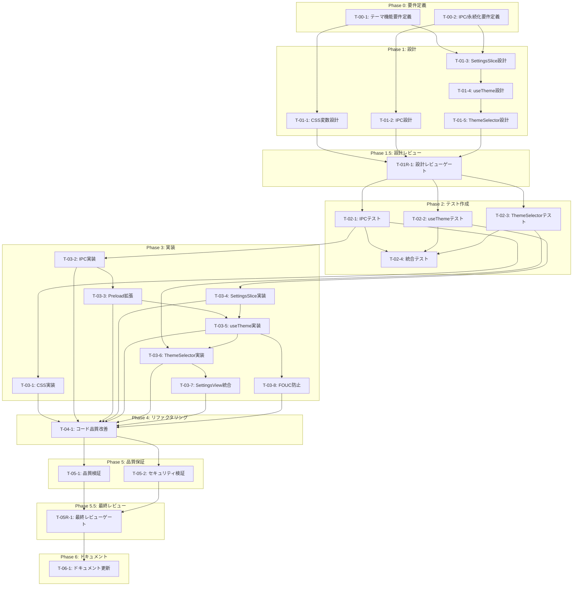

# テーマ機能 - タスク実行仕様書

## ユーザーからの元の指示

```
テーマ機能 - 機能要件定義書

## 概要

### 目的
ライト/ダークテーマの切り替えと永続化を実装する。

### 背景
現在のSettingsViewはテーマ選択UIがあるが、ローカルstateのみで永続化されず、
実際のスタイル適用も機能していない。CSS変数ベースのテーマシステムを実装する必要がある。

### スコープ
- ライト/ダーク/システム連動テーマ
- テーマ設定の永続化
- CSS変数によるスタイル切り替え
- リアルタイムテーマ変更
```

---

## タスク概要

### 目的

Electronデスクトップアプリケーションにおいて、ライト/ダーク/システム連動テーマの切り替え機能を完全に実装する。テーマ設定はelectron-storeで永続化され、CSS変数を通じてリアルタイムにスタイルが反映される。FOUC（Flash of Unstyled Content）を防止し、スムーズなトランジションでユーザー体験を向上させる。

### 背景

現在のSettingsViewにはテーマ選択UIが存在するが、以下の問題がある：

1. **永続化なし**: ローカルステート（useState）のみで管理され、アプリ再起動で設定が失われる
2. **スタイル未適用**: テーマ選択しても実際のスタイルに反映されない
3. **システム連動なし**: OSのテーマ設定との連携が未実装
4. **Zustand未統合**: SettingsSliceにテーマ関連のフィールドがない
5. **IPC未実装**: electron-storeとの連携IPCチャネルが未定義

既存のCSS変数体系（tokens.css）はライト/ダークモード対応済みであり、`@media (prefers-color-scheme: light)` によるシステムテーマ連動の基盤がある。

### 最終ゴール

| 項目             | 達成状態                                       |
| ---------------- | ---------------------------------------------- |
| テーマ選択       | ライト/ダーク/システムの3択から選択可能        |
| 永続化           | electron-storeに設定が保存され、再起動後も維持 |
| 即時反映         | テーマ変更がトランジション付きで即座に反映     |
| システム連動     | 「システム」選択時、OSテーマに自動追従         |
| FOUC防止         | 初回ロード時にちらつきなし                     |
| アクセシビリティ | WCAG 2.1 AA準拠のコントラスト比                |

### 成果物一覧

| 種別           | 成果物                 | 配置先                                          |
| -------------- | ---------------------- | ----------------------------------------------- |
| 機能           | テーマ切り替えシステム | apps/desktop/src/                               |
| コンポーネント | ThemeSelector          | apps/desktop/src/renderer/components/molecules/ |
| フック         | useTheme               | apps/desktop/src/renderer/hooks/                |
| IPC            | テーマ関連ハンドラー   | apps/desktop/src/main/ipc/                      |
| スタイル       | テーマCSS変数拡張      | apps/desktop/src/renderer/styles/               |
| テスト         | ユニット/統合テスト    | apps/desktop/src/\*\*/**tests**/                |
| ドキュメント   | システム要件更新       | docs/00-requirements/                           |

---

## 参照ファイル

本仕様書のコマンド・エージェント・スキル選定は以下を参照：

- `docs/00-requirements/master_system_design.md` - システム要件
- `.claude/commands/ai/command_list.md` - /ai:コマンド定義
- `.claude/agents/agent_list.md` - エージェント定義
- `.claude/skills/skill_list.md` - スキル定義

---

## タスク分解サマリー

| ID      | フェーズ  | サブタスク名                         | 責務                                   | 依存           |
| ------- | --------- | ------------------------------------ | -------------------------------------- | -------------- |
| T-00-1  | Phase 0   | テーマ機能要件定義                   | フロントエンド・テーマUX要件の明確化   | -              |
| T-00-2  | Phase 0   | IPC/永続化要件定義                   | electron-store・IPC連携要件の明確化    | -              |
| T-01-1  | Phase 1   | CSS変数・デザイントークン設計        | テーマ用CSS変数体系の設計              | T-00-1         |
| T-01-2  | Phase 1   | IPCチャネル・ハンドラー設計          | テーマ関連IPC設計                      | T-00-2         |
| T-01-3  | Phase 1   | Zustand SettingsSlice拡張設計        | テーマ状態管理設計                     | T-00-1, T-00-2 |
| T-01-4  | Phase 1   | useThemeフック設計                   | テーマ管理フックのインターフェース設計 | T-01-3         |
| T-01-5  | Phase 1   | ThemeSelectorコンポーネント設計      | テーマ選択UIの設計                     | T-01-4         |
| T-01R-1 | Phase 1.5 | 設計レビューゲート                   | 要件・設計の妥当性検証                 | T-01-1〜T-01-5 |
| T-02-1  | Phase 2   | IPCハンドラーテスト作成              | テーマIPC処理のテスト                  | T-01R-1        |
| T-02-2  | Phase 2   | useThemeフックテスト作成             | テーマフックのテスト                   | T-01R-1        |
| T-02-3  | Phase 2   | ThemeSelectorテスト作成              | テーマ選択UIのテスト                   | T-01R-1        |
| T-02-4  | Phase 2   | 統合テスト作成                       | テーマ機能全体の統合テスト             | T-02-1〜T-02-3 |
| T-03-1  | Phase 3   | CSS変数・テーマスタイル実装          | テーマ用CSS変数の実装                  | T-02-1         |
| T-03-2  | Phase 3   | IPCチャネル・ハンドラー実装          | テーマIPC処理の実装                    | T-02-1         |
| T-03-3  | Phase 3   | プリロードAPI拡張実装                | preload/index.ts拡張                   | T-03-2         |
| T-03-4  | Phase 3   | SettingsSlice拡張実装                | Zustandストア拡張                      | T-02-2         |
| T-03-5  | Phase 3   | useThemeフック実装                   | テーマ管理フックの実装                 | T-03-3, T-03-4 |
| T-03-6  | Phase 3   | ThemeSelectorコンポーネント実装      | テーマ選択UIの実装                     | T-02-3, T-03-5 |
| T-03-7  | Phase 3   | SettingsView統合実装                 | 既存UIへの統合                         | T-03-6         |
| T-03-8  | Phase 3   | FOUC防止実装                         | 初期テーマ適用処理                     | T-03-5         |
| T-04-1  | Phase 4   | コード品質改善                       | 可読性・保守性の向上                   | T-03-1〜T-03-8 |
| T-05-1  | Phase 5   | 品質検証（テスト・Lint・型チェック） | 自動品質検証                           | T-04-1         |
| T-05-2  | Phase 5   | セキュリティ検証                     | IPC安全性検証                          | T-04-1         |
| T-05R-1 | Phase 5.5 | 最終レビューゲート                   | 実装完了後の品質検証                   | T-05-1, T-05-2 |
| T-06-1  | Phase 6   | ドキュメント更新                     | システム要件ドキュメント更新           | T-05R-1        |

**総サブタスク数**: 22個

---

## 実行フロー図



---

## Phase 0: 要件定義

### T-00-1: テーマ機能要件定義

#### 目的

テーマ切り替え機能のフロントエンド・UX要件を明確化し、実装可能な形式に整理する。

#### 背景

ユーザー提供の機能要件定義書（FR-TH-001〜FR-TH-005）を基に、実装に必要な詳細要件を洗い出す。CSS変数体系、コンポーネント構造、ユーザーインタラクションフローを定義する。

#### 責務（単一責務）

テーマ機能のフロントエンド要件（UI/UX、CSS変数、コンポーネント構造）を定義する。

#### 実行コマンド

```bash
/ai:write-spec theme-frontend
```

#### 使用エージェント

- **エージェント**: `@req-analyst`
- **選定理由**: 曖昧な要望を検証可能な要件に変換する専門家。FR定義からテスト可能な受け入れ基準を導出。
- **参照**: `.claude/agents/agent_list.md`

#### 活用スキル

| スキル名                               | 活用方法                                |
| -------------------------------------- | --------------------------------------- |
| requirements-engineering               | FR-TH-001〜005の詳細化、曖昧性排除      |
| acceptance-criteria-writing            | Given-When-Then形式での受け入れ基準定義 |
| functional-non-functional-requirements | FR/NFR分類、WCAG準拠要件の明確化        |

- **参照**: `.claude/skills/skill_list.md`

#### 成果物

| 成果物               | パス                                               | 内容                |
| -------------------- | -------------------------------------------------- | ------------------- |
| フロントエンド要件書 | `docs/30-workflows/theme-feature/spec-frontend.md` | テーマUI/UX詳細要件 |

#### 完了条件

- [ ] テーマ切り替えのユーザーフローが定義されている
- [ ] CSS変数の命名規則と値が定義されている
- [ ] コンポーネント階層が明確になっている
- [ ] アクセシビリティ要件（WCAG 2.1 AA）が具体化されている
- [ ] 受け入れ基準がGiven-When-Then形式で記述されている

#### 依存関係

- **前提**: なし（初期タスク）
- **後続**: T-01-1, T-01-3

---

### T-00-2: IPC/永続化要件定義

#### 目的

electron-storeを使用したテーマ設定の永続化と、Main/Renderer間のIPC通信要件を定義する。

#### 背景

既存のIPC実装パターン（storeHandlers.ts）に従い、テーマ設定の永続化・システムテーマ連動・リアルタイム通知の要件を整理する。

#### 責務（単一責務）

テーマ機能のバックエンド要件（永続化、IPC、システム連携）を定義する。

#### 実行コマンド

```bash
/ai:write-spec theme-backend
```

#### 使用エージェント

- **エージェント**: `@req-analyst`
- **選定理由**: IPC/永続化という技術要件を、実装可能な仕様に変換。
- **参照**: `.claude/agents/agent_list.md`

#### 活用スキル

| スキル名                  | 活用方法                         |
| ------------------------- | -------------------------------- |
| requirements-engineering  | IPCチャネル要件の詳細化          |
| use-case-modeling         | システムテーマ連動のシナリオ定義 |
| requirements-verification | 既存IPC実装との整合性確認        |

- **参照**: `.claude/skills/skill_list.md`

#### 成果物

| 成果物             | パス                                              | 内容               |
| ------------------ | ------------------------------------------------- | ------------------ |
| バックエンド要件書 | `docs/30-workflows/theme-feature/spec-backend.md` | IPC/永続化詳細要件 |

#### 完了条件

- [ ] IPCチャネル定義が完了している
- [ ] electron-storeスキーマが定義されている
- [ ] システムテーマ検出の仕組みが明確になっている
- [ ] エラーハンドリング要件が定義されている

#### 依存関係

- **前提**: なし（初期タスク）
- **後続**: T-01-2, T-01-3

---

## Phase 1: 設計

### T-01-1: CSS変数・デザイントークン設計

#### 目的

既存のtokens.cssを拡張し、テーマ切り替えに対応したCSS変数体系を設計する。

#### 背景

現在のtokens.cssはダークモードデフォルトで、`@media (prefers-color-scheme: light)` によるライトモード対応がある。これを`[data-theme]`属性ベースに変更し、ユーザー選択による制御を可能にする。

#### 責務（単一責務）

テーマ用CSS変数体系の設計（既存トークンの拡張方針）を行う。

#### 実行コマンド

```bash
/ai:setup-design-system
```

#### 使用エージェント

- **エージェント**: `@ui-designer`
- **選定理由**: デザインシステム・デザイントークンの専門家。CSS変数体系の設計に最適。
- **参照**: `.claude/agents/agent_list.md`

#### 活用スキル

| スキル名                   | 活用方法                   |
| -------------------------- | -------------------------- |
| design-system-architecture | デザイントークン体系の設計 |
| tailwind-css-patterns      | Tailwindとの統合設計       |
| accessibility-wcag         | コントラスト比の検証基準   |

- **参照**: `.claude/skills/skill_list.md`

#### 成果物

| 成果物    | パス                                                      | 内容        |
| --------- | --------------------------------------------------------- | ----------- |
| CSS設計書 | `docs/30-workflows/theme-feature/design-css-variables.md` | CSS変数設計 |

#### 完了条件

- [ ] ライト/ダーク両テーマのカラーパレットが定義されている
- [ ] `[data-theme]`属性による切り替え方式が設計されている
- [ ] トランジション仕様が定義されている
- [ ] 既存tokens.cssとの互換性が確保されている

#### 依存関係

- **前提**: T-00-1
- **後続**: T-01R-1

---

### T-01-2: IPCチャネル・ハンドラー設計

#### 目的

テーマ設定の取得・保存・システムテーマ通知のためのIPCチャネルとハンドラーを設計する。

#### 背景

既存のstoreHandlers.tsパターンに従い、新規IPCチャネル（THEME_GET, THEME_SET, THEME_GET_SYSTEM）を設計する。

#### 責務（単一責務）

テーマ関連IPCチャネル・ハンドラーのインターフェース設計を行う。

#### 実行コマンド

```bash
/ai:design-api theme-ipc
```

#### 使用エージェント

- **エージェント**: `@electron-architect`
- **選定理由**: Electron IPC設計の専門家。Main/Renderer/Preloadの分離設計に精通。
- **参照**: `.claude/agents/agent_list.md`

#### 活用スキル

| スキル名              | 活用方法                  |
| --------------------- | ------------------------- |
| electron-architecture | IPC通信パターンの設計     |
| type-safety-patterns  | TypeScript型安全なIPC設計 |

- **参照**: `.claude/skills/skill_list.md`

#### 成果物

| 成果物    | パス                                            | 内容                |
| --------- | ----------------------------------------------- | ------------------- |
| IPC設計書 | `docs/30-workflows/theme-feature/design-ipc.md` | IPCチャネル・型定義 |

#### 完了条件

- [ ] IPCチャネル名が定義されている
- [ ] リクエスト/レスポンス型が定義されている
- [ ] エラーハンドリング方式が設計されている
- [ ] 既存チャネルとの整合性が確保されている

#### 依存関係

- **前提**: T-00-2
- **後続**: T-01R-1

---

### T-01-3: Zustand SettingsSlice拡張設計

#### 目的

SettingsSliceにテーマ関連のstate・actionを追加する設計を行う。

#### 背景

現在のSettingsSliceにはテーマ関連のフィールドがない。`theme`（ユーザー選択）、`resolvedTheme`（実際に適用されるテーマ）を追加する。

#### 責務（単一責務）

Zustandストアのテーマ状態管理設計を行う。

#### 実行コマンド

```bash
/ai:setup-state-management
```

#### 使用エージェント

- **エージェント**: `@state-manager`
- **選定理由**: React状態管理の専門家。Zustandとelectron-storeの統合設計に最適。
- **参照**: `.claude/agents/agent_list.md`

#### 活用スキル

| スキル名              | 活用方法                       |
| --------------------- | ------------------------------ |
| state-lifting         | テーマ状態のグローバル管理設計 |
| custom-hooks-patterns | useThemeフックとの連携設計     |

- **参照**: `.claude/skills/skill_list.md`

#### 成果物

| 成果物      | パス                                              | 内容            |
| ----------- | ------------------------------------------------- | --------------- |
| State設計書 | `docs/30-workflows/theme-feature/design-state.md` | Zustand拡張設計 |

#### 完了条件

- [ ] テーマ関連のstate定義が完了している
- [ ] action（setTheme等）の定義が完了している
- [ ] 永続化対象フィールドが明確になっている
- [ ] 初期値の決定方法が設計されている

#### 依存関係

- **前提**: T-00-1, T-00-2
- **後続**: T-01-4

---

### T-01-4: useThemeフック設計

#### 目的

テーマ管理のためのカスタムフック（useTheme）のインターフェースと実装方針を設計する。

#### 背景

useThemeはテーマの取得・設定・システムテーマ監視を一元管理する。Zustand storeとelectron-store/IPCを橋渡しする役割を持つ。

#### 責務（単一責務）

useThemeフックのインターフェース・実装方針を設計する。

#### 実行コマンド

```bash
/ai:create-custom-hook useTheme
```

#### 使用エージェント

- **エージェント**: `@state-manager`
- **選定理由**: カスタムフック設計の専門家。
- **参照**: `.claude/agents/agent_list.md`

#### 活用スキル

| スキル名              | 活用方法                          |
| --------------------- | --------------------------------- |
| custom-hooks-patterns | フックのインターフェース設計      |
| react-hooks-advanced  | useEffect/useCallbackの適切な使用 |

- **参照**: `.claude/skills/skill_list.md`

#### 成果物

| 成果物       | パス                                                 | 内容         |
| ------------ | ---------------------------------------------------- | ------------ |
| フック設計書 | `docs/30-workflows/theme-feature/design-useTheme.md` | useTheme設計 |

#### 完了条件

- [ ] フックの戻り値（mode, resolvedTheme, setTheme等）が定義されている
- [ ] システムテーマ監視の実装方針が設計されている
- [ ] DOM操作（data-theme属性設定）の方針が設計されている
- [ ] トランジション制御の方針が設計されている

#### 依存関係

- **前提**: T-01-3
- **後続**: T-01-5

---

### T-01-5: ThemeSelectorコンポーネント設計

#### 目的

テーマ選択UIコンポーネント（ThemeSelector）の設計を行う。

#### 背景

既存のSettingsViewにあるテーマ選択UIを、再利用可能なmoleculeコンポーネントとして設計する。アクセシビリティ（WCAG 2.1 AA）に準拠。

#### 責務（単一責務）

ThemeSelectorコンポーネントのUI/インタラクション設計を行う。

#### 実行コマンド

```bash
/ai:create-component ThemeSelector molecule
```

#### 使用エージェント

- **エージェント**: `@ui-designer`
- **選定理由**: UIコンポーネント設計の専門家。アクセシビリティとデザインシステム統合に精通。
- **参照**: `.claude/agents/agent_list.md`

#### 活用スキル

| スキル名                       | 活用方法                           |
| ------------------------------ | ---------------------------------- |
| component-composition-patterns | コンポーネント構造設計             |
| accessibility-wcag             | キーボードナビゲーション、ARIA属性 |
| apple-hig-guidelines           | macOS HIG準拠のビジュアル設計      |

- **参照**: `.claude/skills/skill_list.md`

#### 成果物

| 成果物               | パス                                                      | 内容              |
| -------------------- | --------------------------------------------------------- | ----------------- |
| コンポーネント設計書 | `docs/30-workflows/theme-feature/design-ThemeSelector.md` | ThemeSelector設計 |

#### 完了条件

- [ ] Props定義が完了している
- [ ] レイアウト・スタイル仕様が定義されている
- [ ] アクセシビリティ要件（キーボード、ARIA）が設計されている
- [ ] 既存コンポーネント（Button, SettingsCard等）との統合方針が明確

#### 依存関係

- **前提**: T-01-4
- **後続**: T-01R-1

---

## Phase 1.5: 設計レビューゲート

### T-01R-1: 設計レビューゲート

#### 目的

実装開始前に要件・設計の妥当性を複数エージェントで検証し、問題を早期発見する。

#### 背景

設計ミスが実装後に発見されると修正コストが大幅に増加する。「Shift Left」原則に基づき、問題を可能な限り早期に検出する。

#### レビュー参加エージェント

| エージェント          | レビュー観点         | 選定理由                              |
| --------------------- | -------------------- | ------------------------------------- |
| `@req-analyst`        | 要件充足性           | 要件が明確かつ検証可能か確認          |
| `@arch-police`        | アーキテクチャ整合性 | Clean Architectureレイヤー違反の検出  |
| `@electron-architect` | Electron設計整合性   | Main/Renderer/Preload分離の妥当性確認 |
| `@sec-auditor`        | セキュリティ設計     | IPC安全性の確認                       |

- **参照**: `.claude/agents/agent_list.md`

#### レビューチェックリスト

**要件充足性** (`@req-analyst`)

- [ ] 要件が明確かつ検証可能か
- [ ] スコープが適切に定義されているか
- [ ] 受け入れ基準が具体的か

**アーキテクチャ整合性** (`@arch-police`)

- [ ] Clean Architectureのレイヤー違反がないか
- [ ] 依存関係逆転の原則(DIP)が守られているか
- [ ] 既存設計との整合性があるか

**Electron設計整合性** (`@electron-architect`)

- [ ] Main/Renderer/Preloadの責務分離が適切か
- [ ] IPC通信パターンが既存実装と一貫しているか
- [ ] contextBridge設計が安全か

**セキュリティ設計** (`@sec-auditor`)

- [ ] IPCチャネルのホワイトリスト管理が適切か
- [ ] 入力検証が設計されているか
- [ ] 機密情報の取り扱いが適切か

#### レビュー結果

- **判定**: （レビュー実施時に記入）
- **指摘事項**: （レビュー実施時に記入）
- **対応方針**: （レビュー実施時に記入）

#### 戻り先決定（MAJORの場合）

| 問題の種類 | 戻り先                    |
| ---------- | ------------------------- |
| 要件の問題 | Phase 0（要件定義）へ戻る |
| 設計の問題 | Phase 1（設計）へ戻る     |
| 両方の問題 | Phase 0（要件定義）へ戻る |

#### 完了条件

- [ ] 全レビュー観点でチェック完了
- [ ] 重大な問題（MAJOR）が解決済み
- [ ] 軽微な指摘（MINOR）の対応方針が決定

#### 依存関係

- **前提**: T-01-1, T-01-2, T-01-3, T-01-4, T-01-5
- **後続**: T-02-1, T-02-2, T-02-3

---

## Phase 2: テスト作成 (TDD: Red)

### T-02-1: IPCハンドラーテスト作成

#### 目的

テーマ関連IPCハンドラーのユニットテストを作成する。

#### 背景

TDD原則に従い、実装前にテストを作成。IPCハンドラーの正常系・異常系をカバー。

#### 責務（単一責務）

テーマIPCハンドラーのテストケース作成。

#### 実行コマンド

```bash
/ai:generate-unit-tests apps/desktop/src/main/ipc/themeHandlers.ts
```

#### 使用エージェント

- **エージェント**: `@unit-tester`
- **選定理由**: TDD・ユニットテストの専門家。
- **参照**: `.claude/agents/agent_list.md`

#### 活用スキル

| スキル名        | 活用方法                         |
| --------------- | -------------------------------- |
| tdd-principles  | Red-Green-Refactorサイクルの適用 |
| test-doubles    | electron-storeのモック作成       |
| vitest-advanced | Vitestによるテスト実装           |

- **参照**: `.claude/skills/skill_list.md`

#### 成果物

| 成果物    | パス                                                        | 内容                |
| --------- | ----------------------------------------------------------- | ------------------- |
| IPCテスト | `apps/desktop/src/main/ipc/__tests__/themeHandlers.test.ts` | IPCハンドラーテスト |

#### TDD検証: Red状態確認

```bash
pnpm --filter @repo/desktop test:run -- themeHandlers
```

- [ ] テストが失敗することを確認（Red状態）

#### 完了条件

- [ ] THEME_GET ハンドラーのテストが作成されている
- [ ] THEME_SET ハンドラーのテストが作成されている
- [ ] THEME_GET_SYSTEM ハンドラーのテストが作成されている
- [ ] エラーハンドリングのテストが作成されている
- [ ] テストが失敗する（Red状態）

#### 依存関係

- **前提**: T-01R-1
- **後続**: T-02-4, T-03-1, T-03-2

---

### T-02-2: useThemeフックテスト作成

#### 目的

useThemeフックのユニットテストを作成する。

#### 背景

TDD原則に従い、フックの動作をテストで定義。

#### 責務（単一責務）

useThemeフックのテストケース作成。

#### 実行コマンド

```bash
/ai:generate-unit-tests apps/desktop/src/renderer/hooks/useTheme.ts
```

#### 使用エージェント

- **エージェント**: `@unit-tester`
- **選定理由**: Reactフックテストの専門家。
- **参照**: `.claude/agents/agent_list.md`

#### 活用スキル

| スキル名        | 活用方法                      |
| --------------- | ----------------------------- |
| tdd-principles  | テストファースト開発          |
| vitest-advanced | React Testing Libraryとの統合 |
| test-doubles    | electronAPIのモック           |

- **参照**: `.claude/skills/skill_list.md`

#### 成果物

| 成果物       | パス                                                         | 内容           |
| ------------ | ------------------------------------------------------------ | -------------- |
| フックテスト | `apps/desktop/src/renderer/hooks/__tests__/useTheme.test.ts` | useThemeテスト |

#### TDD検証: Red状態確認

```bash
pnpm --filter @repo/desktop test:run -- useTheme
```

- [ ] テストが失敗することを確認（Red状態）

#### 完了条件

- [ ] 初期テーマ取得のテストが作成されている
- [ ] テーマ変更のテストが作成されている
- [ ] システムテーマ連動のテストが作成されている
- [ ] DOM操作（data-theme属性）のテストが作成されている
- [ ] テストが失敗する（Red状態）

#### 依存関係

- **前提**: T-01R-1
- **後続**: T-02-4, T-03-4

---

### T-02-3: ThemeSelectorテスト作成

#### 目的

ThemeSelectorコンポーネントのテストを作成する。

#### 背景

TDD原則に従い、コンポーネントの動作・アクセシビリティをテストで定義。

#### 責務（単一責務）

ThemeSelectorコンポーネントのテストケース作成。

#### 実行コマンド

```bash
/ai:generate-component-tests apps/desktop/src/renderer/components/molecules/ThemeSelector
```

#### 使用エージェント

- **エージェント**: `@frontend-tester`
- **選定理由**: フロントエンドテストの専門家。React Testing Library活用。
- **参照**: `.claude/agents/agent_list.md`

#### 活用スキル

| スキル名           | 活用方法                 |
| ------------------ | ------------------------ |
| vitest-advanced    | コンポーネントテスト     |
| accessibility-wcag | axe-coreによるa11yテスト |

- **参照**: `.claude/skills/skill_list.md`

#### 成果物

| 成果物               | パス                                                                                    | 内容                |
| -------------------- | --------------------------------------------------------------------------------------- | ------------------- |
| コンポーネントテスト | `apps/desktop/src/renderer/components/molecules/ThemeSelector/__tests__/index.test.tsx` | ThemeSelectorテスト |

#### TDD検証: Red状態確認

```bash
pnpm --filter @repo/desktop test:run -- ThemeSelector
```

- [ ] テストが失敗することを確認（Red状態）

#### 完了条件

- [ ] レンダリングテストが作成されている
- [ ] テーマ選択操作のテストが作成されている
- [ ] キーボードナビゲーションのテストが作成されている
- [ ] アクセシビリティテスト（axe-core）が作成されている
- [ ] テストが失敗する（Red状態）

#### 依存関係

- **前提**: T-01R-1
- **後続**: T-02-4, T-03-6

---

### T-02-4: 統合テスト作成

#### 目的

テーマ機能全体の統合テストを作成する。

#### 背景

個々のコンポーネント・フック・IPCが連携して動作することを検証。

#### 責務（単一責務）

テーマ機能の統合テストケース作成。

#### 実行コマンド

```bash
/ai:generate-e2e-tests theme-switching
```

#### 使用エージェント

- **エージェント**: `@e2e-tester`
- **選定理由**: 統合テスト・E2Eテストの専門家。
- **参照**: `.claude/agents/agent_list.md`

#### 活用スキル

| スキル名             | 活用方法           |
| -------------------- | ------------------ |
| playwright-testing   | Electron E2Eテスト |
| test-data-management | テストデータ準備   |

- **参照**: `.claude/skills/skill_list.md`

#### 成果物

| 成果物     | パス                                                   | 内容       |
| ---------- | ------------------------------------------------------ | ---------- |
| 統合テスト | `apps/desktop/src/__tests__/theme.integration.test.ts` | 統合テスト |

#### TDD検証: Red状態確認

```bash
pnpm --filter @repo/desktop test:run -- theme.integration
```

- [ ] テストが失敗することを確認（Red状態）

#### 完了条件

- [ ] テーマ切り替え→永続化→再読み込みのフローテストが作成されている
- [ ] システムテーマ変更時の連動テストが作成されている
- [ ] テストが失敗する（Red状態）

#### 依存関係

- **前提**: T-02-1, T-02-2, T-02-3
- **後続**: T-03-1

---

## Phase 3: 実装 (TDD: Green)

### T-03-1: CSS変数・テーマスタイル実装

#### 目的

テーマ用CSS変数を実装し、`[data-theme]`属性によるスタイル切り替えを実現する。

#### 背景

既存のtokens.cssを拡張し、ライト/ダークテーマ両方のカラーパレットを定義。トランジション効果を追加。

#### 責務（単一責務）

テーマ用CSS変数の実装。

#### 実行コマンド

```bash
/ai:setup-design-system
```

#### 使用エージェント

- **エージェント**: `@ui-designer`
- **選定理由**: デザイントークン・CSS変数実装の専門家。
- **参照**: `.claude/agents/agent_list.md`

#### 活用スキル

| スキル名              | 活用方法                |
| --------------------- | ----------------------- |
| tailwind-css-patterns | CSS変数とTailwindの統合 |
| accessibility-wcag    | コントラスト比の確保    |

- **参照**: `.claude/skills/skill_list.md`

#### 成果物

| 成果物         | パス                                          | 内容                   |
| -------------- | --------------------------------------------- | ---------------------- |
| トークン拡張   | `apps/desktop/src/renderer/styles/tokens.css` | テーマCSS変数          |
| テーマスタイル | `apps/desktop/src/renderer/styles/theme.css`  | テーマ切り替えスタイル |

#### TDD検証: Green状態確認

```bash
pnpm --filter @repo/desktop test:run -- css
```

- [ ] 関連テストが成功することを確認（Green状態）

#### 完了条件

- [ ] `:root`にライトテーマ変数が定義されている
- [ ] `[data-theme="dark"]`にダークテーマ変数が定義されている
- [ ] トランジションスタイルが実装されている
- [ ] 既存コンポーネントが正常に動作する

#### 依存関係

- **前提**: T-02-1
- **後続**: T-04-1

---

### T-03-2: IPCチャネル・ハンドラー実装

#### 目的

テーマ関連IPCチャネル・ハンドラーを実装する。

#### 背景

設計書に基づき、THEME_GET, THEME_SET, THEME_GET_SYSTEMハンドラーを実装。

#### 責務（単一責務）

テーマIPCハンドラーの実装。

#### 実行コマンド

```bash
/ai:implement-business-logic theme-ipc
```

#### 使用エージェント

- **エージェント**: `@electron-architect`
- **選定理由**: Electron IPC実装の専門家。
- **参照**: `.claude/agents/agent_list.md`

#### 活用スキル

| スキル名              | 活用方法        |
| --------------------- | --------------- |
| electron-architecture | IPC実装パターン |
| type-safety-patterns  | 型安全な実装    |

- **参照**: `.claude/skills/skill_list.md`

#### 成果物

| 成果物       | パス                                         | 内容                  |
| ------------ | -------------------------------------------- | --------------------- |
| チャネル定義 | `apps/desktop/src/preload/channels.ts`       | THEME\_\*チャネル追加 |
| 型定義       | `apps/desktop/src/preload/types.ts`          | テーマ関連型追加      |
| ハンドラー   | `apps/desktop/src/main/ipc/themeHandlers.ts` | IPCハンドラー実装     |
| インデックス | `apps/desktop/src/main/ipc/index.ts`         | ハンドラー登録追加    |

#### TDD検証: Green状態確認

```bash
pnpm --filter @repo/desktop test:run -- themeHandlers
```

- [ ] テストが成功することを確認（Green状態）

#### 完了条件

- [ ] THEME_GETハンドラーが実装されている
- [ ] THEME_SETハンドラーが実装されている
- [ ] THEME_GET_SYSTEMハンドラーが実装されている
- [ ] electron-storeとの連携が動作する
- [ ] 全テストが通過する

#### 依存関係

- **前提**: T-02-1
- **後続**: T-03-3, T-04-1

---

### T-03-3: プリロードAPI拡張実装

#### 目的

preload/index.tsにテーマ関連APIを追加する。

#### 背景

contextBridgeを通じてレンダラープロセスにテーマAPIを公開。

#### 責務（単一責務）

プリロードスクリプトへのテーマAPI追加。

#### 実行コマンド

```bash
/ai:secure-electron-app ipc
```

#### 使用エージェント

- **エージェント**: `@electron-security`
- **選定理由**: Electronセキュリティ・preload実装の専門家。
- **参照**: `.claude/agents/agent_list.md`

#### 活用スキル

| スキル名                    | 活用方法                |
| --------------------------- | ----------------------- |
| electron-security-hardening | 安全なcontextBridge設計 |

- **参照**: `.claude/skills/skill_list.md`

#### 成果物

| 成果物         | パス                                | 内容              |
| -------------- | ----------------------------------- | ----------------- |
| プリロード拡張 | `apps/desktop/src/preload/index.ts` | theme API追加     |
| 型定義         | `apps/desktop/src/preload/types.ts` | ElectronAPI型拡張 |

#### TDD検証: Green状態確認

```bash
pnpm --filter @repo/desktop test:run -- preload
```

- [ ] テストが成功することを確認（Green状態）

#### 完了条件

- [ ] window.electronAPI.themeが公開されている
- [ ] ホワイトリストにテーマチャネルが追加されている
- [ ] 型定義が正しい

#### 依存関係

- **前提**: T-03-2
- **後続**: T-03-5, T-04-1

---

### T-03-4: SettingsSlice拡張実装

#### 目的

Zustand SettingsSliceにテーマ状態を追加する。

#### 背景

theme（ユーザー選択）、resolvedTheme（実際に適用）の状態とsetThemeアクションを追加。

#### 責務（単一責務）

Zustandストアのテーマ状態追加。

#### 実行コマンド

```bash
/ai:setup-state-management
```

#### 使用エージェント

- **エージェント**: `@state-manager`
- **選定理由**: Zustand状態管理の専門家。
- **参照**: `.claude/agents/agent_list.md`

#### 活用スキル

| スキル名      | 活用方法           |
| ------------- | ------------------ |
| state-lifting | グローバル状態設計 |

- **参照**: `.claude/skills/skill_list.md`

#### 成果物

| 成果物             | パス                                                      | 内容           |
| ------------------ | --------------------------------------------------------- | -------------- |
| SettingsSlice      | `apps/desktop/src/renderer/store/slices/settingsSlice.ts` | テーマ状態追加 |
| ストアインデックス | `apps/desktop/src/renderer/store/index.ts`                | 永続化対象追加 |

#### TDD検証: Green状態確認

```bash
pnpm --filter @repo/desktop test:run -- settingsSlice
```

- [ ] テストが成功することを確認（Green状態）

#### 完了条件

- [ ] theme状態が追加されている
- [ ] resolvedTheme状態が追加されている
- [ ] setThemeアクションが実装されている
- [ ] 永続化対象にthemeが含まれている

#### 依存関係

- **前提**: T-02-2
- **後続**: T-03-5, T-04-1

---

### T-03-5: useThemeフック実装

#### 目的

テーマ管理のためのuseThemeフックを実装する。

#### 背景

Zustand store、electron-store/IPC、DOMを統合するフック。

#### 責務（単一責務）

useThemeフックの実装。

#### 実行コマンド

```bash
/ai:create-custom-hook useTheme
```

#### 使用エージェント

- **エージェント**: `@state-manager`
- **選定理由**: カスタムフック実装の専門家。
- **参照**: `.claude/agents/agent_list.md`

#### 活用スキル

| スキル名              | 活用方法                    |
| --------------------- | --------------------------- |
| custom-hooks-patterns | フック実装パターン          |
| react-hooks-advanced  | useEffect/useCallback最適化 |

- **参照**: `.claude/skills/skill_list.md`

#### 成果物

| 成果物 | パス                                          | 内容         |
| ------ | --------------------------------------------- | ------------ |
| フック | `apps/desktop/src/renderer/hooks/useTheme.ts` | useTheme実装 |

#### TDD検証: Green状態確認

```bash
pnpm --filter @repo/desktop test:run -- useTheme
```

- [ ] テストが成功することを確認（Green状態）

#### 完了条件

- [ ] mode, resolvedTheme, setThemeが返される
- [ ] 初期化時にelectron-storeから設定を読み込む
- [ ] setTheme呼び出しでelectron-storeに保存される
- [ ] システムテーマ変更を監視できる
- [ ] data-theme属性がDOMに設定される
- [ ] トランジションクラスが制御される

#### 依存関係

- **前提**: T-03-3, T-03-4
- **後続**: T-03-6, T-03-8, T-04-1

---

### T-03-6: ThemeSelectorコンポーネント実装

#### 目的

テーマ選択UIコンポーネント（ThemeSelector）を実装する。

#### 背景

ライト/ダーク/システムの3択ボタンを持つmoleculeコンポーネント。

#### 責務（単一責務）

ThemeSelectorコンポーネントの実装。

#### 実行コマンド

```bash
/ai:create-component ThemeSelector molecule
```

#### 使用エージェント

- **エージェント**: `@ui-designer`
- **選定理由**: UIコンポーネント実装の専門家。
- **参照**: `.claude/agents/agent_list.md`

#### 活用スキル

| スキル名                       | 活用方法           |
| ------------------------------ | ------------------ |
| component-composition-patterns | コンポーネント構造 |
| accessibility-wcag             | a11y対応実装       |
| tailwind-css-patterns          | スタイリング       |

- **参照**: `.claude/skills/skill_list.md`

#### 成果物

| 成果物         | パス                                                                     | 内容              |
| -------------- | ------------------------------------------------------------------------ | ----------------- |
| コンポーネント | `apps/desktop/src/renderer/components/molecules/ThemeSelector/index.tsx` | ThemeSelector実装 |

#### TDD検証: Green状態確認

```bash
pnpm --filter @repo/desktop test:run -- ThemeSelector
```

- [ ] テストが成功することを確認（Green状態）

#### 完了条件

- [ ] 3つのテーマオプションが表示される
- [ ] 選択中のテーマが視覚的に区別される
- [ ] クリックでテーマ変更される
- [ ] キーボードナビゲーションが動作する
- [ ] ARIA属性が適切に設定されている

#### 依存関係

- **前提**: T-02-3, T-03-5
- **後続**: T-03-7, T-04-1

---

### T-03-7: SettingsView統合実装

#### 目的

ThemeSelectorを既存のSettingsViewに統合する。

#### 背景

既存のテーマ選択UI（ローカルstate版）をThemeSelectorに置き換え。

#### 責務（単一責務）

SettingsViewへのThemeSelector統合。

#### 実行コマンド

```bash
/ai:refactor apps/desktop/src/renderer/views/SettingsView/index.tsx
```

#### 使用エージェント

- **エージェント**: `@router-dev`
- **選定理由**: ページ/ビュー実装の専門家。
- **参照**: `.claude/agents/agent_list.md`

#### 活用スキル

| スキル名               | 活用方法           |
| ---------------------- | ------------------ |
| refactoring-techniques | 既存コード置き換え |

- **参照**: `.claude/skills/skill_list.md`

#### 成果物

| 成果物       | パス                                                     | 内容              |
| ------------ | -------------------------------------------------------- | ----------------- |
| SettingsView | `apps/desktop/src/renderer/views/SettingsView/index.tsx` | ThemeSelector統合 |

#### TDD検証: Green状態確認

```bash
pnpm --filter @repo/desktop test:run -- SettingsView
```

- [ ] テストが成功することを確認（Green状態）

#### 完了条件

- [ ] ThemeSelectorがSettingsViewに表示される
- [ ] 既存のローカルstate版テーマUIが削除されている
- [ ] 既存の他の設定（API設定、RAG設定）が動作する

#### 依存関係

- **前提**: T-03-6
- **後続**: T-04-1

---

### T-03-8: FOUC防止実装

#### 目的

初回ロード時のちらつき（Flash of Unstyled Content）を防止する。

#### 背景

index.htmlにインラインスクリプトを追加し、Reactマウント前にテーマを適用。

#### 責務（単一責務）

FOUC防止の初期テーマ適用処理実装。

#### 実行コマンド

```bash
/ai:design-electron-app fouc-prevention
```

#### 使用エージェント

- **エージェント**: `@electron-architect`
- **選定理由**: Electronアプリ起動時処理の専門家。
- **参照**: `.claude/agents/agent_list.md`

#### 活用スキル

| スキル名              | 活用方法       |
| --------------------- | -------------- |
| electron-architecture | 起動フロー設計 |
| web-performance       | 初期表示最適化 |

- **参照**: `.claude/skills/skill_list.md`

#### 成果物

| 成果物     | パス                                   | 内容                     |
| ---------- | -------------------------------------- | ------------------------ |
| HTML       | `apps/desktop/src/renderer/index.html` | 初期テーマスクリプト追加 |
| プリロード | `apps/desktop/src/preload/index.ts`    | **INITIAL_THEME**設定    |

#### TDD検証: Green状態確認

```bash
pnpm --filter @repo/desktop test:run -- fouc
```

- [ ] テストが成功することを確認（Green状態）

#### 完了条件

- [ ] 初回ロード時にちらつきがない
- [ ] 保存されたテーマが即座に適用される
- [ ] 初回起動時はシステムテーマが適用される

#### 依存関係

- **前提**: T-03-5
- **後続**: T-04-1

---

## Phase 4: リファクタリング (TDD: Refactor)

### T-04-1: コード品質改善

#### 目的

動作を変えずにコード品質を改善する。

#### 背景

実装完了後、可読性・保守性・パフォーマンスを向上させる。

#### 責務（単一責務）

テーマ機能全体のコード品質改善。

#### 実行コマンド

```bash
/ai:refactor apps/desktop/src
```

#### 使用エージェント

- **エージェント**: `@code-quality`
- **選定理由**: コード品質改善の専門家。
- **参照**: `.claude/agents/agent_list.md`

#### 活用スキル

| スキル名               | 活用方法               |
| ---------------------- | ---------------------- |
| refactoring-techniques | コード改善パターン適用 |
| clean-code-practices   | 可読性向上             |

- **参照**: `.claude/skills/skill_list.md`

#### 成果物

| 成果物                     | パス              | 内容                 |
| -------------------------- | ----------------- | -------------------- |
| リファクタリング済みコード | apps/desktop/src/ | 品質改善されたコード |

#### TDD検証: 継続Green確認

```bash
pnpm --filter @repo/desktop test:run
```

- [ ] リファクタリング後もテストが成功することを確認

#### 完了条件

- [ ] 命名が明確である
- [ ] 重複コードが排除されている
- [ ] 関数が適切なサイズである
- [ ] 不要なコメントが削除されている
- [ ] 全テストが通過する

#### 依存関係

- **前提**: T-03-1〜T-03-8
- **後続**: T-05-1, T-05-2

---

## Phase 5: 品質保証

### T-05-1: 品質検証（テスト・Lint・型チェック）

#### 目的

定義された品質基準をすべて満たすことを検証する。

#### 背景

自動化された品質ゲートを通過させる。

#### 責務（単一責務）

テスト・Lint・型チェックの実行と検証。

#### 実行コマンド

```bash
/ai:run-all-tests --coverage
/ai:lint --fix
/ai:fix-type-errors
```

#### 使用エージェント

- **エージェント**: `@code-quality`
- **選定理由**: コード品質検証の専門家。
- **参照**: `.claude/agents/agent_list.md`

#### 活用スキル

| スキル名             | 活用方法       |
| -------------------- | -------------- |
| eslint-configuration | Lint検証       |
| vitest-advanced      | カバレッジ計測 |

- **参照**: `.claude/skills/skill_list.md`

#### 成果物

| 成果物       | パス                                                | 内容         |
| ------------ | --------------------------------------------------- | ------------ |
| 品質レポート | `docs/30-workflows/theme-feature/quality-report.md` | 品質検証結果 |

#### 完了条件

- [ ] 全テストが通過している
- [ ] Lintエラーがない
- [ ] 型エラーがない
- [ ] カバレッジ基準を満たしている

#### 依存関係

- **前提**: T-04-1
- **後続**: T-05R-1

---

### T-05-2: セキュリティ検証

#### 目的

IPC安全性・入力検証・セキュリティベストプラクティスを検証する。

#### 背景

Electronアプリのセキュリティは重要。IPC経由の攻撃を防止。

#### 責務（単一責務）

テーマ機能のセキュリティ検証。

#### 実行コマンド

```bash
/ai:secure-electron-app ipc
```

#### 使用エージェント

- **エージェント**: `@electron-security`
- **選定理由**: Electronセキュリティの専門家。
- **参照**: `.claude/agents/agent_list.md`

#### 活用スキル

| スキル名                    | 活用方法         |
| --------------------------- | ---------------- |
| electron-security-hardening | セキュリティ監査 |

- **参照**: `.claude/skills/skill_list.md`

#### 成果物

| 成果物               | パス                                                 | 内容                 |
| -------------------- | ---------------------------------------------------- | -------------------- |
| セキュリティレポート | `docs/30-workflows/theme-feature/security-report.md` | セキュリティ検証結果 |

#### 完了条件

- [ ] IPCチャネルがホワイトリスト管理されている
- [ ] 入力検証が実装されている
- [ ] contextBridge設計が安全である

#### 依存関係

- **前提**: T-04-1
- **後続**: T-05R-1

---

## 品質ゲートチェックリスト

### 機能検証

- [ ] 全ユニットテスト成功
- [ ] 全統合テスト成功
- [ ] テーマ切り替えが正常動作

### コード品質

- [ ] Lintエラーなし
- [ ] 型エラーなし
- [ ] コードフォーマット適用済み

### テスト網羅性

- [ ] カバレッジ80%以上

### セキュリティ

- [ ] IPCホワイトリスト確認
- [ ] 入力検証実装確認

---

## Phase 5.5: 最終レビューゲート

### T-05R-1: 最終レビューゲート

#### 目的

実装完了後、ドキュメント更新前に全体的な品質・整合性を検証する。

#### 背景

Phase 5の自動検証だけでは検出できない設計判断やベストプラクティス違反を確認。

#### レビュー参加エージェント

| エージェント         | レビュー観点       | 選定理由                     |
| -------------------- | ------------------ | ---------------------------- |
| `@code-quality`      | コード品質         | 可読性・保守性の確認         |
| `@arch-police`       | アーキテクチャ遵守 | レイヤー違反の検出           |
| `@unit-tester`       | テスト品質         | テストカバレッジ・設計の確認 |
| `@electron-security` | セキュリティ       | IPC・CSP安全性の確認         |
| `@ui-designer`       | UI品質             | アクセシビリティ・UXの確認   |

- **参照**: `.claude/agents/agent_list.md`

#### 対象領域別追加レビュー

| 対象領域       | エージェント          | レビュー観点             |
| -------------- | --------------------- | ------------------------ |
| フロントエンド | `@frontend-tester`    | コンポーネントテスト品質 |
| Electron       | `@electron-architect` | IPC設計・プロセス分離    |

#### レビューチェックリスト

**コード品質** (`@code-quality`)

- [ ] コーディング規約への準拠
- [ ] 可読性・保守性の確保
- [ ] 適切なエラーハンドリング
- [ ] 過度な複雑性の有無

**アーキテクチャ遵守** (`@arch-police`)

- [ ] 実装がアーキテクチャ設計に従っているか
- [ ] レイヤー間の依存関係が適切か
- [ ] SOLID原則への準拠

**テスト品質** (`@unit-tester`)

- [ ] テストカバレッジが十分か
- [ ] テストケースが適切に設計されているか
- [ ] 境界値・異常系のテストがあるか

**セキュリティ** (`@electron-security`)

- [ ] IPC通信のセキュリティ
- [ ] contextBridge設計の安全性
- [ ] 入力検証の実装

**UI品質** (`@ui-designer`)

- [ ] アクセシビリティ(WCAG)への準拠
- [ ] テーマ切り替えのUX
- [ ] トランジションの滑らかさ

#### レビュー結果

- **判定**: （レビュー実施時に記入）
- **指摘事項**: （レビュー実施時に記入）
- **対応方針**: （レビュー実施時に記入）

#### 戻り先決定（MAJOR/CRITICALの場合）

| 問題の種類       | 戻り先                            |
| ---------------- | --------------------------------- |
| 要件の問題       | Phase 0（要件定義）へ戻る         |
| 設計の問題       | Phase 1（設計）へ戻る             |
| テスト設計の問題 | Phase 2（テスト作成）へ戻る       |
| 実装の問題       | Phase 3（実装）へ戻る             |
| コード品質の問題 | Phase 4（リファクタリング）へ戻る |

#### エスカレーション条件

- 戻り先の判断が困難な場合
- 複数フェーズにまたがる問題の場合
- 要件自体の見直しが必要な場合

#### 完了条件

- [ ] 全レビュー観点でチェック完了
- [ ] 重大な問題（MAJOR/CRITICAL）が解決済み
- [ ] 軽微な指摘（MINOR）の対応完了

#### 依存関係

- **前提**: T-05-1, T-05-2
- **後続**: T-06-1

---

## Phase 6: ドキュメント更新

### T-06-1: ドキュメント更新

#### 目的

タスク完了後、実装した内容をシステム要件ドキュメントに反映する。

#### 前提条件

- [ ] Phase 5の品質ゲートをすべて通過
- [ ] Phase 5.5の最終レビューゲートを通過
- [ ] すべてのテストが成功

#### 更新対象ドキュメント

| ドキュメント                                  | 更新内容（概要のみ）              |
| --------------------------------------------- | --------------------------------- |
| `docs/00-requirements/16-ui-ux-guidelines.md` | テーマ機能のUI/UXガイドライン追加 |
| `docs/00-requirements/05-architecture.md`     | テーマ状態管理の概要追加          |

#### 実行コマンド

```bash
/ai:update-all-docs
```

#### 使用エージェント

- **エージェント**: `@spec-writer`
- **選定理由**: ドキュメント更新に特化したエージェント
- **参照**: `.claude/agents/agent_list.md`

#### 更新原則

- 概要のみ記載（詳細な実装説明は不要）
- システム構築に必要十分な情報のみ追記
- 既存ドキュメントの構造・フォーマットを維持
- Single Source of Truth原則を遵守

#### 完了条件

- [ ] 関連ドキュメントが更新されている
- [ ] 更新内容が概要レベルである（詳細すぎない）
- [ ] 既存ドキュメントとの整合性が保たれている

---

## リスクと対策

| リスク                                         | 影響度 | 発生確率 | 対策                         | 対応サブタスク |
| ---------------------------------------------- | ------ | -------- | ---------------------------- | -------------- |
| 既存tokens.cssとの互換性問題                   | 高     | 中       | 段階的な変数移行、回帰テスト | T-03-1         |
| electron-storeスキーマ変更による既存データ破損 | 高     | 低       | マイグレーション処理実装     | T-03-2         |
| システムテーマ連動がOSバージョンで動作しない   | 中     | 低       | フォールバック処理実装       | T-03-5         |
| FOUCがEdgeケースで発生                         | 中     | 中       | 複数ブラウザ/OSでのテスト    | T-03-8         |
| アクセシビリティ要件未達                       | 中     | 低       | axe-coreによる自動テスト     | T-02-3         |

---

## 前提条件

- Node.js 20.x以上がインストールされている
- pnpmがインストールされている
- Electronアプリがビルド可能な状態である
- 既存のテスト基盤（Vitest, React Testing Library）が動作する
- electron-storeパッケージがインストール済み

---

## 備考

### 技術的制約

- Electronのメインプロセスからはwindow.matchMediaを使用できないため、nativeTheme APIを使用
- contextBridgeを通じてテーマAPIを公開するため、非同期処理が必須
- FOUC防止のため、preloadスクリプトで初期テーマを設定する必要がある

### 参考資料

- [Electron nativeTheme API](https://www.electronjs.org/docs/latest/api/native-theme)
- [CSS prefers-color-scheme](https://developer.mozilla.org/en-US/docs/Web/CSS/@media/prefers-color-scheme)
- [WCAG 2.1 Contrast Requirements](https://www.w3.org/WAI/WCAG21/Understanding/contrast-minimum.html)
- 既存実装: `apps/desktop/src/renderer/styles/tokens.css`
- 既存実装: `apps/desktop/src/main/ipc/storeHandlers.ts`
