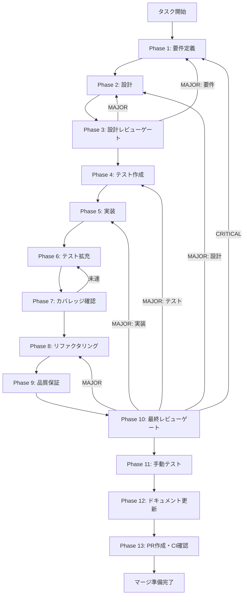

# tool-risk-config-implementation - タスク実行仕様書

## ユーザーからの元の指示

```
packages/shared/src/constants/security.ts に TOOL_RISK_CONFIG 定数を実装し、
riskLevel ごとの dialogWidth・headerColorToken・allowPermanent 設定を確定する。
TASK-SKILL-LIFECYCLE-06（Trust & Permission Governance 仕様策定）の Phase 5 で
設計されたプロトタイプ定義が存在するが、本番実装と確定値割り当てが未完了のため、
後続の PermissionDialog コンポーネント実装がブロックされている。
```

## メタ情報

| 項目         | 内容                                |
| ------------ | ----------------------------------- |
| タスクID     | UT-06-001                           |
| タスク名     | tool-risk-config-implementation     |
| 分類         | 実装タスク                          |
| 対象機能     | ToolRiskConfig 定数（セキュリティ） |
| 優先度       | 高                                  |
| 見積もり規模 | 小規模                              |
| ステータス   | Phase 12 完了（PR作成待ち）         |
| 作成日       | 2026-03-16                          |
| GitHub Issue | #1251                               |

---

## タスク概要

### 目的

`packages/shared/src/constants/security.ts` に `TOOL_RISK_CONFIG` 定数を本番実装し、リスクレベルごとのダイアログ設定（幅・色・許可ポリシー）を確定させる。これにより後続の PermissionDialog コンポーネント実装（UT-06-004）のブロッカーを解消する。

### 背景

TASK-SKILL-LIFECYCLE-06（Trust & Permission Governance 仕様策定）の Phase 5 で `ToolRiskLevel` 型と `TOOL_RISK_CONFIG` 定数のプロトタイプが設計された。プロトタイプでは4段階（critical/high/medium/low）の設計だが、Issue #1251 の受入基準は3段階（low/medium/high）を要求している。本タスクでは Issue の受入基準に従い、3段階の `RiskLevel` 型で本番実装を行う。

### 最終ゴール

- `RiskLevel` 型、`ToolRiskConfigEntry` interface、`TOOL_RISK_CONFIG` 定数が型安全に定義されている
- 全テスト PASS、TypeScript 型エラー・ESLint エラーが 0 件
- `pnpm --filter @repo/shared build` が成功する
- 後続タスク（UT-06-004、TASK-SKILL-LIFECYCLE-08）が着手可能になる

### 成果物一覧

| 種別         | 成果物                | 配置先                                           |
| ------------ | --------------------- | ------------------------------------------------ |
| 機能         | TOOL_RISK_CONFIG 定数 | `packages/shared/src/constants/security.ts`      |
| テスト       | security.test.ts      | `packages/shared/src/constants/security.test.ts` |
| ドキュメント | 実装ガイド・仕様更新  | `outputs/phase-*/`                               |
| PR           | GitHub Pull Request   | GitHub UI                                        |

---

## 参照ファイル

| 参照資料                   | パス                                                                                                                                                  | 内容                                  |
| -------------------------- | ----------------------------------------------------------------------------------------------------------------------------------------------------- | ------------------------------------- |
| Phase 5 プロトタイプ       | `docs/30-workflows/completed-tasks/step-05-par-task-06-trust-permission-governance/outputs/phase-5/security.ts`                                       | 型定義・定数のプロトタイプ            |
| Phase 4 デシジョンテーブル | `docs/30-workflows/completed-tasks/step-05-par-task-06-trust-permission-governance/outputs/phase-4/decision-table-risk-permission.md`                 | リスクレベル×権限の意思決定マトリクス |
| タスク指示書               | `docs/30-workflows/completed-tasks/step-05-par-task-06-trust-permission-governance/unassigned-task/task-ut-06-001-tool-risk-config-implementation.md` | 詳細な実装要件                        |
| 現行 security.ts           | `packages/shared/src/constants/security.ts`                                                                                                           | 既存のセキュリティ定数（323行）       |

### システム仕様（aiworkflow-requirements）

> 実装前に以下のシステム仕様を確認し、既存設計との整合性を確保してください。

| 参照資料             | パス                                                                           | 内容                 |
| -------------------- | ------------------------------------------------------------------------------ | -------------------- |
| セキュリティ原則     | `.claude/skills/aiworkflow-requirements/references/security-principles.md`     | セキュリティ設計原則 |
| セキュリティ実装     | `.claude/skills/aiworkflow-requirements/references/security-implementation.md` | 実装パターン         |
| インターフェース定義 | `.claude/skills/aiworkflow-requirements/references/interfaces-core.md`         | 共有型定義の設計方針 |

---

## タスク分解サマリー

| ID     | フェーズ | サブタスク名                         | 責務                                                            | 依存 |
| ------ | -------- | ------------------------------------ | --------------------------------------------------------------- | ---- |
| T-01-1 | Phase 1  | 要件定義・受入基準の確定             | RiskLevel 3段階の要件確定                                       | -    |
| T-02-1 | Phase 2  | 型設計・定数値の確定                 | interface/type/定数の設計                                       | T-01 |
| T-03-1 | Phase 3  | 設計レビューゲート                   | 設計妥当性の判定                                                | T-02 |
| T-04-1 | Phase 4  | テストケース作成（Red）              | security.test.ts 作成                                           | T-03 |
| T-05-1 | Phase 5  | TOOL_RISK_CONFIG 実装（Green）       | security.ts 更新                                                | T-04 |
| T-06-1 | Phase 6  | テスト拡充（異常系・境界値）         | エッジケーステスト追加                                          | T-05 |
| T-07-1 | Phase 7  | カバレッジ確認                       | Line 80%+ / Branch 60%+ 確認                                    | T-06 |
| T-08-1 | Phase 8  | リファクタリング                     | JSDoc整備・命名改善                                             | T-07 |
| T-09-1 | Phase 9  | 品質保証（Lint/TypeCheck/Test）      | 一括品質判定                                                    | T-08 |
| T-10-1 | Phase 10 | 最終レビューゲート                   | 受入基準の最終判定                                              | T-09 |
| T-11-1 | Phase 11 | 手動テスト（ビルド・型チェック確認） | pnpm build / typecheck 確認                                     | T-10 |
| T-12-1 | Phase 12 | ドキュメント更新（5タスク）          | 実装ガイド/仕様更新/changelog/未タスク検出/スキルフィードバック | T-11 |
| T-13-1 | Phase 13 | PR作成準備                           | ユーザー承認後のPR作成                                          | T-12 |

**総サブタスク数**: 13個

---

## 実行フロー図



---

## Phase一覧

| Phase | 名称               | 仕様書                                                       | ステータス |
| ----- | ------------------ | ------------------------------------------------------------ | ---------- |
| 1     | 要件定義           | [phase-1-requirements.md](phase-1-requirements.md)           | 完了       |
| 2     | 設計               | [phase-2-design.md](phase-2-design.md)                       | 完了       |
| 3     | 設計レビューゲート | [phase-3-design-review.md](phase-3-design-review.md)         | 完了       |
| 4     | テスト作成         | [phase-4-test-creation.md](phase-4-test-creation.md)         | 完了       |
| 5     | 実装               | [phase-5-implementation.md](phase-5-implementation.md)       | 完了       |
| 6     | テスト拡充         | [phase-6-test-expansion.md](phase-6-test-expansion.md)       | 完了       |
| 7     | カバレッジ確認     | [phase-7-coverage-check.md](phase-7-coverage-check.md)       | 完了       |
| 8     | リファクタリング   | [phase-8-refactoring.md](phase-8-refactoring.md)             | 完了       |
| 9     | 品質保証           | [phase-9-quality-assurance.md](phase-9-quality-assurance.md) | 完了       |
| 10    | 最終レビューゲート | [phase-10-final-review.md](phase-10-final-review.md)         | 完了       |
| 11    | 手動テスト         | [phase-11-manual-test.md](phase-11-manual-test.md)           | 完了       |
| 12    | ドキュメント更新   | [phase-12-documentation.md](phase-12-documentation.md)       | 完了       |
| 13    | PR作成             | [phase-13-pr-creation.md](phase-13-pr-creation.md)           | blocked    |

---

## テストカバレッジ目標

### ユニットテスト

| 指標              | 最低基準 | 推奨基準 |
| ----------------- | -------- | -------- |
| Line Coverage     | 80%      | 90%      |
| Branch Coverage   | 60%      | 70%      |
| Function Coverage | 80%      | 90%      |

### 結合テスト

| 指標                         | 目標 |
| ---------------------------- | ---- |
| APIエンドポイント            | 100% |
| モジュール間インターフェース | 100% |
| 正常系シナリオ               | 100% |
| 異常系シナリオ               | 80%+ |
| 外部連携ポイント             | 100% |

---

## 統合テスト連携（Phase 1〜11で必須）

各Phaseで以下の統合テスト連携アクションを実施すること:

| Phase | 統合テスト連携アクション                            |
| ----- | --------------------------------------------------- |
| 1     | 後続タスク（UT-06-004）への型エクスポート要件を明記 |
| 2     | TOOL_RISK_CONFIG の型定義とエクスポート設計を反映   |
| 3     | 型エクスポートの整合性をレビュー                    |
| 4     | 型チェックテスト・エクスポートテストを作成          |
| 5     | security.ts の更新と shared パッケージビルド確認    |
| 6     | 異常値テスト・境界値テスト追加                      |
| 7     | カバレッジ測定と基準充足確認                        |
| 8     | リファクタ後のビルド・テスト継続成功を確認          |
| 9     | Lint/TypeCheck/全テスト一括判定                     |
| 10    | 受入基準12項目の最終判定                            |
| 11    | pnpm --filter @repo/shared build の手動確認         |

---

## Phase完了時の必須アクション

**各Phase完了時に以下を必ず実行すること:**

1. **タスク100%実行**: Phase内で指定された全タスクを完全に実行
2. **成果物確認**: 全ての必須成果物が生成されていることを検証
3. **実行記録**: 実行タスクの結果を記録
4. **artifacts.json更新**: Phase完了ステータスを更新
5. **Phase末端の実行確認**: 各タスクを100%実行し、各タスクを完遂した旨を必ず明記

```bash
# Phase完了時の検証コマンド
node .claude/skills/task-specification-creator/scripts/validate-phase-output.js docs/30-workflows/tool-risk-config-implementation --phase {{PHASE_NUMBER}}

# Phase完了・成果物登録
node .claude/skills/task-specification-creator/scripts/complete-phase.js \
  --workflow docs/30-workflows/tool-risk-config-implementation --phase {{PHASE_NUMBER}} --artifacts "..."
```
