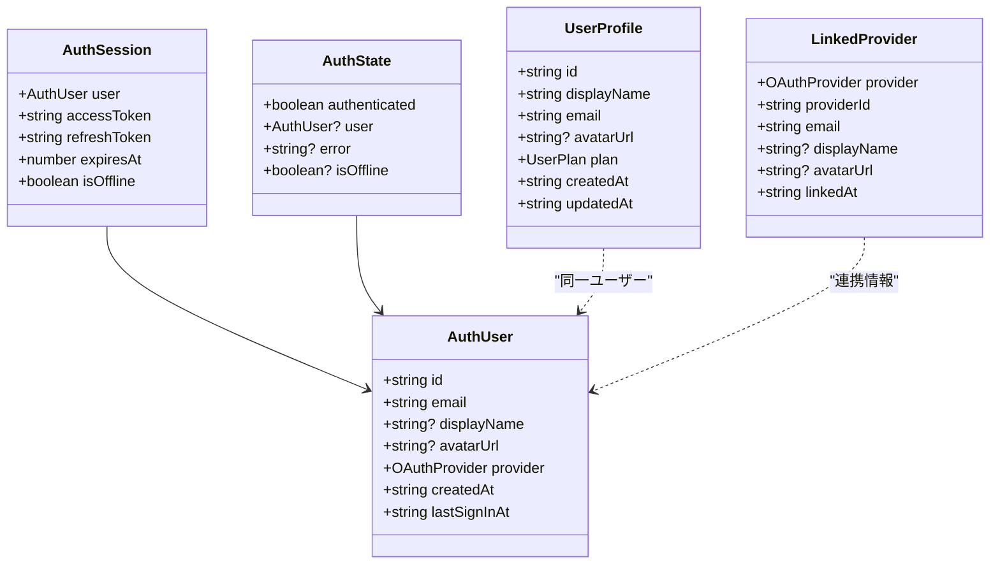

# データモデル設計書

## メタ情報

| 項目       | 内容                   |
| ---------- | ---------------------- |
| タスクID   | T-01-1                 |
| 参照元     | T-00-1, T-00-2, T-00-3 |
| 作成日     | 2025-12-09             |
| ステータス | 完了                   |

---

## 1. 概要

### 1.1 目的

ユーザー認証・プロフィール管理機能のデータモデルを定義する。

### 1.2 設計方針

- **Supabase Auth連携**: 認証はSupabase Authに委譲し、アプリはセッション管理のみ担当
- **型安全性**: TypeScriptの厳密な型定義でランタイムエラーを防止
- **最小権限**: トークンはRenderer processに保持せず、Main processで管理

---

## 2. 型定義

### 2.1 OAuthプロバイダー型

```typescript
/**
 * サポートするOAuthプロバイダー
 */
type OAuthProvider = "google" | "github" | "discord";

/**
 * 有効なプロバイダーかを検証する型ガード
 */
function isValidProvider(provider: unknown): provider is OAuthProvider;
```

**設計判断**:

- Discordを追加（Supabase標準サポート）
- 文字列リテラル型で型安全性を確保

### 2.2 認証ユーザー型

```typescript
/**
 * 認証ユーザー情報
 * Supabase Auth のユーザー情報を正規化した型
 */
interface AuthUser {
  id: string; // Supabase user ID (UUID)
  email: string; // メールアドレス
  displayName: string | null; // 表示名
  avatarUrl: string | null; // アバターURL
  provider: OAuthProvider; // 認証プロバイダー
  createdAt: string; // 作成日時 (ISO 8601)
  lastSignInAt: string; // 最終ログイン日時 (ISO 8601)
}
```

### 2.3 ユーザープロフィール型

```typescript
/**
 * ユーザープラン
 */
type UserPlan = "free" | "pro" | "enterprise";

/**
 * ユーザープロフィール
 * Supabase user_profiles テーブルに対応
 */
interface UserProfile {
  id: string; // Supabase user ID (UUID)
  displayName: string; // 表示名 (3-30文字)
  email: string; // メールアドレス
  avatarUrl: string | null; // アバターURL (HTTPS必須)
  plan: UserPlan; // 契約プラン
  createdAt: string; // 作成日時 (ISO 8601)
  updatedAt: string; // 更新日時 (ISO 8601)
}
```

### 2.4 連携プロバイダー型

```typescript
/**
 * 連携プロバイダー情報
 * ユーザーが連携したOAuthプロバイダーの情報
 */
interface LinkedProvider {
  provider: OAuthProvider; // プロバイダー種別
  providerId: string; // プロバイダー側のユーザーID
  email: string; // プロバイダーのメールアドレス
  displayName: string | null; // プロバイダーの表示名
  avatarUrl: string | null; // プロバイダーのアバターURL
  linkedAt: string; // 連携日時 (ISO 8601)
}
```

### 2.5 認証セッション型

```typescript
/**
 * 認証セッション情報
 * Main Process でのみ保持、Renderer には user のみ公開
 */
interface AuthSession {
  user: AuthUser; // ユーザー情報
  accessToken: string; // アクセストークン (Main processのみ)
  refreshToken: string; // リフレッシュトークン (Main processのみ)
  expiresAt: number; // 有効期限 (Unix timestamp)
  isOffline: boolean; // オフラインモードフラグ
}
```

### 2.6 認証状態型

```typescript
/**
 * 認証状態
 * Renderer Process に公開する認証状態
 */
interface AuthState {
  authenticated: boolean; // 認証済みフラグ
  user?: AuthUser; // ユーザー情報
  error?: string; // エラーメッセージ
  isOffline?: boolean; // オフラインフラグ
}
```

---

## 3. バリデーション

### 3.1 表示名バリデーション

```typescript
const DISPLAY_NAME_CONSTRAINTS = {
  minLength: 3,
  maxLength: 30,
} as const;

function validateDisplayName(
  name: string,
): { valid: true } | { valid: false; message: string };
```

### 3.2 アバターURLバリデーション

```typescript
function validateAvatarUrl(
  url: string | null,
): { valid: true } | { valid: false; message: string };
```

**制約**:

- HTTPS必須
- null許可（デフォルトアバター使用時）

---

## 4. エラーコード

### 4.1 認証エラー

```typescript
const AUTH_ERROR_CODES = {
  LOGIN_FAILED: "auth/login-failed",
  LOGOUT_FAILED: "auth/logout-failed",
  SESSION_FAILED: "auth/session-failed",
  REFRESH_FAILED: "auth/refresh-failed",
  INVALID_PROVIDER: "auth/invalid-provider",
  NETWORK_ERROR: "auth/network-error",
  TOKEN_EXPIRED: "auth/token-expired",
} as const;
```

### 4.2 プロフィールエラー

```typescript
const PROFILE_ERROR_CODES = {
  GET_FAILED: "profile/get-failed",
  UPDATE_FAILED: "profile/update-failed",
  PROVIDERS_FAILED: "profile/providers-failed",
  LINK_FAILED: "profile/link-failed",
  VALIDATION_FAILED: "profile/validation-failed",
} as const;
```

---

## 5. IPC レスポンス型

```typescript
/**
 * IPC エラー型
 */
interface IPCError {
  code: string;
  message: string;
  details?: Record<string, unknown>;
}

/**
 * IPC レスポンスの基本型
 */
interface IPCResponse<T> {
  success: boolean;
  data?: T;
  error?: IPCError;
}
```

---

## 6. 型関係図



---

## 7. 実装ファイル

| 成果物        | パス                                |
| ------------- | ----------------------------------- |
| 型定義        | `packages/shared/types/auth.ts`     |
| preload型定義 | `apps/desktop/src/preload/types.ts` |

---

## 8. 完了条件

- [x] AuthUser型が定義されている
- [x] UserProfile型が定義されている
- [x] LinkedProvider型が定義されている
- [x] AuthSession型が定義されている
- [x] AuthState型が定義されている
- [x] バリデーション関数が定義されている
- [x] エラーコードが定義されている
- [x] 型間の関係が明確化されている
