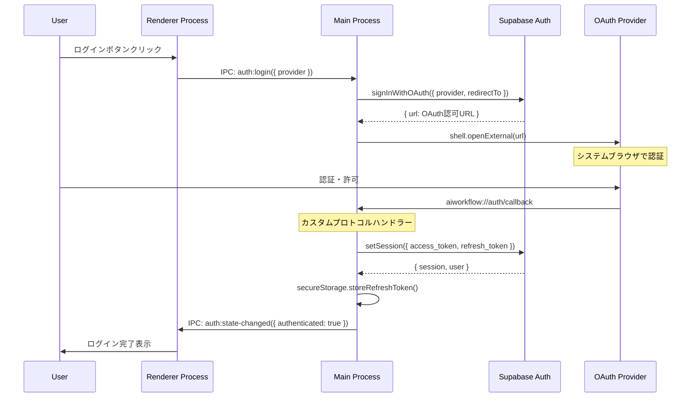
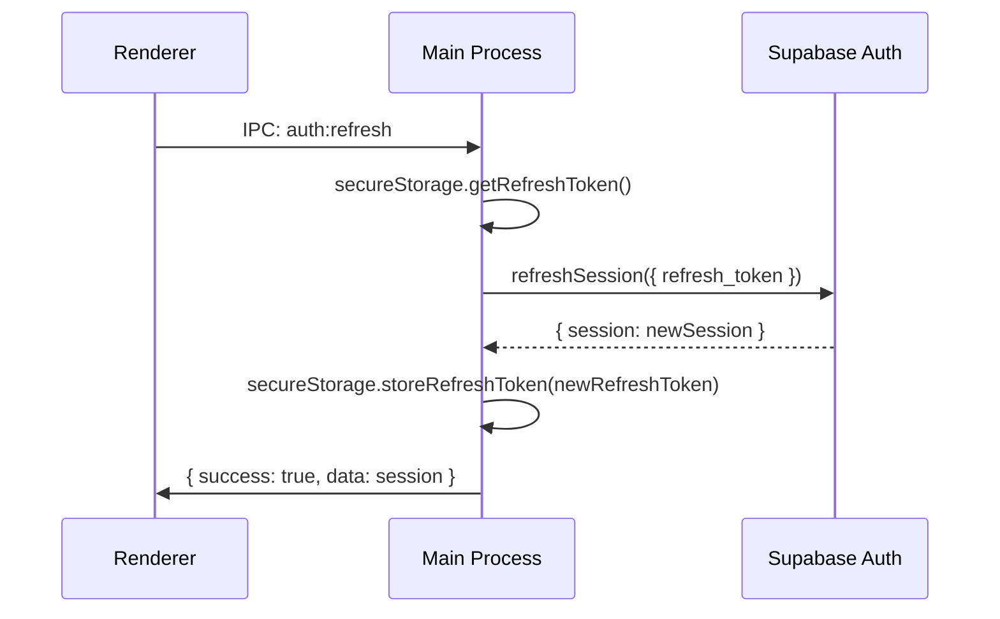
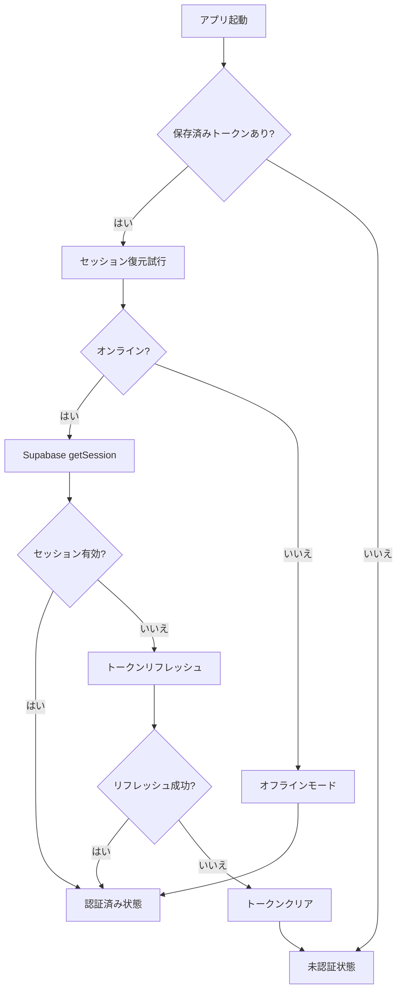

# OAuthフロー設計書

## メタ情報

| 項目       | 内容       |
| ---------- | ---------- |
| タスクID   | T-01-3     |
| 参照元     | T-00-2     |
| 作成日     | 2025-12-09 |
| ステータス | 完了       |

---

## 1. 概要

### 1.1 目的

Supabase Authを使用したOAuth認証フローとカスタムプロトコルによるコールバック処理を設計する。

### 1.2 設計方針

- **Supabase Auth委譲**: PKCE、state管理はSupabase SDKに委譲
- **カスタムプロトコル**: `aiworkflow://auth/callback`でコールバック受信
- **セキュアトークン管理**: safeStorageでリフレッシュトークンを暗号化保存

### 1.3 アーキテクチャ変更

**元の仕様（requirements-oauth.md）**:

- ローカルHTTPサーバー（`http://localhost:{PORT}/auth/callback`）
- 独自PKCE実装（code_verifier/code_challenge）
- 独自state管理（CSRF対策）

**実際の設計**:

- カスタムプロトコル（`aiworkflow://auth/callback`）
- Supabase Auth SDKがPKCE/stateを内部管理
- シンプルで安全な実装

---

## 2. 認証フロー

### 2.1 シーケンス図



### 2.2 カスタムプロトコル

```typescript
// プロトコル名
const CUSTOM_PROTOCOL = "aiworkflow";

// コールバックURL
const AUTH_REDIRECT_URL = "aiworkflow://auth/callback";

// コールバックURL例
// aiworkflow://auth/callback#access_token=xxx&refresh_token=yyy&type=bearer
```

---

## 3. プロバイダー別設定

### 3.1 Google OAuth

| 項目            | 値                           |
| --------------- | ---------------------------- |
| プロバイダー    | google                       |
| スコープ        | openid, profile, email       |
| PKCEサポート    | あり（Supabase SDK内部処理） |
| リダイレクトURI | aiworkflow://auth/callback   |

### 3.2 GitHub OAuth

| 項目            | 値                                  |
| --------------- | ----------------------------------- |
| プロバイダー    | github                              |
| スコープ        | read:user, user:email               |
| PKCEサポート    | なし（Supabaseがclient_secret管理） |
| リダイレクトURI | aiworkflow://auth/callback          |

### 3.3 Discord OAuth

| 項目            | 値                           |
| --------------- | ---------------------------- |
| プロバイダー    | discord                      |
| スコープ        | identify, email              |
| PKCEサポート    | あり（Supabase SDK内部処理） |
| リダイレクトURI | aiworkflow://auth/callback   |

---

## 4. トークン管理

### 4.1 トークン種別

| トークン      | 保存場所               | 暗号化 | 有効期限      |
| ------------- | ---------------------- | ------ | ------------- |
| access_token  | メモリ（Supabase SDK） | なし   | 1時間         |
| refresh_token | safeStorage            | あり   | 長期（6ヶ月） |

### 4.2 セキュアストレージ

```typescript
// apps/desktop/src/main/infrastructure/secureStorage.ts

interface SecureStorage {
  storeRefreshToken(token: string): Promise<void>;
  getRefreshToken(): Promise<string | null>;
  clearTokens(): Promise<void>;
}
```

### 4.3 トークンリフレッシュ



---

## 5. セッション復元

### 5.1 アプリ起動時フロー



### 5.2 オフラインモード

- ネットワーク切断時も保存済みユーザー情報を表示
- API呼び出しは無効化
- 再接続時に自動リフレッシュ

---

## 6. エラーハンドリング

### 6.1 エラー種別

| エラー             | コード                | 原因                   | 対応              |
| ------------------ | --------------------- | ---------------------- | ----------------- |
| ログイン失敗       | auth/login-failed     | OAuth認証エラー        | 再試行を促す      |
| 無効なプロバイダー | auth/invalid-provider | 不正なプロバイダー指定 | エラー表示        |
| セッション取得失敗 | auth/session-failed   | Supabase API エラー    | 再試行/ログアウト |
| リフレッシュ失敗   | auth/refresh-failed   | トークン期限切れ       | 再認証を促す      |
| ネットワークエラー | auth/network-error    | 接続障害               | オフラインモード  |

### 6.2 エラーメッセージ（日本語）

```typescript
const ERROR_MESSAGES: Record<string, string> = {
  "auth/login-failed": "ログインに失敗しました",
  "auth/invalid-provider": "無効な認証プロバイダーです",
  "auth/session-failed": "セッションの取得に失敗しました",
  "auth/refresh-failed": "認証の更新に失敗しました。再度ログインしてください",
  "auth/network-error": "ネットワークエラーが発生しました",
  "auth/token-expired": "認証の有効期限が切れました",
};
```

---

## 7. カスタムプロトコル実装

### 7.1 プロトコル登録

```typescript
// apps/desktop/src/main/protocol/customProtocol.ts

function registerAsDefaultProtocolClient(): boolean;
function setupMacOSProtocolHandler(options: ProtocolSetupOptions): void;
function setupWindowsLinuxProtocolHandler(options: ProtocolSetupOptions): void;
```

### 7.2 コールバック処理

```typescript
async function processAuthCallback(
  callbackUrl: string,
  mainWindow: BrowserWindow,
  supabase: SupabaseClient,
  secureStorage: SecureStorage,
): Promise<void>;
```

---

## 8. 実装ファイル

| 成果物                 | パス                                                    |
| ---------------------- | ------------------------------------------------------- |
| カスタムプロトコル     | `apps/desktop/src/main/protocol/customProtocol.ts`      |
| 認証ハンドラー         | `apps/desktop/src/main/ipc/authHandlers.ts`             |
| セキュアストレージ     | `apps/desktop/src/main/infrastructure/secureStorage.ts` |
| 共有Auth型定義         | `packages/shared/types/auth.ts`                         |
| 共有Authユーティリティ | `packages/shared/infrastructure/auth.ts`                |

---

## 9. 完了条件

- [x] カスタムプロトコル（aiworkflow://）が設計されている
- [x] OAuth認証フローが設計されている
- [x] トークンリフレッシュフローが設計されている
- [x] セッション復元フローが設計されている
- [x] エラーハンドリングが設計されている
- [x] セキュアストレージ（safeStorage）が設計されている

---

## 10. 仕様変更履歴

| 日付       | 変更内容                                         |
| ---------- | ------------------------------------------------ |
| 2025-12-09 | ローカルHTTPサーバーからカスタムプロトコルに変更 |
| 2025-12-09 | 独自PKCE/state実装からSupabase SDK委譲に変更     |
