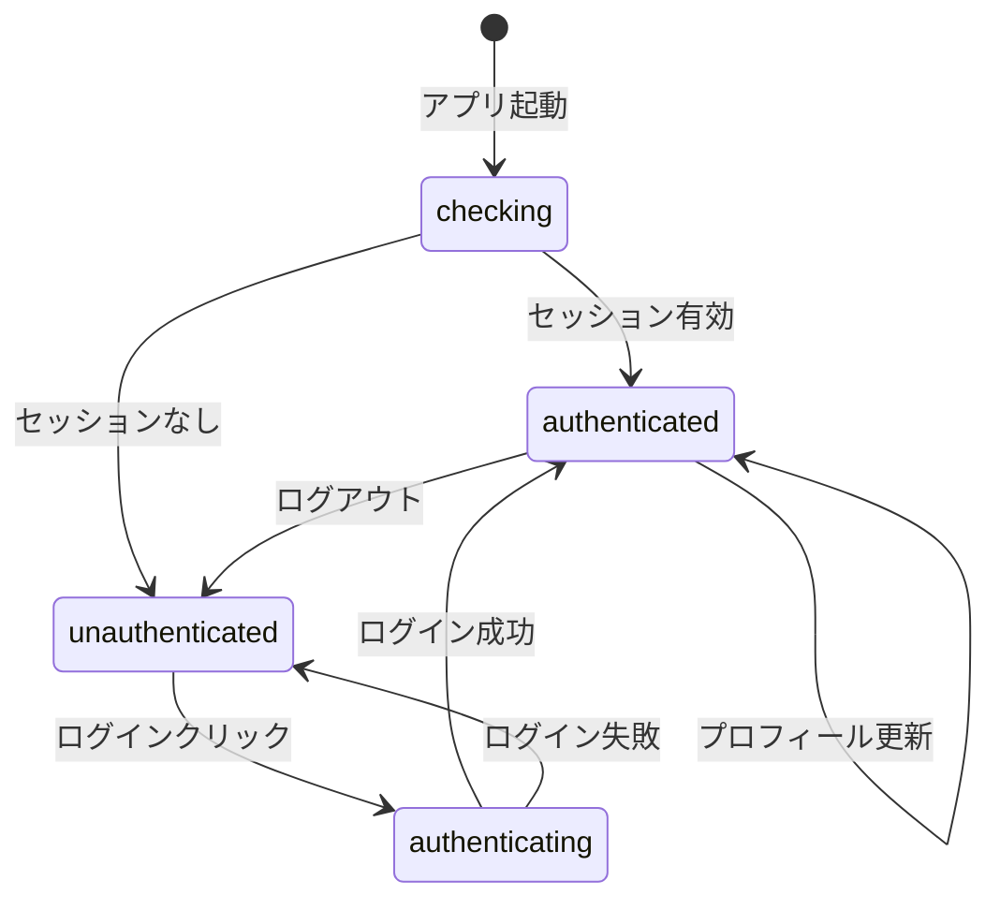

# UI設計書

## メタ情報

| 項目       | 内容           |
| ---------- | -------------- |
| タスクID   | T-01-4         |
| 参照元     | T-01-1, T-01-2 |
| 作成日     | 2025-12-09     |
| ステータス | 完了           |

---

## 1. 概要

### 1.1 目的

アカウント設定画面のコンポーネント構成と状態管理を設計する。

### 1.2 設計方針

- **Atomic Design**: atoms → molecules → organisms の階層構造
- **アクセシビリティ**: WCAG 2.1 AA準拠
- **状態管理**: Zustand slice によるグローバル状態管理

---

## 2. コンポーネント階層

```
AccountSection (organism)
├── ProfileCard
│   ├── Avatar (atom)
│   ├── UserInfo
│   │   ├── DisplayName
│   │   ├── Email
│   │   └── Plan badge
│   └── EditButton (atom)
├── ProfileEditForm (表示/非表示切替)
│   ├── TextInput (atom) - displayName
│   ├── SaveButton (atom)
│   └── CancelButton (atom)
├── LinkedProviders
│   ├── ProviderCard (molecule) × N
│   │   ├── ProviderIcon (atom)
│   │   ├── ProviderInfo
│   │   └── UnlinkButton / LinkButton
│   └── AddProviderButtons
└── ErrorDisplay
    └── ErrorMessage (atom)
```

---

## 3. コンポーネント仕様

### 3.1 AccountSection (organism)

**責務**: アカウント設定の全体レイアウトと状態管理

```typescript
interface AccountSectionProps {
  className?: string;
}
```

**状態**:

- 編集モード（isEditing）
- ローディング状態（isLoading）
- エラー表示

### 3.2 Avatar (atom)

**責務**: アバター画像の表示

```typescript
interface AvatarProps {
  src: string | null;
  alt: string;
  size?: "sm" | "md" | "lg";
  fallback?: React.ReactNode;
}
```

**サイズ**:

- sm: 32px
- md: 48px
- lg: 80px

### 3.3 ProviderIcon (atom)

**責務**: OAuthプロバイダーのアイコン表示

```typescript
interface ProviderIconProps {
  provider: OAuthProvider;
  size?: number;
  className?: string;
}
```

**アイコン**:

- Google: Google カラーロゴ
- GitHub: GitHub ロゴ（ダークモード対応）
- Discord: Discord ロゴ

### 3.4 LinkedProviders (molecule)

**責務**: 連携済みプロバイダーの一覧表示と連携操作

```typescript
interface LinkedProvidersProps {
  providers: LinkedProvider[];
  onLink: (provider: OAuthProvider) => void;
  onUnlink: (provider: OAuthProvider) => void;
  isLoading: boolean;
}
```

---

## 4. 状態管理設計

### 4.1 authSlice

```typescript
interface AuthSlice {
  // 状態
  isAuthenticated: boolean;
  isLoading: boolean;
  authUser: AuthUser | null;
  profile: UserProfile | null;
  linkedProviders: LinkedProvider[];
  isOffline: boolean;
  authError: string | null;

  // アクション
  login: (provider: OAuthProvider) => Promise<void>;
  logout: () => Promise<void>;
  updateProfile: (updates: ProfileUpdateFields) => Promise<void>;
  linkProvider: (provider: OAuthProvider) => Promise<void>;
  unlinkProvider: (provider: OAuthProvider) => Promise<void>;
  setAuthError: (error: string | null) => void;
  initializeAuth: () => Promise<void>;
}
```

### 4.2 状態遷移



---

## 5. レイアウト仕様

### 5.1 未認証状態

```
┌─────────────────────────────────────────────────┐
│ アカウント                        [オフライン] │
├─────────────────────────────────────────────────┤
│                                                 │
│   アカウントを連携してデータを同期              │
│                                                 │
│   ┌─────────────────────────────────────────┐   │
│   │ 🔴 Googleで続ける                       │   │
│   └─────────────────────────────────────────┘   │
│   ┌─────────────────────────────────────────┐   │
│   │ ⚫ GitHubで続ける                       │   │
│   └─────────────────────────────────────────┘   │
│   ┌─────────────────────────────────────────┐   │
│   │ 🔵 Discordで続ける                      │   │
│   └─────────────────────────────────────────┘   │
│                                                 │
└─────────────────────────────────────────────────┘
```

### 5.2 認証済み状態

```
┌─────────────────────────────────────────────────┐
│ アカウント                        [オフライン] │
├─────────────────────────────────────────────────┤
│                                                 │
│   ┌─────┐  Test User              [編集]       │
│   │ 👤  │  test@example.com                    │
│   └─────┘  free プラン                         │
│                                                 │
├─────────────────────────────────────────────────┤
│ 連携サービス                                    │
│                                                 │
│   🔴 Google     test@gmail.com    [登録済み]   │
│   ⚫ GitHub                        [連携する]  │
│   🔵 Discord                       [連携する]  │
│                                                 │
├─────────────────────────────────────────────────┤
│                                                 │
│                              [ログアウト]       │
│                                                 │
└─────────────────────────────────────────────────┘
```

### 5.3 編集モード

```
┌─────────────────────────────────────────────────┐
│ プロフィール編集                                │
├─────────────────────────────────────────────────┤
│                                                 │
│   表示名                                        │
│   ┌─────────────────────────────────────────┐   │
│   │ Test User                               │   │
│   └─────────────────────────────────────────┘   │
│   3〜30文字                                     │
│                                                 │
│              [キャンセル]  [保存]               │
│                                                 │
└─────────────────────────────────────────────────┘
```

---

## 6. アクセシビリティ要件

### 6.1 ARIA属性

| コンポーネント   | ARIA属性                               |
| ---------------- | -------------------------------------- |
| AccountSection   | `role="region"` `aria-label`           |
| Avatar           | `role="img"` `alt`                     |
| ErrorMessage     | `role="alert"` `aria-live="assertive"` |
| LoadingIndicator | `role="status"` `aria-live="polite"`   |
| ログインボタン   | `aria-label="〇〇で続ける"`            |

### 6.2 キーボードナビゲーション

- Tab: フォーカス移動
- Enter/Space: ボタン実行
- Escape: 編集モード終了

### 6.3 スクリーンリーダー対応

- ローディング中: 「読み込み中」を通知
- エラー発生時: エラーメッセージを即座に通知
- 成功時: 「保存しました」を通知

---

## 7. エラー表示

### 7.1 インラインエラー

```typescript
interface ErrorDisplayProps {
  error: string | null;
  onDismiss: () => void;
}
```

### 7.2 エラーメッセージ例

| エラーコード              | 表示メッセージ                      |
| ------------------------- | ----------------------------------- |
| auth/login-failed         | ログインに失敗しました              |
| auth/network-error        | ネットワーク接続を確認してください  |
| profile/validation-failed | 表示名は3〜30文字で入力してください |

---

## 8. 実装ファイル

| 成果物         | パス                                                             |
| -------------- | ---------------------------------------------------------------- |
| AccountSection | `apps/desktop/src/renderer/components/organisms/AccountSection/` |
| ProviderIcon   | `apps/desktop/src/renderer/components/atoms/ProviderIcon/`       |
| authSlice      | `apps/desktop/src/renderer/store/slices/authSlice.ts`            |
| AuthGuard      | `apps/desktop/src/renderer/components/AuthGuard/`                |
| AuthView       | `apps/desktop/src/renderer/views/AuthView/`                      |

---

## 9. 完了条件

- [x] コンポーネント階層が定義されている
- [x] 状態管理（authSlice）の設計が完了している
- [x] レイアウト仕様が定義されている
- [x] アクセシビリティ要件が定義されている
- [x] エラー表示仕様が定義されている
