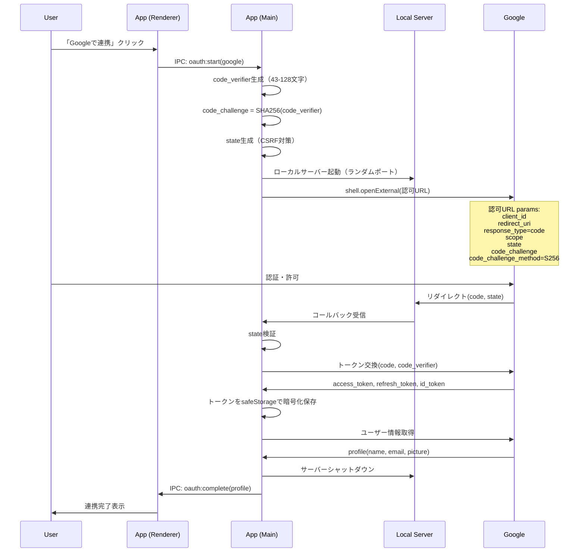
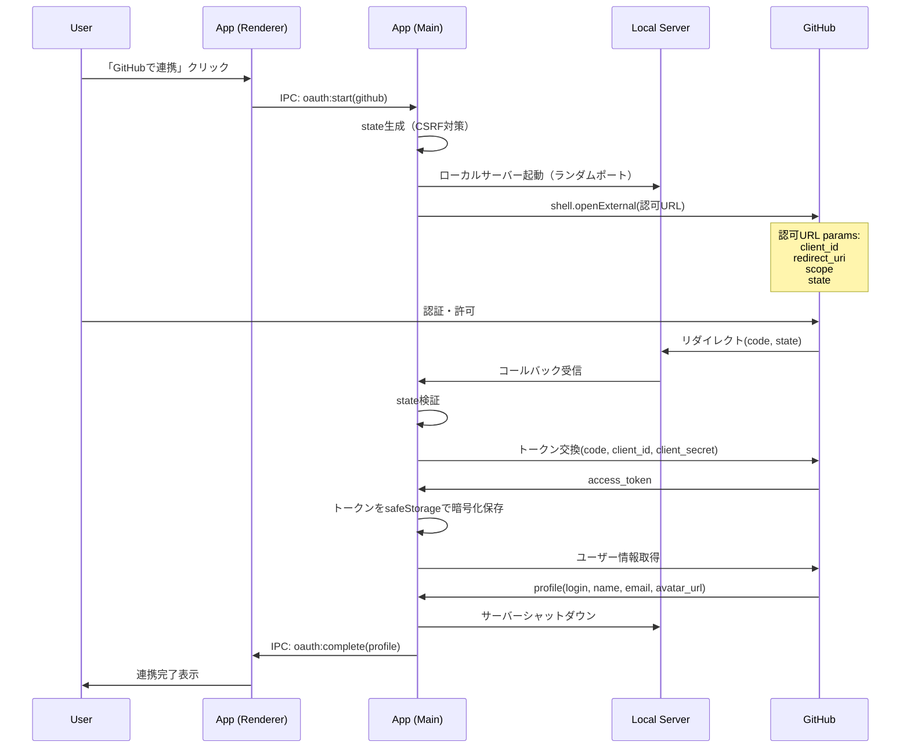

# OAuth連携要件定義書

## メタ情報

| 項目       | 内容                            |
| ---------- | ------------------------------- |
| タスクID   | T-00-2                          |
| 参照元     | FR-UA-002, FR-UA-003, FR-UA-005 |
| 作成日     | 2025-12-09                      |
| ステータス | 完了                            |

---

## 1. 概要

### 1.1 目的

Google/GitHubアカウントとのOAuth連携機能の要件を定義する。Electronデスクトップアプリケーションにおける安全なOAuth認証フローを実現する。

### 1.2 スコープ

| 含む                         | 含まない                          |
| ---------------------------- | --------------------------------- |
| Google OAuth 2.0連携         | Apple Sign-in（将来機能）         |
| GitHub OAuth連携             | Microsoft Account連携（将来機能） |
| PKCEによるセキュア認証       | SAML/OIDC連携（将来機能）         |
| ローカルコールバックサーバー | クラウドベースの認証プロキシ      |
| 連携解除機能                 | マルチアカウント管理              |

---

## 2. 機能要件

### 2.1 Google OAuth連携（FR-OAUTH-001）

#### 説明

Googleアカウントとの連携を実装する。

#### 優先度

**Must Have**

#### OAuth設定

| 項目                       | 値                                            |
| -------------------------- | --------------------------------------------- |
| クライアントタイプ         | Desktop Application                           |
| 認可エンドポイント         | https://accounts.google.com/o/oauth2/v2/auth  |
| トークンエンドポイント     | https://oauth2.googleapis.com/token           |
| ユーザー情報エンドポイント | https://www.googleapis.com/oauth2/v3/userinfo |
| リダイレクトURI            | http://localhost:{PORT}/auth/google/callback  |
| スコープ                   | openid, profile, email                        |
| PKCEサポート               | あり（必須）                                  |

#### 受け入れ基準

```gherkin
Feature: Google OAuth連携
  ユーザーとして
  Googleアカウントと連携したい
  Googleのプロフィール情報を取得できることを期待する

  Scenario: Googleアカウントと正常に連携する
    Given ユーザーが設定画面を開いている
    And Googleアカウントが連携されていない
    When 「Googleで連携」ボタンをクリックする
    Then システムブラウザでGoogle認証画面が開く
    And ユーザーがGoogleアカウントを選択して許可する
    And ブラウザが閉じる（または「アプリに戻る」案内が表示される）
    And アプリに戻ると連携完了通知が表示される
    And Googleプロフィール情報（名前、メール、アバター）が取得される
    And 「連携済みサービス」にGoogleが追加される

  Scenario: Google連携をキャンセルする
    Given ユーザーが設定画面を開いている
    When 「Googleで連携」ボタンをクリックする
    And システムブラウザでGoogle認証画面が開く
    And ユーザーが「キャンセル」をクリックする
    Then 連携は行われない
    And エラー通知「連携がキャンセルされました」が表示される

  Scenario: Google連携でネットワークエラーが発生する
    Given ユーザーが設定画面を開いている
    And ネットワークが切断されている
    When 「Googleで連携」ボタンをクリックする
    Then エラー通知「ネットワークエラーが発生しました」が表示される
    And 連携は行われない
```

---

### 2.2 GitHub OAuth連携（FR-OAUTH-002）

#### 説明

GitHubアカウントとの連携を実装する。

#### 優先度

**Must Have**

#### OAuth設定

| 項目                       | 値                                           |
| -------------------------- | -------------------------------------------- |
| クライアントタイプ         | OAuth App                                    |
| 認可エンドポイント         | https://github.com/login/oauth/authorize     |
| トークンエンドポイント     | https://github.com/login/oauth/access_token  |
| ユーザー情報エンドポイント | https://api.github.com/user                  |
| リダイレクトURI            | http://localhost:{PORT}/auth/github/callback |
| スコープ                   | read:user, user:email                        |
| PKCEサポート               | なし（client_secret必要）                    |

#### 受け入れ基準

```gherkin
Feature: GitHub OAuth連携
  ユーザーとして
  GitHubアカウントと連携したい
  GitHubのプロフィール情報を取得できることを期待する

  Scenario: GitHubアカウントと正常に連携する
    Given ユーザーが設定画面を開いている
    And GitHubアカウントが連携されていない
    When 「GitHubで連携」ボタンをクリックする
    Then システムブラウザでGitHub認証画面が開く
    And ユーザーがGitHubアカウントで認証して許可する
    And ブラウザが閉じる（または「アプリに戻る」案内が表示される）
    And アプリに戻ると連携完了通知が表示される
    And GitHubプロフィール情報（名前、メール、アバター）が取得される
    And 「連携済みサービス」にGitHubが追加される

  Scenario: GitHub連携で認証エラーが発生する
    Given ユーザーが設定画面を開いている
    When 「GitHubで連携」ボタンをクリックする
    And 認証プロセスでエラーが発生する
    Then エラー通知「認証に失敗しました」が表示される
    And エラーの詳細がログに記録される
```

---

### 2.3 OAuth連携解除（FR-OAUTH-003）

#### 説明

連携済みのOAuthプロバイダーとの連携を解除できる。

#### 優先度

**Must Have**

#### 受け入れ基準

```gherkin
Feature: OAuth連携解除
  ユーザーとして
  連携済みのサービスを解除したい
  プライバシーとセキュリティを管理できることを期待する

  Scenario: Google連携を解除する
    Given ユーザーが設定画面を開いている
    And Googleアカウントが連携済みである
    When 「連携解除」ボタンをクリックする
    And 確認ダイアログで「解除」を選択する
    Then Googleとの連携が解除される
    And 保存されていたアクセストークン・リフレッシュトークンが削除される
    And 「連携済みサービス」からGoogleが削除される
    And 成功通知「Googleとの連携を解除しました」が表示される

  Scenario: 連携解除をキャンセルする
    Given ユーザーが設定画面を開いている
    And GitHubアカウントが連携済みである
    When 「連携解除」ボタンをクリックする
    And 確認ダイアログで「キャンセル」を選択する
    Then 連携は維持される
```

---

### 2.4 セッション復元（FR-OAUTH-004）

#### 説明

アプリ起動時に前回のセッションを復元する。

#### 優先度

**Must Have**

#### 受け入れ基準

```gherkin
Feature: セッション復元
  ユーザーとして
  アプリ再起動後も認証状態を維持したい
  毎回ログインし直す必要がないことを期待する

  Scenario: 有効なセッションを復元する
    Given ユーザーがOAuth連携済みの状態でアプリを終了した
    When アプリを再起動する
    Then 前回の連携状態が復元される
    And 連携済みサービスが表示される
    And 再ログインは不要である

  Scenario: トークン期限切れ時の自動リフレッシュ（Google）
    Given ユーザーがGoogle連携済みである
    And アクセストークンの有効期限が切れている
    And リフレッシュトークンが有効である
    When アプリを起動する
    Then 自動的にアクセストークンがリフレッシュされる
    And ユーザーに再認証は求められない

  Scenario: リフレッシュトークン失効時の再認証要求
    Given ユーザーがGoogle連携済みである
    And リフレッシュトークンが失効している
    When アプリを起動する
    Then 通知「Googleの認証が切れました。再連携してください」が表示される
    And 連携ステータスが「要再認証」に変わる
```

---

## 3. 認証フロー

### 3.1 PKCE認証フロー（Google）



### 3.2 GitHub認証フロー



---

## 4. データモデル要件

### 4.1 AuthProvider型

```typescript
interface AuthProvider {
  type: "google" | "github";
  id: string; // プロバイダー側のユーザーID
  email: string;
  displayName: string;
  avatarUrl: string | null;
  accessToken: string; // 暗号化保存
  refreshToken?: string; // 暗号化保存（Googleのみ）
  expiresAt?: Date; // アクセストークン有効期限
  connectedAt: Date;
}
```

### 4.2 UserAuth型

```typescript
interface UserAuth {
  isAuthenticated: boolean;
  providers: AuthProvider[];
}
```

---

## 5. ローカルコールバックサーバー要件

### 5.1 サーバー仕様

| 項目           | 要件                                                   |
| -------------- | ------------------------------------------------------ |
| ポート         | ランダム（49152-65535）                                |
| プロトコル     | HTTP（localhostのみ）                                  |
| ライフサイクル | 認証開始時に起動、コールバック受信後に即シャットダウン |
| タイムアウト   | 5分（認証完了しない場合自動シャットダウン）            |

### 5.2 エンドポイント

| パス                    | メソッド | 説明                 |
| ----------------------- | -------- | -------------------- |
| `/auth/google/callback` | GET      | Google認可コード受信 |
| `/auth/github/callback` | GET      | GitHub認可コード受信 |

### 5.3 コールバック処理

```gherkin
Scenario: 有効なコールバックを処理する
  Given ローカルサーバーが起動している
  And 認証フローが開始されている
  When コールバックURLにリダイレクトされる
  And codeとstateパラメータが含まれている
  Then stateの有効性を検証する
  And codeを使用してトークンを取得する
  And ブラウザに「認証完了。アプリに戻ってください」を表示する
  And サーバーをシャットダウンする

Scenario: 無効なstateを受信する
  Given ローカルサーバーが起動している
  When 無効なstateパラメータを含むコールバックを受信する
  Then エラーをログに記録する
  And ブラウザに「認証に失敗しました」を表示する
  And 認証フローを中断する
```

---

## 6. UI/UX要件

### 6.1 連携ボタン

```
┌─────────────────────────────────────────────────┐
│ 連携サービス                                     │
│                                                  │
│ Google                           [🔗 連携する]  │
│ Googleアカウントと連携してプロフィールを同期     │
│                                                  │
│ GitHub                           [🔗 連携する]  │
│ GitHubアカウントと連携                           │
│                                                  │
└─────────────────────────────────────────────────┘
```

### 6.2 連携済み表示

```
┌─────────────────────────────────────────────────┐
│ 連携済みサービス                                 │
│                                                  │
│ 🟢 Google: user@gmail.com       [連携解除]      │
│    連携日: 2024/01/15                            │
│                                                  │
└─────────────────────────────────────────────────┘
```

### 6.3 認証中表示

- 「連携する」ボタンが「連携中...」に変わる
- スピナーアニメーションを表示
- 「ブラウザで認証を完了してください」メッセージを表示

---

## 7. エラーハンドリング

### 7.1 エラー種別と対応

| エラー                 | 原因                    | ユーザー向けメッセージ                     | 対応                   |
| ---------------------- | ----------------------- | ------------------------------------------ | ---------------------- |
| `invalid_grant`        | 認可コード無効/期限切れ | 「認証に失敗しました。再度お試しください」 | 再認証を促す           |
| `access_denied`        | ユーザーが拒否          | 「連携がキャンセルされました」             | 通知のみ               |
| `invalid_state`        | CSRF攻撃の可能性        | 「セキュリティエラーが発生しました」       | ログ記録、再認証を促す |
| `network_error`        | ネットワーク障害        | 「ネットワークエラーが発生しました」       | リトライボタン表示     |
| `token_refresh_failed` | リフレッシュ失敗        | 「認証が切れました。再連携してください」   | 再認証を促す           |

---

## 8. 非機能要件

### 8.1 パフォーマンス

| 項目                 | 基準                             |
| -------------------- | -------------------------------- |
| OAuth認証フロー全体  | 30秒以内（ユーザー操作時間除く） |
| トークンリフレッシュ | 3秒以内                          |
| ユーザー情報取得     | 2秒以内                          |

### 8.2 可用性

- プロバイダーAPI障害時は適切なエラーメッセージを表示
- オフライン時は連携機能を無効化（ボタンをdisabled）

---

## 9. 依存関係

### 9.1 外部依存

- Google Cloud Console（OAuth Client ID取得）
- GitHub Developer Settings（OAuth App作成）
- shell.openExternal（Electron API）
- http.createServer（Node.js）

### 9.2 後続タスク

- T-00-3: セキュリティ要件定義
- T-01-1: データモデル設計
- T-01-3: OAuthフロー設計

---

## 10. 完了チェックリスト

- [x] Google OAuth認証フローが定義されている
- [x] GitHub OAuth認証フローが定義されている
- [x] PKCE要件が明記されている
- [x] ローカルコールバックサーバー要件が定義されている
