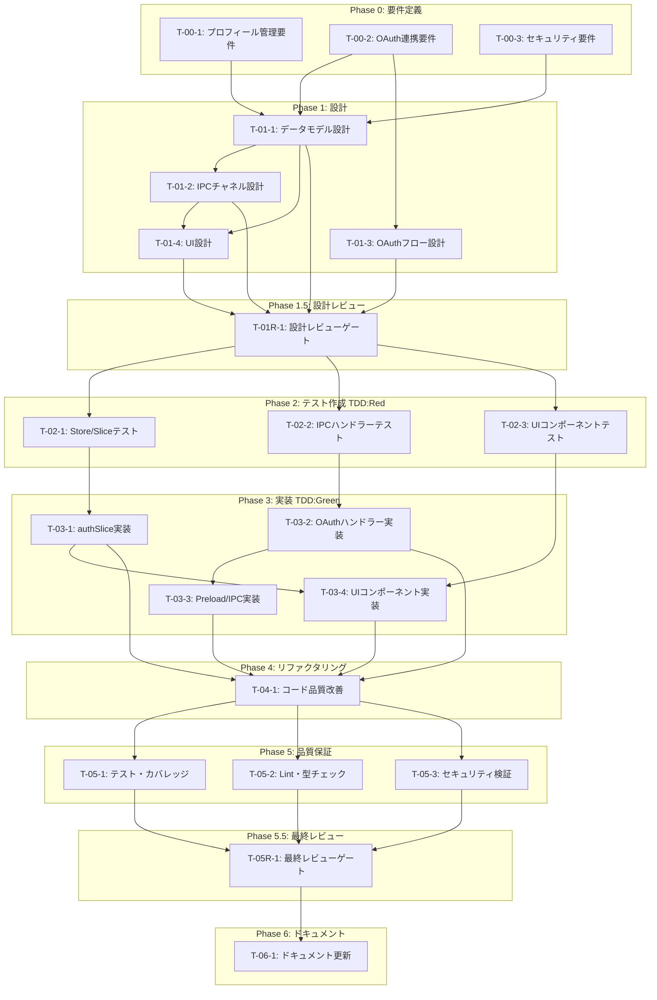

# ユーザー認証・プロフィール管理 - タスク実行仕様書

## ユーザーからの元の指示

```
ユーザー認証・プロフィール管理機能の実装
- ユーザープロフィールの編集・永続化
- Google OAuth連携
- GitHub OAuth連携
- アバター画像の管理
- セッション管理
```

## メタ情報

| 項目             | 内容                                     |
| ---------------- | ---------------------------------------- |
| タスクID         | TASK-USER-AUTH-001                       |
| タスク名         | ユーザー認証・プロフィール管理機能の実装 |
| 分類             | 新規機能                                 |
| 対象機能         | 認証・プロフィール管理（FR-UA-001〜005） |
| 優先度           | 高                                       |
| 見積もり規模     | 大規模                                   |
| ステータス       | 未実施                                   |
| 発見元           | 要件定義書                               |
| 発見日           | 2025-12-09                               |
| 発見エージェント | @product-manager                         |

---

## タスク概要

### 目的

ユーザーが自分のプロフィール情報を管理し、Google/GitHub OAuthによる外部サービス連携を行える機能を実装する。デスクトップアプリケーション（Electron）において、セキュアなOAuth認証フローとトークン管理を実現する。

### 背景

現在のUserProfileはデフォルト値のみで、永続化やOAuth連携機能がない。ユーザーが自分のプロフィールを管理し、外部サービスと連携できる機能が必要。PKCEによるセキュアなOAuth実装が必須。

### 最終ゴール

1. ユーザーがプロフィール（表示名、メール、アバター）を編集・永続化できる
2. Google/GitHub アカウントとOAuth連携できる
3. 連携済みサービスの管理（連携・解除）ができる
4. セッションが永続化され、アプリ再起動後も認証状態が維持される
5. すべてのトークンがsafeStorageで暗号化保存される

### 成果物一覧

| 種別         | 成果物                          | 配置先                                    |
| ------------ | ------------------------------- | ----------------------------------------- |
| 機能         | 認証状態管理（authSlice）       | `apps/desktop/src/renderer/store/slices/` |
| 機能         | OAuthハンドラー（main process） | `apps/desktop/src/main/handlers/`         |
| 機能         | プロフィール編集UI              | `apps/desktop/src/renderer/components/`   |
| 機能         | IPCチャネル定義                 | `apps/desktop/src/preload/`               |
| テスト       | ユニットテスト                  | `apps/desktop/src/**/__tests__/`          |
| ドキュメント | API仕様書                       | `docs/30-workflows/user-auth/`            |

---

## 参照ファイル

本仕様書のコマンド・エージェント・スキル選定は以下を参照：

- `docs/00-requirements/master_system_design.md` - システム要件
- `.claude/commands/ai/command_list.md` - /ai:コマンド定義
- `.claude/agents/agent_list.md` - エージェント定義
- `.claude/skills/skill_list.md` - スキル定義

---

## タスク分解サマリー

| ID      | フェーズ  | サブタスク名               | 責務                                   | 依存           |
| ------- | --------- | -------------------------- | -------------------------------------- | -------------- |
| T-00-1  | Phase 0   | プロフィール管理要件定義   | ユーザープロフィールの機能要件明確化   | なし           |
| T-00-2  | Phase 0   | OAuth連携要件定義          | OAuth認証フローの要件明確化            | なし           |
| T-00-3  | Phase 0   | セキュリティ要件定義       | トークン管理・暗号化の要件明確化       | なし           |
| T-01-1  | Phase 1   | データモデル設計           | UserProfile/AuthProvider型定義         | T-00-1,2,3     |
| T-01-2  | Phase 1   | IPCチャネル設計            | IPC通信インターフェース設計            | T-01-1         |
| T-01-3  | Phase 1   | OAuthフロー設計            | PKCE実装とコールバックサーバー設計     | T-00-2         |
| T-01-4  | Phase 1   | UI設計                     | アカウント設定画面のコンポーネント設計 | T-01-1,2       |
| T-01R-1 | Phase 1.5 | 設計レビュー               | 要件・設計の妥当性検証                 | T-01-1〜4      |
| T-02-1  | Phase 2   | Store/Sliceテスト作成      | authSliceのテスト（Red）               | T-01R-1        |
| T-02-2  | Phase 2   | IPCハンドラーテスト作成    | OAuthハンドラーのテスト（Red）         | T-01R-1        |
| T-02-3  | Phase 2   | UIコンポーネントテスト作成 | プロフィール編集UIのテスト（Red）      | T-01R-1        |
| T-03-1  | Phase 3   | authSlice実装              | 認証状態管理ロジック実装（Green）      | T-02-1         |
| T-03-2  | Phase 3   | OAuthハンドラー実装        | Main processのOAuth処理実装（Green）   | T-02-2         |
| T-03-3  | Phase 3   | Preload/IPC実装            | contextBridge経由のIPC実装（Green）    | T-03-2         |
| T-03-4  | Phase 3   | UIコンポーネント実装       | プロフィール編集画面実装（Green）      | T-02-3, T-03-1 |
| T-04-1  | Phase 4   | コード品質改善             | 命名・構造・重複排除（Refactor）       | T-03-1〜4      |
| T-05-1  | Phase 5   | テスト実行・カバレッジ確認 | 全テスト成功確認                       | T-04-1         |
| T-05-2  | Phase 5   | Lint・型チェック           | コード品質検証                         | T-04-1         |
| T-05-3  | Phase 5   | セキュリティ検証           | 脆弱性スキャン・PKCE検証               | T-04-1         |
| T-05R-1 | Phase 5.5 | 最終レビュー               | 全体品質・整合性検証                   | T-05-1〜3      |
| T-06-1  | Phase 6   | ドキュメント更新           | システム要件ドキュメント反映           | T-05R-1        |

**総サブタスク数**: 21個

---

## 実行フロー図



---

## Phase 0: 要件定義

### T-00-1: プロフィール管理要件定義

#### 目的

ユーザープロフィール管理機能の機能要件・受け入れ基準を明文化する。

#### 背景

FR-UA-001で定義されたプロフィール管理要件を実装可能な形式に変換する必要がある。

#### 責務（単一責務）

プロフィール管理に関する機能要件の定義のみを担当する。

#### Claude Code スラッシュコマンド

> ⚠️ 以下はターミナルコマンドではなく、Claude Code内で実行するスラッシュコマンドです

```
/ai:gather-requirements profile-management
```

- **参照**: `.claude/commands/ai/command_list.md`

#### 使用エージェント

- **エージェント**: @req-analyst
- **選定理由**: 曖昧な要望を検証可能な要件に変換する専門家
- **参照**: `.claude/agents/agent_list.md`

#### 活用スキル

| スキル名                    | 活用方法                                |
| --------------------------- | --------------------------------------- |
| requirements-engineering    | MoSCoW優先度付けで要件を整理            |
| acceptance-criteria-writing | Given-When-Then形式で受け入れ基準を定義 |

- **参照**: `.claude/skills/skill_list.md`

#### 成果物

| 成果物             | パス                                                  | 内容                   |
| ------------------ | ----------------------------------------------------- | ---------------------- |
| プロフィール要件書 | `docs/30-workflows/user-auth/requirements-profile.md` | 機能要件・受け入れ基準 |

#### 完了条件

- [ ] 表示名・メール・アバターの編集要件が定義されている
- [ ] 永続化の要件（保存先、形式）が定義されている
- [ ] 受け入れ基準がGiven-When-Then形式で記述されている

#### 依存関係

- **前提**: なし
- **後続**: T-01-1

---

### T-00-2: OAuth連携要件定義

#### 目的

Google/GitHub OAuth連携の機能要件・セキュリティ要件を明文化する。

#### 背景

FR-UA-002, FR-UA-003で定義されたOAuth連携要件を、Electronデスクトップアプリでの実装に適した形式に変換する。

#### 責務（単一責務）

OAuth認証フローに関する機能要件の定義のみを担当する。

#### Claude Code スラッシュコマンド

> ⚠️ 以下はターミナルコマンドではなく、Claude Code内で実行するスラッシュコマンドです

```
/ai:gather-requirements oauth-integration
```

- **参照**: `.claude/commands/ai/command_list.md`

#### 使用エージェント

- **エージェント**: @req-analyst
- **選定理由**: OAuth認証フローの要件を明確化
- **参照**: `.claude/agents/agent_list.md`

#### 活用スキル

| スキル名                               | 活用方法                              |
| -------------------------------------- | ------------------------------------- |
| use-case-modeling                      | OAuthフローのユースケースシナリオ作成 |
| functional-non-functional-requirements | 機能要件とセキュリティ要件の分類      |

- **参照**: `.claude/skills/skill_list.md`

#### 成果物

| 成果物      | パス                                                | 内容                |
| ----------- | --------------------------------------------------- | ------------------- |
| OAuth要件書 | `docs/30-workflows/user-auth/requirements-oauth.md` | OAuth認証フロー要件 |

#### 完了条件

- [ ] Google OAuth認証フローが定義されている
- [ ] GitHub OAuth認証フローが定義されている
- [ ] PKCE要件が明記されている
- [ ] ローカルコールバックサーバー要件が定義されている

#### 依存関係

- **前提**: なし
- **後続**: T-01-1, T-01-3

---

### T-00-3: セキュリティ要件定義

#### 目的

トークン管理・暗号化に関するセキュリティ要件を明文化する。

#### 背景

NFR-UA-001, NFR-UA-002で定義されたセキュリティ・プライバシー要件を実装可能な形式に変換する。

#### 責務（単一責務）

セキュリティに関する非機能要件の定義のみを担当する。

#### Claude Code スラッシュコマンド

> ⚠️ 以下はターミナルコマンドではなく、Claude Code内で実行するスラッシュコマンドです

```
/ai:gather-requirements security-token-management
```

- **参照**: `.claude/commands/ai/command_list.md`

#### 使用エージェント

- **エージェント**: @sec-auditor
- **選定理由**: セキュリティ要件の専門的な分析
- **参照**: `.claude/agents/agent_list.md`

#### 活用スキル

| スキル名                              | 活用方法                     |
| ------------------------------------- | ---------------------------- |
| cryptographic-practices               | トークン暗号化要件の定義     |
| authentication-authorization-security | 認証フローのセキュリティ評価 |

- **参照**: `.claude/skills/skill_list.md`

#### 成果物

| 成果物             | パス                                                   | 内容             |
| ------------------ | ------------------------------------------------------ | ---------------- |
| セキュリティ要件書 | `docs/30-workflows/user-auth/requirements-security.md` | セキュリティ要件 |

#### 完了条件

- [ ] safeStorage暗号化要件が定義されている
- [ ] PKCE実装要件が定義されている
- [ ] CSRFトークン（state）要件が定義されている
- [ ] トークンライフサイクル要件が定義されている

#### 依存関係

- **前提**: なし
- **後続**: T-01-1

---

## Phase 1: 設計

### T-01-1: データモデル設計

#### 目的

UserProfile、AuthProvider、UserAuth型を設計する。

#### 背景

要件定義で明確化された機能を実現するためのデータ構造を設計する。

#### 責務（単一責務）

データモデル（型定義）の設計のみを担当する。

#### Claude Code スラッシュコマンド

> ⚠️ 以下はターミナルコマンドではなく、Claude Code内で実行するスラッシュコマンドです

```
/ai:design-domain-model user-auth
```

- **参照**: `.claude/commands/ai/command_list.md`

#### 使用エージェント

- **エージェント**: @domain-modeler
- **選定理由**: DDDに基づくドメインモデル設計の専門家
- **参照**: `.claude/agents/agent_list.md`

#### 活用スキル

| スキル名              | 活用方法                      |
| --------------------- | ----------------------------- |
| domain-driven-design  | Entity/Value Objectの境界定義 |
| value-object-patterns | 不変性・型安全性の確保        |

- **参照**: `.claude/skills/skill_list.md`

#### 成果物

| 成果物             | パス                                               | 内容           |
| ------------------ | -------------------------------------------------- | -------------- |
| データモデル設計書 | `docs/30-workflows/user-auth/design-data-model.md` | 型定義・関係図 |

#### 完了条件

- [ ] UserProfile型が定義されている
- [ ] AuthProvider型が定義されている
- [ ] UserAuth型が定義されている
- [ ] 型間の関係が明確化されている

#### 依存関係

- **前提**: T-00-1, T-00-2, T-00-3
- **後続**: T-01-2, T-01-4

---

### T-01-2: IPCチャネル設計

#### 目的

Main/Renderer間のIPC通信インターフェースを設計する。

#### 背景

Electronのセキュリティモデルに従い、contextBridge経由の安全なIPC通信を設計する。

#### 責務（単一責務）

IPCチャネル・メッセージ形式の設計のみを担当する。

#### Claude Code スラッシュコマンド

> ⚠️ 以下はターミナルコマンドではなく、Claude Code内で実行するスラッシュコマンドです

```
/ai:design-api user-auth-ipc
```

- **参照**: `.claude/commands/ai/command_list.md`

#### 使用エージェント

- **エージェント**: @electron-architect
- **選定理由**: Electronのプロセスモデル・IPC設計の専門家
- **参照**: `.claude/agents/agent_list.md`

#### 活用スキル

| スキル名              | 活用方法                  |
| --------------------- | ------------------------- |
| electron-architecture | IPC設計パターンの適用     |
| type-safety-patterns  | 型安全なIPCメッセージ定義 |

- **参照**: `.claude/skills/skill_list.md`

#### 成果物

| 成果物    | パス                                                 | 内容                         |
| --------- | ---------------------------------------------------- | ---------------------------- |
| IPC設計書 | `docs/30-workflows/user-auth/design-ipc-channels.md` | チャネル定義・メッセージ形式 |

#### 完了条件

- [ ] IPCチャネル名が定義されている（user:profile:_, user:oauth:_, user:auth:\*）
- [ ] リクエスト/レスポンス型が定義されている
- [ ] エラーレスポンス形式が定義されている

#### 依存関係

- **前提**: T-01-1
- **後続**: T-01-4

---

### T-01-3: OAuthフロー設計

#### 目的

PKCEを使用したOAuth認証フローとローカルコールバックサーバーを設計する。

#### 背景

デスクトップアプリではclient_secretを安全に保存できないため、PKCEが必須。

#### 責務（単一責務）

OAuth認証フロー・コールバックサーバーの設計のみを担当する。

#### Claude Code スラッシュコマンド

> ⚠️ 以下はターミナルコマンドではなく、Claude Code内で実行するスラッシュコマンドです

```
/ai:setup-auth oauth-pkce
```

- **参照**: `.claude/commands/ai/command_list.md`

#### 使用エージェント

- **エージェント**: @auth-specialist
- **選定理由**: OAuth 2.0/PKCE認証フローの専門家
- **参照**: `.claude/agents/agent_list.md`

#### 活用スキル

| スキル名           | 活用方法                   |
| ------------------ | -------------------------- |
| oauth2-flows       | PKCEフローの設計           |
| session-management | トークンライフサイクル管理 |

- **参照**: `.claude/skills/skill_list.md`

#### 成果物

| 成果物            | パス                                               | 内容                       |
| ----------------- | -------------------------------------------------- | -------------------------- |
| OAuthフロー設計書 | `docs/30-workflows/user-auth/design-oauth-flow.md` | 認証シーケンス図・PKCE実装 |

#### 完了条件

- [ ] PKCEフロー（code_verifier/code_challenge）が設計されている
- [ ] ローカルコールバックサーバー設計が完了している
- [ ] state パラメータによるCSRF対策が設計されている
- [ ] トークンリフレッシュフローが設計されている

#### 依存関係

- **前提**: T-00-2
- **後続**: T-01R-1

---

### T-01-4: UI設計

#### 目的

アカウント設定画面のコンポーネント構成を設計する。

#### 背景

FR-UA-001〜005で定義されたUI/UX要件に基づき、コンポーネント設計を行う。

#### 責務（単一責務）

UIコンポーネント構成・状態管理の設計のみを担当する。

#### Claude Code スラッシュコマンド

> ⚠️ 以下はターミナルコマンドではなく、Claude Code内で実行するスラッシュコマンドです

```
/ai:create-component AccountSection organism
```

- **参照**: `.claude/commands/ai/command_list.md`

#### 使用エージェント

- **エージェント**: @ui-designer
- **選定理由**: UIコンポーネント設計の専門家
- **参照**: `.claude/agents/agent_list.md`

#### 活用スキル

| スキル名                       | 活用方法                     |
| ------------------------------ | ---------------------------- |
| component-composition-patterns | Compound/Slot パターンの適用 |
| accessibility-wcag             | アクセシビリティ対応         |

- **参照**: `.claude/skills/skill_list.md`

#### 成果物

| 成果物   | パス                                                  | 内容                         |
| -------- | ----------------------------------------------------- | ---------------------------- |
| UI設計書 | `docs/30-workflows/user-auth/design-ui-components.md` | コンポーネント構成・状態管理 |

#### 完了条件

- [ ] コンポーネント階層が定義されている
- [ ] 状態管理（authSlice）の設計が完了している
- [ ] アクセシビリティ要件が定義されている

#### 依存関係

- **前提**: T-01-1, T-01-2
- **後続**: T-01R-1

---

## Phase 1.5: 設計レビューゲート

### T-01R-1: 設計レビュー

#### 目的

実装開始前に要件・設計の妥当性を複数エージェントで検証する。

#### 背景

設計ミスが実装後に発見されると修正コストが大幅に増加する。「Shift Left」原則に基づき、問題を早期検出する。

#### レビュー参加エージェント

| エージェント       | レビュー観点         | 選定理由                               |
| ------------------ | -------------------- | -------------------------------------- |
| @req-analyst       | 要件充足性           | 要件の明確性・検証可能性を評価         |
| @arch-police       | アーキテクチャ整合性 | Clean Architecture準拠、DIP遵守を検証  |
| @domain-modeler    | ドメインモデル妥当性 | ユビキタス言語、エンティティ境界を検証 |
| @sec-auditor       | セキュリティ設計     | PKCE、トークン管理の安全性を検証       |
| @electron-security | Electronセキュリティ | IPC安全性、CSP設定を検証               |

- **参照**: `.claude/agents/agent_list.md`

#### レビューチェックリスト

**要件充足性** (@req-analyst)

- [ ] 要件が明確かつ検証可能か
- [ ] スコープが適切に定義されているか
- [ ] 受け入れ基準が具体的か

**アーキテクチャ整合性** (@arch-police)

- [ ] クリーンアーキテクチャのレイヤー違反がないか
- [ ] 依存関係逆転の原則(DIP)が守られているか
- [ ] 既存設計との整合性があるか

**ドメインモデル妥当性** (@domain-modeler)

- [ ] ユビキタス言語が適切に使用されているか
- [ ] エンティティ・値オブジェクトの境界が適切か
- [ ] ドメインルールが正しく表現されているか

**セキュリティ設計** (@sec-auditor, @electron-security)

- [ ] PKCEが正しく設計されているか
- [ ] トークン暗号化（safeStorage）が適切か
- [ ] IPC通信のセキュリティが確保されているか
- [ ] CSRFトークン（state）が設計されているか

#### レビュー結果

- **判定**: （PASS/MINOR/MAJOR）
- **指摘事項**: （レビュー実施時に記入）
- **対応方針**: （レビュー実施時に記入）

#### 戻り先決定（MAJORの場合）

| 問題の種類 | 戻り先                    |
| ---------- | ------------------------- |
| 要件の問題 | Phase 0（要件定義）へ戻る |
| 設計の問題 | Phase 1（設計）へ戻る     |
| 両方の問題 | Phase 0（要件定義）へ戻る |

#### 完了条件

- [ ] 全レビュー観点でチェック完了
- [ ] 重大な問題（MAJOR）がない、または解決済み
- [ ] レビュー結果がドキュメント化されている

#### 依存関係

- **前提**: T-01-1, T-01-2, T-01-3, T-01-4
- **後続**: T-02-1, T-02-2, T-02-3

---

## Phase 2: テスト作成 (TDD: Red)

### T-02-1: Store/Sliceテスト作成

#### 目的

authSliceの動作を検証するユニットテストを実装より先に作成する。

#### 背景

TDDの原則に従い、テストファーストで開発を進める。

#### 責務（単一責務）

authSliceのユニットテスト作成のみを担当する。

#### Claude Code スラッシュコマンド

> ⚠️ 以下はターミナルコマンドではなく、Claude Code内で実行するスラッシュコマンドです

```
/ai:generate-unit-tests apps/desktop/src/renderer/store/slices/authSlice.ts
```

- **参照**: `.claude/commands/ai/command_list.md`

#### 使用エージェント

- **エージェント**: @unit-tester
- **選定理由**: TDDとユニットテスト作成の専門家
- **参照**: `.claude/agents/agent_list.md`

#### 活用スキル

| スキル名                | 活用方法                         |
| ----------------------- | -------------------------------- |
| tdd-principles          | Red-Green-Refactorサイクルの適用 |
| test-doubles            | IPCモックの作成                  |
| boundary-value-analysis | エッジケーステストの設計         |

- **参照**: `.claude/skills/skill_list.md`

#### 成果物

| 成果物          | パス                                                                 | 内容           |
| --------------- | -------------------------------------------------------------------- | -------------- |
| authSliceテスト | `apps/desktop/src/renderer/store/slices/__tests__/authSlice.test.ts` | ユニットテスト |

#### TDD検証: Red状態確認

```bash
pnpm --filter @repo/desktop test:run
```

- [ ] テストが失敗することを確認（Red状態）

#### 完了条件

- [ ] 初期状態テストが作成されている
- [ ] login/logoutアクションテストが作成されている
- [ ] プロフィール更新テストが作成されている
- [ ] エラーケーステストが作成されている

#### 依存関係

- **前提**: T-01R-1
- **後続**: T-03-1

---

### T-02-2: IPCハンドラーテスト作成

#### 目的

OAuthハンドラーの動作を検証するユニットテストを作成する。

#### 背景

Main processのOAuth処理をテストファーストで開発する。

#### 責務（単一責務）

OAuthハンドラーのユニットテスト作成のみを担当する。

#### Claude Code スラッシュコマンド

> ⚠️ 以下はターミナルコマンドではなく、Claude Code内で実行するスラッシュコマンドです

```
/ai:generate-unit-tests apps/desktop/src/main/handlers/authHandlers.ts
```

- **参照**: `.claude/commands/ai/command_list.md`

#### 使用エージェント

- **エージェント**: @unit-tester
- **選定理由**: TDDとユニットテスト作成の専門家
- **参照**: `.claude/agents/agent_list.md`

#### 活用スキル

| スキル名        | 活用方法                                 |
| --------------- | ---------------------------------------- |
| test-doubles    | shell.openExternal、HTTPサーバーのモック |
| vitest-advanced | 非同期テスト、モッキング                 |

- **参照**: `.claude/skills/skill_list.md`

#### 成果物

| 成果物             | パス                                                            | 内容           |
| ------------------ | --------------------------------------------------------------- | -------------- |
| authHandlersテスト | `apps/desktop/src/main/handlers/__tests__/authHandlers.test.ts` | ユニットテスト |

#### TDD検証: Red状態確認

```bash
pnpm --filter @repo/desktop test:run
```

- [ ] テストが失敗することを確認（Red状態）

#### 完了条件

- [ ] OAuth開始テストが作成されている
- [ ] コールバック処理テストが作成されている
- [ ] トークンリフレッシュテストが作成されている
- [ ] エラーハンドリングテストが作成されている

#### 依存関係

- **前提**: T-01R-1
- **後続**: T-03-2

---

### T-02-3: UIコンポーネントテスト作成

#### 目的

プロフィール編集UIのコンポーネントテストを作成する。

#### 背景

UIコンポーネントをテストファーストで開発する。

#### 責務（単一責務）

UIコンポーネントのテスト作成のみを担当する。

#### Claude Code スラッシュコマンド

> ⚠️ 以下はターミナルコマンドではなく、Claude Code内で実行するスラッシュコマンドです

```
/ai:generate-component-tests apps/desktop/src/renderer/components/organisms/AccountSection
```

- **参照**: `.claude/commands/ai/command_list.md`

#### 使用エージェント

- **エージェント**: @frontend-tester
- **選定理由**: フロントエンドテスト戦略の専門家
- **参照**: `.claude/agents/agent_list.md`

#### 活用スキル

| スキル名             | 活用方法             |
| -------------------- | -------------------- |
| playwright-testing   | コンポーネントテスト |
| test-data-management | テストデータ設計     |

- **参照**: `.claude/skills/skill_list.md`

#### 成果物

| 成果物               | パス                                                                                     | 内容                 |
| -------------------- | ---------------------------------------------------------------------------------------- | -------------------- |
| AccountSectionテスト | `apps/desktop/src/renderer/components/organisms/AccountSection/__tests__/index.test.tsx` | コンポーネントテスト |

#### TDD検証: Red状態確認

```bash
pnpm --filter @repo/desktop test:run
```

- [ ] テストが失敗することを確認（Red状態）

#### 完了条件

- [ ] プロフィール表示テストが作成されている
- [ ] プロフィール編集テストが作成されている
- [ ] OAuth連携ボタンテストが作成されている
- [ ] アクセシビリティテストが作成されている

#### 依存関係

- **前提**: T-01R-1
- **後続**: T-03-4

---

## Phase 3: 実装 (TDD: Green)

### T-03-1: authSlice実装

#### 目的

テストを通すための認証状態管理ロジックを実装する。

#### 背景

T-02-1で作成したテストを通す最小限の実装を行う。

#### 責務（単一責務）

authSlice（Zustandストア）の実装のみを担当する。

#### Claude Code スラッシュコマンド

> ⚠️ 以下はターミナルコマンドではなく、Claude Code内で実行するスラッシュコマンドです

```
/ai:setup-state-management zustand
```

- **参照**: `.claude/commands/ai/command_list.md`

#### 使用エージェント

- **エージェント**: @state-manager
- **選定理由**: React状態管理の専門家
- **参照**: `.claude/agents/agent_list.md`

#### 活用スキル

| スキル名                 | 活用方法       |
| ------------------------ | -------------- |
| data-fetching-strategies | 非同期状態管理 |
| custom-hooks-patterns    | ロジック再利用 |

- **参照**: `.claude/skills/skill_list.md`

#### 成果物

| 成果物    | パス                                                  | 内容         |
| --------- | ----------------------------------------------------- | ------------ |
| authSlice | `apps/desktop/src/renderer/store/slices/authSlice.ts` | 認証状態管理 |

#### TDD検証: Green状態確認

```bash
pnpm --filter @repo/desktop test:run
```

- [ ] テストが成功することを確認（Green状態）

#### 完了条件

- [ ] 認証状態（isAuthenticated, isLoading）が管理されている
- [ ] login/logoutアクションが実装されている
- [ ] プロフィール更新アクションが実装されている
- [ ] エラー状態が管理されている

#### 依存関係

- **前提**: T-02-1
- **後続**: T-03-4, T-04-1

---

### T-03-2: OAuthハンドラー実装

#### 目的

Main processのOAuth処理を実装する。

#### 背景

T-02-2で作成したテストを通す最小限の実装を行う。

#### 責務（単一責務）

Main processのOAuthハンドラー実装のみを担当する。

#### Claude Code スラッシュコマンド

> ⚠️ 以下はターミナルコマンドではなく、Claude Code内で実行するスラッシュコマンドです

```
/ai:setup-auth google
/ai:setup-auth github
```

- **参照**: `.claude/commands/ai/command_list.md`

#### 使用エージェント

- **エージェント**: @auth-specialist
- **選定理由**: OAuth実装の専門家
- **参照**: `.claude/agents/agent_list.md`

#### 活用スキル

| スキル名           | 活用方法     |
| ------------------ | ------------ |
| oauth2-flows       | PKCE実装     |
| session-management | トークン管理 |

- **参照**: `.claude/skills/skill_list.md`

#### 成果物

| 成果物       | パス                                             | 内容                         |
| ------------ | ------------------------------------------------ | ---------------------------- |
| authHandlers | `apps/desktop/src/main/handlers/authHandlers.ts` | OAuthハンドラー              |
| oauthServer  | `apps/desktop/src/main/services/oauthServer.ts`  | ローカルコールバックサーバー |

#### TDD検証: Green状態確認

```bash
pnpm --filter @repo/desktop test:run
```

- [ ] テストが成功することを確認（Green状態）

#### 完了条件

- [ ] PKCE（code_verifier/code_challenge）が実装されている
- [ ] ローカルコールバックサーバーが実装されている
- [ ] トークンがsafeStorageで暗号化保存されている
- [ ] Google/GitHub両方のプロバイダーに対応している

#### 依存関係

- **前提**: T-02-2
- **後続**: T-03-3, T-04-1

---

### T-03-3: Preload/IPC実装

#### 目的

contextBridge経由のセキュアなIPC通信を実装する。

#### 背景

Electronのセキュリティモデルに従い、Renderer processからMain processへの安全な通信を実現する。

#### 責務（単一責務）

Preloadスクリプト・IPC定義の実装のみを担当する。

#### Claude Code スラッシュコマンド

> ⚠️ 以下はターミナルコマンドではなく、Claude Code内で実行するスラッシュコマンドです

```
/ai:secure-electron-app ipc
```

- **参照**: `.claude/commands/ai/command_list.md`

#### 使用エージェント

- **エージェント**: @electron-security
- **選定理由**: Electronセキュリティの専門家
- **参照**: `.claude/agents/agent_list.md`

#### 活用スキル

| スキル名                    | 活用方法          |
| --------------------------- | ----------------- |
| electron-security-hardening | セキュアなIPC実装 |
| type-safety-patterns        | 型安全なAPI定義   |

- **参照**: `.claude/skills/skill_list.md`

#### 成果物

| 成果物  | パス                                | 内容              |
| ------- | ----------------------------------- | ----------------- |
| preload | `apps/desktop/src/preload/index.ts` | contextBridge設定 |
| 型定義  | `apps/desktop/src/preload/types.ts` | IPC型定義         |

#### TDD検証: Green状態確認

```bash
pnpm --filter @repo/desktop test:run
```

- [ ] テストが成功することを確認（Green状態）

#### 完了条件

- [ ] contextBridge経由でauth APIが公開されている
- [ ] 型定義が完備されている
- [ ] nodeIntegration: false, contextIsolation: trueが維持されている

#### 依存関係

- **前提**: T-03-2
- **後続**: T-04-1

---

### T-03-4: UIコンポーネント実装

#### 目的

プロフィール編集画面のUIコンポーネントを実装する。

#### 背景

T-02-3で作成したテストを通す最小限の実装を行う。

#### 責務（単一責務）

UIコンポーネントの実装のみを担当する。

#### Claude Code スラッシュコマンド

> ⚠️ 以下はターミナルコマンドではなく、Claude Code内で実行するスラッシュコマンドです

```
/ai:create-component AccountSection organism
```

- **参照**: `.claude/commands/ai/command_list.md`

#### 使用エージェント

- **エージェント**: @ui-designer
- **選定理由**: UIコンポーネント実装の専門家
- **参照**: `.claude/agents/agent_list.md`

#### 活用スキル

| スキル名                       | 活用方法                           |
| ------------------------------ | ---------------------------------- |
| component-composition-patterns | Compound Componentパターン         |
| accessibility-wcag             | ARIA属性、キーボードナビゲーション |

- **参照**: `.claude/skills/skill_list.md`

#### 成果物

| 成果物            | パス                                                                         | 内容                         |
| ----------------- | ---------------------------------------------------------------------------- | ---------------------------- |
| AccountSection    | `apps/desktop/src/renderer/components/organisms/AccountSection/index.tsx`    | アカウント設定コンポーネント |
| UserProfile       | `apps/desktop/src/renderer/components/molecules/UserProfile/index.tsx`       | プロフィール編集             |
| OAuthButtons      | `apps/desktop/src/renderer/components/molecules/OAuthButtons/index.tsx`      | OAuth連携ボタン              |
| ConnectedServices | `apps/desktop/src/renderer/components/molecules/ConnectedServices/index.tsx` | 連携済みサービス一覧         |
| AvatarUploader    | `apps/desktop/src/renderer/components/molecules/AvatarUploader/index.tsx`    | アバターアップロード         |

#### TDD検証: Green状態確認

```bash
pnpm --filter @repo/desktop test:run
```

- [ ] テストが成功することを確認（Green状態）

#### 完了条件

- [ ] プロフィール表示・編集UIが実装されている
- [ ] OAuth連携ボタンが実装されている
- [ ] 連携済みサービス一覧が実装されている
- [ ] アバターアップロードが実装されている

#### 依存関係

- **前提**: T-02-3, T-03-1
- **後続**: T-04-1

---

## Phase 4: リファクタリング (TDD: Refactor)

### T-04-1: コード品質改善

#### 目的

動作を変えずにコード品質を改善する。

#### 背景

テストがGreenの状態を維持しながら、可読性・保守性を向上させる。

#### 責務（単一責務）

コードの品質改善のみを担当する。

#### Claude Code スラッシュコマンド

> ⚠️ 以下はターミナルコマンドではなく、Claude Code内で実行するスラッシュコマンドです

```
/ai:refactor apps/desktop/src/renderer/store/slices/authSlice.ts
/ai:refactor apps/desktop/src/main/handlers/authHandlers.ts
```

- **参照**: `.claude/commands/ai/command_list.md`

#### 使用エージェント

- **エージェント**: @code-quality
- **選定理由**: コード品質管理の専門家
- **参照**: `.claude/agents/agent_list.md`

#### 活用スキル

| スキル名               | 活用方法                 |
| ---------------------- | ------------------------ |
| refactoring-techniques | Extract Method、命名改善 |
| clean-code-practices   | DRY原則、小さな関数      |

- **参照**: `.claude/skills/skill_list.md`

#### 成果物

| 成果物                     | パス             | 内容                 |
| -------------------------- | ---------------- | -------------------- |
| リファクタリング済みコード | 各ソースファイル | 品質改善されたコード |

#### TDD検証: 継続Green確認

```bash
pnpm --filter @repo/desktop test:run
```

- [ ] リファクタリング後もテストが成功することを確認

#### 完了条件

- [ ] 重複コードが排除されている
- [ ] 関数が適切な粒度に分割されている
- [ ] 命名が明確で一貫している
- [ ] 複雑度が適切に抑えられている

#### 依存関係

- **前提**: T-03-1, T-03-2, T-03-3, T-03-4
- **後続**: T-05-1, T-05-2, T-05-3

---

## Phase 5: 品質保証

### T-05-1: テスト実行・カバレッジ確認

#### 目的

全テストの成功とカバレッジ基準の達成を確認する。

#### 背景

品質ゲートとして、テスト網羅性を検証する。

#### 責務（単一責務）

テスト実行とカバレッジ確認のみを担当する。

#### Claude Code スラッシュコマンド

> ⚠️ 以下はターミナルコマンドではなく、Claude Code内で実行するスラッシュコマンドです

```
/ai:run-all-tests --coverage
```

- **参照**: `.claude/commands/ai/command_list.md`

#### 使用エージェント

- **エージェント**: @unit-tester
- **選定理由**: テスト品質評価の専門家
- **参照**: `.claude/agents/agent_list.md`

#### 活用スキル

| スキル名        | 活用方法       |
| --------------- | -------------- |
| vitest-advanced | カバレッジ測定 |
| tdd-principles  | テスト品質評価 |

- **参照**: `.claude/skills/skill_list.md`

#### 成果物

| 成果物             | パス        | 内容                 |
| ------------------ | ----------- | -------------------- |
| カバレッジレポート | `coverage/` | テストカバレッジ結果 |

#### 完了条件

- [ ] 全ユニットテストが成功している
- [ ] 新規コードのカバレッジが80%以上
- [ ] 境界値・異常系テストが含まれている

#### 依存関係

- **前提**: T-04-1
- **後続**: T-05R-1

---

### T-05-2: Lint・型チェック

#### 目的

コード品質の静的検証を行う。

#### 背景

ESLint、TypeScriptコンパイラによる品質検証を実施する。

#### 責務（単一責務）

Lint・型チェックの実行のみを担当する。

#### Claude Code スラッシュコマンド

> ⚠️ 以下はターミナルコマンドではなく、Claude Code内で実行するスラッシュコマンドです

```
/ai:lint --fix
/ai:fix-type-errors
```

- **参照**: `.claude/commands/ai/command_list.md`

#### 使用エージェント

- **エージェント**: @code-quality
- **選定理由**: コード品質管理の専門家
- **参照**: `.claude/agents/agent_list.md`

#### 活用スキル

| スキル名             | 活用方法       |
| -------------------- | -------------- |
| eslint-configuration | Lintルール適用 |
| static-analysis      | 複雑度分析     |

- **参照**: `.claude/skills/skill_list.md`

#### 成果物

| 成果物       | パス | 内容                 |
| ------------ | ---- | -------------------- |
| 品質レポート | -    | Lint・型チェック結果 |

#### 完了条件

- [ ] ESLintエラーがない
- [ ] TypeScript型エラーがない
- [ ] Prettierフォーマットが適用されている

#### 依存関係

- **前提**: T-04-1
- **後続**: T-05R-1

---

### T-05-3: セキュリティ検証

#### 目的

OAuth実装のセキュリティを検証する。

#### 背景

PKCEの正しい実装、トークン管理のセキュリティを確認する。

#### 責務（単一責務）

セキュリティ検証のみを担当する。

#### Claude Code スラッシュコマンド

> ⚠️ 以下はターミナルコマンドではなく、Claude Code内で実行するスラッシュコマンドです

```
/ai:security-audit auth
/ai:secure-electron-app full
```

- **参照**: `.claude/commands/ai/command_list.md`

#### 使用エージェント

- **エージェント**: @sec-auditor, @electron-security
- **選定理由**: セキュリティ監査の専門家
- **参照**: `.claude/agents/agent_list.md`

#### 活用スキル

| スキル名                              | 活用方法                   |
| ------------------------------------- | -------------------------- |
| authentication-authorization-security | 認証フローセキュリティ評価 |
| electron-security-hardening           | Electronセキュリティ検証   |

- **参照**: `.claude/skills/skill_list.md`

#### 成果物

| 成果物               | パス                                             | 内容                 |
| -------------------- | ------------------------------------------------ | -------------------- |
| セキュリティレポート | `docs/30-workflows/user-auth/security-report.md` | セキュリティ検証結果 |

#### 完了条件

- [ ] PKCEが正しく実装されている
- [ ] safeStorage暗号化が適用されている
- [ ] stateパラメータによるCSRF対策が実装されている
- [ ] 重大な脆弱性がない

#### 依存関係

- **前提**: T-04-1
- **後続**: T-05R-1

---

## Phase 5.5: 最終レビューゲート

### T-05R-1: 最終レビュー

#### 目的

実装完了後、ドキュメント更新前に全体的な品質・整合性を検証する。

#### 背景

Phase 5の自動検証だけでは検出できない設計判断やベストプラクティス違反を人間的視点で確認する。

#### レビュー参加エージェント

| エージェント       | レビュー観点         | 選定理由                         |
| ------------------ | -------------------- | -------------------------------- |
| @code-quality      | コード品質           | コーディング規約、可読性、保守性 |
| @arch-police       | アーキテクチャ遵守   | 設計原則、依存関係               |
| @unit-tester       | テスト品質           | カバレッジ、テスト設計           |
| @sec-auditor       | セキュリティ         | OWASP対応、認証実装              |
| @electron-security | Electronセキュリティ | IPC安全性、CSP                   |

- **参照**: `.claude/agents/agent_list.md`

#### 対象領域別追加レビュー（該当する場合のみ）

| 対象領域       | エージェント                   | レビュー観点                     |
| -------------- | ------------------------------ | -------------------------------- |
| フロントエンド | @ui-designer, @frontend-tester | アクセシビリティ、ユーザビリティ |
| Electron       | @electron-security             | IPC通信、CSP設定                 |

#### レビューチェックリスト

**コード品質** (@code-quality)

- [ ] コーディング規約への準拠
- [ ] 可読性・保守性の確保
- [ ] 適切なエラーハンドリング
- [ ] 過度な複雑性の有無

**アーキテクチャ遵守** (@arch-police)

- [ ] 実装がアーキテクチャ設計に従っているか
- [ ] レイヤー間の依存関係が適切か
- [ ] SOLID原則への準拠

**テスト品質** (@unit-tester)

- [ ] テストカバレッジが十分か
- [ ] テストケースが適切に設計されているか
- [ ] 境界値・異常系のテストがあるか
- [ ] テストの可読性・保守性

**セキュリティ** (@sec-auditor, @electron-security)

- [ ] OWASP Top 10への対応
- [ ] 入力検証・サニタイズの実装
- [ ] 認証・認可の適切な実装
- [ ] 機密情報の適切な取り扱い

**フロントエンド** (@ui-designer, @frontend-tester)

- [ ] アクセシビリティ(WCAG)への準拠
- [ ] キーボードナビゲーション
- [ ] ユーザビリティの確保

**Electron** (@electron-security)

- [ ] IPC通信のセキュリティ
- [ ] CSP設定の適切性
- [ ] contextIsolation/sandbox設定

#### レビュー結果

- **判定**: （PASS/MINOR/MAJOR/CRITICAL）
- **指摘事項**: （レビュー実施時に記入）
- **対応方針**: （レビュー実施時に記入）
- **未完了タスク数**: （レビュー実施時に記入）件

#### 戻り先決定（MAJOR/CRITICALの場合）

| 問題の種類       | 戻り先                            |
| ---------------- | --------------------------------- |
| 要件の問題       | Phase 0（要件定義）へ戻る         |
| 設計の問題       | Phase 1（設計）へ戻る             |
| テスト設計の問題 | Phase 2（テスト作成）へ戻る       |
| 実装の問題       | Phase 3（実装）へ戻る             |
| コード品質の問題 | Phase 4（リファクタリング）へ戻る |

#### エスカレーション条件

- 戻り先の判断が困難な場合
- 複数フェーズにまたがる問題の場合
- 要件自体の見直しが必要な場合

#### 完了条件

- [ ] 全レビュー観点でチェック完了
- [ ] 重大な問題（MAJOR/CRITICAL）がない、または解決済み
- [ ] 未完了タスクが記録されている（該当する場合）
- [ ] レビュー結果がドキュメント化されている

#### 依存関係

- **前提**: T-05-1, T-05-2, T-05-3
- **後続**: T-06-1

---

## Phase 6: ドキュメント更新・未完了タスク記録

### T-06-1: ドキュメント更新

#### 目的

1. タスク完了後、実装した内容をシステム要件ドキュメントに反映する
2. レビューで発見された未完了タスク・追加タスクを記録する

#### 前提条件

- [ ] Phase 5の品質ゲートをすべて通過
- [ ] Phase 5.5の最終レビューゲートを通過
- [ ] すべてのテストが成功

---

#### サブタスク 6.1: システムドキュメント更新

##### 更新対象ドキュメント

| ドキュメント                                     | 更新内容                           |
| ------------------------------------------------ | ---------------------------------- |
| `docs/00-requirements/06-core-interfaces.md`     | UserProfile/AuthProvider型定義追加 |
| `docs/00-requirements/17-security-guidelines.md` | OAuth PKCE実装ガイドライン追加     |

##### Claude Code スラッシュコマンド

> ⚠️ 以下はターミナルコマンドではなく、Claude Code内で実行するスラッシュコマンドです

```
/ai:update-all-docs
```

- **参照**: `.claude/commands/ai/command_list.md`

##### 使用エージェント

- **エージェント**: @spec-writer
- **選定理由**: ドキュメント作成の専門家
- **参照**: `.claude/agents/agent_list.md`

##### 更新原則

- 概要のみ記載（詳細な実装説明は不要）
- システム構築に必要十分な情報のみ追記
- 既存ドキュメントの構造・フォーマットを維持
- Single Source of Truth原則を遵守

---

#### サブタスク 6.2: 未完了タスク・追加タスク記録

##### 出力先

`docs/30-workflows/unassigned-task/`

##### ファイル命名規則

- 要件系: `requirements-{{機能領域}}.md`
- 改善系: `task-{{改善領域}}-improvements.md`

##### Claude Code スラッシュコマンド

> ⚠️ 以下はターミナルコマンドではなく、Claude Code内で実行するスラッシュコマンドです

```
/ai:write-spec unassigned-tasks
```

- **参照**: `.claude/commands/ai/command_list.md`

##### 使用エージェント

- **エージェント**: @spec-writer
- **選定理由**: 実装可能な詳細仕様書の作成
- **参照**: `.claude/agents/agent_list.md`

##### 活用スキル

| スキル名                          | 活用方法         |
| --------------------------------- | ---------------- |
| technical-documentation-standards | 指示書の品質担保 |
| structured-writing                | 明確な構造化     |

- **参照**: `.claude/skills/skill_list.md`

##### 指示書としての品質基準

生成されるタスク指示書は以下を満たすこと：

**Why（なぜ必要か）**

- [ ] 背景が明確に記述されている
- [ ] 問題点・課題が具体的に説明されている
- [ ] 放置した場合の影響が記載されている

**What（何を達成するか）**

- [ ] 目的が明確に定義されている
- [ ] 最終ゴールが具体的に記述されている
- [ ] スコープ（含む/含まない）が明記されている
- [ ] 成果物が一覧化されている

**How（どのように実行するか）**

- [ ] 前提条件が明記されている
- [ ] 依存タスクが特定されている
- [ ] 必要な知識・スキルが記載されている
- [ ] 推奨アプローチが説明されている

**実行手順**

- [ ] フェーズ構成が明確である
- [ ] 各フェーズにClaude Codeスラッシュコマンド（/ai:xxx形式）が記載されている
- [ ] 使用エージェント・スキルが選定されている
- [ ] 各フェーズの成果物・完了条件が定義されている

**検証・完了**

- [ ] 完了条件チェックリストがある
- [ ] テストケース/検証方法が記載されている
- [ ] リスクと対策が検討されている

---

#### 完了条件

- [ ] システムドキュメントが更新されている
- [ ] 未完了タスクが記録されている（該当する場合）
- [ ] 全ドキュメントがMarkdownとして有効

---

## 品質ゲートチェックリスト

### 機能検証

- [ ] 全ユニットテスト成功
- [ ] コンポーネントテスト成功
- [ ] OAuth認証フロー動作確認（Google/GitHub両方）

### コード品質

- [ ] Lintエラーなし
- [ ] 型エラーなし
- [ ] コードフォーマット適用済み

### テスト網羅性

- [ ] 新規コードカバレッジ80%以上

### セキュリティ

- [ ] PKCEが正しく実装されている
- [ ] トークンがsafeStorageで暗号化されている
- [ ] CSRFトークン（state）が実装されている
- [ ] 重大な脆弱性なし

---

## リスクと対策

| リスク                     | 影響度 | 発生確率 | 対策                       | 対応サブタスク  |
| -------------------------- | ------ | -------- | -------------------------- | --------------- |
| PKCE実装の誤り             | 高     | 中       | セキュリティレビューで検証 | T-05-3, T-05R-1 |
| トークン漏洩               | 高     | 低       | safeStorage暗号化必須      | T-03-2          |
| OAuth API変更              | 中     | 低       | 公式ドキュメント参照       | T-01-3          |
| ローカルサーバーポート競合 | 低     | 中       | ランダムポート使用         | T-03-2          |

---

## 前提条件

- Node.js 20.x以上がインストールされている
- pnpmがインストールされている
- Google Cloud Console / GitHub Developer Settings でOAuthアプリが設定されている
- 環境変数（GOOGLE_CLIENT_ID, GITHUB_CLIENT_ID, GITHUB_CLIENT_SECRET）が設定されている

---

## 備考

### 技術的制約

- デスクトップアプリのためclient_secretを安全に保存できない → PKCEが必須
- GoogleはPKCEをサポート、GitHubはclient_secretが必要だが暗号化保存
- ローカルコールバックサーバーは認証完了後に即座にシャットダウン

### 参考資料

- [Google OAuth 2.0 for Desktop Apps](https://developers.google.com/identity/protocols/oauth2/native-app)
- [GitHub OAuth App](https://docs.github.com/en/developers/apps/building-oauth-apps)
- [Electron Security Best Practices](https://www.electronjs.org/docs/latest/tutorial/security)
- [PKCE RFC 7636](https://tools.ietf.org/html/rfc7636)
