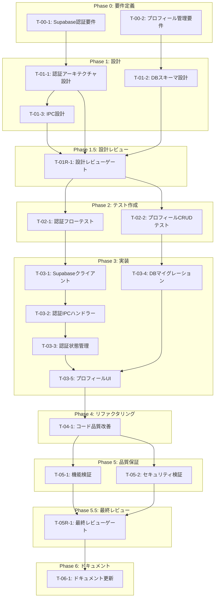

# ユーザー認証・プロフィール管理 - タスク実行仕様書

## ユーザーからの元の指示

```
ユーザーを管理するようなものを作りたいです。ユーザーアカウントを管理するための機能を実装したいです。
バックエンドも含めて実装してほしいです。追加、更新、保存、変更、削除なども含めて全て管理できるようにしたいです。
ということは、管理者も必要です。そしてDiscordのアカウントも紐付けるようにしたいです。
そしてこれらを管理できるようなライブラリを使って実装を進めたいです。外部のサービスを使ってもOKです。

ヒアリング結果:
- 認証サービス: Supabase（Electron対応ガイドあり、Discord OAuth対応、DB統合）
- Discord Bot連携: 後で検討（現フェーズでは除外）
- 管理者機能: 不要（ユーザー自身によるプロフィール管理のみ）
- データ永続化: ハイブリッド（ローカルキャッシュ + Supabase同期）
```

---

## タスク概要

### 目的

Supabaseを活用したユーザー認証・プロフィール管理機能をElectronデスクトップアプリに実装する。
Google/GitHub/Discord OAuthによるソーシャルログインと、ユーザープロフィールの編集・永続化機能を提供する。

### 背景

現在のアプリにはユーザー認証機能がなく、設定は全てローカルに保存されている。
クラウド同期やマルチデバイス対応、将来的なチーム機能拡張のため、認証基盤の構築が必要。
SupabaseはElectronとの統合ガイドがあり、PostgreSQL + 認証 + ストレージを統合的に提供する。

### 最終ゴール

- Supabase認証によるGoogle/GitHub/Discord OAuthログイン
- ユーザープロフィール（表示名、メール、アバター）の管理
- **Supabase（認証）+ Turso（ビジネスデータ）のハイブリッド構成**
- セキュアなトークン管理（Electron SafeStorage）
- Turso Embedded Replicasによるオフライン対応

### データベース構成

```
┌─────────────────────────────────────────────────────────────────────┐
│                    Supabase + Turso ハイブリッド構成                 │
├─────────────────────────────────────────────────────────────────────┤
│                                                                      │
│  【Supabase】認証・プロフィールのみ（無料枠: 50K MAU, 500MB）       │
│  ┌─────────────────────────────────────────────────────────────┐    │
│  │ auth.users         - OAuth認証 (Google/GitHub/Discord)      │    │
│  │ user_profiles      - 表示名, アバター, plan                 │    │
│  └─────────────────────────────────────────────────────────────┘    │
│                                                                      │
│  【Turso】ビジネスデータ（無料枠: 9GB, 1B rows read/month）         │
│  ┌─────────────────────────────────────────────────────────────┐    │
│  │ workflows          - ワークフロー定義                        │    │
│  │ executions         - 実行履歴                                │    │
│  │ logs               - 実行ログ（大量データ）                  │    │
│  │ chat_messages      - チャット履歴（大量データ）              │    │
│  │ dashboard_data     - ダッシュボード情報                      │    │
│  │ rag_documents      - RAG用ドキュメント・ベクトル             │    │
│  │ user_settings      - ユーザー別設定                          │    │
│  │ ※ 全テーブルにuser_id（Supabase発行）を持つ                 │    │
│  └─────────────────────────────────────────────────────────────┘    │
│                                                                      │
│  【ローカルSQLite】Turso Embedded Replicas                          │
│  ┌─────────────────────────────────────────────────────────────┐    │
│  │ Tursoテーブルのローカルレプリカ（自動同期）                  │    │
│  │ → オフライン時も完全動作                                     │    │
│  └─────────────────────────────────────────────────────────────┘    │
│                                                                      │
│  【safeStorage】機密情報（デバイスごと・同期なし）                  │
│  ┌─────────────────────────────────────────────────────────────┐    │
│  │ OpenAI API Key, Anthropic API Key                           │    │
│  │ Supabase Session Token, Turso Auth Token                    │    │
│  └─────────────────────────────────────────────────────────────┘    │
│                                                                      │
└─────────────────────────────────────────────────────────────────────┘
```

**設計判断の理由:**

- **Supabase**: 認証機能が充実（OAuth、RLS）、無料枠でMAU管理に最適
- **Turso**: 大量データ（ログ、チャット、RAG）を低コストで保存、SQLite互換でオフライン対応
- **APIキー**: セキュリティ上、クラウドには保存せずローカルのみ

### 成果物一覧

| 種別         | 成果物                      | 配置先                                                |
| ------------ | --------------------------- | ----------------------------------------------------- |
| 設計         | 認証アーキテクチャ設計書    | `docs/30-workflows/user-auth/architecture.md`         |
| 機能         | Supabaseクライアント設定    | `packages/shared/infrastructure/auth/`                |
| 機能         | 認証IPCハンドラー           | `apps/desktop/src/main/ipc/authHandlers.ts`           |
| 機能         | 認証状態管理                | `apps/desktop/src/renderer/store/slices/authSlice.ts` |
| 機能         | ユーザープロフィールUI      | `apps/desktop/src/renderer/components/`               |
| 機能         | DBスキーマ（user_profiles） | `packages/shared/infrastructure/database/schema/`     |
| テスト       | 認証フローテスト            | `apps/desktop/src/__tests__/auth/`                    |
| ドキュメント | セットアップガイド          | `docs/30-workflows/user-auth/setup-guide.md`          |

---

## 参照ファイル

本仕様書のコマンド・エージェント・スキル選定は以下を参照：

- `docs/00-requirements/master_system_design.md` - システム要件
- `.claude/commands/ai/command_list.md` - /ai:コマンド定義
- `.claude/agents/agent_list.md` - エージェント定義
- `.claude/skills/skill_list.md` - スキル定義

---

## タスク分解サマリー

| ID      | フェーズ  | サブタスク名               | 責務                                 | 依存       |
| ------- | --------- | -------------------------- | ------------------------------------ | ---------- |
| T-00-1  | Phase 0   | Supabase認証要件定義       | 認証フロー・OAuth設定要件の明確化    | -          |
| T-00-2  | Phase 0   | プロフィール管理要件定義   | ユーザーデータ構造・操作要件の明確化 | -          |
| T-01-1  | Phase 1   | 認証アーキテクチャ設計     | Electron + Supabase統合設計          | T-00-1     |
| T-01-2  | Phase 1   | DBスキーマ設計             | user_profiles テーブル設計           | T-00-2     |
| T-01-3  | Phase 1   | IPC設計                    | 認証関連IPCチャネル設計              | T-01-1     |
| T-01R-1 | Phase 1.5 | 設計レビュー               | 要件・設計の妥当性検証               | T-01-1,2,3 |
| T-02-1  | Phase 2   | 認証フローテスト作成       | OAuth認証のテストケース              | T-01R-1    |
| T-02-2  | Phase 2   | プロフィールCRUDテスト作成 | プロフィール操作のテストケース       | T-01R-1    |
| T-03-1  | Phase 3   | Supabaseクライアント実装   | Supabase SDK統合                     | T-02-1     |
| T-03-2  | Phase 3   | 認証IPCハンドラー実装      | Main Processの認証処理               | T-03-1     |
| T-03-3  | Phase 3   | 認証状態管理実装           | Zustand authSlice                    | T-03-2     |
| T-03-4  | Phase 3   | DBマイグレーション実装     | user_profiles テーブル作成           | T-01-2     |
| T-03-5  | Phase 3   | プロフィールUI実装         | 設定画面のアカウントセクション       | T-03-3     |
| T-04-1  | Phase 4   | コード品質改善             | リファクタリング・コード整理         | T-03-5     |
| T-05-1  | Phase 5   | 機能検証                   | テスト実行・カバレッジ確認           | T-04-1     |
| T-05-2  | Phase 5   | セキュリティ検証           | 脆弱性スキャン・トークン管理確認     | T-04-1     |
| T-05R-1 | Phase 5.5 | 最終レビュー               | 品質・整合性の多角的検証             | T-05-1,2   |
| T-06-1  | Phase 6   | ドキュメント更新           | システム要件ドキュメント反映         | T-05R-1    |

**総サブタスク数**: 18個

---

## 実行フロー図



---

## Phase 0: 要件定義

### T-00-1: Supabase認証要件定義

#### 目的

Supabaseを使用したOAuth認証フロー、対応プロバイダー、セッション管理方式の要件を明確化する。

#### 背景

Electronアプリでの認証は、セキュリティとUXの両立が重要。
Supabaseはカスタムプロトコルによるdeep link認証をサポートしており、Electronとの統合が可能。

#### 責務（単一責務）

認証システムの要件定義のみ（プロフィール管理は別サブタスク）

#### 実行コマンド

```bash
/ai:gather-requirements user-auth
```

#### 使用エージェント

- **エージェント**: `@req-analyst`
- **選定理由**: 要求工学の権威カール・ウィーガーズをモデルとした要件分析の専門家
- **参照**: `.claude/agents/agent_list.md`

#### 活用スキル

| スキル名             | 活用方法                          |
| -------------------- | --------------------------------- |
| oauth2-flows         | OAuth 2.0フロー（PKCE）の要件整理 |
| interview-techniques | 要件ヒアリングの構造化            |

#### 成果物

| 成果物         | パス                                               | 内容                                            |
| -------------- | -------------------------------------------------- | ----------------------------------------------- |
| 認証要件定義書 | `docs/30-workflows/user-auth/requirements-auth.md` | OAuth設定、セッション管理、トークン永続化の要件 |

#### 完了条件

- [ ] 対応OAuthプロバイダー（Google, GitHub, Discord）の要件定義
- [ ] 認証フロー（カスタムプロトコル）の要件定義
- [ ] セッション管理方式の要件定義
- [ ] トークン永続化（SafeStorage）の要件定義
- [ ] オフライン対応の要件定義

#### 依存関係

- **前提**: なし
- **後続**: T-01-1（認証アーキテクチャ設計）

---

### T-00-2: プロフィール管理要件定義

#### 目的

ユーザープロフィールのデータ構造、CRUD操作、同期方式の要件を明確化する。

#### 背景

ユーザーが自身のプロフィール（表示名、メール、アバター）を管理できる機能が必要。
ローカルキャッシュとSupabaseの同期により、オフライン時も動作可能にする。

#### 責務（単一責務）

プロフィール管理の要件定義のみ（認証は別サブタスク）

#### 実行コマンド

```bash
/ai:create-user-stories user-profile-management
```

#### 使用エージェント

- **エージェント**: `@req-analyst`
- **選定理由**: ユーザーストーリーとアクセプタンスクライテリアの作成に長けている
- **参照**: `.claude/agents/agent_list.md`

#### 活用スキル

| スキル名                    | 活用方法             |
| --------------------------- | -------------------- |
| acceptance-criteria-writing | 受け入れ基準の明確化 |
| use-case-modeling           | ユースケースの整理   |

#### 成果物

| 成果物                 | パス                                                  | 内容                                 |
| ---------------------- | ----------------------------------------------------- | ------------------------------------ |
| プロフィール要件定義書 | `docs/30-workflows/user-auth/requirements-profile.md` | データ構造、CRUD操作、同期方式の要件 |

#### 完了条件

- [ ] UserProfileデータ構造の要件定義
- [ ] プロフィールCRUD操作の要件定義
- [ ] アバター管理の要件定義
- [ ] ローカル/クラウド同期の要件定義
- [ ] プライバシー設定の要件定義

#### 依存関係

- **前提**: なし
- **後続**: T-01-2（DBスキーマ設計）

---

## Phase 1: 設計

### T-01-1: 認証アーキテクチャ設計

#### 目的

Electron + Supabase認証の統合アーキテクチャを設計する。

#### 背景

Electronでの認証は、Main Process/Renderer Process/Preloadの責務分離が重要。
Supabaseのdeep link認証をカスタムプロトコルで実装する必要がある。

#### 責務（単一責務）

認証アーキテクチャの設計のみ

#### 実行コマンド

```bash
/ai:design-architecture electron-supabase-auth
```

#### 使用エージェント

- **エージェント**: `@electron-architect`
- **選定理由**: Electronアプリケーションのセキュアなアーキテクチャ設計の専門家
- **参照**: `.claude/agents/agent_list.md`

#### 活用スキル

| スキル名                      | 活用方法                     |
| ----------------------------- | ---------------------------- |
| electron-security-hardening   | セキュアなプロセス間通信設計 |
| oauth2-flows                  | PKCE認証フローの設計         |
| clean-architecture-principles | レイヤー分離の設計           |

#### 成果物

| 成果物                   | パス                                          | 内容                                    |
| ------------------------ | --------------------------------------------- | --------------------------------------- |
| 認証アーキテクチャ設計書 | `docs/30-workflows/user-auth/architecture.md` | プロセスモデル、IPC設計、トークンフロー |

#### 完了条件

- [ ] Main/Renderer/Preload責務分離の設計
- [ ] カスタムプロトコル（deep link）フローの設計
- [ ] トークン管理フローの設計
- [ ] セッション復元フローの設計
- [ ] エラーハンドリング設計

#### 依存関係

- **前提**: T-00-1（Supabase認証要件定義）
- **後続**: T-01-3（IPC設計）, T-01R-1（設計レビュー）

---

### T-01-2: DBスキーマ設計

#### 目的

ユーザープロフィールを保存するDBスキーマを設計する。

#### 背景

Supabaseのuser_metadata + カスタムプロフィールテーブルの組み合わせで、
柔軟なプロフィール管理を実現する。

#### 責務（単一責務）

DBスキーマの設計のみ

#### 実行コマンド

```bash
/ai:design-database user_profiles
```

#### 使用エージェント

- **エージェント**: `@db-architect`
- **選定理由**: Drizzle ORM + SQLiteのスキーマ設計の専門家
- **参照**: `.claude/agents/agent_list.md`

#### 活用スキル

| スキル名                | 活用方法         |
| ----------------------- | ---------------- |
| database-normalization  | 正規化設計       |
| indexing-strategies     | インデックス設計 |
| foreign-key-constraints | 外部キー設計     |

#### 成果物

| 成果物           | パス                                       | 内容                                    |
| ---------------- | ------------------------------------------ | --------------------------------------- |
| DBスキーマ設計書 | `docs/30-workflows/user-auth/db-schema.md` | user_profilesテーブル定義、インデックス |

#### 完了条件

- [ ] user_profilesテーブルのカラム定義
- [ ] インデックス設計
- [ ] Supabase RLS（Row Level Security）ポリシー設計
- [ ] ローカルSQLiteスキーマの設計
- [ ] マイグレーション戦略の設計

#### 依存関係

- **前提**: T-00-2（プロフィール管理要件定義）
- **後続**: T-01R-1（設計レビュー）, T-03-4（DBマイグレーション実装）

---

### T-01-3: IPC設計

#### 目的

認証関連のIPCチャネルとAPIを設計する。

#### 背景

Electronでは、Main ProcessとRenderer Process間の通信はIPCで行う。
認証関連の操作（ログイン、ログアウト、トークン取得等）のIPCを設計する。

#### 責務（単一責務）

IPCチャネル設計のみ

#### 実行コマンド

```bash
/ai:design-api auth-ipc
```

#### 使用エージェント

- **エージェント**: `@electron-architect`
- **選定理由**: ElectronのIPC設計パターンに精通
- **参照**: `.claude/agents/agent_list.md`

#### 活用スキル

| スキル名              | 活用方法             |
| --------------------- | -------------------- |
| type-safety-patterns  | 型安全なIPC設計      |
| interface-segregation | インターフェース分離 |

#### 成果物

| 成果物    | パス                                        | 内容                             |
| --------- | ------------------------------------------- | -------------------------------- |
| IPC設計書 | `docs/30-workflows/user-auth/ipc-design.md` | チャネル定義、Request/Response型 |

#### 完了条件

- [ ] 認証IPCチャネル定義（auth:login, auth:logout等）
- [ ] プロフィールIPCチャネル定義（profile:get, profile:update等）
- [ ] Request/Response型定義
- [ ] エラーレスポンス形式定義
- [ ] イベントチャネル定義（auth:state-changed等）

#### 依存関係

- **前提**: T-01-1（認証アーキテクチャ設計）
- **後続**: T-01R-1（設計レビュー）

---

## Phase 1.5: 設計レビューゲート

### T-01R-1: 設計レビュー

#### 目的

実装開始前に要件・設計の妥当性を複数エージェントで検証する。

#### 背景

設計ミスが実装後に発見されると修正コストが大幅に増加する。
「Shift Left」原則に基づき、問題を早期に検出する。

#### レビュー参加エージェント

| エージェント         | レビュー観点         | 選定理由                                   |
| -------------------- | -------------------- | ------------------------------------------ |
| `@req-analyst`       | 要件充足性           | 要件定義との整合性確認                     |
| `@arch-police`       | アーキテクチャ整合性 | Clean Architecture違反検出                 |
| `@electron-security` | セキュリティ設計     | Electronセキュリティベストプラクティス確認 |
| `@domain-modeler`    | ドメインモデル妥当性 | ユビキタス言語・エンティティ境界確認       |

#### レビューチェックリスト

**要件充足性** (`@req-analyst`)

- [ ] 要件が明確かつ検証可能か
- [ ] スコープが適切に定義されているか
- [ ] 受け入れ基準が具体的か

**アーキテクチャ整合性** (`@arch-police`)

- [ ] クリーンアーキテクチャのレイヤー違反がないか
- [ ] 依存関係逆転の原則(DIP)が守られているか
- [ ] 既存設計との整合性があるか

**セキュリティ設計** (`@electron-security`)

- [ ] contextIsolation, nodeIntegrationの設定
- [ ] IPCチャネルのホワイトリスト設計
- [ ] トークン管理のセキュリティ（SafeStorage）

**ドメインモデル妥当性** (`@domain-modeler`)

- [ ] ユビキタス言語が適切に使用されているか
- [ ] エンティティ・値オブジェクトの境界が適切か

#### レビュー結果

- **判定**: PASS / MINOR / MAJOR
- **指摘事項**: （レビュー時に記載）
- **対応方針**: （レビュー時に記載）

#### 戻り先決定（MAJORの場合）

| 問題の種類 | 戻り先              |
| ---------- | ------------------- |
| 要件の問題 | Phase 0（要件定義） |
| 設計の問題 | Phase 1（設計）     |
| 両方の問題 | Phase 0（要件定義） |

#### 完了条件

- [ ] 全レビュー観点でチェック完了
- [ ] 指摘事項の対応方針決定
- [ ] レビュー結果がPASSまたはMINOR

#### 依存関係

- **前提**: T-01-1, T-01-2, T-01-3
- **後続**: T-02-1, T-02-2

---

## Phase 2: テスト作成 (TDD: Red)

### T-02-1: 認証フローテスト作成

#### 目的

OAuth認証フローのテストケースを実装より先に作成する。

#### 背景

TDDに基づき、期待される動作を検証するテストを先に作成する。

#### 責務（単一責務）

認証フローのテストケース作成のみ

#### 実行コマンド

```bash
/ai:generate-unit-tests apps/desktop/src/main/ipc/authHandlers.ts
```

#### 使用エージェント

- **エージェント**: `@unit-tester`
- **選定理由**: TDD再発見者ケント・ベックをモデルとしたテスト専門家
- **参照**: `.claude/agents/agent_list.md`

#### 活用スキル

| スキル名                | 活用方法                   |
| ----------------------- | -------------------------- |
| tdd-principles          | Red-Green-Refactorサイクル |
| test-doubles            | モック・スタブの活用       |
| boundary-value-analysis | 境界値テスト               |

#### 成果物

| 成果物             | パス                                                    | 内容                       |
| ------------------ | ------------------------------------------------------- | -------------------------- |
| 認証テストファイル | `apps/desktop/src/__tests__/auth/authHandlers.test.ts`  | 認証IPCハンドラーのテスト  |
| 認証モック         | `apps/desktop/src/__tests__/auth/__mocks__/supabase.ts` | Supabaseクライアントモック |

#### TDD検証: Red状態確認

```bash
pnpm --filter @repo/desktop test:run -- authHandlers.test.ts
```

- [ ] テストが失敗することを確認（Red状態）

#### 完了条件

- [ ] ログインフローのテストケース作成
- [ ] ログアウトフローのテストケース作成
- [ ] セッション復元のテストケース作成
- [ ] エラーハンドリングのテストケース作成
- [ ] テストが失敗状態（Red）であることを確認

#### 依存関係

- **前提**: T-01R-1（設計レビュー）
- **後続**: T-03-1（Supabaseクライアント実装）

---

### T-02-2: プロフィールCRUDテスト作成

#### 目的

プロフィールCRUD操作のテストケースを作成する。

#### 背景

プロフィールの取得・更新・削除操作のテストを先に作成する。

#### 責務（単一責務）

プロフィールCRUDのテストケース作成のみ

#### 実行コマンド

```bash
/ai:generate-unit-tests apps/desktop/src/renderer/store/slices/authSlice.ts
```

#### 使用エージェント

- **エージェント**: `@unit-tester`
- **選定理由**: Zustand状態管理のテストパターンに精通
- **参照**: `.claude/agents/agent_list.md`

#### 活用スキル

| スキル名             | 活用方法             |
| -------------------- | -------------------- |
| test-doubles         | Supabaseモックの活用 |
| test-data-management | テストデータの管理   |

#### 成果物

| 成果物                     | パス                                                | 内容              |
| -------------------------- | --------------------------------------------------- | ----------------- |
| プロフィールテストファイル | `apps/desktop/src/__tests__/auth/authSlice.test.ts` | authSliceのテスト |

#### TDD検証: Red状態確認

```bash
pnpm --filter @repo/desktop test:run -- authSlice.test.ts
```

- [ ] テストが失敗することを確認（Red状態）

#### 完了条件

- [ ] プロフィール取得のテストケース作成
- [ ] プロフィール更新のテストケース作成
- [ ] アバター更新のテストケース作成
- [ ] オフライン時のフォールバックテスト作成
- [ ] テストが失敗状態（Red）であることを確認

#### 依存関係

- **前提**: T-01R-1（設計レビュー）
- **後続**: T-03-4（DBマイグレーション実装）

---

## Phase 3: 実装 (TDD: Green)

### T-03-1: Supabaseクライアント実装

#### 目的

Supabase SDK統合とクライアント設定を実装する。

#### 背景

Supabase JavaScript SDKをElectronに統合し、認証・DB操作の基盤を構築する。

#### 責務（単一責務）

Supabaseクライアントの初期化と設定のみ

#### 実行コマンド

```bash
/ai:create-api-gateway supabase
```

#### 使用エージェント

- **エージェント**: `@gateway-dev`
- **選定理由**: 外部APIとの境界管理の専門家
- **参照**: `.claude/agents/agent_list.md`

#### 活用スキル

| スキル名            | 活用方法                     |
| ------------------- | ---------------------------- |
| api-client-patterns | Supabaseクライアント設計     |
| network-resilience  | リトライ・エラーハンドリング |

#### 成果物

| 成果物               | パス                                                     | 内容           |
| -------------------- | -------------------------------------------------------- | -------------- |
| Supabaseクライアント | `packages/shared/infrastructure/auth/supabase-client.ts` | Supabase初期化 |
| 型定義               | `packages/shared/types/auth.ts`                          | 認証関連型定義 |

#### TDD検証: Green状態確認

```bash
pnpm --filter @repo/desktop test:run -- authHandlers.test.ts
```

- [ ] 関連テストが成功することを確認（Green状態）

#### 完了条件

- [ ] Supabaseクライアント初期化
- [ ] 環境変数からの設定読み込み
- [ ] 型定義の作成
- [ ] エラーハンドリングの実装
- [ ] 関連テストがGreen状態

#### 依存関係

- **前提**: T-02-1（認証フローテスト作成）
- **後続**: T-03-2（認証IPCハンドラー実装）

---

### T-03-2: 認証IPCハンドラー実装

#### 目的

Main Processの認証IPCハンドラーを実装する。

#### 背景

Renderer Processからの認証リクエストを処理し、Supabaseと連携する。

#### 責務（単一責務）

認証IPCハンドラーの実装のみ

#### 実行コマンド

```bash
/ai:implement-business-logic auth-ipc-handlers
```

#### 使用エージェント

- **エージェント**: `@electron-architect`
- **選定理由**: ElectronのIPC実装パターンに精通
- **参照**: `.claude/agents/agent_list.md`

#### 活用スキル

| スキル名                    | 活用方法            |
| --------------------------- | ------------------- |
| electron-security-hardening | セキュアなIPC実装   |
| oauth2-flows                | OAuth認証フロー実装 |

#### 成果物

| 成果物            | パス                                           | 内容                               |
| ----------------- | ---------------------------------------------- | ---------------------------------- |
| 認証IPCハンドラー | `apps/desktop/src/main/ipc/authHandlers.ts`    | ログイン/ログアウト/セッション管理 |
| IPCチャネル定義   | `apps/desktop/src/preload/channels.ts`（更新） | AUTH\_\*チャネル追加               |
| IPC型定義         | `apps/desktop/src/preload/types.ts`（更新）    | AuthRequest/Response型追加         |

#### TDD検証: Green状態確認

```bash
pnpm --filter @repo/desktop test:run -- authHandlers.test.ts
```

- [ ] テストが成功することを確認（Green状態）

#### 完了条件

- [ ] auth:loginハンドラー実装
- [ ] auth:logoutハンドラー実装
- [ ] auth:get-sessionハンドラー実装
- [ ] auth:refresh-tokenハンドラー実装
- [ ] SafeStorageによるトークン永続化
- [ ] テストがGreen状態

#### 依存関係

- **前提**: T-03-1（Supabaseクライアント実装）
- **後続**: T-03-3（認証状態管理実装）

---

### T-03-3: 認証状態管理実装

#### 目的

Renderer ProcessのZustand authSliceを実装する。

#### 背景

認証状態（ログイン状態、ユーザー情報、プロフィール）をZustandで管理する。

#### 責務（単一責務）

認証状態管理の実装のみ

#### 実行コマンド

```bash
/ai:setup-state-management auth
```

#### 使用エージェント

- **エージェント**: `@state-manager`
- **選定理由**: Redux開発者ダン・アブラモフをモデルとした状態管理の専門家
- **参照**: `.claude/agents/agent_list.md`

#### 活用スキル

| スキル名              | 活用方法         |
| --------------------- | ---------------- |
| state-lifting         | 状態の適切な配置 |
| custom-hooks-patterns | 認証フックの設計 |

#### 成果物

| 成果物       | パス                                                  | 内容            |
| ------------ | ----------------------------------------------------- | --------------- |
| authSlice    | `apps/desktop/src/renderer/store/slices/authSlice.ts` | 認証状態管理    |
| useAuth hook | `apps/desktop/src/renderer/hooks/useAuth.ts`          | 認証フック      |
| 型定義更新   | `apps/desktop/src/renderer/store/types.ts`（更新）    | AuthState型追加 |

#### TDD検証: Green状態確認

```bash
pnpm --filter @repo/desktop test:run -- authSlice.test.ts
```

- [ ] テストが成功することを確認（Green状態）

#### 完了条件

- [ ] AuthState型定義
- [ ] authSlice実装（login, logout, updateProfile）
- [ ] IPC通信との連携
- [ ] useAuthフック実装
- [ ] テストがGreen状態

#### 依存関係

- **前提**: T-03-2（認証IPCハンドラー実装）
- **後続**: T-03-5（プロフィールUI実装）

---

### T-03-4: DBマイグレーション実装

#### 目的

user_profilesテーブルのDBマイグレーションを実装する。

#### 背景

ローカルSQLiteにユーザープロフィールをキャッシュするためのテーブルを作成する。

#### 責務（単一責務）

DBマイグレーションの実装のみ

#### 実行コマンド

```bash
/ai:create-migration add-user-profiles
```

#### 使用エージェント

- **エージェント**: `@dba-mgr`
- **選定理由**: マイグレーション管理の専門家
- **参照**: `.claude/agents/agent_list.md`

#### 活用スキル

| スキル名               | 活用方法                           |
| ---------------------- | ---------------------------------- |
| transaction-management | マイグレーションのトランザクション |
| backup-recovery        | ロールバック設計                   |

#### 成果物

| 成果物           | パス                                                              | 内容                     |
| ---------------- | ----------------------------------------------------------------- | ------------------------ |
| スキーマ定義     | `packages/shared/infrastructure/database/schema/user-profiles.ts` | user_profilesテーブル    |
| マイグレーション | `packages/shared/infrastructure/database/migrations/`             | マイグレーションファイル |

#### TDD検証: Green状態確認

```bash
pnpm --filter @repo/shared test:run -- user-profiles
```

- [ ] テストが成功することを確認（Green状態）

#### 完了条件

- [ ] user_profilesテーブルスキーマ定義
- [ ] マイグレーションファイル作成
- [ ] ロールバックスクリプト作成
- [ ] テストがGreen状態

#### 依存関係

- **前提**: T-02-2（プロフィールCRUDテスト作成）
- **後続**: T-03-5（プロフィールUI実装）

---

### T-03-5: プロフィールUI実装

#### 目的

設定画面のアカウントセクションUIを実装する。

#### 背景

ユーザーがプロフィール（表示名、メール、アバター）を編集できるUIを提供する。

#### 責務（単一責務）

プロフィール編集UIの実装のみ

#### 実行コマンド

```bash
/ai:create-component UserProfileEditor molecule
```

#### 使用エージェント

- **エージェント**: `@ui-designer`
- **選定理由**: アクセシビリティ・デザインシステムの専門家
- **参照**: `.claude/agents/agent_list.md`

#### 活用スキル

| スキル名           | 活用方法               |
| ------------------ | ---------------------- |
| accessibility-wcag | WCAG準拠のフォーム設計 |
| error-boundary     | エラー状態の表示       |

#### 成果物

| 成果物            | パス                                                                   | 内容                           |
| ----------------- | ---------------------------------------------------------------------- | ------------------------------ |
| UserProfileEditor | `apps/desktop/src/renderer/components/molecules/UserProfileEditor.tsx` | プロフィール編集コンポーネント |
| OAuthButtons      | `apps/desktop/src/renderer/components/molecules/OAuthButtons.tsx`      | OAuth連携ボタン                |
| AvatarUploader    | `apps/desktop/src/renderer/components/molecules/AvatarUploader.tsx`    | アバターアップロード           |
| AccountSettings   | `apps/desktop/src/renderer/views/Settings/AccountSettings.tsx`         | アカウント設定ページ           |

#### TDD検証: Green状態確認

```bash
pnpm --filter @repo/desktop test:run -- UserProfileEditor
```

- [ ] テストが成功することを確認（Green状態）

#### 完了条件

- [ ] プロフィール表示・編集UI
- [ ] OAuthログイン/ログアウトボタン
- [ ] アバターアップロード機能
- [ ] エラー・ローディング状態の表示
- [ ] アクセシビリティ対応
- [ ] テストがGreen状態

#### 依存関係

- **前提**: T-03-3（認証状態管理実装）, T-03-4（DBマイグレーション実装）
- **後続**: T-04-1（コード品質改善）

---

## Phase 4: リファクタリング (TDD: Refactor)

### T-04-1: コード品質改善

#### 目的

動作を変えずにコード品質を改善する。

#### 背景

TDDのRefactorフェーズとして、コードの可読性・保守性を向上させる。

#### 責務（単一責務）

コードリファクタリングのみ

#### 実行コマンド

```bash
/ai:refactor apps/desktop/src/main/ipc/authHandlers.ts
/ai:refactor apps/desktop/src/renderer/store/slices/authSlice.ts
```

#### 使用エージェント

- **エージェント**: `@code-quality`
- **選定理由**: ESLint作者をモデルとしたコード品質の専門家
- **参照**: `.claude/agents/agent_list.md`

#### 活用スキル

| スキル名               | 活用方法                 |
| ---------------------- | ------------------------ |
| refactoring-techniques | リファクタリングパターン |
| clean-code-practices   | クリーンコード原則       |
| code-smell-detection   | コードスメル検出         |

#### 成果物

| 成果物                     | パス         | 内容                 |
| -------------------------- | ------------ | -------------------- |
| リファクタリング済みコード | 既存ファイル | 品質改善されたコード |

#### TDD検証: 継続Green確認

```bash
pnpm --filter @repo/desktop test:run
```

- [ ] リファクタリング後もテストが成功することを確認

#### 完了条件

- [ ] 重複コードの排除
- [ ] 命名の改善
- [ ] 関数の適切な分割
- [ ] コメント・ドキュメント追加
- [ ] テストが継続してGreen状態

#### 依存関係

- **前提**: T-03-5（プロフィールUI実装）
- **後続**: T-05-1（機能検証）, T-05-2（セキュリティ検証）

---

## Phase 5: 品質保証

### T-05-1: 機能検証

#### 目的

全テストスイートを実行し、機能の正常動作を確認する。

#### 背景

Phase 3, 4で実装したコードが要件を満たしていることを検証する。

#### 責務（単一責務）

機能テストの実行と検証のみ

#### 実行コマンド

```bash
/ai:run-all-tests --coverage
```

#### 使用エージェント

- **エージェント**: `@unit-tester`
- **選定理由**: テスト実行と品質評価の専門家
- **参照**: `.claude/agents/agent_list.md`

#### 活用スキル

| スキル名             | 活用方法           |
| -------------------- | ------------------ |
| tdd-principles       | テスト網羅性の確認 |
| test-data-management | テストデータの検証 |

#### 成果物

| 成果物         | パス        | 内容               |
| -------------- | ----------- | ------------------ |
| テストレポート | `coverage/` | カバレッジレポート |

#### 完了条件

- [ ] 全ユニットテスト成功
- [ ] カバレッジ80%以上達成
- [ ] Lintエラーなし
- [ ] 型エラーなし

#### 依存関係

- **前提**: T-04-1（コード品質改善）
- **後続**: T-05R-1（最終レビュー）

---

### T-05-2: セキュリティ検証

#### 目的

認証機能のセキュリティを検証する。

#### 背景

認証は最もセキュリティリスクの高い機能。脆弱性がないことを確認する。

#### 責務（単一責務）

セキュリティ検証のみ

#### 実行コマンド

```bash
/ai:security-audit auth
```

#### 使用エージェント

- **エージェント**: `@sec-auditor`
- **選定理由**: セキュリティの巨人ブルース・シュナイアーをモデルとした専門家
- **参照**: `.claude/agents/agent_list.md`

#### 活用スキル

| スキル名                              | 活用方法         |
| ------------------------------------- | ---------------- |
| authentication-authorization-security | 認証・認可の検証 |
| cryptographic-practices               | 暗号化の検証     |

#### 成果物

| 成果物               | パス                                             | 内容           |
| -------------------- | ------------------------------------------------ | -------------- |
| セキュリティレポート | `docs/30-workflows/user-auth/security-report.md` | 脆弱性検査結果 |

#### 完了条件

- [ ] トークン管理のセキュリティ確認
- [ ] IPC通信のセキュリティ確認
- [ ] 入力バリデーションの確認
- [ ] 脆弱性スキャン完了
- [ ] 重大な脆弱性なし

#### 依存関係

- **前提**: T-04-1（コード品質改善）
- **後続**: T-05R-1（最終レビュー）

---

## 品質ゲートチェックリスト

### 機能検証

- [ ] 全ユニットテスト成功
- [ ] 全統合テスト成功
- [ ] 認証フローのE2Eテスト成功

### コード品質

- [ ] Lintエラーなし
- [ ] 型エラーなし
- [ ] コードフォーマット適用済み

### テスト網羅性

- [ ] カバレッジ80%以上達成

### セキュリティ

- [ ] 脆弱性スキャン完了
- [ ] 重大な脆弱性なし
- [ ] トークン管理がセキュア

---

## Phase 5.5: 最終レビューゲート

### T-05R-1: 最終レビュー

#### 目的

実装完了後、ドキュメント更新前に全体的な品質・整合性を検証する。

#### 背景

Phase 5の自動検証だけでは検出できない設計判断やベストプラクティス違反を確認する。

#### レビュー参加エージェント

| エージェント         | レビュー観点         | 選定理由                 |
| -------------------- | -------------------- | ------------------------ |
| `@code-quality`      | コード品質           | コーディング規約・可読性 |
| `@arch-police`       | アーキテクチャ遵守   | レイヤー依存関係         |
| `@unit-tester`       | テスト品質           | テストカバレッジ・設計   |
| `@sec-auditor`       | セキュリティ         | OWASP対応・認証実装      |
| `@electron-security` | Electronセキュリティ | IPC安全性・CSP           |

#### 対象領域別追加レビュー

| 対象領域       | エージェント                       | レビュー観点                   |
| -------------- | ---------------------------------- | ------------------------------ |
| フロントエンド | `@ui-designer`, `@frontend-tester` | アクセシビリティ・UX           |
| バックエンド   | `@gateway-dev`                     | API設計・エラーハンドリング    |
| データベース   | `@db-architect`, `@dba-mgr`        | スキーマ設計・マイグレーション |

#### レビューチェックリスト

**コード品質** (`@code-quality`)

- [ ] コーディング規約への準拠
- [ ] 可読性・保守性の確保
- [ ] 適切なエラーハンドリング
- [ ] 過度な複雑性の有無

**アーキテクチャ遵守** (`@arch-police`)

- [ ] 実装がアーキテクチャ設計に従っているか
- [ ] レイヤー間の依存関係が適切か
- [ ] SOLID原則への準拠

**テスト品質** (`@unit-tester`)

- [ ] テストカバレッジが十分か
- [ ] テストケースが適切に設計されているか
- [ ] 境界値・異常系のテストがあるか

**セキュリティ** (`@sec-auditor`, `@electron-security`)

- [ ] OWASP Top 10への対応
- [ ] 入力検証・サニタイズの実装
- [ ] 認証・認可の適切な実装
- [ ] IPC通信のセキュリティ

#### レビュー結果

- **判定**: PASS / MINOR / MAJOR / CRITICAL
- **指摘事項**: （レビュー時に記載）
- **対応方針**: （レビュー時に記載）

#### 戻り先決定（MAJOR/CRITICALの場合）

| 問題の種類       | 戻り先                      |
| ---------------- | --------------------------- |
| 要件の問題       | Phase 0（要件定義）         |
| 設計の問題       | Phase 1（設計）             |
| テスト設計の問題 | Phase 2（テスト作成）       |
| 実装の問題       | Phase 3（実装）             |
| コード品質の問題 | Phase 4（リファクタリング） |

#### 完了条件

- [ ] 全レビュー観点でチェック完了
- [ ] 指摘事項の対応完了
- [ ] レビュー結果がPASSまたはMINOR

#### 依存関係

- **前提**: T-05-1（機能検証）, T-05-2（セキュリティ検証）
- **後続**: T-06-1（ドキュメント更新）

---

## Phase 6: ドキュメント更新

### T-06-1: ドキュメント更新

#### 目的

タスク完了後、実装した内容をシステム要件ドキュメントに反映する。

#### 前提条件

- [ ] Phase 5の品質ゲートをすべて通過
- [ ] Phase 5.5の最終レビューゲートを通過
- [ ] すべてのテストが成功

#### 更新対象ドキュメント

| ドキュメント                                     | 更新内容（概要のみ）               |
| ------------------------------------------------ | ---------------------------------- |
| `docs/00-requirements/05-architecture.md`        | 認証アーキテクチャの追加           |
| `docs/00-requirements/08-api-design.md`          | 認証IPCチャネルの追加              |
| `docs/00-requirements/15-database-design.md`     | user_profilesテーブルの追加        |
| `docs/00-requirements/17-security-guidelines.md` | 認証セキュリティガイドラインの追加 |

#### 実行コマンド

```bash
/ai:update-all-docs
```

#### 使用エージェント

- **エージェント**: `@spec-writer`
- **選定理由**: ドキュメント更新に特化したエージェント
- **参照**: `.claude/agents/agent_list.md`

#### 更新原則

- 概要のみ記載（詳細な実装説明は不要）
- システム構築に必要十分な情報のみ追記
- 既存ドキュメントの構造・フォーマットを維持
- Single Source of Truth原則を遵守

#### 完了条件

- [ ] 関連ドキュメントが更新されている
- [ ] 更新内容が概要レベルである（詳細すぎない）
- [ ] 既存ドキュメントとの整合性が保たれている

---

## リスクと対策

| リスク                 | 影響度 | 発生確率 | 対策                             | 対応サブタスク |
| ---------------------- | ------ | -------- | -------------------------------- | -------------- |
| Supabase APIレート制限 | 中     | 低       | ローカルキャッシュによる負荷分散 | T-03-3         |
| OAuth認証失敗          | 高     | 中       | エラーハンドリングとリトライ機構 | T-03-2         |
| トークン漏洩           | 高     | 低       | SafeStorageによる暗号化          | T-03-2, T-05-2 |
| オフライン時の同期競合 | 中     | 中       | 楽観的ロック・最終更新日時比較   | T-03-3         |
| Discord OAuth制限      | 低     | 中       | Google/GitHubをフォールバック    | T-03-1         |

---

## 前提条件

- Supabaseプロジェクトが作成済み（または作成可能な状態）
- Google Cloud Console / GitHub Developer Settings へのアクセス権
- Discord Developer Portal へのアクセス権
- Node.js 20.x 以上がインストール済み
- pnpmがインストール済み
- Electronアプリが起動可能な状態

---

## 備考

### 技術的制約

- Electronのカスタムプロトコル登録はmacOS/Windowsで動作確認が必要
- SafeStorage APIはLinuxでは環境依存（gnome-keyring等）
- Supabase無料枠の制限（50,000 MAU、500MB DB）

### 参考資料

- [Supabase + Electron Guide](https://bootstrapped.app/guide/how-to-use-supabase-with-electron-for-desktop-apps)
- [Electron SafeStorage API](https://www.electronjs.org/docs/latest/api/safe-storage)
- [Supabase Auth Documentation](https://supabase.com/docs/guides/auth)
- [既存テーマ機能実装](/apps/desktop/src/main/ipc/themeHandlers.ts) - 参考実装

### Supabaseセットアップ手順（別途実施）

1. https://supabase.com でプロジェクト作成
2. Authentication > Providers で Google/GitHub/Discord を有効化
3. Authentication > URL Configuration でカスタムプロトコル設定
4. 環境変数にSUPABASE_URL, SUPABASE_ANON_KEYを設定
