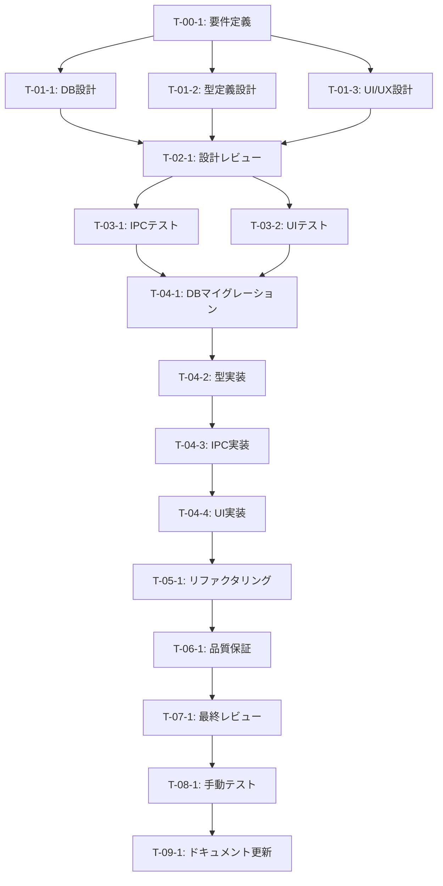

# ユーザープロフィール詳細管理機能強化 - タスク実行仕様書

## ユーザーからの元の指示

```
@docs/30-workflows/unassigned-task/task-02-user-profile-enhancement.md を実装するために次の内容でまずは指定のディレクトリを作成してタスク仕様書を作成してください
@.kamui/prompt/custom-prompt.txt supabase, turso, local どこのどこに永久的に保存するのが最適かというところも見極めてタスクを実行してください。
```

## メタ情報

| 項目             | 内容                                 |
| ---------------- | ------------------------------------ |
| タスクID         | TASK-USER-DATA-02                    |
| タスク名         | ユーザープロフィール詳細管理機能強化 |
| 分類             | 機能改善                             |
| 対象機能         | ユーザーデータ永続化                 |
| 優先度           | 中                                   |
| 見積もり規模     | 中規模                               |
| ステータス       | 実施中                               |
| 発見元           | ユーザー要件                         |
| 発見日           | 2025-12-10                           |
| 発見エージェント | タスク分解プロンプト                 |

---

## タスク概要

### 目的

ユーザープロフィールに詳細情報（タイムゾーン、言語、通知設定等）を追加し、パーソナライズされた体験を提供する。

### 背景

現在のユーザープロフィール管理は基本的な表示名・メールアドレス・アバターのみをサポートしているが、ワークフローオーケストレーターとしての利用において、より詳細なユーザー情報の管理が求められる。

### 最終ゴール

- タイムゾーン設定の追加と永続化
- 言語/ロケール設定の追加
- 通知設定（メール、デスクトップ、サウンド）の管理
- プロフィール情報のエクスポート/インポート機能
- Supabase `user_profiles` テーブルの拡張

### 成果物一覧

| 種別         | 成果物                        | 配置先                                                         |
| ------------ | ----------------------------- | -------------------------------------------------------------- |
| DB           | Supabase マイグレーション     | `supabase/migrations/003_extend_user_profiles.sql`             |
| 機能         | プロフィール拡張IPCハンドラー | `apps/desktop/src/main/ipc/profileHandlers.ts`                 |
| 型定義       | 拡張プロフィール型            | `packages/shared/types/auth.ts`                                |
| UI           | プロフィール設定画面          | `apps/desktop/src/renderer/views/SettingsView/ProfileSection/` |
| テスト       | ユニットテスト                | `apps/desktop/src/main/ipc/__tests__/`                         |
| ドキュメント | 要件定義書                    | `docs/30-workflows/user-profile-enhancement/requirements.md`   |

---

## データ保存先の設計判断

### 調査結果

プロジェクトは以下の3層データ永続化アーキテクチャを採用:

1. **Supabase** (クラウドDB + Auth) - Primary Source of Truth
2. **electron-store** (ローカル暗号化ストレージ) - キャッシュ・トークン
3. **Turso** (エッジSQLite) - デバイス固有設定

### 保存先決定

| プロフィール項目       | 保存先                           | 理由                                               |
| ---------------------- | -------------------------------- | -------------------------------------------------- |
| タイムゾーン           | Supabase `user_profiles`         | 複数デバイス同期、サーバー側スケジュール処理で参照 |
| 言語/ロケール          | Supabase `user_profiles`         | 複数デバイス同期、将来のWeb版でも共有              |
| 通知設定               | Supabase `user_profiles` (JSONB) | 複数デバイス同期、サーバー側プッシュ通知で参照     |
| エクスポートデータ     | ローカルファイル (JSON)          | ユーザー管理、ダウンロード形式                     |
| プロフィールキャッシュ | electron-store `profileCache`    | オフライン時フォールバック用（24時間TTL）          |

### アーキテクチャ図

```
┌─────────────────────────────────────────────────────────────────┐
│                      データ永続化アーキテクチャ                    │
├─────────────────────────────────────────────────────────────────┤
│                                                                   │
│   ┌─────────────────────┐                                        │
│   │   Supabase          │  ← Primary Source of Truth             │
│   │   user_profiles     │                                        │
│   │   ├── timezone      │  ← 新規追加                             │
│   │   ├── locale        │  ← 新規追加                             │
│   │   ├── notification  │  ← 新規追加 (JSONB)                     │
│   │   └── preferences   │  ← 新規追加 (JSONB)                     │
│   └─────────────────────┘                                        │
│              ↓ 同期                                               │
│   ┌─────────────────────┐                                        │
│   │   electron-store    │  ← Cache Layer                         │
│   │   profileCache      │                                        │
│   │   ├── 24時間 TTL     │                                        │
│   │   └── オフライン対応  │                                        │
│   └─────────────────────┘                                        │
│                                                                   │
│   ┌─────────────────────┐                                        │
│   │   Turso             │  ← デバイス固有設定（既存）              │
│   │   user_settings     │                                        │
│   │   └── themeMode等   │  ← 維持（変更なし）                      │
│   └─────────────────────┘                                        │
│                                                                   │
└─────────────────────────────────────────────────────────────────┘
```

---

## 参照ファイル

本仕様書のコマンド・エージェント・スキル選定は以下を参照：

- `docs/00-requirements/master_system_design.md` - システム要件
- `.claude/commands/ai/command_list.md` - /ai:コマンド定義
- `.claude/agents/agent_list.md` - エージェント定義
- `.claude/skills/skill_list.md` - スキル定義

---

## タスク分解サマリー

| ID     | フェーズ | サブタスク名                 | 責務                         | 依存    |
| ------ | -------- | ---------------------------- | ---------------------------- | ------- |
| T-00-1 | Phase 0  | プロフィール拡張要件定義     | 拡張項目・要件の明確化       | なし    |
| T-01-1 | Phase 1  | データベーススキーマ設計     | Supabaseテーブル拡張設計     | T-00-1  |
| T-01-2 | Phase 1  | 型定義・バリデーション設計   | TypeScript型・Zodスキーマ    | T-00-1  |
| T-01-3 | Phase 1  | UI/UX設計                    | 設定画面レイアウト設計       | T-00-1  |
| T-02-1 | Phase 2  | 設計レビュー                 | 設計品質の検証               | T-01-\* |
| T-03-1 | Phase 3  | IPCハンドラーテスト作成      | TDD Red状態確認              | T-02-1  |
| T-03-2 | Phase 3  | UIコンポーネントテスト作成   | TDD Red状態確認              | T-02-1  |
| T-04-1 | Phase 4  | Supabaseマイグレーション実行 | DBスキーマ拡張               | T-03-\* |
| T-04-2 | Phase 4  | 型定義・スキーマ実装         | TypeScript実装               | T-04-1  |
| T-04-3 | Phase 4  | IPC層拡張実装                | IPCハンドラー実装            | T-04-2  |
| T-04-4 | Phase 4  | UI実装                       | React コンポーネント実装     | T-04-3  |
| T-05-1 | Phase 5  | コード品質改善               | リファクタリング             | T-04-\* |
| T-06-1 | Phase 6  | 品質保証                     | テスト実行・カバレッジ確認   | T-05-1  |
| T-07-1 | Phase 7  | 最終レビュー                 | コード・セキュリティレビュー | T-06-1  |
| T-08-1 | Phase 8  | 手動テスト検証               | E2E動作確認                  | T-07-1  |
| T-09-1 | Phase 9  | ドキュメント更新             | システムドキュメント反映     | T-08-1  |

**総サブタスク数**: 16個

---

## 実行フロー図



---

## Phase 0: 要件定義

### T-00-1: プロフィール拡張要件定義

#### 目的

拡張するプロフィール項目と要件を定義し、実装の基盤を確立する。

#### 背景

現在のユーザープロフィールは `display_name`, `email`, `avatar_url`, `plan` のみをサポート。グローバルユーザー対応やパーソナライズのため、追加項目が必要。

#### 責務（単一責務）

プロフィール拡張項目の要件定義と仕様策定

#### Claude Code スラッシュコマンド

> 以下はターミナルコマンドではなく、Claude Code内で実行するスラッシュコマンドです

```
/ai:gather-requirements user-profile-enhancement
```

- **参照**: `.claude/commands/ai/command_list.md`

#### 使用エージェント

- **エージェント**: `@req-analyst`
- **選定理由**: 機能要件・非機能要件の明確化に特化
- **参照**: `.claude/agents/agent_list.md`

#### 活用スキル

| スキル名                               | 活用方法                   |
| -------------------------------------- | -------------------------- |
| functional-non-functional-requirements | プロフィール拡張要件の整理 |
| use-case-modeling                      | ユーザー設定シナリオ定義   |

- **参照**: `.claude/skills/skill_list.md`

#### 成果物

| 成果物     | パス                                                         | 内容         |
| ---------- | ------------------------------------------------------------ | ------------ |
| 要件定義書 | `docs/30-workflows/user-profile-enhancement/requirements.md` | 拡張項目一覧 |

#### 完了条件

- [ ] 追加プロフィール項目の確定
- [ ] 各項目のデータ型・制約定義
- [ ] デフォルト値の決定
- [ ] 非機能要件（パフォーマンス、セキュリティ）の定義

#### 依存関係

- **前提**: なし
- **後続**: T-01-1, T-01-2, T-01-3

---

## Phase 1: 設計

### T-01-1: データベーススキーマ設計

#### 目的

Supabase `user_profiles` テーブルの拡張スキーマを設計する。

#### 背景

既存テーブルに `timezone`, `locale`, `notification_settings`, `preferences` カラムを追加し、後方互換性を維持しながら拡張する。

#### 責務（単一責務）

Supabaseテーブル拡張のスキーマ設計

#### Claude Code スラッシュコマンド

> 以下はターミナルコマンドではなく、Claude Code内で実行するスラッシュコマンドです

```
/ai:design-database user_profiles
```

- **参照**: `.claude/commands/ai/command_list.md`

#### 使用エージェント

- **エージェント**: `@db-architect`
- **選定理由**: データベース設計の専門家
- **参照**: `.claude/agents/agent_list.md`

#### 活用スキル

| スキル名               | 活用方法             |
| ---------------------- | -------------------- |
| database-normalization | 正規化設計           |
| indexing-strategies    | パフォーマンス最適化 |

- **参照**: `.claude/skills/skill_list.md`

#### 成果物

| 成果物         | パス                                                          | 内容             |
| -------------- | ------------------------------------------------------------- | ---------------- |
| スキーマ設計書 | `docs/30-workflows/user-profile-enhancement/schema-design.md` | テーブル拡張設計 |

#### 完了条件

- [ ] 追加カラム定義（timezone, locale, notification_settings, preferences）
- [ ] インデックス設計
- [ ] マイグレーションSQL作成
- [ ] RLSポリシー更新

#### 依存関係

- **前提**: T-00-1
- **後続**: T-02-1

---

### T-01-2: 型定義・バリデーション設計

#### 目的

拡張プロフィールの型定義とZodスキーマを設計する。

#### 背景

TypeScriptの型安全性を維持し、ランタイムバリデーションをZodで実装する。

#### 責務（単一責務）

TypeScript型定義とZodスキーマの設計

#### Claude Code スラッシュコマンド

> 以下はターミナルコマンドではなく、Claude Code内で実行するスラッシュコマンドです

```
/ai:create-schema user-profile-extended
```

- **参照**: `.claude/commands/ai/command_list.md`

#### 使用エージェント

- **エージェント**: `@schema-def`
- **選定理由**: 型定義・スキーマ設計の専門家
- **参照**: `.claude/agents/agent_list.md`

#### 活用スキル

| スキル名             | 活用方法               |
| -------------------- | ---------------------- |
| zod-validation       | バリデーションスキーマ |
| type-safety-patterns | 型安全な設計           |

- **参照**: `.claude/skills/skill_list.md`

#### 成果物

| 成果物       | パス                                                        | 内容             |
| ------------ | ----------------------------------------------------------- | ---------------- |
| 型定義設計書 | `docs/30-workflows/user-profile-enhancement/type-design.md` | 型・スキーマ定義 |

#### 完了条件

- [ ] ExtendedUserProfile型定義
- [ ] NotificationSettings型定義
- [ ] UserPreferences型定義
- [ ] Zodスキーマ定義

#### 依存関係

- **前提**: T-00-1
- **後続**: T-02-1

---

### T-01-3: UI/UX設計

#### 目的

プロフィール設定画面のUI/UXを設計する。

#### 背景

設定画面は既存の SettingsView に統合し、一貫したデザインシステムに従う。

#### 責務（単一責務）

設定画面のUI/UX設計

#### Claude Code スラッシュコマンド

> 以下はターミナルコマンドではなく、Claude Code内で実行するスラッシュコマンドです

```
/ai:create-component ProfileSettings organism
```

- **参照**: `.claude/commands/ai/command_list.md`

#### 使用エージェント

- **エージェント**: `@ui-designer`
- **選定理由**: UI/UX設計の専門家
- **参照**: `.claude/agents/agent_list.md`

#### 活用スキル

| スキル名             | 活用方法             |
| -------------------- | -------------------- |
| accessibility-wcag   | アクセシビリティ対応 |
| apple-hig-guidelines | デスクトップUI設計   |

- **参照**: `.claude/skills/skill_list.md`

#### 成果物

| 成果物   | パス                                                      | 内容         |
| -------- | --------------------------------------------------------- | ------------ |
| UI設計書 | `docs/30-workflows/user-profile-enhancement/ui-design.md` | 設定画面設計 |

#### 完了条件

- [ ] セクション分割設計（タイムゾーン、言語、通知）
- [ ] フォーム要素設計
- [ ] エクスポート/インポートUI設計
- [ ] レスポンシブ対応設計

#### 依存関係

- **前提**: T-00-1
- **後続**: T-02-1

---

## Phase 2: 設計レビューゲート

### T-02-1: 設計レビュー

#### 目的

実装開始前に要件・設計の妥当性を複数エージェントで検証する。

#### 背景

設計ミスが実装後に発見されると修正コストが増加するため、早期検出する。

#### レビュー参加エージェント

| エージェント  | レビュー観点               | 選定理由           |
| ------------- | -------------------------- | ------------------ |
| @arch-police  | アーキテクチャ整合性       | 既存設計との整合性 |
| @db-architect | データベース設計           | スキーマ品質確認   |
| @sec-auditor  | プライバシー・セキュリティ | 個人情報の取り扱い |

- **参照**: `.claude/agents/agent_list.md`

#### レビューチェックリスト

**アーキテクチャ整合性** (@arch-police)

- [ ] クリーンアーキテクチャのレイヤー違反がないか
- [ ] 既存の永続化アーキテクチャとの整合性
- [ ] IPC通信パターンの一貫性

**データベース設計** (@db-architect)

- [ ] スキーマ設計の正規化レベルが適切か
- [ ] インデックス設計が最適か
- [ ] マイグレーションの後方互換性

**セキュリティ** (@sec-auditor)

- [ ] 個人情報の適切な取り扱い
- [ ] RLSポリシーの適切性
- [ ] エクスポートデータの機密情報除外

#### レビュー結果

- **判定**: （実行後記入）
- **指摘事項**: （実行後記入）
- **対応方針**: （実行後記入）

#### 完了条件

- [ ] 全レビュー観点でPASS判定

#### 依存関係

- **前提**: T-01-1, T-01-2, T-01-3
- **後続**: T-03-1, T-03-2

---

## Phase 3: テスト作成 (TDD: Red)

### T-03-1: IPCハンドラーテスト作成

#### 目的

拡張プロフィール機能のIPCハンドラーテストを作成する。

#### 背景

TDD手法に従い、実装前にテストを作成してRed状態を確認する。

#### 責務（単一責務）

IPCハンドラーのユニットテスト作成

#### Claude Code スラッシュコマンド

> 以下はターミナルコマンドではなく、Claude Code内で実行するスラッシュコマンドです

```
/ai:generate-unit-tests apps/desktop/src/main/ipc/profileHandlers.ts
```

- **参照**: `.claude/commands/ai/command_list.md`

#### 使用エージェント

- **エージェント**: `@unit-tester`
- **選定理由**: ユニットテスト作成の専門家
- **参照**: `.claude/agents/agent_list.md`

#### 活用スキル

| スキル名       | 活用方法           |
| -------------- | ------------------ |
| tdd-principles | TDDサイクル実践    |
| test-doubles   | モック・スタブ設計 |

- **参照**: `.claude/skills/skill_list.md`

#### 成果物

| 成果物         | パス                                                                   | 内容           |
| -------------- | ---------------------------------------------------------------------- | -------------- |
| テストファイル | `apps/desktop/src/main/ipc/__tests__/profileHandlers.extended.test.ts` | 拡張機能テスト |

#### TDD検証: Red状態確認

```bash
pnpm --filter @repo/desktop test:run profileHandlers
```

- [ ] テストが失敗することを確認（Red状態）

#### 完了条件

- [ ] タイムゾーン設定テスト
- [ ] 言語設定テスト
- [ ] 通知設定テスト
- [ ] エクスポート/インポートテスト

#### 依存関係

- **前提**: T-02-1
- **後続**: T-04-1

---

### T-03-2: UIコンポーネントテスト作成

#### 目的

プロフィール設定UIコンポーネントのテストを作成する。

#### 背景

UIコンポーネントの動作検証をTDD手法で実施する。

#### 責務（単一責務）

UIコンポーネントのテスト作成

#### Claude Code スラッシュコマンド

> 以下はターミナルコマンドではなく、Claude Code内で実行するスラッシュコマンドです

```
/ai:generate-component-tests apps/desktop/src/renderer/views/SettingsView/ProfileSection
```

- **参照**: `.claude/commands/ai/command_list.md`

#### 使用エージェント

- **エージェント**: `@frontend-tester`
- **選定理由**: フロントエンドテストの専門家
- **参照**: `.claude/agents/agent_list.md`

#### 活用スキル

| スキル名             | 活用方法         |
| -------------------- | ---------------- |
| playwright-testing   | E2Eテスト設計    |
| test-data-management | テストデータ管理 |

- **参照**: `.claude/skills/skill_list.md`

#### 成果物

| 成果物         | パス                                                                               | 内容                 |
| -------------- | ---------------------------------------------------------------------------------- | -------------------- |
| テストファイル | `apps/desktop/src/renderer/views/SettingsView/ProfileSection/__tests__/*.test.tsx` | コンポーネントテスト |

#### TDD検証: Red状態確認

```bash
pnpm --filter @repo/desktop test:run ProfileSection
```

- [ ] テストが失敗することを確認（Red状態）

#### 完了条件

- [ ] タイムゾーンセレクターテスト
- [ ] 言語セレクターテスト
- [ ] 通知設定トグルテスト
- [ ] エクスポート/インポートボタンテスト

#### 依存関係

- **前提**: T-02-1
- **後続**: T-04-4

---

## Phase 4: 実装 (TDD: Green)

### T-04-1: Supabaseマイグレーション実行

#### 目的

user_profiles テーブルにカラムを追加する。

#### 背景

設計に基づきDBスキーマを拡張し、既存データに影響を与えない。

#### 責務（単一責務）

Supabaseマイグレーションの実行

#### 実行手順

1. Supabase Dashboard にログイン
2. SQL Editor でマイグレーションSQL実行
3. テーブル構造確認

#### 追加カラム

```sql
-- タイムゾーン（IANA形式）
ALTER TABLE user_profiles
ADD COLUMN IF NOT EXISTS timezone VARCHAR(50) DEFAULT 'Asia/Tokyo';

-- ロケール
ALTER TABLE user_profiles
ADD COLUMN IF NOT EXISTS locale VARCHAR(10) DEFAULT 'ja';

-- 通知設定（JSONB）
ALTER TABLE user_profiles
ADD COLUMN IF NOT EXISTS notification_settings JSONB DEFAULT '{
  "email": true,
  "desktop": true,
  "sound": true,
  "workflowComplete": true,
  "workflowError": true
}'::jsonb;

-- ユーザー設定（JSONB）
ALTER TABLE user_profiles
ADD COLUMN IF NOT EXISTS preferences JSONB DEFAULT '{}'::jsonb;
```

#### 完了条件

- [ ] マイグレーション成功
- [ ] 既存データに影響なし
- [ ] RLSポリシー更新確認

#### 依存関係

- **前提**: T-03-1, T-03-2
- **後続**: T-04-2

---

### T-04-2: 型定義・スキーマ実装

#### 目的

拡張プロフィールの型定義とZodスキーマを実装する。

#### 背景

TypeScript型安全性とランタイムバリデーションを確保する。

#### 責務（単一責務）

TypeScript型定義とZodスキーマの実装

#### Claude Code スラッシュコマンド

> 以下はターミナルコマンドではなく、Claude Code内で実行するスラッシュコマンドです

```
/ai:create-schema user-profile-extended
```

- **参照**: `.claude/commands/ai/command_list.md`

#### 使用エージェント

- **エージェント**: `@schema-def`
- **選定理由**: 型定義・スキーマ実装の専門家
- **参照**: `.claude/agents/agent_list.md`

#### 成果物

| 成果物 | パス                            | 内容       |
| ------ | ------------------------------- | ---------- |
| 型定義 | `packages/shared/types/auth.ts` | 拡張型追加 |

#### 完了条件

- [ ] Timezone型（IANAタイムゾーン）
- [ ] Locale型
- [ ] NotificationSettings型
- [ ] UserPreferences型
- [ ] ExtendedUserProfile型
- [ ] Zodスキーマ

#### 依存関係

- **前提**: T-04-1
- **後続**: T-04-3

---

### T-04-3: IPC層拡張実装

#### 目的

プロフィール更新IPCハンドラーを拡張する。

#### 背景

既存のprofileHandlers.tsに新しいハンドラーを追加する。

#### 責務（単一責務）

IPCハンドラーの実装

#### Claude Code スラッシュコマンド

> 以下はターミナルコマンドではなく、Claude Code内で実行するスラッシュコマンドです

```
/ai:implement-business-logic profile-extended
```

- **参照**: `.claude/commands/ai/command_list.md`

#### 使用エージェント

- **エージェント**: `@logic-dev`
- **選定理由**: ビジネスロジック実装の専門家
- **参照**: `.claude/agents/agent_list.md`

#### 成果物

| 成果物        | パス                                           | 内容     |
| ------------- | ---------------------------------------------- | -------- |
| IPCハンドラー | `apps/desktop/src/main/ipc/profileHandlers.ts` | 拡張実装 |

#### TDD検証: Green状態確認

```bash
pnpm --filter @repo/desktop test:run profileHandlers
```

- [ ] テストが成功することを確認（Green状態）

#### 完了条件

- [ ] `profile:update-timezone` ハンドラー
- [ ] `profile:update-locale` ハンドラー
- [ ] `profile:update-notifications` ハンドラー
- [ ] `profile:export` ハンドラー
- [ ] `profile:import` ハンドラー
- [ ] キャッシュ同期処理

#### 依存関係

- **前提**: T-04-2
- **後続**: T-04-4

---

### T-04-4: UI実装

#### 目的

プロフィール設定画面のUIコンポーネントを実装する。

#### 背景

設計に基づきReactコンポーネントを実装する。

#### 責務（単一責務）

UIコンポーネントの実装

#### Claude Code スラッシュコマンド

> 以下はターミナルコマンドではなく、Claude Code内で実行するスラッシュコマンドです

```
/ai:create-component ProfileSettingsSection organism
```

- **参照**: `.claude/commands/ai/command_list.md`

#### 使用エージェント

- **エージェント**: `@ui-designer`
- **選定理由**: UI実装の専門家
- **参照**: `.claude/agents/agent_list.md`

#### 成果物

| 成果物         | パス                                                           | 内容   |
| -------------- | -------------------------------------------------------------- | ------ |
| コンポーネント | `apps/desktop/src/renderer/views/SettingsView/ProfileSection/` | 設定UI |

#### TDD検証: Green状態確認

```bash
pnpm --filter @repo/desktop test:run ProfileSection
```

- [ ] テストが成功することを確認（Green状態）

#### 完了条件

- [ ] TimezoneSelector コンポーネント
- [ ] LocaleSelector コンポーネント
- [ ] NotificationSettings コンポーネント
- [ ] ProfileExportImport コンポーネント
- [ ] 既存SettingsViewへの統合

#### 依存関係

- **前提**: T-04-3
- **後続**: T-05-1

---

## Phase 5: リファクタリング (TDD: Refactor)

### T-05-1: コード品質改善

#### 目的

動作を変えずにコード品質を改善する。

#### 背景

実装完了後、コードの可読性・保守性を向上させる。

#### 責務（単一責務）

コードリファクタリング

#### Claude Code スラッシュコマンド

> 以下はターミナルコマンドではなく、Claude Code内で実行するスラッシュコマンドです

```
/ai:refactor apps/desktop/src/main/ipc/profileHandlers.ts
```

- **参照**: `.claude/commands/ai/command_list.md`

#### 使用エージェント

- **エージェント**: `@code-quality`
- **選定理由**: コード品質改善の専門家
- **参照**: `.claude/agents/agent_list.md`

#### 活用スキル

| スキル名               | 活用方法             |
| ---------------------- | -------------------- |
| clean-code-practices   | コード品質向上       |
| refactoring-techniques | リファクタリング技法 |

- **参照**: `.claude/skills/skill_list.md`

#### TDD検証: 継続Green確認

```bash
pnpm --filter @repo/desktop test:run
```

- [ ] リファクタリング後もテストが成功することを確認

#### 完了条件

- [ ] Lintエラーなし
- [ ] 型エラーなし
- [ ] コードフォーマット適用

#### 依存関係

- **前提**: T-04-4
- **後続**: T-06-1

---

## Phase 6: 品質保証

### T-06-1: 品質保証

#### 目的

定義された品質基準をすべて満たすことを検証する。

#### 背景

品質ゲートを通過しなければ次フェーズに進めない。

#### 責務（単一責務）

品質検証の実施

#### Claude Code スラッシュコマンド

> 以下はターミナルコマンドではなく、Claude Code内で実行するスラッシュコマンドです

```
/ai:run-all-tests --coverage
```

- **参照**: `.claude/commands/ai/command_list.md`

#### 完了条件

- [ ] 全ユニットテスト成功
- [ ] 全統合テスト成功
- [ ] Lintエラーなし
- [ ] 型エラーなし
- [ ] カバレッジ80%以上

#### 依存関係

- **前提**: T-05-1
- **後続**: T-07-1

---

## 品質ゲートチェックリスト

### 機能検証

- [ ] 全ユニットテスト成功
- [ ] 全統合テスト成功

### コード品質

- [ ] Lintエラーなし
- [ ] 型エラーなし
- [ ] コードフォーマット適用済み

### テスト網羅性

- [ ] カバレッジ基準達成（80%以上）

### セキュリティ

- [ ] 脆弱性スキャン完了
- [ ] 重大な脆弱性なし

---

## Phase 7: 最終レビューゲート

### T-07-1: 最終レビュー

#### 目的

実装完了後、ドキュメント更新前に全体的な品質・整合性を検証する。

#### 背景

Phase 6の自動検証だけでは検出できない設計判断やベストプラクティス違反を確認する。

#### レビュー参加エージェント

| エージェント       | レビュー観点             | 選定理由        |
| ------------------ | ------------------------ | --------------- |
| @code-quality      | コード品質               | 保守性確認      |
| @arch-police       | アーキテクチャ遵守       | 設計整合性      |
| @sec-auditor       | セキュリティ             | 個人情報保護    |
| @electron-security | Electron固有セキュリティ | IPC通信の安全性 |

- **参照**: `.claude/agents/agent_list.md`

#### レビューチェックリスト

**コード品質** (@code-quality)

- [ ] コーディング規約への準拠
- [ ] 可読性・保守性の確保
- [ ] 適切なエラーハンドリング

**アーキテクチャ遵守** (@arch-police)

- [ ] 既存パターンとの整合性
- [ ] レイヤー間依存関係の適切性
- [ ] SOLID原則への準拠

**セキュリティ** (@sec-auditor)

- [ ] 入力検証の実装
- [ ] エクスポートデータの機密情報除外
- [ ] RLSポリシーの適切性

**Electronセキュリティ** (@electron-security)

- [ ] IPC通信のセキュリティ
- [ ] Context Isolationの維持
- [ ] Preload Script の適切な公開範囲

#### 完了条件

- [ ] 全レビュー観点でPASS判定

#### 依存関係

- **前提**: T-06-1
- **後続**: T-08-1

---

## Phase 8: 手動テスト検証

### T-08-1: 手動テスト検証

#### 目的

自動テストでは検証できないユーザー体験・UI/UXを手動で確認する。

#### 背景

実際のユーザー操作フローでの動作を検証する。

#### 手動テストケース

| No  | カテゴリ     | テスト項目               | 前提条件                 | 操作手順                       | 期待結果                         | 実行結果 | 備考 |
| --- | ------------ | ------------------------ | ------------------------ | ------------------------------ | -------------------------------- | -------- | ---- |
| 1   | タイムゾーン | タイムゾーン変更         | ログイン済み             | 設定画面でタイムゾーンを変更   | 変更が保存され、再起動後も保持   |          |      |
| 2   | 言語設定     | 言語変更                 | ログイン済み             | 設定画面で言語を変更           | 変更が保存され、UIに反映         |          |      |
| 3   | 通知設定     | 通知ON/OFF               | ログイン済み             | 各通知設定をトグル             | 変更が保存される                 |          |      |
| 4   | エクスポート | プロフィールエクスポート | ログイン済み             | エクスポートボタンをクリック   | JSONファイルがダウンロードされる |          |      |
| 5   | インポート   | プロフィールインポート   | エクスポート済みファイル | インポートボタンでファイル選択 | 設定が復元される                 |          |      |
| 6   | オフライン   | オフライン時の動作       | ネットワーク切断         | 設定画面を開く                 | キャッシュから表示される         |          |      |

#### 完了条件

- [ ] すべての手動テストケースがPASS
- [ ] 発見された不具合が修正済み

#### 依存関係

- **前提**: T-07-1
- **後続**: T-09-1

---

## Phase 9: ドキュメント更新・未完了タスク記録

### T-09-1: ドキュメント更新

#### 目的

タスク完了後、実装した内容をシステム要件ドキュメントに反映する。

#### 前提条件

- [ ] Phase 6の品質ゲートをすべて通過
- [ ] Phase 7の最終レビューゲートを通過
- [ ] Phase 8の手動テストが完了
- [ ] すべてのテストが成功

#### サブタスク 9.1: システムドキュメント更新

##### 更新対象ドキュメント

- `docs/00-requirements/master_system_design.md` - プロフィール仕様追記

##### Claude Code スラッシュコマンド

> 以下はターミナルコマンドではなく、Claude Code内で実行するスラッシュコマンドです

```
/ai:update-all-docs
```

- **参照**: `.claude/commands/ai/command_list.md`

##### 更新原則

- 概要のみ記載（詳細な実装説明は不要）
- システム構築に必要十分な情報のみ追記
- 既存ドキュメントの構造・フォーマットを維持
- Single Source of Truth原則を遵守

#### 完了条件

- [ ] システムドキュメント更新完了
- [ ] 未完了タスクの記録完了（該当する場合）

---

## リスクと対策

| リスク                   | 影響度 | 発生確率 | 対策                                      | 対応サブタスク |
| ------------------------ | ------ | -------- | ----------------------------------------- | -------------- |
| マイグレーション失敗     | 高     | 低       | バックアップ後に実行、ロールバックSQL準備 | T-04-1         |
| 既存データ破損           | 高     | 低       | NULL許容・デフォルト値設定                | T-04-1         |
| タイムゾーン処理の複雑化 | 中     | 中       | date-fns-tz使用、UTCベース保存            | T-04-3         |
| キャッシュ同期の不整合   | 中     | 中       | 同期処理の厳密な実装、エラーハンドリング  | T-04-3         |

---

## 前提条件

- Supabase プロジェクトへの管理者アクセス権
- 既存の認証・プロフィールシステムが動作していること
- TASK-USER-DATA-01（APIキー管理）と並行または後続実装可能

---

## 備考

### 技術的制約

- タイムゾーンはIANA形式（例: Asia/Tokyo）で保存
- 通知設定はJSONB型で柔軟に拡張可能な設計
- エクスポート形式はJSON（機密情報を除外）
- electron-storeのキャッシュTTLは24時間

### 参考資料

- [IANA Time Zone Database](https://www.iana.org/time-zones)
- [date-fns-tz](https://github.com/marnusw/date-fns-tz)
- 既存実装: `apps/desktop/src/main/ipc/profileHandlers.ts`
- 既存型定義: `packages/shared/types/auth.ts`
