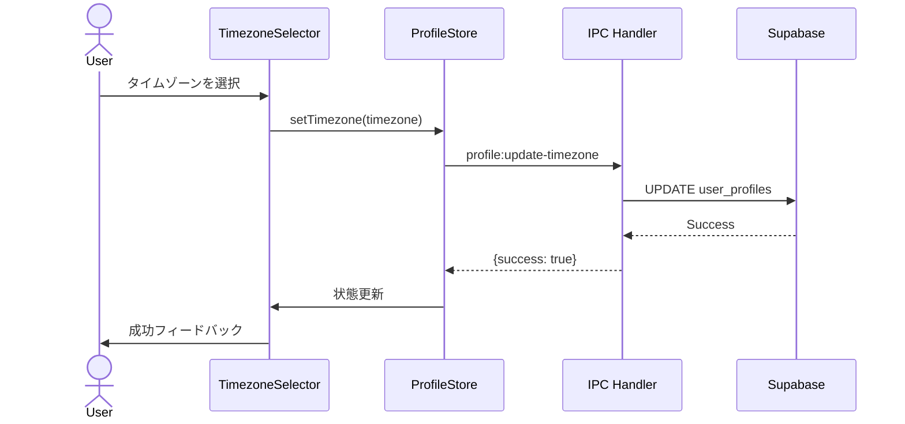
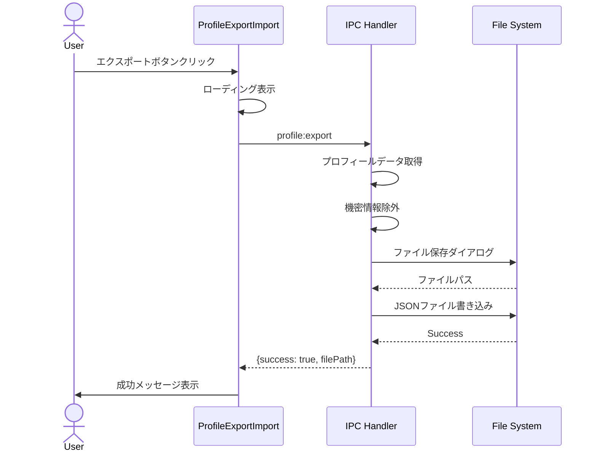
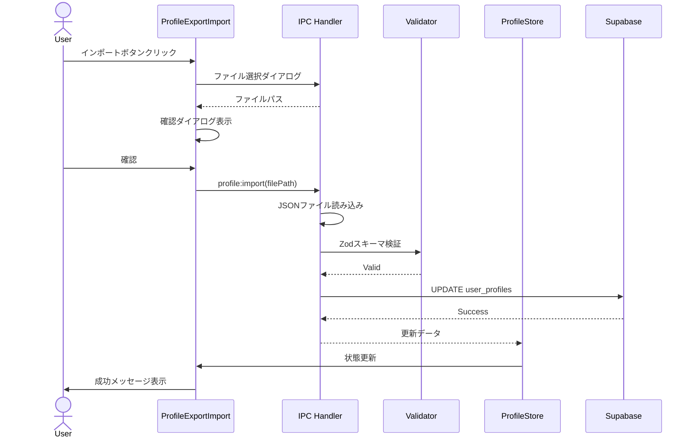

# ユーザープロフィール拡張 - UI/UX設計書

## メタ情報

| 項目       | 内容                |
| ---------- | ------------------- |
| 文書ID     | UI-USER-PROFILE-001 |
| 作成日     | 2025-12-10          |
| 担当者     | @ui-designer        |
| ステータス | 確定                |
| 関連タスク | T-01-3              |

---

## 1. 概要

### 1.1 目的

プロフィール設定画面のUI/UXを設計し、ユーザーが直感的に設定を変更できるインターフェースを提供する。

### 1.2 設計方針

- **一貫性**: 既存の SettingsView デザインパターンを踏襲
- **アクセシビリティ**: WCAG 2.1 AA 準拠
- **レスポンシブ**: 各種ウィンドウサイズに対応
- **即時反映**: 設定変更時に即座にフィードバック

---

## 2. 画面構成

### 2.1 設定画面レイアウト

```
┌─────────────────────────────────────────────────────────────────────────┐
│ Settings                                                        [×]    │
├───────────────────┬─────────────────────────────────────────────────────┤
│ ▶ Account        │                                                     │
│   Profile        │  Profile Settings                                   │
│   Security       │  ─────────────────────────────────────────────────  │
│ ▶ Preferences    │                                                     │
│   Regional       │  ┌─ Basic Information ─────────────────────────┐   │
│   Notifications  │  │                                              │   │
│   Display        │  │  Display Name                                │   │
│ ▶ Data           │  │  ┌────────────────────────────────────┐     │   │
│   Export/Import  │  │  │ John Doe                           │     │   │
│   Backup         │  │  └────────────────────────────────────┘     │   │
│                  │  │                                              │   │
│                  │  │  Email                                       │   │
│                  │  │  john.doe@example.com                        │   │
│                  │  │  (読み取り専用)                               │   │
│                  │  │                                              │   │
│                  │  │  Avatar                                      │   │
│                  │  │  ┌─────┐                                     │   │
│                  │  │  │ 👤  │  [Change Avatar]                   │   │
│                  │  │  └─────┘                                     │   │
│                  │  └──────────────────────────────────────────────┘   │
│                  │                                                     │
│                  │  ┌─ Regional Settings ─────────────────────────┐   │
│                  │  │                                              │   │
│                  │  │  Timezone                                    │   │
│                  │  │  ┌────────────────────────────────────┐ ▼   │   │
│                  │  │  │ Asia/Tokyo (UTC+9)                 │     │   │
│                  │  │  └────────────────────────────────────┘     │   │
│                  │  │                                              │   │
│                  │  │  Language                                    │   │
│                  │  │  ┌────────────────────────────────────┐ ▼   │   │
│                  │  │  │ 日本語                              │     │   │
│                  │  │  └────────────────────────────────────┘     │   │
│                  │  └──────────────────────────────────────────────┘   │
│                  │                                                     │
└───────────────────┴─────────────────────────────────────────────────────┘
```

### 2.2 通知設定セクション

```
┌─ Notification Settings ───────────────────────────────────────────┐
│                                                                   │
│  ┌─ General ──────────────────────────────────────────────────┐  │
│  │                                                             │  │
│  │  Email Notifications                             [═════○]  │  │
│  │  Receive notifications via email                           │  │
│  │                                                             │  │
│  │  Desktop Notifications                           [═════○]  │  │
│  │  Show system notifications                                 │  │
│  │                                                             │  │
│  │  Sound                                           [═════○]  │  │
│  │  Play notification sounds                                  │  │
│  │                                                             │  │
│  └─────────────────────────────────────────────────────────────┘  │
│                                                                   │
│  ┌─ Workflow Events ──────────────────────────────────────────┐  │
│  │                                                             │  │
│  │  Workflow Complete                               [═════○]  │  │
│  │  Notify when a workflow finishes successfully              │  │
│  │                                                             │  │
│  │  Workflow Error                                  [═════○]  │  │
│  │  Notify when a workflow encounters an error                │  │
│  │                                                             │  │
│  └─────────────────────────────────────────────────────────────┘  │
│                                                                   │
└───────────────────────────────────────────────────────────────────┘
```

### 2.3 データ管理セクション

```
┌─ Data Management ─────────────────────────────────────────────────┐
│                                                                   │
│  Export Profile                                                   │
│  Download your profile settings as a JSON file.                   │
│  ┌──────────────────────────┐                                     │
│  │  📥 Export to JSON       │                                     │
│  └──────────────────────────┘                                     │
│                                                                   │
│  Note: Export includes timezone, language, and notification       │
│  settings. It does not include sensitive information like         │
│  email or API keys.                                               │
│                                                                   │
│  ─────────────────────────────────────────────────────────────    │
│                                                                   │
│  Import Profile                                                   │
│  Restore your profile settings from a previously exported file.   │
│  ┌──────────────────────────┐                                     │
│  │  📤 Import from JSON     │                                     │
│  └──────────────────────────┘                                     │
│                                                                   │
│  Warning: Importing will overwrite your current settings.         │
│                                                                   │
└───────────────────────────────────────────────────────────────────┘
```

---

## 3. コンポーネント設計

### 3.1 TimezoneSelector

#### 仕様

| 項目             | 内容                                       |
| ---------------- | ------------------------------------------ |
| コンポーネント名 | `TimezoneSelector`                         |
| 種類             | Molecule                                   |
| 配置             | `components/settings/TimezoneSelector.tsx` |

#### Props

```typescript
interface TimezoneSelectorProps {
  value: string;
  onChange: (timezone: string) => void;
  disabled?: boolean;
  error?: string;
}
```

#### 機能

- 検索可能なドロップダウン
- よく使うタイムゾーンを上部に表示
- 現在時刻のプレビュー表示
- キーボードナビゲーション対応

#### ワイヤーフレーム

```
┌─────────────────────────────────────────────────────────┐
│ 🔍 Search timezone...                              ▼   │
├─────────────────────────────────────────────────────────┤
│ ── Common Timezones ──                                  │
│   ○ Asia/Tokyo (UTC+9)           Current: 14:30        │
│   ○ America/New_York (UTC-5)     Current: 00:30        │
│   ○ Europe/London (UTC+0)        Current: 05:30        │
│ ── All Timezones ──                                     │
│   ○ Africa/Abidjan                                      │
│   ○ Africa/Accra                                        │
│   ...                                                   │
└─────────────────────────────────────────────────────────┘
```

---

### 3.2 LocaleSelector

#### 仕様

| 項目             | 内容                                     |
| ---------------- | ---------------------------------------- |
| コンポーネント名 | `LocaleSelector`                         |
| 種類             | Molecule                                 |
| 配置             | `components/settings/LocaleSelector.tsx` |

#### Props

```typescript
interface LocaleSelectorProps {
  value: Locale;
  onChange: (locale: Locale) => void;
  disabled?: boolean;
}
```

#### 機能

- ドロップダウン選択
- 言語名をネイティブ表記で表示
- 国旗アイコン表示（オプション）

#### ワイヤーフレーム

```
┌─────────────────────────────────────────────────────────┐
│ 日本語                                             ▼   │
├─────────────────────────────────────────────────────────┤
│   🇯🇵 日本語                                      ✓    │
│   🇺🇸 English                                          │
│   🇨🇳 简体中文                                          │
│   🇹🇼 繁體中文                                          │
│   🇰🇷 한국어                                            │
└─────────────────────────────────────────────────────────┘
```

---

### 3.3 NotificationToggle

#### 仕様

| 項目             | 内容                                         |
| ---------------- | -------------------------------------------- |
| コンポーネント名 | `NotificationToggle`                         |
| 種類             | Atom                                         |
| 配置             | `components/settings/NotificationToggle.tsx` |

#### Props

```typescript
interface NotificationToggleProps {
  label: string;
  description?: string;
  checked: boolean;
  onChange: (checked: boolean) => void;
  disabled?: boolean;
}
```

#### 機能

- トグルスイッチ
- ラベルと説明テキスト
- 即時反映

#### ワイヤーフレーム

```
┌─────────────────────────────────────────────────────────┐
│  Email Notifications                         [═════○]  │
│  Receive notifications via email                        │
└─────────────────────────────────────────────────────────┘
```

---

### 3.4 ProfileExportImport

#### 仕様

| 項目             | 内容                                          |
| ---------------- | --------------------------------------------- |
| コンポーネント名 | `ProfileExportImport`                         |
| 種類             | Organism                                      |
| 配置             | `components/settings/ProfileExportImport.tsx` |

#### Props

```typescript
interface ProfileExportImportProps {
  onExport: () => Promise<void>;
  onImport: (filePath: string) => Promise<void>;
  isExporting?: boolean;
  isImporting?: boolean;
}
```

#### 機能

- エクスポートボタン
- インポートボタン（ファイル選択ダイアログ）
- ローディング状態表示
- 成功/エラーメッセージ表示

#### ワイヤーフレーム

```
┌─────────────────────────────────────────────────────────┐
│  Export Profile                                         │
│  ┌──────────────────────────┐                          │
│  │  📥 Export to JSON       │  ⟳ Exporting...          │
│  └──────────────────────────┘                          │
│                                                         │
│  ✓ Exported to ~/Downloads/profile-export-2025-12-10.json│
│                                                         │
│  ─────────────────────────────────────────────────────  │
│                                                         │
│  Import Profile                                         │
│  ┌──────────────────────────┐                          │
│  │  📤 Import from JSON     │                          │
│  └──────────────────────────┘                          │
│                                                         │
│  ⚠️ Warning: This will overwrite your current settings. │
└─────────────────────────────────────────────────────────┘
```

---

## 4. インタラクション設計

### 4.1 タイムゾーン変更フロー



### 4.2 エクスポートフロー



### 4.3 インポートフロー



---

## 5. 状態管理

### 5.1 ProfileSettingsStore

```typescript
// stores/profileSettingsStore.ts

interface ProfileSettingsState {
  // 設定値
  timezone: string;
  locale: Locale;
  notificationSettings: NotificationSettings;

  // UI状態
  isLoading: boolean;
  isSaving: boolean;
  isExporting: boolean;
  isImporting: boolean;
  error: string | null;
  successMessage: string | null;

  // アクション
  setTimezone: (timezone: string) => Promise<void>;
  setLocale: (locale: Locale) => Promise<void>;
  setNotificationSetting: (
    key: keyof NotificationSettings,
    value: boolean,
  ) => Promise<void>;
  exportProfile: () => Promise<void>;
  importProfile: (filePath: string) => Promise<void>;
  clearMessages: () => void;
}
```

### 5.2 状態遷移

```
┌──────────────────────────────────────────────────────────────────┐
│                        状態遷移図                                │
├──────────────────────────────────────────────────────────────────┤
│                                                                  │
│    ┌─────────┐                                                   │
│    │  Idle   │ ←─────────────────────────────────────┐          │
│    └────┬────┘                                       │          │
│         │ ユーザー操作                                │          │
│         ▼                                           │          │
│    ┌─────────┐                                       │          │
│    │ Saving  │ ─────→ ┌─────────┐                   │          │
│    └─────────┘  成功   │ Success │ ──→ 3秒後 ────────┘          │
│         │              └─────────┘                              │
│         │ 失敗                                                   │
│         ▼                                                        │
│    ┌─────────┐                                                   │
│    │  Error  │ ──────→ ユーザーがクリア ─────→ Idle             │
│    └─────────┘                                                   │
│                                                                  │
└──────────────────────────────────────────────────────────────────┘
```

---

## 6. エラーハンドリング

### 6.1 エラー種別

| エラー種別           | 表示方法                 | ユーザーアクション |
| -------------------- | ------------------------ | ------------------ |
| バリデーションエラー | フィールド横に赤テキスト | 入力値を修正       |
| ネットワークエラー   | トースト通知             | 再試行ボタン       |
| ファイルエラー       | ダイアログ               | 別ファイルを選択   |
| 権限エラー           | ダイアログ               | ログインし直し     |

### 6.2 エラーメッセージ

| エラーコード | メッセージ（日本語）                                 |
| ------------ | ---------------------------------------------------- |
| INVALID_TZ   | 無効なタイムゾーンです                               |
| INVALID_LOC  | サポートされていない言語です                         |
| NETWORK_ERR  | ネットワークエラーが発生しました。再試行してください |
| IMPORT_ERR   | ファイルの読み込みに失敗しました                     |
| EXPORT_ERR   | ファイルの保存に失敗しました                         |
| VALIDATION   | ファイル形式が正しくありません                       |

---

## 7. アクセシビリティ

### 7.1 キーボードナビゲーション

| キー      | アクション                     |
| --------- | ------------------------------ |
| Tab       | 次のフォーカス要素へ移動       |
| Shift+Tab | 前のフォーカス要素へ移動       |
| Enter     | ボタン/ドロップダウンを活性化  |
| Space     | トグルスイッチを切り替え       |
| Escape    | ドロップダウンを閉じる         |
| ↑/↓       | ドロップダウン内の選択肢を移動 |

### 7.2 ARIAラベル

```tsx
// タイムゾーンセレクター
<Select
  aria-label="タイムゾーンを選択"
  aria-describedby="timezone-description"
>

// トグルスイッチ
<Switch
  aria-label="メール通知を有効にする"
  role="switch"
  aria-checked={checked}
>

// エクスポートボタン
<Button
  aria-label="プロフィール設定をJSONファイルとしてエクスポート"
  aria-busy={isExporting}
>
```

### 7.3 コントラスト比

| 要素           | 前景色  | 背景色  | コントラスト比 |
| -------------- | ------- | ------- | -------------- |
| 本文テキスト   | #1a1a1a | #ffffff | 16.1:1         |
| ラベルテキスト | #4a4a4a | #ffffff | 7.2:1          |
| エラーテキスト | #dc2626 | #ffffff | 4.5:1          |
| 無効テキスト   | #9ca3af | #ffffff | 3.0:1          |

---

## 8. レスポンシブ対応

### 8.1 ブレークポイント

| 名称 | 幅         | レイアウト           |
| ---- | ---------- | -------------------- |
| sm   | < 640px    | シングルカラム       |
| md   | 640-1024px | サイドバー折りたたみ |
| lg   | > 1024px   | フルレイアウト       |

### 8.2 レイアウト変化

**Desktop (lg)**

```
┌─────────────────┬─────────────────────────────────────┐
│   Sidebar       │          Content Area               │
│                 │                                     │
└─────────────────┴─────────────────────────────────────┘
```

**Tablet (md)**

```
┌────┬────────────────────────────────────────────────┐
│ ≡  │              Content Area                      │
└────┴────────────────────────────────────────────────┘
  ↓ サイドバーはハンバーガーメニュー
```

**Mobile (sm)**

```
┌─────────────────────────────────────────────────────┐
│ ≡  Settings                                         │
├─────────────────────────────────────────────────────┤
│                                                     │
│  Content Area (Full Width)                          │
│                                                     │
└─────────────────────────────────────────────────────┘
```

---

## 9. コンポーネントディレクトリ構造

```
apps/desktop/src/renderer/
├── views/
│   └── SettingsView/
│       ├── index.tsx
│       ├── ProfileSection/
│       │   ├── index.tsx
│       │   ├── BasicInfoSection.tsx
│       │   ├── RegionalSettingsSection.tsx
│       │   ├── NotificationSettingsSection.tsx
│       │   └── DataManagementSection.tsx
│       └── ...
├── components/
│   └── settings/
│       ├── TimezoneSelector.tsx
│       ├── TimezoneSelector.test.tsx
│       ├── LocaleSelector.tsx
│       ├── LocaleSelector.test.tsx
│       ├── NotificationToggle.tsx
│       ├── NotificationToggle.test.tsx
│       ├── ProfileExportImport.tsx
│       └── ProfileExportImport.test.tsx
└── stores/
    └── profileSettingsStore.ts
```

---

## 10. 変更履歴

| 版  | 日付       | 変更内容 | 担当者       |
| --- | ---------- | -------- | ------------ |
| 1.0 | 2025-12-10 | 初版作成 | @ui-designer |
