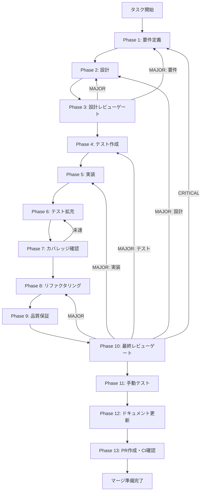

# ut-fix-ci-ipc-continue-on-error-001 - タスク実行仕様書

## ユーザーからの元の指示

```
Issue #2196: [UT-FIX-CI-IPC-CONTINUE-ON-ERROR-001]
CI verify-ipc-4layer の continue-on-error 解除・CIブロッキング有効化

.github/workflows/ci.yml の verify-ipc-4layer ジョブに設定されている
continue-on-error: true を削除し、IPC 4層整合性違反を検出した場合に
CIをブロックする状態にする。
```

## メタ情報

| 項目         | 内容                                         |
| ------------ | -------------------------------------------- |
| タスクID     | UT-FIX-CI-IPC-CONTINUE-ON-ERROR-001          |
| タスク名     | ci-ipc-continue-on-error-removal             |
| 分類         | 改善                                         |
| 対象機能     | GitHub Actions CI / verify-ipc-4layer ジョブ |
| 優先度       | 中                                           |
| 見積もり規模 | 小規模                                       |
| ステータス   | Phase 12 完了（PR未着手）                    |
| 作成日       | 2026-04-16                                   |
| GitHub Issue | #2196                                        |

---

## タスク概要

### 目的

`.github/workflows/ci.yml` の `verify-ipc-4layer` ジョブから `continue-on-error: true` を削除し、
IPC 4層整合性違反を検出した際にCIが確実にブロックされる状態を実現する。

### 背景

- `UT-IMP-IPC-4LAYER-ALIGNMENT-CI-001` でCI `verify-ipc-4layer` ジョブを追加した際、
  CI環境での実行が不安定だったため `continue-on-error: true` を一時設定した
- `UT-FIX-IPC-PRELOAD-CHANNEL-SYNC-001`（Rule-1: preloadホワイトリスト12チャネル解消）
  および `UT-FIX-IPC-MAIN-HANDLER-IMPL-001`（Rule-2: mainハンドラ8チャネル解消）で
  既知の全違反が解消済み
- `continue-on-error: true` が残存する限り、将来のIPC違反がCIをすり抜ける

### 最終ゴール

`.github/workflows/ci.yml` の `verify-ipc-4layer` ジョブが `continue-on-error` なしで
安定してGREENになり、IPC違反が混入した場合にCIが確実にブロックされること。

### 成果物一覧

| 種別         | 成果物                              | 配置先                                                   |
| ------------ | ----------------------------------- | -------------------------------------------------------- |
| CI設定       | ci.yml（continue-on-error削除済み） | `.github/workflows/ci.yml`                               |
| CI確認結果   | CI PASSエビデンス                   | `outputs/phase-11/`                                      |
| ドキュメント | Phase 1-13 仕様書                   | `docs/30-workflows/ut-fix-ci-ipc-continue-on-error-001/` |
| PR           | GitHub Pull Request                 | GitHub UI                                                |

---

## 参照ファイル

本仕様書のコマンド選定は以下を参照：

- `.github/workflows/ci.yml` - CIワークフロー定義
- `scripts/verify-ipc-4layer.cjs` - IPC 4層整合性検証スクリプト
- `docs/30-workflows/unassigned-task/task-ipc-4layer-ci-continue-on-error-removal.md` - 元の指示書
- `docs/30-workflows/ipc-4layer-fix-lane/` - 関連Laneの設計書

---

## タスク分解サマリー

| ID     | フェーズ | サブタスク名                     | 責務                                                   | 依存 |
| ------ | -------- | -------------------------------- | ------------------------------------------------------ | ---- |
| T-01-1 | Phase 1  | IPC整合性現状確認・要件定義      | ローカルPASS確認、削除要件の明文化                     | -    |
| T-02-1 | Phase 2  | CI修正設計                       | continue-on-error削除の設計、安定化手法の確定          | T-01 |
| T-03-1 | Phase 3  | 設計レビューゲート               | 設計の妥当性確認、リスク評価                           | T-02 |
| T-04-1 | Phase 4  | テスト計画作成                   | CI PASSを確認するためのテスト設計                      | T-03 |
| T-05-1 | Phase 5  | continue-on-error 削除実装       | ci.yml修正（1行削除のみ）                              | T-04 |
| T-06-1 | Phase 6  | テスト拡充                       | CI実行による検証拡充                                   | T-05 |
| T-07-1 | Phase 7  | カバレッジ・整合性確認           | verify-ipc-4layer.cjs 全PASS確認                       | T-06 |
| T-08-1 | Phase 8  | リファクタリング（必要に応じて） | CI設定の整理・最適化                                   | T-07 |
| T-09-1 | Phase 9  | 品質保証                         | CI必須ジョブGREEN確認・security / coverage条件付き確認 | T-08 |
| T-10-1 | Phase 10 | 最終レビューゲート               | 受け入れ条件の最終確認                                 | T-09 |
| T-11-1 | Phase 11 | 手動テスト                       | CI実行結果の目視確認                                   | T-10 |
| T-12-1 | Phase 12 | ドキュメント更新                 | 仕様書・変更ログ更新                                   | T-11 |
| T-13-1 | Phase 13 | PR作成・CI確認                   | PRの作成とCI最終確認                                   | T-12 |

**総サブタスク数**: 13個

---

## 実行フロー図



---

## Phase一覧

| Phase | 名称               | 仕様書                                                       | ステータス |
| ----- | ------------------ | ------------------------------------------------------------ | ---------- |
| 1     | 要件定義           | [phase-1-requirements.md](phase-1-requirements.md)           | 完了       |
| 2     | 設計               | [phase-2-design.md](phase-2-design.md)                       | 完了       |
| 3     | 設計レビューゲート | [phase-3-design-review.md](phase-3-design-review.md)         | 完了       |
| 4     | テスト作成         | [phase-4-test-creation.md](phase-4-test-creation.md)         | 完了       |
| 5     | 実装               | [phase-5-implementation.md](phase-5-implementation.md)       | 完了       |
| 6     | テスト拡充         | [phase-6-test-expansion.md](phase-6-test-expansion.md)       | 完了       |
| 7     | カバレッジ確認     | [phase-7-coverage-check.md](phase-7-coverage-check.md)       | 完了       |
| 8     | リファクタリング   | [phase-8-refactoring.md](phase-8-refactoring.md)             | 完了       |
| 9     | 品質保証           | [phase-9-quality-assurance.md](phase-9-quality-assurance.md) | 完了       |
| 10    | 最終レビューゲート | [phase-10-final-review.md](phase-10-final-review.md)         | 完了       |
| 11    | 手動テスト         | [phase-11-manual-test.md](phase-11-manual-test.md)           | 完了       |
| 12    | ドキュメント更新   | [phase-12-documentation.md](phase-12-documentation.md)       | 完了       |
| 13    | PR作成             | [phase-13-pr-creation.md](phase-13-pr-creation.md)           | 未実施     |

---

## テストカバレッジ目標

本タスクはCI設定ファイル（YAML）の変更であり、コードのユニットテストカバレッジは対象外。
ただし、以下の観点で検証を実施する。

### CI検証

| 指標                            | 目標                                               |
| ------------------------------- | -------------------------------------------------- |
| verify-ipc-4layer ジョブ PASS率 | 100%                                               |
| build ジョブ成功率              | 100%（verify-ipc-4layer 通過時）                   |
| security ジョブ正常             | 100%（step-level continue-on-error は意図的）      |
| coverage 条件付き実行           | pull_request では skipped / main push では success |
| IPC Rule-1/2/3 全PASS           | 100%                                               |

---

## 統合テスト連携（Phase 1〜11で必須）

| Phase | 統合テスト連携アクション                                                       |
| ----- | ------------------------------------------------------------------------------ |
| 1     | verify-ipc-4layer.cjs のローカル実行を要件に明記                               |
| 2     | CI stepsの依存（buildジョブのブロッキング連鎖、ci.yml 438〜453行）を設計に反映 |
| 3     | CI整合性の観点でレビューゲートを実施                                           |
| 4     | CI環境でのPASS確認シナリオを設計                                               |
| 5     | continue-on-error削除後のCIトリガーを実施                                      |
| 6     | CI実行ログを拡充証跡として収集                                                 |
| 7     | Rule-1/2/3 全PASS確認をゲート判定に使用                                        |
| 8     | リファクタ（CI設定整理）後のCI継続PASS確認                                     |
| 9     | 品質保証でCI必須ジョブGREEN確認・security / coverage条件付き確認               |
| 10    | 最終レビューでCI結果を確認                                                     |
| 11    | 手動でのGitHub Actions実行結果確認                                             |

---

## Phase完了時の必須アクション

**各Phase完了時に以下を必ず実行すること:**

1. **タスク100%実行**: Phase内で指定された全タスクを完全に実行
2. **成果物確認**: 全ての必須成果物が生成されていることを検証
3. **実行記録**: 実行タスクの結果を記録
4. **artifacts.json更新**: Phase完了ステータスを更新
5. **Phase末端の実行確認**: 各タスクを100%実行し、各タスクを完遂した旨を必ず明記
