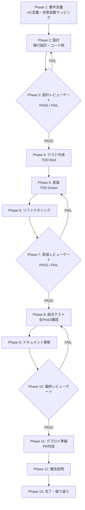

# UT-HEALTH-POLICY-MAINLINE-MIGRATION-001 - タスク実行仕様書

## ユーザーからの元の指示

GitHub Issue #1605: useMainlineExecutionAccess の healthPolicy 移行

## メタ情報

| 項目         | 内容                                                            |
| ------------ | --------------------------------------------------------------- |
| タスクID     | UT-HEALTH-POLICY-MAINLINE-MIGRATION-001                         |
| タスク名     | useMainlineExecutionAccess の healthPolicy 移行                 |
| 分類         | リファクタリング                                                |
| 対象機能     | HealthPolicy 統一機構                                           |
| 優先度       | 高                                                              |
| 見積もり規模 | 小規模                                                          |
| ステータス   | completed（Phase 1-12 completed / Phase 13 blocked）            |
| 作成日       | 2026-04-07                                                      |
| 関連Issue    | https://github.com/daishiman/AIWorkflowOrchestrator/issues/1605 |

---

## タスク概要

### 目的

`useMainlineExecutionAccess` フック内の独自 `apiKeyDegraded` 算出ロジック（L117-120）を削除し、`TASK-IMP-HEALTH-POLICY-UNIFICATION-001` で導入された統一 HealthPolicy 機構（`resolveHealthPolicy()` / `buildMainlineExecutionAccessState()`）経由に移行する。

これにより HealthPolicy の判定ロジックが一元化され、将来的な判定基準の変更が単一箇所の修正で済む状態を実現する。

### 背景

`apps/desktop/src/renderer/hooks/useMainlineExecutionAccess.ts` の L117-120 では、`apiKeyDegraded` フラグを独自ロジックで算出している：

```typescript
const apiKeyDegraded =
  credentials.apiKeyValid &&
  (selectedHealthStatus?.status === "disconnected" ||
    selectedHealthStatus?.status === "error");
```

この実装は `TASK-IMP-HEALTH-POLICY-UNIFICATION-001` で導入された `resolveHealthPolicy()` / `buildMainlineExecutionAccessState()` の統一ポリシー機構を経由しておらず、HealthPolicy の判定が二重管理になっている。

`buildMainlineExecutionAccessState()` はすでに `healthPolicy?: HealthPolicy` をオプション引数として受け付けており、Hook 側の移行のみが残件となっている。

### 最終ゴール

移行完了後の状態：

- `useMainlineExecutionAccess` が `resolveHealthPolicy()` を呼び出して `HealthPolicy` を生成している
- 生成した `HealthPolicy` を `buildMainlineExecutionAccessState()` に渡している
- L117-120 の独自 `apiKeyDegraded` 算出ロジックが削除されている
- `@repo/shared/types` 経由でインポートしている（サブパス直接指定は禁止）
- 既存のユニットテストが全 PASS している
- TypeScript の型チェックがエラーなく通過している

### 成果物一覧

| 成果物                                                                         | 種別         | 説明                                                |
| ------------------------------------------------------------------------------ | ------------ | --------------------------------------------------- |
| `apps/desktop/src/renderer/hooks/useMainlineExecutionAccess.ts`                | 変更ファイル | 独自ロジック削除 + resolveHealthPolicy 呼び出し追加 |
| `apps/desktop/src/renderer/hooks/__tests__/useMainlineExecutionAccess.test.ts` | 変更ファイル | 新規テストケース追加（TC-01〜TC-05）                |
| `outputs/phase-1/requirements-definition.md`                                   | ドキュメント | 要件定義書                                          |
| `outputs/phase-1/state-mapping.md`                                             | ドキュメント | 状態変数マッピング定義                              |
| `outputs/phase-2/design-spec.md`                                               | ドキュメント | 移行設計詳細                                        |
| `outputs/phase-3/design-review-result.md`                                      | ドキュメント | 設計レビュー結果                                    |

---

## 参照ファイル

| ファイルパス                                                                        | 役割                                           |
| ----------------------------------------------------------------------------------- | ---------------------------------------------- |
| `apps/desktop/src/renderer/hooks/useMainlineExecutionAccess.ts`                     | 移行対象 Hook（L117-120 に独自ロジック）       |
| `apps/desktop/src/renderer/hooks/__tests__/useMainlineExecutionAccess.test.ts`      | 既存ユニットテスト                             |
| `packages/shared/src/types/health-policy.ts`                                        | HealthPolicyInput / HealthPolicy 型定義        |
| `packages/shared/src/types/index.ts`                                                | barrel export（resolveHealthPolicy を含む）    |
| `apps/desktop/src/renderer/hooks/useMainlineExecutionAccess.ts` (buildMainline参照) | buildMainlineExecutionAccessState 呼び出し箇所 |

---

## タスク分解サマリー

| ID    | フェーズ | サブタスク名             | 責務                                           | 依存  |
| ----- | -------- | ------------------------ | ---------------------------------------------- | ----- |
| PH-01 | Phase 1  | 要件定義                 | AC定義・状態変数マッピング確定                 | なし  |
| PH-02 | Phase 2  | 設計                     | 移行設計・コード例・削除ロジック明示           | PH-01 |
| PH-03 | Phase 3  | 設計レビューゲート       | 設計品質確認・PASS/FAIL判定                    | PH-02 |
| PH-04 | Phase 4  | テスト作成（TDD Red）    | 失敗するテスト実装（TC-01〜TC-05）             | PH-03 |
| PH-05 | Phase 5  | 実装（TDD Green）        | resolveHealthPolicy 呼び出し・独自ロジック削除 | PH-04 |
| PH-06 | Phase 6  | リファクタリング         | コード整理・不要コメント削除                   | PH-05 |
| PH-07 | Phase 7  | 実装レビューゲート       | 実装品質確認・AC全項目検証                     | PH-06 |
| PH-08 | Phase 8  | 統合テスト               | 既存テスト全PASS確認・型チェック実行           | PH-07 |
| PH-09 | Phase 9  | ドキュメント更新         | CHANGELOG・コードコメント更新                  | PH-08 |
| PH-10 | Phase 10 | 最終レビューゲート       | 全AC検証・マージ可否判定                       | PH-09 |
| PH-11 | Phase 11 | デプロイ準備             | PR作成・レビュアーアサイン                     | PH-10 |
| PH-12 | Phase 12 | 概念説明（非技術者向け） | 中学生レベルで変更内容を説明                   | PH-11 |
| PH-13 | Phase 13 | 完了・振り返り           | 完了確認・lessons learned記録                  | PH-12 |

---

## 実行フロー図



---

## Phase一覧

| Phase | 名称               | 仕様書                                                         | ステータス                  |
| ----- | ------------------ | -------------------------------------------------------------- | --------------------------- |
| 1     | 要件定義           | [phase-1-requirements.md](./phase-1-requirements.md)           | 完了                        |
| 2     | 設計               | [phase-2-design.md](./phase-2-design.md)                       | 完了                        |
| 3     | 設計レビューゲート | [phase-3-design-review.md](./phase-3-design-review.md)         | 完了                        |
| 4     | テスト作成         | [phase-4-test-creation.md](./phase-4-test-creation.md)         | 完了                        |
| 5     | 実装               | [phase-5-implementation.md](./phase-5-implementation.md)       | 完了                        |
| 6     | テスト拡充         | [phase-6-test-expansion.md](./phase-6-test-expansion.md)       | 完了                        |
| 7     | カバレッジ確認     | [phase-7-coverage-check.md](./phase-7-coverage-check.md)       | 完了                        |
| 8     | リファクタリング   | [phase-8-refactoring.md](./phase-8-refactoring.md)             | 完了                        |
| 9     | 品質保証           | [phase-9-quality-assurance.md](./phase-9-quality-assurance.md) | 完了                        |
| 10    | 最終レビューゲート | [phase-10-final-review.md](./phase-10-final-review.md)         | 完了                        |
| 11    | 手動テスト         | [phase-11-manual-test.md](./phase-11-manual-test.md)           | 完了                        |
| 12    | ドキュメント更新   | [phase-12-documentation.md](./phase-12-documentation.md)       | 完了                        |
| 13    | PR作成             | [phase-13-pr-creation.md](./phase-13-pr-creation.md)           | ユーザー承認待ち（blocked） |

---

## テストカバレッジ目標

| テスト種別     | 対象ファイル                                   | 目標カバレッジ | 備考                       |
| -------------- | ---------------------------------------------- | -------------- | -------------------------- |
| ユニットテスト | `useMainlineExecutionAccess.ts`                | 100%（変更行） | TC-01〜TC-05 全PASS        |
| 型チェック     | 変更ファイル全体                               | エラー0件      | `pnpm typecheck` PASS      |
| 既存テスト維持 | `__tests__/useMainlineExecutionAccess.test.ts` | 全PASS         | 既存テストを破壊しないこと |

---

## 統合テスト連携

| Phase | 統合テスト内容                                | 確認コマンド                                         |
| ----- | --------------------------------------------- | ---------------------------------------------------- |
| 4     | TC-01〜TC-05 が失敗することを確認（Red）      | `pnpm --filter @repo/desktop test`                   |
| 5     | TC-01〜TC-05 が全PASS することを確認（Green） | `pnpm --filter @repo/desktop test`                   |
| 8     | 既存テスト全PASS + 型チェック PASS            | `pnpm --filter @repo/desktop test && pnpm typecheck` |

---

## Phase完了時の必須アクション

各 Phase 完了時に以下を実行すること：

1. **成果物確認**: 仕様書に記載の成果物が存在することを確認する
2. **AC検証**: 該当 Phase の受入基準を全て満たしていることを確認する
3. **次のPhaseへの引継ぎ**: 次フェーズに必要な情報（設計判断・成果物パス等）を記録する
4. **レビューゲート（Phase 3 / 7 / 10）**: PASS が確認できるまで前のフェーズに戻る

---

## 関連タスク・依存関係

| 関係 | タスクID                               | 説明                                                             |
| ---- | -------------------------------------- | ---------------------------------------------------------------- |
| 前提 | TASK-IMP-HEALTH-POLICY-UNIFICATION-001 | resolveHealthPolicy / buildMainlineExecutionAccessState の実装元 |
| 関連 | UT-HEALTH-POLICY-RUNTIME-INJECTION-001 | 同じ healthPolicy 移行系タスク（実行コンテキストが異なる）       |
