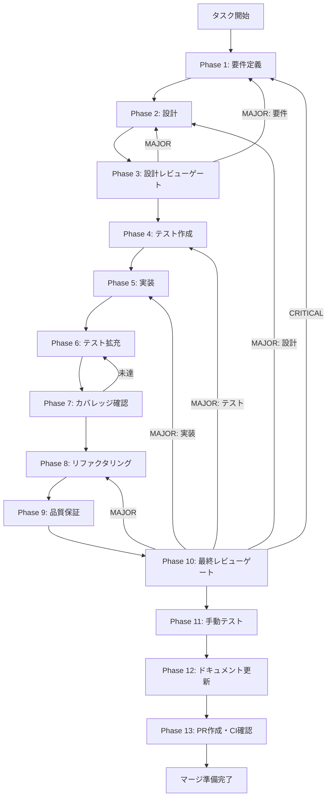

# ut-safety-gov-disclosure-runtime-injection - タスク実行仕様書

## ユーザーからの元の指示

```
GitHub Issue #1804 (UT-SAFETY-GOV-DISCLOSURE-RUNTIME-INJECTION-001):
disclosure 情報を runtime から注入

getDisclosureInfo() は現在 anthropic / claude-sonnet / [] の固定値を返す
placeholder 実装であり、ExecutionConsole の disclosure 表示が実際の設定と一致しない。
```

## メタ情報

| 項目         | 内容                                           |
| ------------ | ---------------------------------------------- |
| タスクID     | UT-SAFETY-GOV-DISCLOSURE-RUNTIME-INJECTION-001 |
| タスク名     | disclosure-runtime-injection                   |
| 分類         | 改善                                           |
| 対象機能     | ExecutionConsole disclosure情報のruntime注入   |
| 優先度       | 高                                             |
| 見積もり規模 | 中規模                                         |
| ステータス   | Phase 12 完了 / Phase 13 blocked               |
| 作成日       | 2026-04-02                                     |
| Issue        | #1804                                          |
| 関連タスク   | UT-IMP-SAFETY-GOV-PRODUCTION-INTEGRATION-001   |

---

## タスク概要

### 目的

`getDisclosureInfo()` の placeholder 実装を廃止し、実際の LLM 設定または runtime state から
provider / model / externalDestinations 情報を動的に注入する。
ExecutionConsole に表示される AI 利用情報が実際の設定と一致するようにし、
production 品質の disclosure 表示を実現する。

### 背景

`safety-gov-production-integration` タスク（UT-IMP-SAFETY-GOV-PRODUCTION-INTEGRATION-001）において、
IPC チャンネルの配線（`execution:get-disclosure-info`）は完了しているが、
`apps/desktop/src/main/ipc/index.ts` の L907-918 に以下の TODO(DI) が残存している：

```typescript
// TODO(DI): Replace getDisclosureInfo with actual service when available.
//   Current placeholder returns static metadata.
//   Production implementation should read from LLM provider config.
getDisclosureInfo: async () => ({
  aiServiceName: "anthropic",
  modelName: "claude-sonnet",
  externalDestinations: [],
}),
```

この placeholder により、ユーザーが ExecutionConsole で確認できる「使用中の AI プロバイダー情報」が
常に静的な値となっており、production 品質と見なせない状態にある。

あわせて、`disclosureHandlers.ts` の独立したユニットテスト（`disclosureHandlers.test.ts`）も
未作成のため、同時に作成する（関連 issue: UT-IMP-SAFETY-GOV-DISCLOSURE-TEST-001）。

### 最終ゴール

1. `getDisclosureInfo()` が `AuthModeService` / `AuthKeyService` から runtime 情報を取得する
2. provider 未設定時の degrade 動作（fallback値）が定義されている
3. API key / token を返さない（DENY-5 準拠）
4. `disclosureHandlers.test.ts` が独立テストとして存在し PASS する

### 成果物一覧

| 種別         | 成果物                                  | 配置先                                                           |
| ------------ | --------------------------------------- | ---------------------------------------------------------------- |
| 実装         | disclosure DI 接続（ipc/index.ts 修正） | `apps/desktop/src/main/ipc/index.ts`                             |
| テスト       | disclosureHandlers 独立ユニットテスト   | `apps/desktop/src/main/ipc/__tests__/disclosureHandlers.test.ts` |
| ドキュメント | Phase成果物                             | `outputs/phase-*/`                                               |
| PR           | GitHub Pull Request                     | GitHub UI                                                        |

---

## 参照ファイル

- `apps/desktop/src/main/ipc/index.ts` - placeholder TODO(DI) 箇所（L907-918）
- `apps/desktop/src/main/ipc/disclosureHandlers.ts` - IPCハンドラー定義
- `apps/desktop/src/main/services/runtime/RuntimeResolver.ts` - authMode/apiKey解決
- `apps/desktop/src/main/services/chat-edit/AnthropicLLMAdapter.ts` - モデル名定数
- `apps/desktop/src/preload/types.ts` - ExecutionAPI.getDisclosureInfo 型定義
- `.claude/skills/aiworkflow-requirements/references/` - システム仕様

---

## タスク分解サマリー

| ID     | フェーズ | サブタスク名       | 責務                                   | 依存 |
| ------ | -------- | ------------------ | -------------------------------------- | ---- |
| T-01-1 | Phase 1  | 要件定義           | 機能要件・非機能要件・AC定義           | -    |
| T-02-1 | Phase 2  | 設計               | DI接続設計・DisclosureService設計      | T-01 |
| T-03-1 | Phase 3  | 設計レビューゲート | 設計品質確認                           | T-02 |
| T-04-1 | Phase 4  | テスト作成         | disclosureHandlers.test.ts 作成        | T-03 |
| T-05-1 | Phase 5  | 実装               | DI接続実装・DisclosureService実装      | T-04 |
| T-06-1 | Phase 6  | テスト拡充         | fallback・DENY-5・sender検証テスト追加 | T-05 |
| T-07-1 | Phase 7  | カバレッジ確認     | 80%+カバレッジ確認                     | T-06 |
| T-08-1 | Phase 8  | リファクタリング   | 実装品質向上                           | T-07 |
| T-09-1 | Phase 9  | 品質保証           | lint/typecheck/test全通過              | T-08 |
| T-10-1 | Phase 10 | 最終レビューゲート | 全AC確認・セキュリティレビュー         | T-09 |
| T-11-1 | Phase 11 | 手動テスト         | UI確認・disclosure表示検証             | T-10 |
| T-12-1 | Phase 12 | ドキュメント更新   | unassigned-task仕様書のクローズ記録    | T-11 |
| T-13-1 | Phase 13 | PR作成             | PR作成・CI確認                         | T-12 |

**総サブタスク数**: 13個

---

## 実行フロー図



---

## Phase一覧

| Phase | 名称               | 仕様書                                                       | ステータス |
| ----- | ------------------ | ------------------------------------------------------------ | ---------- |
| 1     | 要件定義           | [phase-1-requirements.md](phase-1-requirements.md)           | 完了       |
| 2     | 設計               | [phase-2-design.md](phase-2-design.md)                       | 完了       |
| 3     | 設計レビューゲート | [phase-3-design-review.md](phase-3-design-review.md)         | 完了       |
| 4     | テスト作成         | [phase-4-test-creation.md](phase-4-test-creation.md)         | 完了       |
| 5     | 実装               | [phase-5-implementation.md](phase-5-implementation.md)       | 完了       |
| 6     | テスト拡充         | [phase-6-test-expansion.md](phase-6-test-expansion.md)       | 完了       |
| 7     | カバレッジ確認     | [phase-7-coverage-check.md](phase-7-coverage-check.md)       | 完了       |
| 8     | リファクタリング   | [phase-8-refactoring.md](phase-8-refactoring.md)             | 完了       |
| 9     | 品質保証           | [phase-9-quality-assurance.md](phase-9-quality-assurance.md) | 完了       |
| 10    | 最終レビューゲート | [phase-10-final-review.md](phase-10-final-review.md)         | 完了       |
| 11    | 手動テスト         | [phase-11-manual-test.md](phase-11-manual-test.md)           | 完了       |
| 12    | ドキュメント更新   | [phase-12-documentation.md](phase-12-documentation.md)       | 完了       |
| 13    | PR作成             | [phase-13-pr-creation.md](phase-13-pr-creation.md)           | blocked    |

---

## テストカバレッジ目標

### ユニットテスト

| 指標              | 最低基準 | 推奨基準 |
| ----------------- | -------- | -------- |
| Line Coverage     | 80%      | 90%      |
| Branch Coverage   | 60%      | 70%      |
| Function Coverage | 80%      | 90%      |

### 結合テスト

| 指標                        | 目標 |
| --------------------------- | ---- |
| IPCチャンネル（disclosure） | 100% |
| 正常系シナリオ              | 100% |
| 異常系シナリオ              | 80%+ |

---

## Phase完了時の必須アクション

**各Phase完了時に以下を必ず実行すること:**

1. **タスク100%実行**: Phase内で指定された全タスクを完全に実行
2. **成果物確認**: 全ての必須成果物が生成されていることを検証
3. **実行記録**: 実行タスクの結果を記録
4. **artifacts.json更新**: Phase完了ステータスを更新
5. **Phase末端の実行確認**: 各タスクを100%実行し、各タスクを完遂した旨を必ず明記
