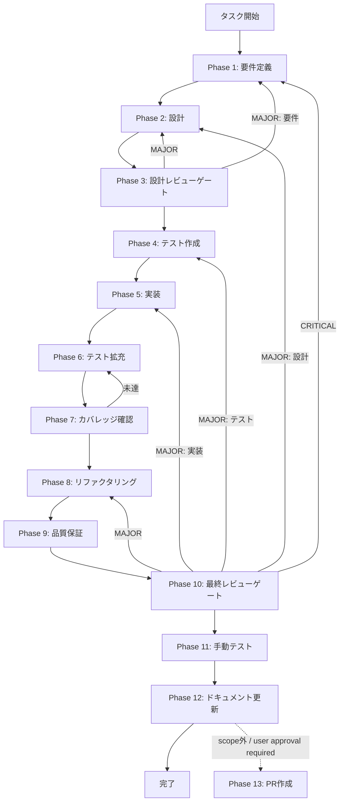

# ut-sdk-07-approval-request-surface-001 - タスク実行仕様書

## ユーザーからの元の指示

```
Issue #1683 (UT-SDK-07-APPROVAL-REQUEST-SURFACE-001):
Skill Creator の preload / renderer に `approval:request` surface を追加し、
disclosure と同水準で approval flow を public surface に接続する。
```

## メタ情報

| 項目         | 内容                                                              |
| ------------ | ----------------------------------------------------------------- |
| タスクID     | UT-SDK-07-APPROVAL-REQUEST-SURFACE-001                            |
| タスク名     | ut-sdk-07-approval-request-surface-001                            |
| 分類         | 実装                                                              |
| 対象機能     | Skill Creator approval:request surface（preload / renderer 接続） |
| 優先度       | 中                                                                |
| 見積もり規模 | 小規模                                                            |
| ステータス   | 未実施                                                            |
| 作成日       | 2026-04-06                                                        |
| 関連Issue    | #1683 (UT-SDK-07-APPROVAL-REQUEST-SURFACE-001)                    |

---

## タスク概要

### 目的

`SkillCreatorAPI`（`apps/desktop/src/preload/skill-creator-api.ts`）に `onApprovalRequest` メソッドを追加し、`APPROVAL_REQUEST` チャンネルを `safeOn` 経由で購読できるようにする。また、`SkillLifecyclePanel.tsx` に approval request の購読と UI 表示を追加し、disclosure surface と対称な責務で approval flow を公開 surface に接続する。

> 本タスクのスコープは Phase 12 まで。`commit` / `PR` 作成はユーザー指示があるまで実行しない。
> Phase 13 は標準フレームワーク上の最終工程として保持するが、この workflow では `blocked` 扱いとする。

### 背景

TASK-SDK-07 で shared approval/disclosure contract が確立されたが、Skill Creator の preload API（`SkillCreatorAPI` インターフェース）には `respondToApproval` と `getDisclosureInfo` のみが実装されており、`onApprovalRequest`（push 通知購読）が欠如している。

`ExecutionAPI` には既に `onApprovalRequest` が実装済み（`preload/types.ts` 行 1038）で、`APPROVAL_REQUEST` チャンネルも `ALLOWED_ON_CHANNELS` に登録済み（`preload/channels.ts` 行 777）。Skill Creator も同一チャンネルを購読することで、approval flow が Renderer 側で受信可能になる。

`SkillLifecyclePanel.tsx` では disclosure info の UI 実装（`data-testid="skill-lifecycle-disclosure-summary"`）は存在するが、approval request の購読・表示が存在しない。

### 最終ゴール

- `SkillCreatorAPI` インターフェースに `onApprovalRequest` メソッドが追加されている
- `skill-creator-api.ts` の実装オブジェクトに `onApprovalRequest` が `safeOn` 経由で実装されている
- `SkillLifecyclePanel.tsx` が `onApprovalRequest` を購読し、approval request 受信時にバナー/通知で表示する
- approval / disclosure の UI surface が対称な責務で確認できる
- renderer テストで approval request 経路が固定される

### 成果物一覧

| 種別         | 成果物                                               | 配置先                                                                                       |
| ------------ | ---------------------------------------------------- | -------------------------------------------------------------------------------------------- |
| 機能         | `SkillCreatorAPI.onApprovalRequest` メソッド追加     | `apps/desktop/src/preload/skill-creator-api.ts`                                              |
| 機能         | `SkillLifecyclePanel.tsx` approval request 購読 + UI | `apps/desktop/src/renderer/components/skill/SkillLifecyclePanel.tsx`                         |
| テスト       | `skill-creator-api.approval.test.ts` (新規)          | `apps/desktop/src/preload/__tests__/skill-creator-api.approval.test.ts`                      |
| テスト       | `SkillLifecyclePanel.approval.test.tsx` (新規)       | `apps/desktop/src/renderer/components/skill/__tests__/SkillLifecyclePanel.approval.test.tsx` |
| ドキュメント | タスク仕様書（本ディレクトリ）                       | `docs/30-workflows/ut-sdk-07-approval-request-surface-001/`                                  |
| ドキュメント | Phase 12 outputs                                     | `docs/30-workflows/ut-sdk-07-approval-request-surface-001/outputs/phase-12/`                 |

> Phase 12 の canonical outputs は `outputs/phase-12/` 配下に生成し、root `artifacts.json` と `outputs/artifacts.json` を同一 wave で同期する。

---

## 実行原則

- Phase 1〜3 は `skill準拠検証` と `多角的思考分析` を別 SubAgent で並列実行する
- `多角的思考分析` は 30 種の思考法を全て適用し、Phase 3 の判定材料へ集約する
- Phase 4 は preload テスト骨格と renderer テスト骨格を別 SubAgent で並列作成する
- Phase 5 は preload 実装と renderer 実装を別 SubAgent で並列実行し、共通契約は Phase 2 で固定する
- Phase 12 は 6 つの文書成果物を並列生成し、最後に compliance check で束ねる

---

## 参照ファイル

- `apps/desktop/src/preload/skill-creator-api.ts` - 主要修正対象（`SkillCreatorAPI` インターフェース + 実装オブジェクト）
- `apps/desktop/src/renderer/components/skill/SkillLifecyclePanel.tsx` - approval request 購読 + UI 追加対象
- `apps/desktop/src/preload/types.ts` 行 1038 - `ExecutionAPI.onApprovalRequest` の型定義（参照パターン）
- `apps/desktop/src/preload/channels.ts` 行 777 - `APPROVAL_REQUEST` の `ALLOWED_ON_CHANNELS` 登録（確認済み）
- `apps/desktop/src/preload/__tests__/index.execution.test.ts` - `onApprovalRequest` テストの参照パターン
- `docs/30-workflows/completed-tasks/approval-request-producer/` - 関連タスク仕様書（参照）

---

## タスク分解サマリー

| ID     | フェーズ | サブタスク名       | 責務                                                                                                                                                                            | 依存 |
| ------ | -------- | ------------------ | ------------------------------------------------------------------------------------------------------------------------------------------------------------------------------- | ---- |
| T-01-1 | Phase 1  | 要件定義           | P50チェック・受入基準 AC-1〜AC-5 確定                                                                                                                                           | -    |
| T-02-1 | Phase 2  | 技術設計           | インターフェース設計・UI設計・型設計                                                                                                                                            | T-01 |
| T-03-1 | Phase 3  | 設計レビューゲート | PASS/MINOR/MAJOR 判定・Phase 4 開始条件確認                                                                                                                                     | T-02 |
| T-04-1 | Phase 4  | テスト作成         | `skill-creator-api.approval.test.ts` 骨格作成                                                                                                                                   | T-03 |
| T-05-1 | Phase 5  | 実装               | `onApprovalRequest` 追加 + `SkillLifecyclePanel` UI 実装                                                                                                                        | T-04 |
| T-06-1 | Phase 6  | テスト拡充         | エッジケース・異常系テスト追加                                                                                                                                                  | T-05 |
| T-07-1 | Phase 7  | カバレッジ確認     | Line 80%+ / Branch 60%+ / Function 80%+ 達成                                                                                                                                    | T-06 |
| T-08-1 | Phase 8  | リファクタリング   | コード品質向上・重複排除                                                                                                                                                        | T-07 |
| T-09-1 | Phase 9  | 品質保証           | lint / typecheck / 全テスト PASS 確認                                                                                                                                           | T-08 |
| T-10-1 | Phase 10 | 最終レビューゲート | PASS 判定・マージ可否確認                                                                                                                                                       | T-09 |
| T-11-1 | Phase 11 | 手動テスト         | Electron 起動・approval request 実受信確認                                                                                                                                      | T-10 |
| T-12-1 | Phase 12 | ドキュメント更新   | implementation-guide / system-spec-update-summary / documentation-changelog / unassigned-task-detection / skill-feedback-report / compliance-check を生成し、台帳 parity を固定 | T-11 |
| T-13-1 | Phase 13 | PR作成             | `blocked` / ユーザー承認待ち                                                                                                                                                    | T-12 |

**総サブタスク数**: 13個（Phase 13 は blocked）

---

## 実行フロー図



> Phase 13 はユーザー承認があるまで blocked のまま維持する。

---

## Phase 一覧

| Phase | 名称               | 仕様書                                                       | ステータス |
| ----- | ------------------ | ------------------------------------------------------------ | ---------- |
| 1     | 要件定義           | [phase-1-requirements.md](phase-1-requirements.md)           | 未実施     |
| 2     | 設計               | [phase-2-design.md](phase-2-design.md)                       | 未実施     |
| 3     | 設計レビューゲート | [phase-3-design-review.md](phase-3-design-review.md)         | 未実施     |
| 4     | テスト作成         | [phase-4-test-creation.md](phase-4-test-creation.md)         | 未実施     |
| 5     | 実装               | [phase-5-implementation.md](phase-5-implementation.md)       | 未実施     |
| 6     | テスト拡充         | [phase-6-test-expansion.md](phase-6-test-expansion.md)       | 未実施     |
| 7     | カバレッジ確認     | [phase-7-coverage-check.md](phase-7-coverage-check.md)       | 未実施     |
| 8     | リファクタリング   | [phase-8-refactoring.md](phase-8-refactoring.md)             | 未実施     |
| 9     | 品質保証           | [phase-9-quality-assurance.md](phase-9-quality-assurance.md) | 未実施     |
| 10    | 最終レビューゲート | [phase-10-final-review.md](phase-10-final-review.md)         | 未実施     |
| 11    | 手動テスト         | [phase-11-manual-test.md](phase-11-manual-test.md)           | 未実施     |
| 12    | ドキュメント更新   | [phase-12-documentation.md](phase-12-documentation.md)       | 未実施     |
| 13    | PR作成             | [phase-13-pr-creation.md](phase-13-pr-creation.md)           | blocked    |

---

## テストカバレッジ目標

### ユニットテスト

| 指標              | 最低基準 | 推奨基準 |
| ----------------- | -------- | -------- |
| Line Coverage     | 80%      | 90%      |
| Branch Coverage   | 60%      | 70%      |
| Function Coverage | 80%      | 90%      |

### 結合テスト

| 指標                                  | 目標 |
| ------------------------------------- | ---- |
| IPC 経路（Main → Preload → Renderer） | 100% |
| 正常系シナリオ                        | 100% |
| 異常系シナリオ（チャンネル未許可）    | 80%+ |

---

## 統合テスト連携（Phase 1〜11 で必須）

| Phase | 統合テスト連携アクション                                             |
| ----- | -------------------------------------------------------------------- |
| 1     | IPC 接続要件（APPROVAL_REQUEST チャンネル・safeOn 経由）を要件に明記 |
| 2     | IPC 4層整合性チェック（既存チャンネル確認）を設計に反映              |
| 3     | IPC 統合テスト観点のレビューゲートを実施                             |
| 4     | IPC 購読テストシナリオを `skill-creator-api.approval.test.ts` に作成 |
| 5     | `onApprovalRequest` 実装 + `SkillLifecyclePanel` 接続の実装          |
| 6     | IPC 統合テストのカバレッジ向上                                       |
| 7     | 統合テストの再実行とゲート判定                                       |
| 8     | リファクタ後の統合テスト継続成功を確認                               |
| 9     | 品質保証で統合テスト結果を確認                                       |
| 10    | 最終レビューで統合テスト結果を確認                                   |
| 11    | 手動統合テスト（Skill Creator 起動→approval request 受信→UI 確認）   |

---

## Phase 完了時の必須アクション

**各 Phase 完了時に以下を必ず実行すること:**

1. **タスク 100% 実行**: Phase 内で指定された全タスクを完全に実行
2. **成果物確認**: 全ての必須成果物が生成されていることを検証
3. **実行記録**: 実行タスクの結果を記録
4. **artifacts.json 更新**: Phase 完了ステータスを更新
5. **Phase 末端の実行確認**: 各タスクを 100% 実行し、各タスクを完遂した旨を必ず明記

```bash
# Phase 完了時の検証コマンド
node .claude/skills/task-specification-creator/scripts/validate-phase-output.js docs/30-workflows/ut-sdk-07-approval-request-surface-001 --phase {{PHASE_NUMBER}}

# Phase 完了・成果物登録
node .claude/skills/task-specification-creator/scripts/complete-phase.js \
  --workflow docs/30-workflows/ut-sdk-07-approval-request-surface-001 --phase {{PHASE_NUMBER}} --artifacts "..."
```
