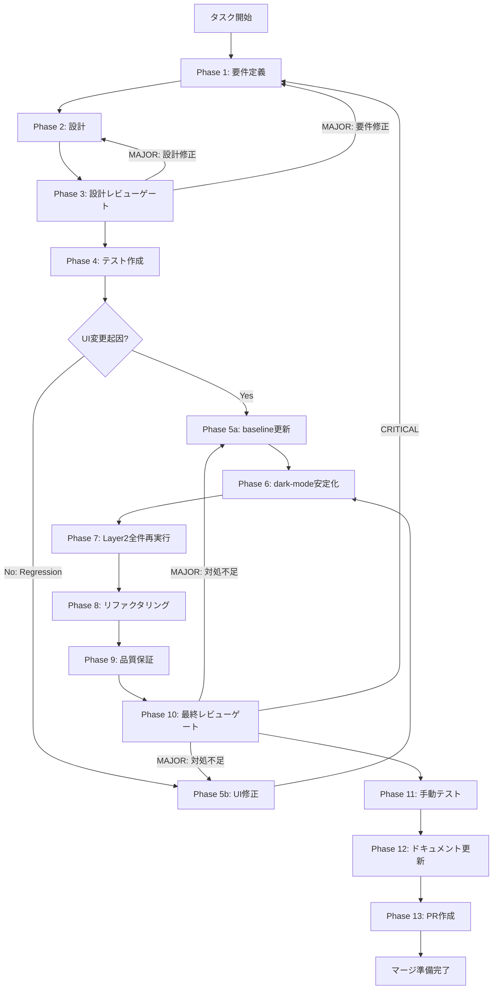

# ut-uiux-visual-baseline-drift-001 - タスク実行仕様書

## ユーザーからの元の指示

```
Issue #1811: Visual Baseline Drift 是正（error-display / loading-state / dark-mode）

UT-UIUX-PLAYWRIGHT-E2E-001 の Phase 11 実行中に、Playwright Layer 2（Visual Regression）テストで
error-display / loading-state / dark-mode の 3 surface において 113px の snapshot diff が検出された。

baseline snapshot が過去の UI 実装（OnboardingWizard の inert 付与などの変更が未反映）を基準にしており、
このまま放置すると Visual Regression テストが常に失敗し、CI での visual check が機能しない状態が継続する。

差分が UI 変更起因か regression 起因かを判定した上で、baseline 更新または UI 修正を実施し、
ui-ux-layer2 project が全 PASS になることを確認する。
```

## メタ情報

| 項目         | 内容                                                    |
| ------------ | ------------------------------------------------------- |
| タスクID     | UT-UIUX-VISUAL-BASELINE-DRIFT-001                       |
| タスク名     | visual-baseline-drift                                   |
| 分類         | 改善                                                    |
| 対象機能     | apps/desktop/e2e/ui-ux/layer2-visual.spec.ts-snapshots/ |
| 優先度       | 中                                                      |
| 見積もり規模 | 小規模                                                  |
| ステータス   | Phase 1〜12 完了 / Phase 13 未実施                      |
| 作成日       | 2026-04-03                                              |
| Issue番号    | #1811                                                   |
| 関連タスク   | UT-UIUX-PLAYWRIGHT-E2E-001, TASK-A11Y-FOCUS-TRAP-001    |

---

## タスク概要

### 目的

Playwright Layer 2（Visual Regression）テストで検出された 3 surface（error-display / loading-state / dark-mode）の baseline drift を是正し、`ui-ux-layer2` project が CI で常時 GREEN を維持できる状態にする。

差分原因を正確に判定（UI 変更起因 vs Regression 起因）し、適切な対処（baseline 更新 or UI 修正）を選択・実施する。

### 背景

`UT-UIUX-PLAYWRIGHT-E2E-001` の Phase 11 実行中に以下の問題が検出された：

- `TC-11-05 error-display`：113px の snapshot diff
- `TC-11-06 loading-state`：113px の snapshot diff
- `TC-11-07 dark-mode`：113px の snapshot diff

現在の baseline snapshot は OnboardingWizard の `inert` 付与など過去の UI 変更が反映されていない状態。このまま放置すると Visual Regression テストが常に失敗し、本来の regression 検知機能が失われる。

### 最終ゴール

- `pnpm --filter @repo/desktop exec playwright test --project=ui-ux-layer2` が全 PASS
- CI GREEN
- 各 surface の diff 原因判定根拠が PR に記述されている
- dark-mode の `colorScheme` が OS 依存なく安定して動作する

### 成果物一覧

| 種別         | 成果物                           | 配置先                                                          |
| ------------ | -------------------------------- | --------------------------------------------------------------- |
| 設計書       | 差分原因判定フロー設計           | `outputs/phase-2/design.md`                                     |
| snapshot     | 更新済み baseline snapshots      | `apps/desktop/e2e/ui-ux/layer2-visual.spec.ts-snapshots/`       |
| 設定変更     | colorScheme / maxDiffPixels 修正 | `apps/desktop/playwright.config.ts` / `apps/desktop/e2e/ui-ux/` |
| ドキュメント | Phase完了レポート                | `outputs/phase-*/`                                              |
| PR           | GitHub Pull Request              | GitHub UI                                                       |

---

## 参照ファイル

- `docs/30-workflows/ut-uiux-playwright-e2e-001/outputs/phase-11/screenshots/` — Phase 11 diff 画像
- `docs/30-workflows/ut-uiux-playwright-e2e-001/outputs/phase-11/discovered-issues.md` — ISSUE-002 記録
- `apps/desktop/e2e/ui-ux/test-targets.config.ts` — テスト対象設定
- `apps/desktop/e2e/ui-ux/layer2-visual.spec.ts` — Visual Regression テスト実装
- `apps/desktop/e2e/ui-ux/layer2-visual.spec.ts-snapshots/` — baseline snapshot 配置先
- `apps/desktop/playwright.config.ts` — Playwright 設定
- `apps/desktop/src/renderer/components/organisms/OnboardingWizard/index.tsx` — 変更起因コンポーネント

---

## タスク分解サマリー

| ID     | フェーズ | サブタスク名       | 責務                                             | 依存 |
| ------ | -------- | ------------------ | ------------------------------------------------ | ---- |
| T-01-1 | Phase 1  | 要件定義           | 差分原因判定・対処方針の要件を明文化             | -    |
| T-02-1 | Phase 2  | 設計               | 判定フロー・baseline更新・UI修正手順の設計       | T-01 |
| T-03-1 | Phase 3  | 設計レビューゲート | Phase 2 設計のセルフレビューと承認判定           | T-02 |
| T-04-1 | Phase 4  | テスト作成         | diff画像確認・git log照合・原因種別判定          | T-03 |
| T-05-1 | Phase 5  | 実装               | 判定結果に基づく対処の実施                       | T-04 |
| T-06-1 | Phase 6  | dark-mode安定化    | colorScheme設定確認・修正・再テスト              | T-05 |
| T-07-1 | Phase 7  | カバレッジ確認     | `ui-ux-layer2` project 全 PASS 確認              | T-06 |
| T-08-1 | Phase 8  | リファクタリング   | 更新 baseline 画像の目視確認・意図外更新チェック | T-07 |
| T-09-1 | Phase 9  | 品質保証           | 全体テスト・lint・型チェック実行                 | T-08 |
| T-10-1 | Phase 10 | 最終レビューゲート | 全受け入れ条件の充足確認                         | T-09 |
| T-11-1 | Phase 11 | 手動テスト         | HTML レポート視認確認・baseline 画像の目視確認   | T-10 |
| T-12-1 | Phase 12 | ドキュメント更新   | 対処根拠・手順のドキュメント化                   | T-11 |
| T-13-1 | Phase 13 | PR作成             | PR 作成・レビュー依頼・CI 確認                   | T-12 |

**総サブタスク数**: 13個

---

## 実行フロー図



---

## Phase一覧

| Phase | 名称               | 仕様書                                                                         | ステータス |
| ----- | ------------------ | ------------------------------------------------------------------------------ | ---------- |
| 1     | 要件定義           | [outputs/phase-1/requirements.md](outputs/phase-1/requirements.md)             | 完了       |
| 2     | 設計               | [outputs/phase-2/design.md](outputs/phase-2/design.md)                         | 完了       |
| 3     | 設計レビューゲート | [outputs/phase-3/review-result.md](outputs/phase-3/review-result.md)           | 完了       |
| 4     | テスト作成         | [outputs/phase-4/diff-analysis.md](outputs/phase-4/diff-analysis.md)           | 完了       |
| 5     | 実装               | [outputs/phase-5/implementation-log.md](outputs/phase-5/implementation-log.md) | 完了       |
| 6     | テスト拡充         | [phase-6-test-expansion.md](phase-6-test-expansion.md)                         | 完了       |
| 7     | カバレッジ確認     | [phase-7-coverage-check.md](phase-7-coverage-check.md)                         | 完了       |
| 8     | リファクタリング   | [phase-8-refactoring.md](phase-8-refactoring.md)                               | 完了       |
| 9     | 品質保証           | [phase-9-quality-assurance.md](phase-9-quality-assurance.md)                   | 完了       |
| 10    | 最終レビューゲート | [phase-10-final-review.md](phase-10-final-review.md)                           | 完了       |
| 11    | 手動テスト         | [phase-11-manual-test.md](phase-11-manual-test.md)                             | 完了       |
| 12    | ドキュメント更新   | [phase-12-documentation.md](phase-12-documentation.md)                         | 完了       |
| 13    | PR作成             | [phase-13-pr-creation.md](phase-13-pr-creation.md)                             | 未実施     |

---

## テストカバレッジ目標

### Visual Regression テスト（Layer 2）

| 指標                    | 目標       |
| ----------------------- | ---------- |
| Layer 2 全テストケース  | 100% PASS  |
| error-display surface   | PASS       |
| loading-state surface   | PASS       |
| dark-mode surface       | PASS       |
| maxDiffPixels 許容値    | 200px 以下 |
| CI ui-ux-layer2 project | GREEN      |

### 統合テスト連携（Phase 1〜13で必須）

| Phase | 統合テスト連携アクション                                          |
| ----- | ----------------------------------------------------------------- |
| 1     | Visual Regression テスト要件（対象surface・判定基準）を要件に明記 |
| 2     | baseline更新手順・UI修正手順・colorScheme設定を設計に反映         |
| 3     | Visual Regression テスト観点のレビューゲートを実施                |
| 4     | diff画像・git logを照合し原因種別を判定                           |
| 5     | baseline更新 or UI修正を実施し再テスト                            |
| 6     | dark-mode colorScheme設定を修正し再テスト                         |
| 7     | Layer 2 全件再実行・全PASS確認                                    |
| 8     | 更新 baseline 画像の目視確認                                      |
| 9     | lint・型チェック・全体テスト実行                                  |
| 10    | 全受け入れ条件の充足確認                                          |
| 11    | HTMLレポートと baseline 画像の視認確認                            |
| 12    | 判断根拠・対処内容のドキュメント化                                |
| 13    | PR作成前の最終確認と CI GREEN 確認                                |

---

## Phase完了時の必須アクション

**各Phase完了時に以下を必ず実行すること:**

1. **タスク100%実行**: Phase内で指定された全タスクを完全に実行
2. **成果物確認**: 全ての必須成果物が生成されていることを検証
3. **実行記録**: 実行タスクの結果を記録
4. **artifacts.json更新**: Phase完了ステータスを更新
5. **Phase末端の実行確認**: 各タスクを100%実行し、各タスクを完遂した旨を必ず明記

```bash
# Phase完了時の検証コマンド
node .claude/skills/task-specification-creator/scripts/validate-phase-output.js \
  docs/30-workflows/completed-tasks/ut-uiux-visual-baseline-drift-001 --phase <PHASE_NUMBER>

# Phase完了・成果物登録
node .claude/skills/task-specification-creator/scripts/complete-phase.js \
  --workflow docs/30-workflows/completed-tasks/ut-uiux-visual-baseline-drift-001 \
  --phase <PHASE_NUMBER> --artifacts "..."
```
